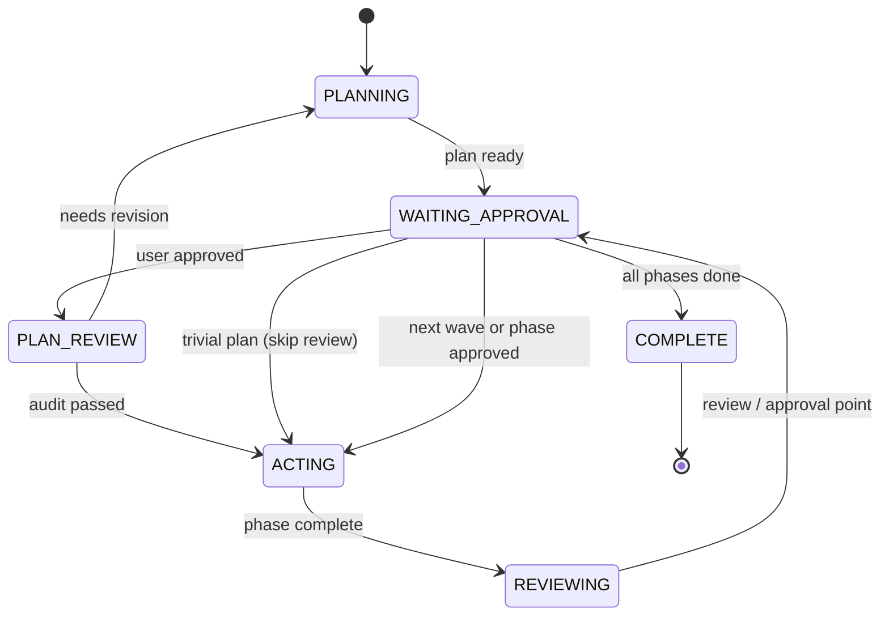
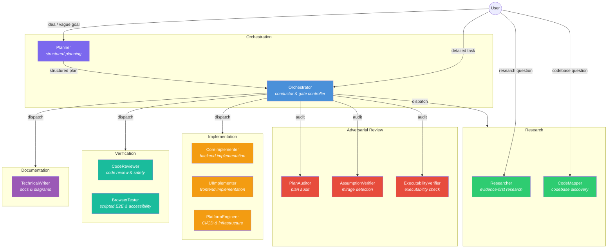

# ControlFlow

[](https://github.com/Smithbox-ai/ControlFlow/actions/workflows/ci.yml)


A multi-agent orchestration system for VS Code Copilot, plus maintained Codex, Claude, and Cursor plugins. ControlFlow coordinates 13 specialized agents under deterministic **P.A.R.T contracts** (Prompt → Archive → Resources → Tools), structured text outputs, and layered reliability gates.

---

## Contents

- [ControlFlow](#controlflow)
  - [Contents](#contents)
  - [Why ControlFlow?](#why-controlflow)
  - [Quick Start](#quick-start)
  - [When to Use Which Agent](#when-to-use-which-agent)
  - [Pipeline by Complexity](#pipeline-by-complexity)
  - [Orchestration State Machine](#orchestration-state-machine)
  - [Failure Routing](#failure-routing)
  - [Agent Architecture](#agent-architecture)
    - [Interaction diagram](#interaction-diagram)
    - [Primary Agents](#primary-agents)
    - [Specialized Subagents](#specialized-subagents)
  - [Evaluation Suite](#evaluation-suite)
  - [Project Structure](#project-structure)
  - [Documentation](#documentation)
  - [Installation](#installation)
    - [Adding Custom Agents](#adding-custom-agents)
  - [ControlFlow for Codex (Plugin)](#controlflow-for-codex-plugin)
    - [Included Skills](#included-skills)
  - [ControlFlow for Claude Code (Plugin)](#controlflow-for-claude-code-plugin)
    - [Installing the Plugin](#installing-the-plugin)
    - [Skills](#skills)
    - [Intentional Differences from VS Code](#intentional-differences-from-vs-code)
  - [ControlFlow for Cursor](#controlflow-for-cursor)
  - [ControlFlow for Codex Usage and Validation](#controlflow-for-codex-usage-and-validation)
    - [Plugin Installation](#plugin-installation)
    - [Usage](#usage)
    - [Validating Codex Strict-Plan Artifacts](#validating-codex-strict-plan-artifacts)
    - [Intentional Differences from the VS Code Version](#intentional-differences-from-the-vs-code-version)
  - [License](#license)
  - [Acknowledgments](#acknowledgments)

---

## Why ControlFlow?

| | Single Agent | ControlFlow (13 agents) |
| --- | --- | --- |
| **Planning** | Agent guesses architecture on-the-fly | Planner runs structured idea interview, produces phased plan with Mermaid diagrams |
| **Quality gates** | None | PlanAuditor + AssumptionVerifier + ExecutabilityVerifier audit before implementation |
| **Execution** | Sequential, monolithic | Wave-based parallel execution with inter-phase contracts |
| **Failures** | Silent or catastrophic | Classified (`transient`/`fixable`/`needs_replan`/`escalate`, plus `model_unavailable`) with bounded retry routing |
| **Scope drift** | Common | [LLM Behavior Guidelines](skills/patterns/llm-behavior-guidelines.md) enforce surgical changes |
| **Verification** | Manual | Offline eval suite + CodeReviewer gates every phase |

---

## Quick Start

```bash
# 1. Clone
git clone https://github.com/Smithbox-ai/ControlFlow.git

# 2. Copy to your VS Code prompts directory (or symlink)
#    Windows: %APPDATA%\Code\User\prompts
#    macOS:   ~/Library/Application Support/Code/User/prompts
#    Linux:   ~/.config/Code/User/prompts

# 3. Enable in VS Code settings:
#    { "chat.customAgentInSubagent.enabled": true,
#      "github.copilot.chat.responsesApiReasoningEffort": "high" }

# 4. Reload VS Code → type @Planner in Copilot Chat

# 5. Verify evals
cd evals && npm install && npm test
```

> **First task?** Type `@Planner "Add OAuth login with Google"` — the system handles the rest.
>
> **Quick project status?** Run `cd evals && npm run health` for an offline, read-only operator report (git status by surface, NOTES.md state, plans by status, latest session outcome, artifact coverage).

---

## When to Use Which Agent

| Scenario | Agent | What happens |
| ---------- | ------- | -------------- |
| Abstract idea or vague goal | `@Planner` | Idea interview → phased plan → Mermaid diagram |
| Detailed task, clear requirements | `@Orchestrator` | Dispatches subagents → verification gates → phase-by-phase execution |
| Research question | `@Researcher` | Evidence-based investigation with confidence scores |
| Quick codebase exploration | `@CodeMapper` | Read-only discovery — files, dependencies, entry points |

**Typical workflow:** `@Planner` authors a plan → you approve → `@Orchestrator` executes it with full subagent coordination, review gates, and approvals.

---

## Pipeline by Complexity

| Tier | Scope | Review Agents | Max Iterations |
| ------ | ------- | --------------- | ---------------- |
| **TRIVIAL** | 1–2 files, single concern | None (CodeReviewer still runs per-phase) | — |
| **SMALL** | 3–5 files, single domain | PlanAuditor | 2 |
| **MEDIUM** | 6–15 files, cross-domain | PlanAuditor + AssumptionVerifier | 5 |
| **LARGE** | 15+ files, system-wide | PlanAuditor + AssumptionVerifier + ExecutabilityVerifier | 5 |

Any plan with an unresolved `HIGH`-impact `risk_review` entry forces the full pipeline regardless of tier.

CodeReviewer still runs after each implementation, testing, documentation, or platform phase. Ordinary multi-phase waves use one user approval per wave; destructive/high-risk phases and phases that are `FAILED` or `BLOCKED` require per-phase approval. Todo completion remains per-phase.

---

## Orchestration State Machine



> Simplified — REJECTED transition, HIGH_RISK_APPROVAL_GATE, required PLAN_REVIEW ABSTAIN handling, and final review paths omitted for clarity. See `Orchestrator.agent.md` for the full state machine.

---

## Failure Routing

| Classification | Action | Max Retries |
| ---------------- | -------- | ------------- |
| `transient` | Retry same agent | 3 |
| `fixable` | Retry with fix hint | 1 |
| `needs_replan` | Delegate to Planner | 1 |
| `escalate` | Stop — present to user | 0 |
| `model_unavailable` | Retry same agent with model-substitution semantics, then escalate on exhaustion | `retry_budgets.model_unavailable_max` |

When any retry budget is exhausted the phase escalates to the user with accumulated failure evidence.

PlanAuditor and AssumptionVerifier intentionally exclude `transient` and may use `model_unavailable` when their assigned model is unreachable. ExecutabilityVerifier can use all five failure classifications.

---

## Agent Architecture

### Interaction diagram



### Primary Agents

| Agent | File | Role |
| ------- | ------ | ------ |
| **Orchestrator** | `Orchestrator.agent.md` | Conductor, gate controller, delegation |
| **Planner** | `Planner.agent.md` | Structured planning, idea interviews |

### Specialized Subagents

| Agent | File | Role |
| ------- | ------ | ------ |
| **Researcher** | `Researcher-subagent.agent.md` | Evidence-first research |
| **CodeMapper** | `CodeMapper-subagent.agent.md` | Read-only codebase discovery |
| **CodeReviewer** | `CodeReviewer-subagent.agent.md` | Code review and safety gates |
| **PlanAuditor** | `PlanAuditor-subagent.agent.md` | Adversarial plan audit |
| **AssumptionVerifier** | `AssumptionVerifier-subagent.agent.md` | Assumption-fact confusion detection |
| **ExecutabilityVerifier** | `ExecutabilityVerifier-subagent.agent.md` | Cold-start plan executability simulation |
| **CoreImplementer** | `CoreImplementer-subagent.agent.md` | Backend implementation |
| **UIImplementer** | `UIImplementer-subagent.agent.md` | Frontend implementation |
| **PlatformEngineer** | `PlatformEngineer-subagent.agent.md` | CI/CD, containers, infrastructure |
| **TechnicalWriter** | `TechnicalWriter-subagent.agent.md` | Documentation, diagrams, code-doc parity |
| **BrowserTester** | `BrowserTester-subagent.agent.md` | Runs provided E2E/accessibility scripts or harnesses; abstains when no executable harness is supplied |

VS Code Copilot's **Auto** picker is the default model selection for every agent: Auto agents omit the `model:` frontmatter line and Copilot chooses the runtime model. Deterministic/pinned selection is the opt-in override for four control-plane agents (Orchestrator, Planner, PlanAuditor, AssumptionVerifier) listed in `governance/model-routing.json` `pinned_agents`, which carry a literal `model:` line. For internal orchestrated dispatch (via `agent/runSubagent`), **ControlFlow resolves `governance/model-routing.json` at call time**; in auto mode the outer `model` is intentionally omitted so Copilot auto-selects the subagent model, while deterministic mode passes the pinned model explicitly — see [docs/agent-engineering/MODEL-ROUTING.md](docs/agent-engineering/MODEL-ROUTING.md).

---

## Evaluation Suite

`cd evals && npm test` is the canonical offline suite. It runs structural validation plus prompt-behavior, orchestration-handoff, drift, NOTES.md, archive-script, and fingerprint regression checks. No live agents, no network.

See [`evals/README.md`](evals/README.md) for pass descriptions and how to add scenarios.

---

## Project Structure

```text
├── Orchestrator.agent.md          # Conductor agent
├── Planner.agent.md               # Planning agent
├── *-subagent.agent.md            # 11 specialized subagents
├── .github/
│   └── copilot-instructions.md    # Shared agent policy (loaded by all agents)
├── schemas/                       # JSON Schema contracts
├── docs/
│   ├── agent-engineering/         # Governance policies and reliability gates
│   ├── tutorial-en/               # Full English-language tutorial (19 chapters)
│   └── tutorial-ru/               # Full Russian-language tutorial (19 chapters)
├── governance/                    # Operational knobs and tool grants
├── skills/                        # Reusable domain pattern library (20 patterns)
├── evals/                         # Offline validation suite
│   └── scenarios/                 # Eval scenario fixtures
├── plans/                         # Plan artifacts and templates
├── plugins/
│   ├── controlflow-codex/         # Codex CLI plugin (10 portable skills)
│   └── controlflow-claude-code/   # Claude Code plugin (three skills, no plugin agents, standalone)
└── NOTES.md                       # Active objective state (repo-persistent)
```

---

## Documentation

- **[docs/tutorial-en/](docs/tutorial-en/README.md)** — full English tutorial: architecture, agents, orchestration, planning, review pipeline, schemas, governance, skills, memory, failure taxonomy, evals, case studies, exercises, glossary, FAQ.
- **[docs/tutorial-ru/](docs/tutorial-ru/README.md)** — то же на русском языке.
- **[docs/agent-engineering/](docs/agent-engineering/README.md)** — authoritative governance specs; see its README for the full, current index.
- **[CONTRIBUTING.md](CONTRIBUTING.md)** — how to add agents, schemas, eval scenarios.
- **[CHANGELOG.md](CHANGELOG.md)** — version history.

---

## Installation

> **VS Code prompts directory:**
>
> - **Windows:** `%APPDATA%\Code\User\prompts`
> - **macOS:** `~/Library/Application Support/Code/User/prompts`
> - **Linux:** `~/.config/Code/User/prompts`

1. Clone this repository.
2. Copy the entire repo contents into the prompts directory (or symlink the repo there).
3. Enable custom agents in VS Code settings:

   ```json
   {
     "chat.customAgentInSubagent.enabled": true,
     "github.copilot.chat.responsesApiReasoningEffort": "high"
   }
   ```

4. Reload VS Code.
5. Verify: type `@Planner` in Copilot Chat — the agent should appear in suggestions.
6. Run evals: `cd evals && npm install && npm test`

Without `.github/copilot-instructions.md` agents will not have access to shared failure classification, conventions, and governance references.

### Adding Custom Agents

Create a new `.agent.md` file following the P.A.R.T structure (Prompt → Archive → Resources → Tools). See [CONTRIBUTING.md](CONTRIBUTING.md) for the process documented there.

---

## ControlFlow for Codex (Plugin)

A portable adaptation of ControlFlow for [OpenAI Codex CLI](https://github.com/openai/codex), located in [`plugins/controlflow-codex/`](plugins/controlflow-codex/).

The plugin brings the core ControlFlow disciplines — phased planning, pre-execution plan review, assumption verification, orchestration, evidence-backed code review, and memory hygiene — into Codex without depending on VS Code-specific tool contracts, fixed agent rosters, or `@Agent` syntax.

Version `0.6.0` adds machine-checked selective parity through `plugins/controlflow-shared-source/core-portability-matrix.json`: portable workflow invariants are adopted or adapted, while model routing, tool grants, the fixed roster, session telemetry, compaction, budgets, and `model_unavailable` remain explicit divergences.

### Included Skills

| Skill | Analogous ControlFlow Role |
| ----- | -------------------------- |
| `$controlflow-router` | Entry-point dispatcher |
| `$controlflow-spec` | Spec-before-plan capture |
| `$controlflow-strict-workflow` | Orchestrator (full workflow entry point) |
| `$controlflow-planning` | Planner — writes `plans/<task-slug>-plan.md` |
| `$controlflow-plan-audit` | PlanAuditor |
| `$controlflow-assumption-verifier` | AssumptionVerifier |
| `$controlflow-executability-verifier` | ExecutabilityVerifier |
| `$controlflow-orchestration` | Orchestrator (execution-only path) |
| `$controlflow-review` | CodeReviewer |
| `$controlflow-memory-hygiene` | Memory hygiene |

---

## ControlFlow for Claude Code (Plugin)

A lightweight, standalone adaptation of ControlFlow for [Claude Code](https://docs.anthropic.com/en/docs/agents-and-tools/claude-code), located in [`plugins/controlflow-claude-code/`](plugins/controlflow-claude-code/).

Version `0.2.0` is **three skills, zero plugin agents** — it produces high-quality plans in the shared ControlFlow plan format, verifies them inline with adversarial framing, and reviews code as a thin layer over Claude Code's native toolset. It does not duplicate or shadow native `/code-review`, `Explore`, `Plan`, or the `code-reviewer` subagent. The plugin is hand-maintained and intentionally **not** generated by the shared-source plugin generator (Codex and Cursor remain generator-managed).

### Installing the Plugin

The repo-root [`.claude-plugin/marketplace.json`](.claude-plugin/marketplace.json) registers this plugin under the `controlflow-marketplace` local marketplace.

**Global install (recommended — available in every project, lives in `~/.claude`):**

```sh
# 1. From the repo root, register the marketplace (user scope = global)
claude plugin marketplace add ./ --scope user

# 2. Install the plugin (default scope is user = global)
claude plugin install controlflow-claude-code@controlflow-marketplace

# 3. Verify
claude plugin list
```

Use `--scope project` to scope the marketplace to the current project only, or `--scope local` for a one-off. After install, the three skills are available in every new session as `/controlflow-claude-code:controlflow-plan`, `:controlflow-verify`, `:controlflow-review`. To update after pulling repo changes, re-run the install command; to remove, `claude plugin uninstall controlflow-claude-code@controlflow-marketplace`.

**Local development (no install — load straight from the working tree):**

```sh
claude --plugin-dir ./plugins/controlflow-claude-code
```

**Validate the plugin manifest:**

```sh
cd plugins/controlflow-claude-code && claude plugin validate .
```

### Skills

| Skill | Purpose |
| ----- | ------- |
| `/controlflow-claude-code:controlflow-plan` | Generate a plan in the shared ControlFlow format → `plans/<task-slug>-plan.md` |
| `/controlflow-claude-code:controlflow-verify` | Inline adversarial pre-execution verification (zero subagents) → APPROVED / NEEDS_REVISION / REJECTED |
| `/controlflow-claude-code:controlflow-review` | Evidence-backed review layered over native `/code-review`, with plan-vs-implementation scope-drift comparison |

Typical flow: `controlflow-plan` → `controlflow-verify` (must return APPROVED) → implement → `controlflow-review`.

### Intentional Differences from VS Code

- **Three skills, zero plugin agents:** Planning, verification, and review are skills that run inline in the main context. There are no plugin subagents — verification is adversarial-by-construction instead of relying on isolated verifier contexts.
- **Native toolset coexistence:** ControlFlow does not override Claude Code native tools. Use native `/code-review`, `security-review`, `Explore`, `Plan`, and the `code-reviewer` subagent directly when they fit; ControlFlow adds plan-format discipline, adversarial verification, and evidence-backed review on top.
- **Tier-gated workflow:** `TRIVIAL` → skip; `SMALL` → plan + verify phase 1 + review; `MEDIUM` → plan + verify phases 1–2 + review; `LARGE` → plan + verify phases 1–3 + review. Any unresolved HIGH-impact semantic risk forces LARGE.

See [`plugins/controlflow-claude-code/README.md`](plugins/controlflow-claude-code/README.md) and [`plugins/controlflow-claude-code/USAGE.md`](plugins/controlflow-claude-code/USAGE.md) for full documentation.

## ControlFlow for Cursor

ControlFlow ships a **Cursor plugin** (level 3 integration): Project Rules, workflow Skills, and 11 project Subagents — approximating the VS Code 13-agent system without `agent/runSubagent`.

| Surface | Location | Purpose |
| ------- | -------- | ------- |
| Project Rules | [`.cursor/rules/`](.cursor/rules/) | Conventions, orchestration discipline, eval gate |
| Skills | [`.cursor/skills/`](.cursor/skills/) | Planner/Orchestrator workflow (`controlflow-strict-workflow`, planning, orchestration, review) |
| Subagents | [`.cursor/agents/`](.cursor/agents/) | Isolated audit, research, implementer roles |
| Plugin package | [`plugins/controlflow-cursor/`](plugins/controlflow-cursor/) | Install into other repositories |

### Quick start (this repo)

Open the project in Cursor (Agent mode). No extra install required.

```text
Follow the controlflow-strict-workflow skill. Task: <your goal>. Save the plan to plans/<task-slug>-plan.md.
```

### Install into another repository

```powershell
powershell -ExecutionPolicy Bypass -File plugins/controlflow-cursor/scripts/install-project.ps1 -TargetRepo C:\path\to\your-app
```

### What Cursor does and does not do

- **Does:** Tiered plan → review → phased execution → review; artifacts under `plans/`; delegation via `Task` when available.
- **Does not:** `@Planner` / `@Orchestrator`, VS Code `runSubagent`, or deterministic model-routing enforcement.

See [docs/agent-engineering/CURSOR-SUPPORT.md](docs/agent-engineering/CURSOR-SUPPORT.md) and [plugins/controlflow-cursor/USAGE.md](plugins/controlflow-cursor/USAGE.md).

## ControlFlow for Codex Usage and Validation

### Plugin Installation

From the repository root:

```powershell
# Windows — installs to ~/plugins/controlflow-codex/ and registers in ~/.agents/plugins/marketplace.json
powershell -ExecutionPolicy Bypass -File plugins/controlflow-codex/scripts/install-home-local.ps1

# Re-install (replace existing)
powershell -ExecutionPolicy Bypass -File plugins/controlflow-codex/scripts/install-home-local.ps1 -Force
```

After installation, the plugin is available in Codex as `$controlflow-*` skills.

### Usage

Recommended entry point for any non-trivial task:

```text
Use $controlflow-strict-workflow to handle this repository task from plan through execution.
```

For individual steps:

```text
# Write a strict plan artifact
Use $controlflow-planning to write a plan in plans/ for this task.

# Audit an existing plan before coding
Use $controlflow-plan-audit to review plans/my-task-plan.md.

# Check for hidden assumptions
Use $controlflow-assumption-verifier to find mirages in plans/my-task-plan.md.

# Execute an approved plan in phases
Use $controlflow-orchestration to execute plans/my-task-plan.md.

# Review completed implementation
Use $controlflow-review to review the completed implementation.
```

See [`plugins/controlflow-codex/USAGE.md`](plugins/controlflow-codex/USAGE.md) for the full prompt catalog and [`plugins/controlflow-codex/README.md`](plugins/controlflow-codex/README.md) for detailed documentation.

### Validating Codex Strict-Plan Artifacts

```powershell
powershell -ExecutionPolicy Bypass -File plugins/controlflow-codex/scripts/validate-strict-artifacts.ps1 `
  -RepoRoot . `
  -PlanPath plans/my-task-plan.md `
  -StrictReviewByTier
```

The `validate-strict-artifacts.ps1` script validates **Codex strict-plan artifacts only**. Do not use it for core VS Code plans. It enforces the mandatory lifecycle sections (`## Progress`, `## Discoveries`, `## Decision Log`, `## Outcomes`, `## Idempotence & Recovery`) in exact order. `-StrictReviewByTier` derives required review artifacts from tier and applicable unresolved `HIGH` risk; the existing `-Require*` switches remain additive compatibility controls.

### Intentional Differences from the VS Code Version

- Symphony daemon/runtime, Linear workflow, and Gem Team multi-plugin packaging were NOT imported.

- No `@Agent` syntax or fixed subagent roster.
- No `agent/runSubagent` dispatch or `governance/model-routing.json` — model selection is Codex's responsibility.
- No VS Code-specific tool surfaces (`vscode/askQuestions`, `read/problems`, etc.).
- Plan artifact structure (`plans/<task-slug>-plan.md`) and review artifact paths (`plans/artifacts/<task-slug>/`) are identical to the main project.
- Skills use `update_plan` and local shell inspection rather than schema-driven chat payloads.

---

## License

MIT. Copyright (c) 2026 ControlFlow Contributors.

## Acknowledgments

ControlFlow was inspired by and builds upon ideas from:

- [Github-Copilot-Atlas](https://github.com/bigguy345/Github-Copilot-Atlas) — original multi-agent orchestration concept for VS Code Copilot.
- [claude-bishx](https://github.com/bish-x/claude-bishx) — agent engineering patterns and structured workflows.
- [copilot-orchestra](https://github.com/ShepAlderson/copilot-orchestra)
- [oh-my-opencode](https://github.com/code-yeongyu/oh-my-opencode)
