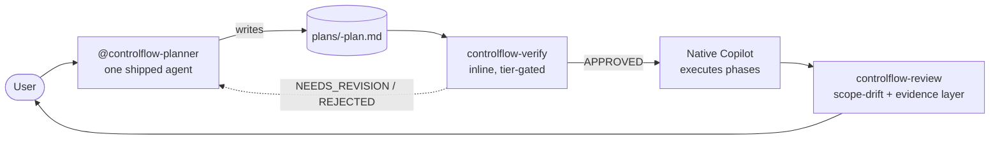

# Chapter 00 — Introduction

## Why this chapter

Understand **what ControlFlow is**, what it delivers, and why it exists. After this chapter you will know the difference between ControlFlow and other AI tools, and where to start exploring.

## Key concepts

- **Thin layer** — ControlFlow is a non-duplicating layer over native GitHub Copilot agent capabilities, not a compiled application or a multi-agent dispatch runtime.
- **Prompt repo** — ControlFlow ships as Markdown agent prompts, JSON schemas, governance files, and skills that Copilot reads natively from `.github/`.
- **Conceptual role** — a labeled responsibility (e.g. `CoreImplementer-subagent`, `PlanAuditor-subagent`) the Planner assigns in plan phases and native Copilot executes inline. _Not_ a shipped agent file.
- **Pipeline** — plan → verify → review over native Copilot: the Planner produces an artifact, `controlflow-verify` gates it, native Copilot executes the phases, `controlflow-review` gates the result.
- **Determinism** — every decision follows a documented rule; no guessing, no silent assumptions.

## What ControlFlow Is (and Is Not)

**ControlFlow is a thin, non-duplicating layer over GitHub Copilot's native agent capabilities.** It ships one agent (`@controlflow-planner`) and three skills (`controlflow-plan`, `controlflow-verify`, `controlflow-review`) plus a routing stub, and keeps only what Copilot does not provide natively: the schema-enforced plan format, adversarial verification, the seven-category semantic-risk taxonomy, plan-vs-implementation scope-drift review, and the contract-drift eval suite.

**ControlFlow is NOT:**
- A runtime server or compiled application.
- A code library you `npm install`.
- A multi-agent dispatch runtime — there are no shipped subagents; Copilot native provides dispatch and parallelism.
- A chatbot or single-agent assistant.
- A low-code drag-and-drop workflow builder.

The repository delivers:

| Artifact | Count | Purpose |
|----------|-------|---------|
| Planner agent (`@controlflow-planner`) | one | `.github/agents/controlflow-planner.agent.md` — the sole shipped agent; produces plans, hands execution to native Copilot |
| Workflow skills | three | `.github/skills/` — the `controlflow-plan`, `controlflow-verify`, `controlflow-review` pipeline |
| Value-add patterns | nineteen | `skills/patterns/` — reusable domain discipline the Planner injects into phases (up to three per phase) |
| JSON schemas | twenty | `schemas/` — contract documentation + eval fixture references (the plan-format anchor is `schemas/planner.plan.schema.json`) |
| Governance configs | four | `governance/` — runtime policy, role registry, canonical-source matrix, rename allowlist |
| Routing stub | one | `.github/copilot-instructions.md` — shared policies tying the pipeline together |
| Eval harness | ~410 checks | `evals/` — offline validation of schema compliance, drift, parity, and behavioral invariants |
| Documentation | — | Engineering policies, tutorials, architecture docs |

## Why ControlFlow Exists

Without a structured planning layer over an agentic code assistant, LLM-based engineering assistance suffers from recurring failure modes:

1. **Hallucination** — the assistant invents files, APIs, or behaviors that don't exist.
2. **Scope drift** — the implementation changes things outside the agreed scope.
3. **Silent assumptions** — the assistant guesses instead of asking.
4. **Missing rollback** — destructive operations proceed without a recovery plan.
5. **Approval bypass** — high-risk actions execute without human confirmation.
6. **Flaky outputs** — results vary run to run with no deterministic failure labeling.

ControlFlow addresses all six by enforcing:
- Adversarial plan verification before any code is written (`controlflow-verify`).
- Schema-anchored plan contracts (`schemas/planner.plan.schema.json`) kept aligned by the contract-drift eval suite.
- Explicit human approval gates before execution and before shipping.
- A five-class failure taxonomy (`transient`, `fixable`, `needs_replan`, `escalate`, `model_unavailable`) recorded in plan lifecycle sections; retry routing and parallelism delegated to native Copilot.
- An offline eval harness to catch regressions continuously.

What ControlFlow does **not** duplicate: planning discovery, subagent dispatch, code review, model selection, approvals, MCP, and the skills library are all native Copilot capabilities — ControlFlow layers its five disciplines on top rather than reimplementing them. The canonical record is `docs/agent-engineering/NATIVE-DELEGATION-BOUNDARY.md`.

## Architecture in One Sentence

A **Planner** (`@controlflow-planner`) authors a schema-anchored plan artifact; `controlflow-verify` adversarially audits it inline; **native Copilot** executes the phases (the eight executor roles are conceptual labels the Planner assigns, not shipped agents); `controlflow-review` layers scope-drift and evidence review over native Copilot code review.

## The Slim Surface and the Pipeline

The pipeline has three gates, not a state machine. Between gates, native Copilot runs the show. The verify-phase depth is tier-gated (see chapter 05).

## Audience

This tutorial is written for three audiences:

**Newcomers (chapters 00–04):** No prior ControlFlow knowledge required. You need only basic familiarity with Markdown, JSON, and software engineering concepts.

**Mid-level developers (chapters 05–14):** Assumes you have read chapters 00–04 and want to understand the pipeline, planning, schemas, governance, and the eval harness in depth.

**Practitioners (chapters 15–18):** Hands-on case studies, exercises, a glossary, and an FAQ for day-to-day use.

## Learning Outcomes

After completing this tutorial you will be able to:

1. Describe the slim ControlFlow surface (one agent + three skills + routing stub) and what each piece does.
2. Explain the plan → verify → review pipeline and where native Copilot takes over between gates.
3. Classify a task into one of the four complexity tiers and state which verify phases run.
4. Describe the eight executor roles and the three inline verify roles as **conceptual labels** the Planner assigns and native Copilot executes — not shipped agent files.
5. Read any plan artifact in `plans/` and understand its status, phases, risks, and handoff.
6. Run `cd evals && npm test` and interpret the output.
7. Contribute a new skill pattern or governance change following the process documented in CONTRIBUTING.md.

## How to Read This Tutorial

- **Sequential** — read chapters in order for a complete mental model.
- **By trajectory** — see the [README](README.md) for curated reading paths.
- **As a reference** — chapters 03, 09, 10, 17, and 18 are designed for lookup.

## Review Questions

1. Name three things ControlFlow is **not**.
2. What six failure modes does ControlFlow address, and which of them are mitigated by `controlflow-verify`?
3. Which repository directory holds the offline eval harness?
4. What is the relationship between the Planner and native Copilot? Where does ControlFlow end and Copilot begin?

## See Also

- [Chapter 01 — Quick Start](01-quickstart.md)
- [Chapter 02 — Architecture Overview](02-architecture-overview.md)
- [docs/agent-engineering/NATIVE-DELEGATION-BOUNDARY.md](../agent-engineering/NATIVE-DELEGATION-BOUNDARY.md)
- [plans/project-context.md](../../plans/project-context.md)