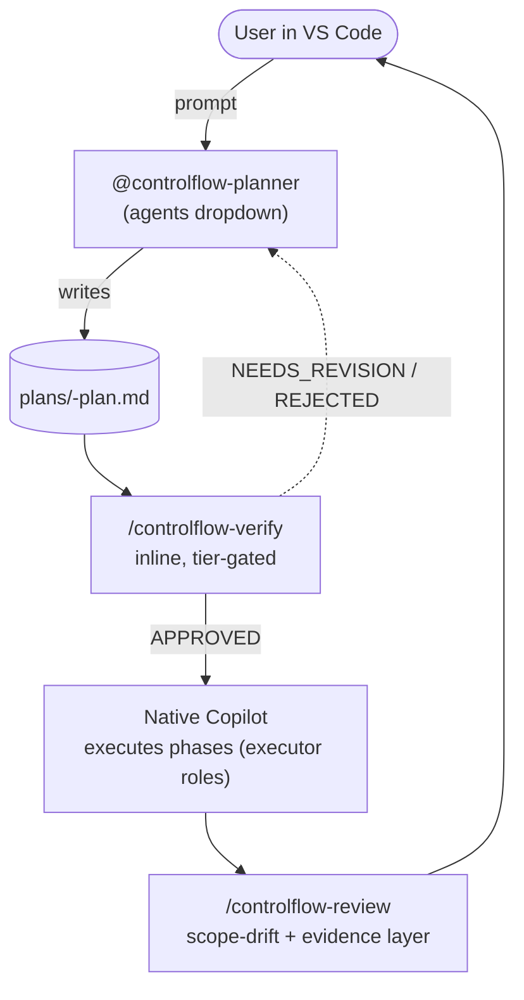

# Chapter 01 — Quick Start

## Why this chapter

Get oriented in the repository within 30 minutes. After this chapter you can drive the slim ControlFlow flow end-to-end — open the planner, produce a plan artifact, verify it, implement with native Copilot, and review — and run the eval harness.

## Step 1: Repository Map

```text
ControlFlow/
├── .github/
│   ├── agents/
│   │   └── controlflow-planner.agent.md   ← the sole shipped agent
│   ├── skills/
│   │   ├── controlflow-plan/              ← plan skill + references
│   │   ├── controlflow-verify/           ← inline adversarial verify
│   │   └── controlflow-review/           ← post-implementation review
│   └── copilot-instructions.md            ← shared routing stub
├── schemas/                               ← twenty JSON schemas (contracts + eval fixtures)
├── governance/                            ← four governance files (policy, registry, matrix, allowlist)
├── skills/
│   ├── index.md                           ← pattern domain mapping
│   └── patterns/                          ← nineteen value-add patterns
├── evals/                                 ← offline validation suite
│   ├── validate.mjs
│   ├── scenarios/                          ← regression fixtures
│   └── tests/
├── plans/
│   ├── project-context.md                 ← role taxonomy, tiers, conventions
│   ├── templates/                          ← plan + session-notes templates
│   └── artifacts/                         ← per-task history
├── plugins/
│   ├── controlflow-claude-code/           ← portable Claude Code plugin
│   ├── controlflow-codex/                 ← portable Codex CLI plugin
│   └── controlflow-cursor/                ← portable Cursor plugin
├── docs/
│   └── agent-engineering/                 ← engineering policy docs
└── NOTES.md                               ← active objective state
```

Copilot reads `.github/agents/`, `.github/skills/`, and `.github/copilot-instructions.md` natively — that is the entire shipped ControlFlow surface. There is one shipped agent and three shipped skills; everything else is contracts, patterns, evals, and docs.

## Step 2: Run the Eval Harness

The canonical verification command is:

```sh
cd evals && npm test
```

This runs ~410 offline checks — structural validation, prompt-behavior contracts, drift detection (including the `plans/project-context.md` ↔ `governance/project-context-registry.json` mirror), skill discoverability, capability matrix, plugin manifest parity, and contract-drift. No live agents, no network calls.

Faster targeted runs:

```sh
npm run test:structural   # structural validation only (faster)
npm run test:behavior     # prompt-behavior + drift regressions only
```

Run `npm install` once before `npm test` if you haven't already. The cache at `evals/.cache/` may mask failures after structural edits — delete it (`rm -rf evals/.cache`) before trusting a green run.

## Step 3: The Slim Flow at a Glance



The flow has three gates: the Planner produces the artifact, `controlflow-verify` gates it before execution, native Copilot executes the phases, and `controlflow-review` gates the result. Between gates, native Copilot runs the show.

## Step 4: Drive the Flow End-to-End

1. **Open the repo in VS Code.** Copilot reads the slim surface from `.github/` natively.
2. **Open Copilot Chat → switch to Agent mode → open the agents dropdown → select `controlflow-planner`.** (Selecting from the dropdown is the GA-confirmed invocation path. `@controlflow-planner` via `@-mention` also works if it surfaces in your setup.)
3. **Prompt it.** Example: `Add OAuth login with Google`. The Planner runs an Idea Interview if the request is vague, reads the repo, assigns a complexity tier, fills the seven semantic-risk categories, decomposes into phases, and writes a schema-conforming plan to `plans/<task-slug>-plan.md`. It never inlines the plan in chat — it points you to the artifact path.
4. **Read the plan artifact.** Open `plans/<task-slug>-plan.md` in the editor; review status, phases, risks, and handoff.
5. **Verify it (SMALL+ work).** Run `/controlflow-verify` in Copilot Chat. It reads the plan from disk, runs the tier-gated inline phases (structural audit for SMALL; plus mirage detection for MEDIUM; plus executability cold-start for LARGE), and emits `APPROVED` / `NEEDS_REVISION` / `REJECTED`. A compact verdict is written to `plans/artifacts/<task-slug>/verify-verdict.md`. Do not begin implementation until the verdict is `APPROVED`.
6. **Implement with native Copilot.** Continue in Copilot Chat; native Copilot executes the plan's phases, using the `executor_agent` field in each phase as a role label (e.g. `CoreImplementer-subagent`), not a spawned ControlFlow agent. Mid-execution clarification is native Copilot's job; if the ambiguity changes file scope or architecture, re-invoke `@controlflow-planner` for a targeted replan.
7. **Review (SMALL+ work).** After implementation, run `/controlflow-review`. It layers plan-vs-implementation scope-drift comparison, proactive vulnerability and error search, and evidence discipline over native Copilot code review. Findings are ordered by severity.

TRIVIAL tasks (one to two files, single concern) skip the pipeline entirely — no plan, no verify, no review.

## Step 5: End-to-End Scenario (CSV Export)

**Task:** "Add CSV export to the orders page."

Here is a simplified walkthrough:

1. **Select `controlflow-planner` from the agents dropdown** and prompt it with the task.
2. **Planner conducts an Idea Interview** if the scope is ambiguous (format? which endpoint? auth required?).
3. **Planner reads the repo** and keeps verified facts separate from bounded assumptions.
4. **Planner assigns a complexity tier** — likely `SMALL` or `MEDIUM` (one domain, a handful of files).
5. **Planner fills the seven semantic-risk categories** (none skipped; `not_applicable` with justification when irrelevant).
6. **Planner selects skill patterns** — e.g. `skills/patterns/tdd-patterns.md`, `skills/patterns/error-handling-patterns.md` (up to three per phase).
7. **Planner decomposes into phases** — Phase 1: add service layer; Phase 2: add endpoint; Phase 3: add tests. Each phase declares one `executor_agent` from the eight-name enum.
8. **Planner writes the artifact** to `plans/add-csv-export-plan.md` and points you to the path. It does not hand off to a dispatcher — it stops here.
9. **You run `/controlflow-verify`.** For `SMALL`, phase 1 (structural audit) runs. For `MEDIUM`, phases 1–2 run. If `APPROVED`, proceed. If `NEEDS_REVISION`, re-invoke the Planner to revise.
10. **You implement with native Copilot**, phase by phase, following the plan's `executor_agent` labels and `acceptance_criteria`.
11. **You run `/controlflow-review`.** It compares the diff to the plan, searches proactively for vulnerabilities and skipped error paths, and emits findings plus a verdict.
12. **You review the verdict** before the change ships.

There is no dispatch state machine, no wave scheduler, and no per-phase gate event stream in the slim flow — those were the retired conceptual conductor's responsibilities, now covered by the Planner plus native Copilot plus the two verdict gates.

## Step 6: What to Read Next

| Goal | Chapter |
| --- | --- |
| Understand the slim architecture | [Chapter 02](02-architecture-overview.md) |
| Understand the role taxonomy | [Chapter 03](03-agent-roster.md) |
| Write a custom agent prompt | [Chapter 04](04-part-spec.md) |
| Understand the pipeline | [Chapter 05](05-orchestration.md) |
| Understand planning | [Chapter 06](06-planning.md) |
| Understand verify | [Chapter 07](07-review-pipeline.md) |
| Understand schemas | [Chapter 09](09-schemas.md) |
| Understand governance | [Chapter 10](10-governance.md) |

## Exercises

1. **(beginner)** Open `.github/agents/controlflow-planner.agent.md`. Find the required frontmatter fields (`description`, `name`, `tools`). Why is there no `model:` line?
2. **(beginner)** Run `cd evals && npm test`. How many checks passed? How long did it take? (Remember to `rm -rf evals/.cache` first.)
3. **(intermediate)** Open `governance/runtime-policy.json`. Find `review_pipeline_by_tier`. Which verify phases are active for `MEDIUM`?
4. **(intermediate)** Open `schemas/planner.plan.schema.json`. Find the `complexity_tier` enum. What are the four allowed values, and which one skips the pipeline entirely?

## Using with Cursor or Codex

ControlFlow ships host-adaptation plugins for non-VS Code hosts: `plugins/controlflow-cursor/` (Cursor) and `plugins/controlflow-codex/` (Codex CLI). These approximate the slim flow with each host's native surfaces. See `plugins/controlflow-cursor/README.md` and `plugins/controlflow-codex/README.md` for installation and the current skill catalog.

## Review Questions

1. What is the canonical verification command, and why must you delete `evals/.cache/` before trusting a green run?
2. Name the slim shipped ControlFlow surface (one agent, three skills, one stub) and the directory Copilot reads them from.
3. List the three gates in the slim flow in order.
4. After the Planner writes the plan artifact, is it auto-approved? What must happen before implementation begins on SMALL+ work?

## See Also

- [Chapter 02 — Architecture Overview](02-architecture-overview.md)
- [Chapter 04 — Agent prompt structure](04-part-spec.md)
- [Chapter 14 — Eval Harness](14-evals.md)
- [evals/README.md](../../evals/README.md)
- [docs/agent-engineering/NATIVE-DELEGATION-BOUNDARY.md](../agent-engineering/NATIVE-DELEGATION-BOUNDARY.md)