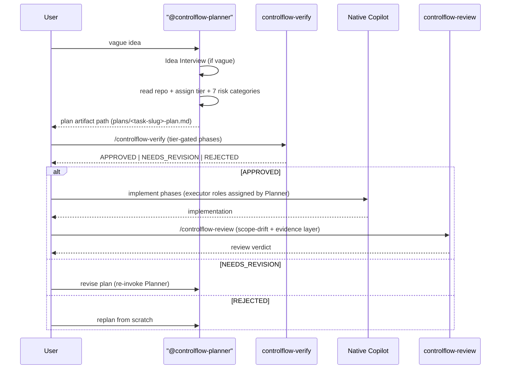

# Chapter 02 — Architecture Overview

## Why this chapter

Build a mental model of the entire system: what ControlFlow ships, what it delegates to native Copilot, and how the plan → verify → review pipeline ties the pieces together. After this chapter you could sketch the ControlFlow architecture on a whiteboard in five minutes — and point to exactly where native Copilot takes over.

## Key Concepts

- **Slim surface** — the entire shipped ControlFlow artifact set for VS Code Copilot: one agent (`@controlflow-planner`) plus three skills (`controlflow-plan`, `controlflow-verify`, `controlflow-review`) plus a routing stub. Everything else is delegated to native Copilot.
- **Conceptual role** — a labeled responsibility (e.g. `CoreImplementer-subagent`, `PlanAuditor-subagent`) the Planner assigns in plan phases and native Copilot executes inline. _Not_ a shipped agent file.
- **Pipeline** — plan → verify → review over native Copilot. The Planner produces the artifact; `controlflow-verify` gates it before execution; native Copilot executes the phases; `controlflow-review` gates the result.
- **Tier-gated policy** — `TRIVIAL` / `SMALL` / `MEDIUM` / `LARGE` decide whether plan, verify, and review run at all and how deep verify goes.
- **Delegation boundary** — the rule that ControlFlow ships no surface duplicating a native Copilot capability. The canonical record is `docs/agent-engineering/NATIVE-DELEGATION-BOUNDARY.md`.
- **Contract (schema)** — a JSON schema in `schemas/` documenting a role's output shape and anchoring an eval fixture. Schemas are contract documentation + eval fixture references in the slim model, not runtime-validated inter-agent messages.

## Top-Level Architecture

```mermaid
flowchart TB
    User([User])

    subgraph CF["ControlFlow slim surface (shipped)"]
        direction TB
        Planner["@controlflow-planner<br/>.github/agents/controlflow-planner.agent.md"]
        PlanSkill["controlflow-plan<br/>.github/skills/controlflow-plan/"]
        VerifySkill["controlflow-verify<br/>.github/skills/controlflow-verify/"]
        ReviewSkill["controlflow-review<br/>.github/skills/controlflow-review/"]
        Stub["copilot-instructions.md<br/>routing stub"]
    end

    subgraph Roles["Conceptual roles (NOT shipped files)"]
        direction LR
        Exec[8 executor roles]
        Verify[3 inline verify roles]
    end

    subgraph Native["Native Copilot (provides)"]
        direction LR
        Dispatch[Subagent dispatch + parallelism]
        PlanMode[/plan mode]
        CodeReview[Agentic code review]
        Models[Model selection + approvals + MCP]
    end

    User -->|prompt| Planner
    Planner --> PlanSkill
    PlanSkill -->|plan artifact in plans/| VerifySkill
    VerifySkill -->|APPROVED| Native
    Native -->|executes phases<br/>(executor roles)| ReviewSkill
    ReviewSkill -->|verdict| User
    Planner -.->|assigns| Roles
    Roles -.->|executed by| Native
    Stub -.->|routes| PlanSkill
    Stub -.->|routes| VerifySkill
    Stub -.->|routes| ReviewSkill
```

## The Slim Surface and Its Roles

ControlFlow ships **one agent and three skills** over native Copilot. There are **no shipped subagents**.

| Surface | Path | Role |
|---------|------|------|
| `@controlflow-planner` agent | `.github/agents/controlflow-planner.agent.md` | The sole shipped agent. Runs the plan skill + Idea Interview; hands execution to native Copilot. Uses the Copilot Auto model picker (no `model:` frontmatter). |
| `controlflow-plan` skill | `.github/skills/controlflow-plan/` | Produces a schema-anchored plan artifact in `plans/`. Single-sources the format from `schemas/planner.plan.schema.json` and `plans/templates/plan-document-template.md`. |
| `controlflow-verify` skill | `.github/skills/controlflow-verify/` | Inline adversarial verification (zero subagents). Tier-gated phases: structural audit, mirage detection, executability cold-start. Emits a verdict. |
| `controlflow-review` skill | `.github/skills/controlflow-review/` | Evidence-backed review layered over native Copilot code review. Adds plan-vs-implementation scope-drift comparison. |
| Routing stub | `.github/copilot-instructions.md` | Shared policies; ties plan → verify → review together. |

The role labels in plans — the eight executor roles and the three inline verify roles — are **conceptual roles** the Planner assigns in plan phases and native Copilot executes inline. They are not shipped agent files. See chapter 03 for the full taxonomy and `plans/project-context.md` for the authoritative mirror tables.

### What native Copilot provides (delegated)

| Native capability | Status | ControlFlow delegation |
|-------------------|--------|------------------------|
| Custom agents (`@-mention`, `.agent.md`) | GA (Feb 2026) | ControlFlow's `.agent.md` is already a Copilot agent |
| Subagent dispatch + parallelism | GA (Feb 2026) | Drop the legacy dispatch state machine; native Copilot runs executor phases |
| Plan mode (`/plan`) | GA | Layer over — keep the CF plan _format_; use native discovery |
| Agentic code review | GA (Mar 2026) | Delegate the mechanical pass; keep the CF scope-drift + evidence layer |
| Skills library (`.github/skills/`) | GA (portable) | Ship ControlFlow as skills |
| MCP, model selection, approvals, custom instructions | GA | Delegate |

### What ControlFlow keeps (Copilot does not provide natively)

1. The schema-enforced plan format (YAML header, ten sections, seven-category semantic risk, Mermaid per tier) anchored by `schemas/planner.plan.schema.json`.
2. Adversarial inline verification (`controlflow-verify`: structural audit, mirage detection, executability cold-start → `APPROVED` / `NEEDS_REVISION` / `REJECTED`).
3. The tier-gated workflow policy (`TRIVIAL` / `SMALL` / `MEDIUM` / `LARGE` with verify-phase depth).
4. Plan-vs-implementation scope-drift review (`controlflow-review`, layered over native Copilot code review).
5. The contract-drift eval suite (`evals/`).

The canonical record is `docs/agent-engineering/NATIVE-DELEGATION-BOUNDARY.md` — read it; cite it; do not restate it at length.

## Key Flow: Idea → Code



The pipeline has three gates, not a state machine: the Planner produces an artifact; `controlflow-verify` gates it before execution; native Copilot executes; `controlflow-review` gates after. Between gates, native Copilot runs the show — including mid-execution clarification and retry routing (see chapter 05).

## Subsystems

| Subsystem | Location | Purpose |
|-----------|----------|---------|
| **Schemas** | `schemas/*.json` | Twenty JSON schemas — contract documentation + eval fixture references. The plan format anchor is `schemas/planner.plan.schema.json`. |
| **Governance** | `governance/*.json` | Four files: `runtime-policy.json`, `project-context-registry.json`, `canonical-source-matrix.json`, `rename-allowlist.json`. No model routing or tool grant surfaces. |
| **Skills** | `.github/skills/controlflow-{plan,verify,review}/` + `skills/patterns/` | Three workflow skills (shipped) and nineteen value-add patterns (Planner-injected, ≤3 per phase via `skill_references`). |
| **Memory** | `NOTES.md`, `plans/artifacts/`, `/memories/repo/` | Three-layer model: session / task-episodic / repo-persistent. |
| **Plans** | `plans/` | Plan artifacts + `plans/project-context.md` (the authoritative role taxonomy) + `plans/templates/`. |
| **Eval harness** | `evals/` | Offline quality checks for the entire system (see chapter 14). |

Each is covered in a dedicated chapter (09–14).

## Architecture Principles

1. **Planning / execution separation.** The Planner produces the plan and does not write code. Native Copilot executes phases and does not change the design.
2. **Adversarial verification before execution.** `controlflow-verify` tries to refute the plan before any code is touched. Finding a problem in a plan is cheaper than finding it in code.
3. **Contracts over trust.** The plan format is anchored by `schemas/planner.plan.schema.json`; role output shapes are documented in `schemas/` and verified by the eval suite.
4. **Human approval gates.** The user confirms the plan before execution begins and the review verdict before the change ships.
5. **Explicit failure taxonomy.** Every failure recorded in a plan lifecycle section is classified into one of five classes (`transient`, `fixable`, `needs_replan`, `escalate`, `model_unavailable`). Retry routing and parallelism are native Copilot's job.
6. **Fail-loud, abstain-safe.** When evidence is insufficient, the Planner returns `ABSTAIN` rather than guessing.
7. **Least privilege — delegated.** Tool access and model selection are delegated to native Copilot. There is no `governance/tool-grants.json` in the slim model.
8. **Structured text output.** Plans and verdicts are written to artifacts in `plans/` and presented as structured text — never raw JSON dumped to chat.
9. **Non-duplication.** ControlFlow ships no surface that duplicates a native Copilot capability. The delegation boundary is audited (see `docs/agent-engineering/NATIVE-DELEGATION-BOUNDARY.md`).

## Common Misconceptions

- **"The executor role names are shipped agent files."** No — `CodeMapper-subagent`, `CoreImplementer-subagent`, and the other seven are _conceptual role labels_ the Planner assigns in plan phases. Native Copilot executes them inline. The only shipped agent file is `.github/agents/controlflow-planner.agent.md`.
- **"`controlflow-verify` spawns verifier subagents."** No — the three verify roles (`PlanAuditor-subagent`, `AssumptionVerifier-subagent`, `ExecutabilityVerifier-subagent`) are phases of the verify skill performed inline in the main context. Zero subagents.
- **"ControlFlow has an Orchestrator that dispatches phases."** The Orchestrator is the _retired_ conceptual conductor role; it is not shipped. The Planner + native Copilot cover orchestration. The legacy state machine, dispatch, waves, and gates are gone.
- **"You can invoke an executor role directly from ControlFlow."** There is no ControlFlow surface to invoke. The Planner assigns the role in a plan phase; you then run the phase with native Copilot (or recreate the persona as a native Copilot custom agent — see `NATIVE-DELEGATION-BOUNDARY.md §5`).
- **"Schemas validate inter-agent messages at runtime."** In the slim model, schemas are contract documentation + eval fixture references. The plan format is enforced at planning time by the `controlflow-plan` skill conforming to `schemas/planner.plan.schema.json`, and the contract-drift eval suite asserts the format, role taxonomy, and governance stay aligned.

## Exercises

1. **(beginner)** Draw on paper the slim surface (one agent, three skills, routing stub) over native Copilot. Compare with the diagram above.
2. **(beginner)** Open `plans/project-context.md` and find the Phase Executor Agents table. Confirm the eight executor role names match the ones listed in chapter 03.
3. **(intermediate)** Which three roles **cannot** appear in the `executor_agent` field of a plan phase, and why? (Hint: they are the inline verify roles, performed by `controlflow-verify`.)
4. **(intermediate)** Open `docs/agent-engineering/NATIVE-DELEGATION-BOUNDARY.md` §1. List the five "Keep" rows — the things Copilot does not provide natively and ControlFlow keeps.
5. **(advanced)** Explain in your own words why the Orchestrator state machine was retired rather than slimmed. What native Copilot capability replaced dispatch + waves + gates?

## Review Questions

1. Name the shipped ControlFlow surface for VS Code Copilot (one agent, three skills, one stub).
2. What is the difference between a _conceptual role_ and a _shipped agent file_?
3. List the three pipeline gates in order.
4. Which subsystem anchors the plan format as a contract?
5. Why is there no model routing or tool grant JSON file in the slim model governance directory?

## See Also

- [Chapter 03 — Role Taxonomy](03-agent-roster.md)
- [Chapter 05 — The plan → verify → review pipeline](05-orchestration.md)
- [Chapter 07 — Review Pipeline](07-review-pipeline.md)
- [docs/agent-engineering/NATIVE-DELEGATION-BOUNDARY.md](../agent-engineering/NATIVE-DELEGATION-BOUNDARY.md)
- [plans/project-context.md](../../plans/project-context.md)