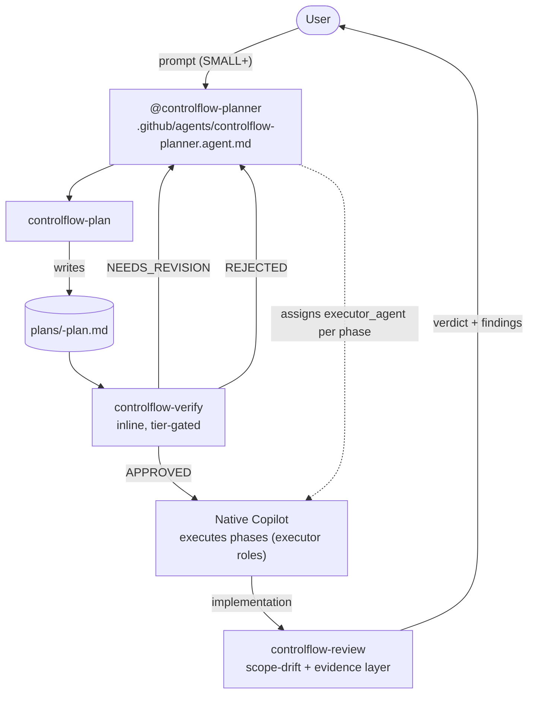
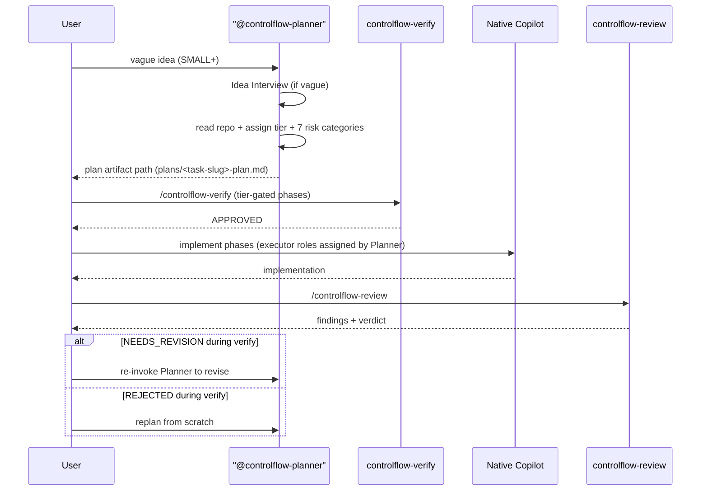

# Chapter 05 — The plan → verify → review pipeline

## Why this chapter

Understand **how the pipeline governs the process** in the slim model: what runs when, what gates what, and what native Copilot owns between gates. After this chapter you can trace any task step by step from idea to reviewed implementation — and you know exactly where the legacy Orchestrator state machine went and why.

The headline change: the Orchestrator is **retired** as a shipped agent. There is no dispatch state machine, no wave scheduler, no per-phase gate event stream. Orchestration is now the plan → verify → review pipeline over native Copilot, governed by a tier-gated policy and three verdict gates.

## Key Concepts

- **Pipeline** — the three-step flow: `controlflow-plan` (Planner produces the artifact) → `controlflow-verify` (inline adversarial audit) → native Copilot executes phases → `controlflow-review` (scope-drift + evidence layer over native code review).
- **Tier-gated policy** — `TRIVIAL` / `SMALL` / `MEDIUM` / `LARGE` decide whether plan, verify, and review run at all and how many verify phases run.
- **Verdict gate** — a decision emitted by a skill: `controlflow-verify` → `APPROVED` / `NEEDS_REVISION` / `REJECTED`; `controlflow-review` → findings + verdict. A gate blocks progression until the user (or a re-invoke of the Planner) resolves it.
- **Conceptual role** — a labeled responsibility the Planner assigns in a plan phase (`executor_agent`) and native Copilot executes inline. Not a shipped agent (see chapter 03).
- **Failure classification** — one of `transient`, `fixable`, `needs_replan`, `escalate`, `model_unavailable`. Recorded in plan lifecycle sections; retry routing and parallelism are native Copilot's job.
- **Orchestrator (retired)** — the conceptual conductor role. Mentioned here only as history: in the slim model, the Planner + native Copilot cover orchestration. The legacy state machine (`PLANNING` / `WAITING_APPROVAL` / `PLAN_REVIEW` / `ACTING` / `REVIEWING` / `COMPLETE`), dispatch, waves, and batch gates are gone.

## The Pipeline

The pipeline has three gates, not a state machine. Between gates, native Copilot runs the show.

## Tier-Gated Policy

The tier table is the only workflow policy. It must match `README.md`, `.github/copilot-instructions.md`, and `plans/project-context.md` exactly.

| Tier | Scope | Plan | Verify (inline phases) | Review |
|------|-------|------|-------------------------|--------|
| **TRIVIAL** | 1–2 files, single concern | skip | skip | skip |
| **SMALL** | 3–5 files, single domain | `controlflow-plan` | phase 1 (structural audit) | `controlflow-review` |
| **MEDIUM** | 6–14 files, cross-domain | `controlflow-plan` | phases 1–2 (audit + assumption/mirage) | `controlflow-review` |
| **LARGE** | 15+ files, system-wide | `controlflow-plan` | phases 1–3 (audit + mirage + executability cold-start) | `controlflow-review` |

**Override rule:** any plan with a `risk_review` entry where `applicability: applicable` AND `impact: HIGH` AND `disposition` not `resolved` forces `LARGE` (all three verify phases) regardless of file count.

**Hard rule:** do not begin implementation on SMALL+ work until `controlflow-verify` returns `APPROVED`.

## The Three Gates in Detail

### Gate 1 — Plan (produces the artifact)

`@controlflow-planner` runs the `controlflow-plan` skill (`.github/skills/controlflow-plan/`). What happens:

- Read the repository before phase decomposition; keep verified facts separate from assumptions with a bounded scope statement.
- Run an **Idea Interview** when the request is vague; ask the user directly when an answer changes file scope, user-visible behavior, architecture, or destructive-risk handling; otherwise record a bounded assumption.
- Assign one complexity tier.
- Fill all seven semantic-risk categories (none skipped; `not_applicable` with justification when irrelevant).
- Declare exactly one `executor_agent` per phase from the schema enum.
- Write the artifact to `plans/<task-slug>-plan.md` using the template at `plans/templates/plan-document-template.md`, conforming to `schemas/planner.plan.schema.json`.
- Never inline the plan in chat — point to the artifact path.

The Planner does **not** write code, invoke executors, or run verify/review. It produces the artifact and hands off.

### Gate 2 — Verify (adversarial pre-execution)

`/controlflow-verify` runs inline in the main context — zero subagents. It reads the plan from disk (not a chat-embedded copy) and tries to refute it. Adversarial framing: your job is to break the plan, not to defend it. Default to `flagged` when evidence is insufficient.

| Phase | Role label | What it checks | Tier |
|-------|-----------|----------------|------|
| 1 — Structural audit | `PlanAuditor-subagent` | Schema/template conformance; 10 sections in order; 7 risk categories; executor enum; Mermaid rules | SMALL+ |
| 2 — Mirage detection | `AssumptionVerifier-subagent` | Referenced files/symbols exist; assumptions bounded; no concurrency hand-waving | MEDIUM+ |
| 3 — Executability cold-start | `ExecutabilityVerifier-subagent` | Can a fresh executor start Phase 1 from the plan alone? Concrete verification commands? Rollback for destructive phases? | LARGE (or HIGH-risk override) |

**Verdict semantics:**

- `APPROVED` — all checks pass, Phase 1 actionable, criteria measurable. Implementation may begin.
- `NEEDS_REVISION` — ambiguous Phase 1, unverified paths, vague criteria, structural failure. List each finding with the exact section reference; re-audit after fix. Re-invoke the Planner to revise.
- `REJECTED` — structural flaw; scope not deliverable as authored. Explain blockers; ask the user for direction. Do not start coding.

A compact verdict is written to `plans/artifacts/<task-slug>/verify-verdict.md` for auditability, then presented to the user.

### Gate 3 — Review (post-implementation, layered over native)

`/controlflow-review` runs after implementation. It is a **layer over** native Copilot code review, not a replacement. The mechanical/style pass (lint-class issues, formatting, rote pattern checks) belongs to native Copilot code review and `security-review`. ControlFlow adds only what native review does not:

- **Plan comparison** — does the diff match the plan's phases, files, and acceptance criteria? Flag scope drift, missing phases, extra-phased work, unmet acceptance criteria.
- **Proactive vulnerability / error search** — trace new data flows to their endpoints; check validation at each boundary; look for error paths the implementation skipped (absence mirages A11–A13); check for missing migrations or rollback (A16); check for missing security boundaries on sensitive operations (A17).
- **Evidence discipline** — label each finding with severity, confidence, file, line, user impact, and validation method. Distinguish validated blockers from hypotheses; state validation gaps explicitly.

Findings are presented first, ordered by severity. If there are none, the skill says so and names residual risks or test gaps. Soft labels (`Nit`, `Optional`, `FYI`) come only after blocking findings.

## Scenario: Typical End-to-End Task

## Mid-Execution Clarification

Native Copilot handles mid-execution ambiguity. If a phase needs clarification, native Copilot surfaces it to the user directly (its native approvals/ask-questions surface) and continues. There is no `NEEDS_INPUT` routing table — that was an Orchestrator concept.

If the ambiguity changes file scope, user-visible behavior, architecture, or destructive-risk handling, the user re-invokes `@controlflow-planner` for a targeted replan rather than resolving it inline. The Planner reads the existing artifact in `plans/`, updates the affected phases, and re-runs `controlflow-verify` before execution resumes.

## Failure Routing

Every failure recorded in a plan lifecycle section (`## Progress`, `## Discoveries`, `## Idempotence & Recovery`) receives a `failure_classification`:

| Class | Meaning | Who routes |
| ----- | ------- | ----------- |
| `transient` | Flaky test, network timeout, temporary tool unavailability; retry with identical scope | Native Copilot |
| `fixable` | Small correctable issue (typo, missing import, config value); retry with fix hint | Native Copilot |
| `needs_replan` | Architecture mismatch or missing dependency; delegate to the Planner for a targeted replan | Re-invoke `@controlflow-planner` |
| `escalate` | Security vulnerability, data integrity risk, unresolvable blocker; stop and await human approval | Native Copilot stops; user decides |
| `model_unavailable` | The routed/primary model is unavailable or unreachable; retry with a native Copilot model substitution, then escalate on exhaustion | Native Copilot |

Retry routing, retry budgets, and parallelism are native Copilot's job, not ControlFlow's. `needs_replan` is the one class that re-enters the ControlFlow pipeline — it re-invokes the Planner for a targeted replan.

## Stopping Rules (mandatory pauses)

These moments are **mandatory pauses** — they cannot be skipped:

1. After the plan is written and before execution begins (the user reviews the artifact).
2. After `controlflow-verify` returns a verdict — implementation begins only on `APPROVED`.
3. After `controlflow-review` returns findings — the user reviews the verdict before the change ships.

Skipping a stopping rule equals skipping a gate, which is a contract violation.

## Why the Orchestrator State Machine Was Retired

A brief history, since the question is common. The legacy Orchestrator owned a lifecycle (`PLANNING` → `WAITING_APPROVAL` → `PLAN_REVIEW` → `ACTING` → `REVIEWING` → `COMPLETE`), emitted gate events, dispatched phases in waves, and routed failures per a retry budget. As of February 2026, Copilot does all of this natively: subagent dispatch + parallelism is GA default-on, `/plan` mode is GA, agentic code review is GA, and approvals + custom instructions are GA.

Keeping a ControlFlow dispatch state machine on top of those would duplicate native capabilities — exactly what the slim model forbids. So the Orchestrator is retired as a shipped agent. What ControlFlow keeps is what Copilot does not provide natively: the plan _format_, the adversarial _verify_ gate, the tier-gated _policy_, and the scope-drift _review_ layer. The pipeline above is what "orchestration" now means.

## Common Mistakes

- **Treating a plan artifact as approved.** A written plan is not approval; `controlflow-verify` still must return `APPROVED` before execution.
- **Skipping verify on SMALL tasks.** SMALL runs phase 1 (structural audit) — it is not skip-verify. Only TRIVIAL skips the pipeline.
- **In-lining the plan in chat.** The Planner writes an artifact to `plans/` and points to the path. The verify skill reads from disk. An in-chat plan is not a plan artifact.
- **Looking for the retired Orchestrator agent file or the dispatch state machine.** Both are retired. The routing stub (`.github/copilot-instructions.md`) and the tier table are the policy.
- **Expecting ControlFlow to retry, parallelize, or route failures.** Those are native Copilot's job. ControlFlow only labels failures (`needs_replan` re-enters the pipeline; the rest are native Copilot's to handle).
- **Forcing continuation after `REJECTED`.** `REJECTED` means stop; ask the user for direction or replan from scratch.

## Exercises

1. **(beginner)** Open `.github/copilot-instructions.md` and find the tier table. Confirm it matches the table in this chapter and in `README.md`.
2. **(beginner)** Open `.github/skills/controlflow-verify/SKILL.md` and list the three phases and the role label each corresponds to.
3. **(intermediate)** A SMALL task has an unresolved `HIGH`-impact `performance` risk entry. What tier does it become, and how many verify phases run? (Override rule.)
4. **(intermediate)** A phase fails with `needs_replan`. Who routes it, and what is the single ControlFlow entry point that re-enters the pipeline?
5. **(advanced)** Trace a MEDIUM task end-to-end: which skill runs, which verify phases run, which roles are assigned, which gate emits the verdict. Draw it.

## Review Questions

1. Name the three gates in the pipeline and the skill (or native surface) behind each.
2. What does the tier-gated override rule say, and where is it encoded?
3. List the three verify verdicts and what each means for implementation.
4. Which failure class re-enters the ControlFlow pipeline, and how?
5. Why was the Orchestrator state machine retired rather than slimmed?

## See Also

- [Chapter 02 — Architecture Overview](02-architecture-overview.md)
- [Chapter 06 — Planning](06-planning.md)
- [Chapter 07 — Review Pipeline](07-review-pipeline.md)
- [Chapter 08 — Execution Pipeline](08-execution-pipeline.md)
- [Chapter 13 — Failure Taxonomy](13-failure-taxonomy.md)
- [.github/copilot-instructions.md](../../.github/copilot-instructions.md)
- [docs/agent-engineering/NATIVE-DELEGATION-BOUNDARY.md](../agent-engineering/NATIVE-DELEGATION-BOUNDARY.md)