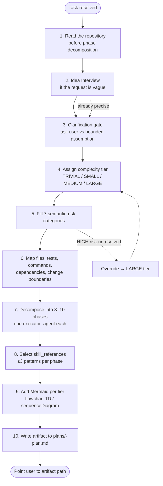

# Chapter 06 — Planning

## Why this chapter

Walk through **how `@controlflow-planner` turns an idea into a plan artifact**: the sequential workflow the `controlflow-plan` skill runs, from first read of the repo to the written artifact in `plans/`. This is the most "thinking-intensive" part of the pipeline, and it is the one place where ControlFlow produces a durable written contract before any code is touched.

The Planner does **not** write code, invoke executors, or run verify/review. It produces the artifact and hands off. Execution is native Copilot's job (see chapter 08); adversarial verification is `controlflow-verify`'s job (see chapter 07).

## Key Concepts

- **`@controlflow-planner`** — the sole shipped ControlFlow agent (`.github/agents/controlflow-planner.agent.md`). Runs the `controlflow-plan` skill. Uses the Copilot Auto model picker (no `model:` frontmatter).
- **`controlflow-plan` skill** — the workflow this chapter describes. Single-sources the plan format from `schemas/planner.plan.schema.json` (the machine-enforced contract) and `plans/templates/plan-document-template.md` (the human document skeleton).
- **Idea Interview** — a structured dialogue with the user when a task is vague.
- **Clarification gate** — ask the user directly when an answer changes file scope, user-visible behavior, architecture, or destructive-risk handling; otherwise record a bounded assumption.
- **Semantic risk review** — mandatory assessment across 7 risk categories (none skipped; `not_applicable` with justification when irrelevant).
- **Complexity tier** — classification into `TRIVIAL` / `SMALL` / `MEDIUM` / `LARGE` (TRIVIAL skips the pipeline).
- **`executor_agent`** — required field per phase; exactly one, from the 8-name schema enum. Conceptual role label the Planner assigns; native Copilot executes.
- **`skill_references`** — up to 3 value-add `skills/patterns/` paths the Planner injects into a phase for discipline.
- **Plan artifact** — the plan written to `plans/<task-slug>-plan.md`. **Never inlined in chat** — the Planner points to the artifact path.
- **Terminal outcomes** — `READY_FOR_EXECUTION`, or `ABSTAIN` / `REPLAN_REQUIRED` when evidence is insufficient or premises are invalid.

## The Planner Workflow

The workflow mirrors `.github/skills/controlflow-plan/SKILL.md`. The format itself is **not** restated here — the Planner reads `schemas/planner.plan.schema.json` and `plans/templates/plan-document-template.md` at invoke time and conforms to them.

## Step 1. Read the Repository

Before phase decomposition, the Planner reads the repo and keeps **verified facts** separate from **assumptions** with a bounded scope statement. Planning from chat memory when reading the repo would change scope is a failure mode (see `controlflow-plan` skill, Planning-Specific Failure Checks).

## Step 2. Idea Interview

If the user's request is vague ("improve performance", "let's refactor"), the Planner conducts an interview:

- **What is the goal?** — what specifically changes in the system for the user.
- **What are the boundaries?** — what must NOT be touched.
- **What are the success criteria?** — how will we know it's done.
- **What are the constraints?** — performance, time, dependencies.

Skill pattern: `skills/patterns/idea-to-prompt.md`. The interview can be **skipped** when the task is already precisely formulated.

## Step 3. Clarification Gate

The Planner asks the user directly when an answer changes **file scope, user-visible behavior, architecture, or destructive-risk handling**; otherwise it records a bounded assumption. Typical clarification triggers:

| Trigger | Example |
|---------|---------|
| Scope ambiguity | "Add export" — where? CSV / JSON / PDF? |
| Architecture fork | "Store in Redis or Postgres?" |
| User preference decision | "Sort by name or by date?" |
| Destructive risk approval | "Permanently delete old records?" |
| Repository structure change | "Rename the module?" |

The canonical clarification classes live in `docs/agent-engineering/CLARIFICATION-POLICY.md`. When the Planner asks, it offers 2–3 options, each with pros/cons/affected files and a recommendation.

## Step 4. Assign Complexity Tier

The Planner reads the tier definitions and assigns one tier. The tier table must match `README.md`, `.github/copilot-instructions.md`, and `plans/project-context.md` exactly.

| Tier | Scope | Plan | Verify (inline phases) | Review |
|------|-------|------|-------------------------|--------|
| **TRIVIAL** | 1–2 files, single concern | skip | skip | skip |
| **SMALL** | 3–5 files, single domain | `controlflow-plan` | phase 1 (structural audit) | `controlflow-review` |
| **MEDIUM** | 6–14 files, cross-domain | `controlflow-plan` | phases 1–2 (audit + assumption/mirage) | `controlflow-review` |
| **LARGE** | 15+ files, system-wide | `controlflow-plan` | phases 1–3 (audit + mirage + executability cold-start) | `controlflow-review` |

**Override rule:** any plan with a `risk_review` entry where `applicability: applicable` AND `impact: HIGH` AND `disposition` not `resolved` forces `LARGE` (all three verify phases) regardless of file count.

## Step 5. Semantic Risk Review

**Mandatory** for all plan statuses (including `READY_FOR_EXECUTION`). All 7 categories, each exactly once:

| Category | What it checks |
|----------|---------------|
| `data_volume` | Data sizes, pagination, batch ops, `SELECT *` |
| `performance` | Query paths, N+1, indexes, hot path |
| `concurrency` | Parallel operations, data races, shared mutable state |
| `access_control` | Authorization, permissions, ownership |
| `migration_rollback` | Schema migrations, data transforms, format changes |
| `dependency` | External APIs, new packages, versions |
| `operability` | Deployment, monitoring, infrastructure |

For each category, record `applicability` (`applicable` / `not_applicable` / `uncertain`), `impact` (`HIGH` / `MEDIUM` / `LOW` / `UNKNOWN`), `evidence_source` (file path or query), and `disposition` (`resolved` / `open_question` / `research_phase_added` / `not_applicable`). Never skip a row — use `not_applicable` with justification. The override in Step 4 fires on an unresolved HIGH-impact applicable entry.

The category taxonomy is defined in `docs/agent-engineering/RISK-TAXONOMY.md`; the audit-phase focus areas each category maps to are in `plans/project-context.md` (the `controlflow-verify Phase 1 (Audit) Focus Area Mapping` table).

## Step 6. Map Files, Tests, Commands, Dependencies, Change Boundaries

The Planner maps likely files, tests, commands, dependencies, and change boundaries **before** phase decomposition (not after). This is the input to Phase 9 of the plan artifact (Success Criteria) and to the per-phase `files` arrays.

## Step 7. Decompose into Phases

The plan is broken into **3–10 phases**. If more are needed, decompose the task further. Each phase declares exactly one `executor_agent` from the 8-name schema enum — these are **conceptual role labels** the Planner assigns and native Copilot executes inline (see chapter 03), not shipped agent files:

- `CodeMapper-subagent` — read-only discovery
- `Researcher-subagent` — research & evidence
- `CoreImplementer-subagent` — backend implementation (canonical backbone)
- `UIImplementer-subagent` — UI implementation
- `PlatformEngineer-subagent` — infrastructure / CI-CD
- `TechnicalWriter-subagent` — documentation
- `BrowserTester-subagent` — E2E browser testing
- `CodeReviewer-subagent` — post-implementation review

Each phase contains: `phase_id`, `title`, `objective`, `dependencies`, `files` (`{path, action, reason}`), `tests`, `steps` (numbered prose — **no code blocks**), `acceptance_criteria` (at least one measurable observable outcome), `quality_gates` (from the enum `tests_pass` / `lint_clean` / `schema_valid` / `safety_clear` / `human_approved_if_required`), `failure_expectations` (`{scenario, classification, mitigation}`), and `skill_references`.

**Inter-phase contracts** — if phase B depends on phase A, record `{from_phase, to_phase, interface, format}`. The format must be explicit and the downstream phase must know how to validate it.

The three inline verify roles (`PlanAuditor-subagent`, `AssumptionVerifier-subagent`, `ExecutabilityVerifier-subagent`) **must not** appear as `executor_agent` — they are read-only verify phases performed by `controlflow-verify` (see chapter 07).

## Step 8. Select skill_references

The Planner reads `skills/index.md` and selects **up to 3** `skills/patterns/` paths most relevant to the phase. Paths are written to `skill_references` in each applicable phase. Implementation agents read these patterns **before** starting work.

Example selection for "add endpoint with auth":

- `skills/patterns/security-patterns.md` (auth, validation)
- `skills/patterns/tdd-patterns.md` (tests)
- `skills/patterns/error-handling-patterns.md` (boundaries)

The patterns carry the reusable discipline that retired specialized agents used to embody. See chapter 11 for the pattern domain mapping.

## Step 9. Add Mermaid Per Tier

- `flowchart TD` (DAG of phase dependencies) is required for MEDIUM+ with 3+ phases.
- `sequenceDiagram` is added for MEDIUM with non-trivial orchestration, and for all LARGE plans.
- Each diagram ≤30 lines.

## Step 10. Write the Artifact

The Planner writes the artifact to `plans/<task-slug>-plan.md` using `plans/templates/plan-document-template.md`, conforming to `schemas/planner.plan.schema.json`. The artifact includes the YAML header, the 10 sections in order, and the 5 lifecycle sections (`## Progress`, `## Discoveries`, `## Decision Log`, `## Outcomes`, `## Idempotence & Recovery`) for SMALL+ plans.

The Planner **never inlines the plan in chat** — it points to the artifact path. `controlflow-verify` reads the plan from disk, not from a chat-embedded copy. An in-chat plan is not a plan artifact.

## Handoff

For `READY_FOR_EXECUTION`, the artifact includes a Handoff section pointing execution to `plans/<task-slug>-plan.md` and declaring the review route (`/controlflow-verify`, tier-gated). The `plan_path` is a **reviewable input**, not implicit approval — the user reviews the artifact, then runs `/controlflow-verify`.

The legacy `target_agent: Orchestrator` handoff is retired — there is no shipped Orchestrator to hand off to. The Planner hands to the artifact; the user runs verify; native Copilot executes (chapter 08).

## Terminal Outcomes

If the Planner cannot produce a `READY_FOR_EXECUTION` plan:

- **`status: ABSTAIN`** — insufficient evidence; user action needed. Include the terminal-outcome structure from the template.
- **`status: REPLAN_REQUIRED`** — initial premises turned out to be invalid.

Both have a different file structure (see `plans/templates/plan-document-template.md`, Terminal Non-Ready Outcome Artifact section). When confidence is below 0.9, the plan is not `READY_FOR_EXECUTION`.

## Schema-Driven Structure

The complete plan structure is defined by `schemas/planner.plan.schema.json`. Required top-level fields include `schema_version` (`1.2.0`), `agent` (`Planner`), `status`, `task_title`, `summary`, `confidence` (0–1; <0.9 triggers escalation), `abstain` (`{is_abstaining, reasons}`), `phases` (array), `open_questions`, `risks`, `risk_review` (7 categories), `success_criteria`, `complexity_tier`, and `handoff`. The contract-drift eval suite (`evals/`) asserts the plan format, the role taxonomy, and the governance config stay aligned across files (see chapter 14).

## Common Mistakes

- **Inlining the plan in chat.** The Planner writes an artifact to `plans/` and points to the path. The verify skill reads from disk. An in-chat plan is not a plan artifact.
- **Omitting `risk_review` for TRIVIAL.** All 7 categories are required for non-TRIVIAL plans, even as `not_applicable` with justification. (TRIVIAL skips the pipeline entirely.)
- **Vague `acceptance_criteria`.** Must be a **measurable observable outcome** — at least one per phase.
- **Code blocks in `steps`.** Forbidden — describe steps in numbered prose.
- **Manual testing steps.** Forbidden — all verification must be automatable.
- **Assigning a verify role as `executor_agent`.** `PlanAuditor-subagent`, `AssumptionVerifier-subagent`, and `ExecutabilityVerifier-subagent` are read-only verify phases performed by `controlflow-verify`; they must not appear in `executor_agent`.
- **Decomposing phases before mapping files and tests.** Map first (Step 6), decompose second (Step 7).
- **Marking `READY_FOR_EXECUTION` without a review route and artifact destination.**
- **Restating the schema/template inside the artifact.** Conform to them; do not paraphrase the contract from memory.

## Exercises

1. **(beginner)** Open `.github/skills/controlflow-plan/SKILL.md` and find the workflow. Compare its steps with the diagram above.
2. **(beginner)** Open `schemas/planner.plan.schema.json` and list the 8 allowed values of `executor_agent`. Confirm they match chapter 03.
3. **(intermediate)** Which workflow step can the Planner skip if the task is already precisely stated?
4. **(intermediate)** Open any plan in `plans/`. Find all 7 semantic risk categories and their `disposition` values. Which one would fire the LARGE override if unresolved and HIGH-impact?
5. **(advanced)** Task: "Remove the deprecated endpoint `/v1/users`". Which clarification triggers apply? What complexity tier, and which override might fire?

## Review Questions

1. Name the two single-source-of-truth files the Planner reads at invoke time for the plan format.
2. What is the maximum number of `skill_references` per phase, and where are they written?
3. Under what conditions is a task forced to `LARGE` tier regardless of file count?
4. What are the two terminal non-ready outcomes from the Planner, and when does each fire?
5. Can the Planner assign `PlanAuditor-subagent` as a phase `executor_agent`? Why or why not?

## See Also

- [Chapter 03 — Role Taxonomy](03-agent-roster.md)
- [Chapter 05 — The plan → verify → review pipeline](05-orchestration.md)
- [Chapter 07 — Review Pipeline (controlflow-verify)](07-review-pipeline.md)
- [Chapter 08 — Execution + review over native Copilot](08-execution-pipeline.md)
- [Chapter 11 — Skills](11-skills.md)
- [.github/skills/controlflow-plan/SKILL.md](../../.github/skills/controlflow-plan/SKILL.md)
- [schemas/planner.plan.schema.json](../../schemas/planner.plan.schema.json)
- [plans/templates/plan-document-template.md](../../plans/templates/plan-document-template.md)
- [docs/agent-engineering/CLARIFICATION-POLICY.md](../agent-engineering/CLARIFICATION-POLICY.md)