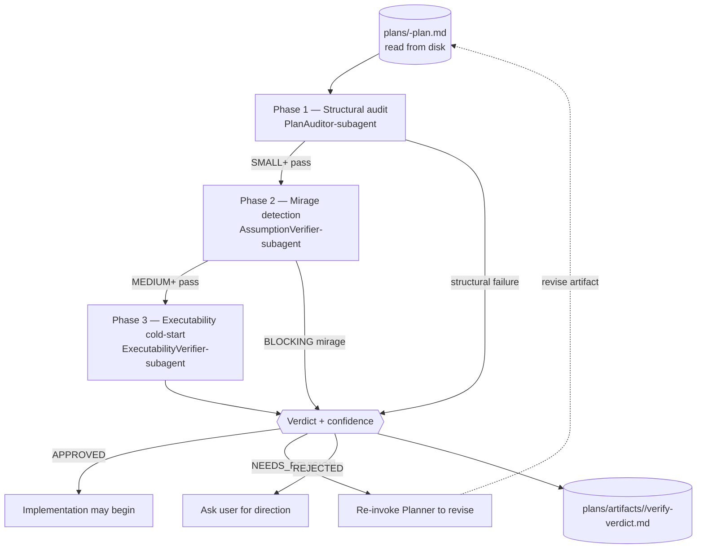

# Chapter 07 — Review Pipeline (controlflow-verify)

## Why this chapter

Understand **`controlflow-verify`** — the adversarial pre-execution gate that runs *before* any code is touched. This is the "verify" half of the pipeline: the Planner produces an artifact; `controlflow-verify` tries to refute it; only on `APPROVED` does implementation begin. Finding a problem in a plan is orders of magnitude cheaper than finding it in code.

This chapter is the **pre-execution** verify gate. The post-execution "review" gate (`controlflow-review`) is chapter 08. Together they are the two gates that bracket execution in the plan → verify → review pipeline (chapter 05).

## Key Concepts

- **`controlflow-verify`** — the skill that runs adversarial pre-execution verification **inline in the main context** (zero subagents). Invoke via `/controlflow-verify`.
- **Inline, not dispatched** — verify runs in the main conversation context. It does **not** spawn verifier agents. The three verify roles are phases of the skill, not shipped agents.
- **Adversarial framing** — your job is to **break** the plan, not to defend it. Steelman the rejection. Default to `flagged` when evidence is insufficient; do not rationalize a pass.
- **Three phases = three verify roles** — `PlanAuditor-subagent` (phase 1, structural audit), `AssumptionVerifier-subagent` (phase 2, mirage detection), `ExecutabilityVerifier-subagent` (phase 3, executability cold-start). These are conceptual role labels; they **must not** appear as `executor_agent` in plan phases.
- **Tier-gated phase depth** — `SMALL` → phase 1; `MEDIUM` → phases 1–2; `LARGE` → phases 1–3; any unresolved HIGH-impact semantic risk → all three regardless of tier.
- **Verdict** — `APPROVED` / `NEEDS_REVISION` / `REJECTED`, with a confidence score.
- **Mirage taxonomy** — presence mirages P1–P10 and absence mirages A11–A17 (the factual-claims axis).
- **Read from disk** — the verify skill reads the plan artifact from `plans/<task-slug>-plan.md`, not from a chat-embedded copy.

## The Verify Pipeline



The pipeline is tier-gated: SMALL runs phase 1 only; MEDIUM runs phases 1–2; LARGE runs all three. Structural failure in phase 1 short-circuits to `NEEDS_REVISION` immediately.

## Tier-Gated Phase Depth

The tier table matches `README.md`, `.github/copilot-instructions.md`, and `plans/project-context.md` exactly.

| Tier | Verify phases to run |
|------|----------------------|
| **TRIVIAL** | skip |
| **SMALL** | phase 1 (structural audit) |
| **MEDIUM** | phases 1–2 (audit + assumption/mirage) |
| **LARGE** | phases 1–3 (audit + mirage + executability cold-start) |

**Override rule:** any plan with a `risk_review` entry where `applicability: applicable` AND `impact: HIGH` AND `disposition` not `resolved` forces all three phases regardless of tier. Do not begin implementation on SMALL+ work until `controlflow-verify` returns `APPROVED`.

## Adversarial Framing (applies to every phase)

- Your job is to break the plan, not to defend it. Steelman the rejection.
- Default to `flagged` when evidence is insufficient — do not rationalize a pass.
- For each claim, ask: "What would make this false?" then check that.
- Distinguish **validated blockers** from **hypotheses**; state validation gaps explicitly.
- The Planner's `confidence` value does **not** substitute for your own scoring.

The adversarial framing is the corrective for inline review lacking the isolation of a fresh agent context. Because there is no fresh verifier subagent, the framing itself must carry the skepticism.

## Phase 1 — Structural Audit (PlanAuditor-subagent)

Confirm the artifact conforms to `schemas/planner.plan.schema.json` and `plans/templates/plan-document-template.md`:

1. YAML header present; `Status` is one of `READY_FOR_EXECUTION`, `ABSTAIN`, `REPLAN_REQUIRED`; `Agent: Planner`; `Schema Version: 1.2.0`; `Confidence` is numeric.
2. All 10 sections present in order; 5 lifecycle sections present and ordered for SMALL+.
3. Section 7 has exactly seven risk categories, each once.
4. Every phase declares one `executor_agent` from the schema enum; quality gates use only the five standard values (`tests_pass`, `lint_clean`, `schema_valid`, `safety_clear`, `human_approved_if_required`).
5. Acceptance criteria include at least one measurable observable outcome per phase.
6. LARGE tier includes `flowchart TD` + `sequenceDiagram`; each ≤30 lines.

**Structural failure → `NEEDS_REVISION` immediately.** Failure classification for this phase **excludes** `transient`.

### Phase 1 Focus Area Mapping

When a semantic-risk entry triggers the audit, the risk category maps to audit focus areas. This table is the one in `plans/project-context.md`:

| Risk Category | Audit Focus Areas |
|---------------|-------------------|
| `data_volume`, `performance` | `["performance"]` |
| `concurrency`, `access_control` | `["architecture"]` |
| `migration_rollback` | `["destructive_risk", "missing_rollback"]` |
| `dependency` | `["architecture"]` |
| `operability` | `["scope_gap"]` |

## Phase 2 — Assumption / Mirage Check (AssumptionVerifier-subagent)

Try to **refute** the plan's factual claims:

1. Every referenced file/path/symbol is real — open or grep for it. A referenced file that does not exist is a mirage and a blocker.
2. Every assumption is bounded in scope, not a hidden scope decision.
3. Dependencies and version constraints are pinned or explicitly flagged.
4. No "should be safe" hand-waving on concurrency or shared mutable state — ownership and ordering are explicit.
5. Data-volume concerns documented where applicable (bulk ops, pagination).

The full mirage taxonomy is in `.github/skills/controlflow-verify/references/mirage-patterns.md`:

- **Presence mirages (P1–P10)** — "File X exists" (it doesn't); "Function Y returns Z" (it returns something else); "API W is available" (it is deprecated); "Dependency is already installed" (it isn't); "Test covers the case" (it doesn't).
- **Absence mirages (A11–A17)** — error paths the plan skipped, missing migrations, missing rollback, missing security boundaries on sensitive operations.

Severity is `BLOCKING` / `WARNING` / `INFO`. Only `BLOCKING` stops the pipeline. `AssumptionVerifier` supplements `PlanAuditor` because they check **different axes**: PlanAuditor reviews _design_ (is the solution correct?); AssumptionVerifier reviews _factual accuracy_ (is what the Planner wrote actually true?).

## Phase 3 — Executability Cold-Start Simulation (ExecutabilityVerifier-subagent)

Simulate a fresh executor starting Phase 1 with only the plan in hand:

1. Can Phase 1 execute without asking the user a question? If yes → fine; if no → flag the ambiguity as a Phase 1 blocker.
2. Are verification commands concrete enough to run as-is (no guessing)?
3. Does each destructive or migration-heavy phase have rollback/recovery guidance? HIGH blast radius → require `human_approved_if_required`; MEDIUM → `safety_clear`.
4. Is the inter-phase contract deliverable format explicit, and does the downstream phase know how to validate it?

Status is `PASS` / `WARN` / `FAIL`. `FAIL` or `WARN` routes back to the Planner for refinement.

## Confidence Score and Verdict

Score each applicable checklist item `confirmed` / `uncertain` / `refuted`:

```
confidence = confirmed_count / total_items_with_any_actionable_question
```

- `uncertain ≥ 2` → cap confidence at 0.85.
- Any HIGH-impact open question → cap at 0.7.
- All checks pass, Phase 1 actionable, criteria measurable → **`APPROVED`**.
- Ambiguous Phase 1, unverified paths, vague criteria, no rollback on destructive change → **`NEEDS_REVISION`** (list each finding with the exact section reference; re-audit after fix; re-invoke the Planner to revise).
- Structural flaw; scope not deliverable as authored → **`REJECTED`** (explain blockers; ask the user for direction; do not start coding).

A compact verdict is written to `plans/artifacts/<task-slug>/verify-verdict.md` for auditability, then presented to the user with the findings that justify it.

| Verdict | Meaning | Next step |
|---------|---------|-----------|
| `APPROVED` | All checks pass; Phase 1 actionable; criteria measurable | Implementation may begin (chapter 08) |
| `NEEDS_REVISION` | Correctable issues — ambiguous Phase 1, unverified paths, vague criteria | Re-invoke `@controlflow-planner` to revise; re-run verify |
| `REJECTED` | Structural flaw; scope not deliverable as authored | Ask user for direction or replan from scratch; do not start coding |

`ABSTAIN` is **not** a verify verdict. (`ABSTAIN` is a _Planner_ terminal outcome, not a verify verdict — see chapter 06.) If verify cannot assess an item confidently, it flags the item and states the validation gap; it does not silently pass.

## Verify-Specific Failure Checks

- Do not pass a plan you have not read from disk.
- Do not mark a finding resolved without re-checking the evidence.
- Do not let the Planner's `confidence` value substitute for your own scoring.
- Do not collapse the three phases into a single skim for a "small" plan — run the phase(s) the tier requires.
- Do not begin implementation on SMALL+ work until verify returns `APPROVED`.

## Common Mistakes

- **Treating `controlflow-verify` as optional on SMALL tasks.** SMALL runs phase 1 (structural audit) — it is not skip-verify. Only TRIVIAL skips the pipeline.
- **Inlining the plan in chat and verifying the chat copy.** The verify skill reads from disk (`plans/<task-slug>-plan.md`). An in-chat plan is not a plan artifact.
- **Defending the plan instead of refuting it.** Adversarial framing is mandatory. Default to `flagged` when evidence is insufficient.
- **Collapsing phases into a single skim.** Run the phase(s) the tier requires. LARGE runs all three; MEDIUM runs two; SMALL runs one.
- **Ignoring the HIGH-risk override.** A plan may be SMALL by file count, but an unresolved HIGH-impact applicable `risk_review` entry forces all three phases.
- **Assigning a verify role as `executor_agent`.** `PlanAuditor-subagent`, `AssumptionVerifier-subagent`, and `ExecutabilityVerifier-subagent` are read-only verify phases performed inline; they must not appear in `executor_agent`.
- **Treating AssumptionVerifier as "a second pair of eyes."** It checks a **different axis** (factual accuracy of plan claims) than PlanAuditor (design correctness).
- **Forcing continuation after `REJECTED`.** `REJECTED` means stop; ask the user for direction or replan from scratch.

## Exercises

1. **(beginner)** Open `.github/skills/controlflow-verify/SKILL.md` and list the three phases and the role label each corresponds to.
2. **(beginner)** Open `.github/skills/controlflow-verify/references/mirage-patterns.md`. Name one presence mirage (P1–P10) and one absence mirage (A11–A17).
3. **(intermediate)** Under what conditions does a SMALL-tier plan get the full three-phase LARGE pipeline?
4. **(intermediate)** At iteration, PlanAuditor passes (`APPROVED`-equivalent) but AssumptionVerifier finds a `BLOCKING` mirage. What is the verdict, and what happens next?
5. **(advanced)** A plan references `src/api/users.ts` and `getUsers()` in Phase 1. Walk through exactly how phase 2 would try to refute each claim. What commands would you run?

## Review Questions

1. List the three verify phases, the role label each corresponds to, and the tier at which each activates.
2. What is the adversarial framing, and why is it necessary specifically because verify runs inline rather than as a fresh subagent?
3. What are the three verdicts, and what does each mean for implementation?
4. How is the confidence score computed, and what two conditions cap it below 0.9?
5. Where is the Phase 1 Audit Focus Area Mapping table defined, and what does it map?

## See Also

- [Chapter 05 — The plan → verify → review pipeline](05-orchestration.md)
- [Chapter 06 — Planning](06-planning.md)
- [Chapter 08 — Execution + review over native Copilot](08-execution-pipeline.md)
- [Chapter 09 — Schemas (Contracts)](09-schemas.md)
- [.github/skills/controlflow-verify/SKILL.md](../../.github/skills/controlflow-verify/SKILL.md)
- [plans/project-context.md](../../plans/project-context.md)