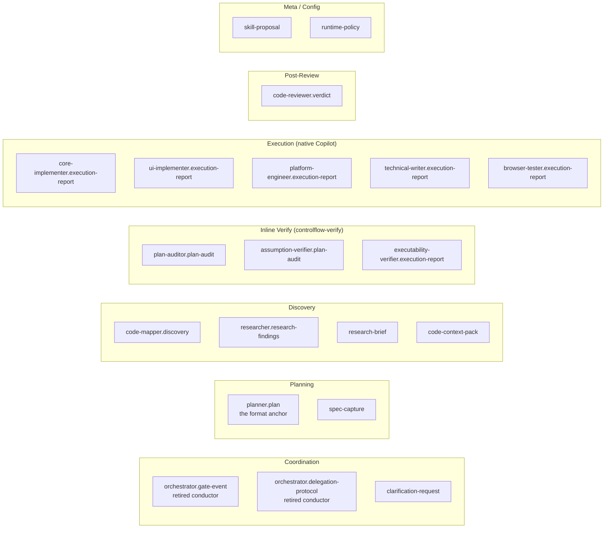

# Chapter 09 — Schemas (Contracts)

## Why this chapter

Understand **that schemas are contracts and eval fixtures**, not runtime-validated inter-agent messages. After this chapter you will know the purpose of each of the twenty schemas in `schemas/` and where to find their key fields.

## What a Schema Is in ControlFlow

A schema (a file under `schemas/`) is a **JSON Schema (draft 2020-12)** that fixes the structure of one role's output, a shared payload, or a governance config. In the slim model, schemas serve three purposes:

1. **Contract documentation** — a role's output shape is documented once and referenced by the role's prose (in the agent prompt or skill), by `plans/project-context.md`, and by the tutorials. Agents do **not** emit raw JSON to chat; they emit structured text. The schema is the contract behind the text.
2. **Eval fixture reference** — `evals/validate.mjs` validates real scenarios and templates against schemas. The contract-drift eval suite asserts the plan format, the role taxonomy, and the governance config stay aligned across files (see chapter 14).
3. **Plan-format anchor** — `schemas/planner.plan.schema.json` is the immutable machine-enforced contract the `controlflow-plan` skill conforms to at planning time.

**Important:** in the slim model, schemas are **not** runtime-validated inter-agent messages. There is no dispatch state machine exchanging JSON payloads between shipped agents — the slim model ships one agent (`@controlflow-planner`) and delegates execution to native Copilot. Schemas document the contract and anchor the evals; the Planner conforms to `planner.plan.schema.json` at planning time, and the eval suite asserts the contracts stay aligned.

## Complete Schema Registry

Twenty schemas in `schemas/`:

| # | File | Documents the contract for | Purpose |
|---|------|-----------------------------|---------|
| 1 | `clarification-request.schema.json` | Any acting role on `NEEDS_INPUT` | Shared clarification payload template |
| 2 | `orchestrator.delegation-protocol.schema.json` | Orchestrator (retired conceptual conductor) | Delegation contract — historical, anchored as eval fixture |
| 3 | `orchestrator.gate-event.schema.json` | Orchestrator (retired conceptual conductor) | Gate-event format — historical, anchored as eval fixture |
| 4 | `planner.plan.schema.json` | Planner | Full plan with phases, risks, contracts, handoff — **the plan-format anchor** |
| 5 | `code-mapper.discovery.schema.json` | `CodeMapper-subagent` | Discovery report |
| 6 | `researcher.research-findings.schema.json` | `Researcher-subagent` | Findings with citations |
| 7 | `plan-auditor.plan-audit.schema.json` | `PlanAuditor-subagent` (verify phase 1) | Audit verdict (APPROVED/NEEDS_REVISION/REJECTED/ABSTAIN) |
| 8 | `assumption-verifier.plan-audit.schema.json` | `AssumptionVerifier-subagent` (verify phase 2) | Mirage detection report |
| 9 | `executability-verifier.execution-report.schema.json` | `ExecutabilityVerifier-subagent` (verify phase 3) | Cold-start report |
| 10 | `core-implementer.execution-report.schema.json` | `CoreImplementer-subagent` | Backend implementation report |
| 11 | `ui-implementer.execution-report.schema.json` | `UIImplementer-subagent` | UI implementation report (a11y/responsive) |
| 12 | `platform-engineer.execution-report.schema.json` | `PlatformEngineer-subagent` | Infra report (approvals, rollback, health) |
| 13 | `technical-writer.execution-report.schema.json` | `TechnicalWriter-subagent` | Docs report (parity, diagrams) |
| 14 | `browser-tester.execution-report.schema.json` | `BrowserTester-subagent` | E2E report (scenarios, accessibility) |
| 15 | `code-reviewer.verdict.schema.json` | `CodeReviewer-subagent` | Review verdict (validated_blocking_issues) |
| 16 | `skill-proposal.schema.json` | Any acting role | Candidate skill-pattern proposal (human-approved before promotion) |
| 17 | `runtime-policy.schema.json` | Governance config | Schema validating `governance/runtime-policy.json` |
| 18 | `spec-capture.schema.json` | Planner | Compact spec-before-plan artifact |
| 19 | `research-brief.schema.json` | `Researcher-subagent` | Compact research handoff with ranked options |
| 20 | `code-context-pack.schema.json` | `CodeMapper-subagent` | Compact code map for bounded executor context |

> **Note:** fourteen role-output schemas + three shared/config schemas (`clarification-request`, `skill-proposal`, `runtime-policy`) + three compact artifact schemas = twenty files. The two `orchestrator.*` schemas document the **retired** conceptual conductor's contract and remain as eval fixture references — there is no shipped Orchestrator agent in the slim model.

## Schema Groups by Purpose

The role names above (`CodeMapper-subagent`, `PlanAuditor-subagent`, etc.) are **conceptual role labels** the Planner assigns and native Copilot (or the inline `controlflow-verify` phases) execute — not shipped agent files (see chapter 03).

## Key Schemas — Deep Dive

### planner.plan.schema.json

The most comprehensive and important schema — the plan-format anchor. Required top-level fields:

- `schema_version` (`1.2.0`)
- `agent` (`Planner`)
- `status` (`READY_FOR_EXECUTION` / `ABSTAIN` / `REPLAN_REQUIRED`)
- `task_title`, `summary`, `confidence` (0–1; <0.9 triggers escalation)
- `abstain` `{is_abstaining, reasons}`
- `phases[]` — array of phases
- `open_questions[]`, `risks[]`
- `risk_review[]` — seven semantic risk categories
- `success_criteria[]`
- `complexity_tier` (TRIVIAL/SMALL/MEDIUM/LARGE)
- `handoff` `{target_agent, prompt}`

**Each phase:**
- `phase_id`, `title`, `objective`, `wave`
- `executor_agent` (enum — eight values; the conceptual role labels)
- `dependencies[]`, `files[]`, `tests[]`, `steps[]`
- `acceptance_criteria[]` (≥1, required)
- `quality_gates[]` (enum — five values: `tests_pass`, `lint_clean`, `schema_valid`, `safety_clear`, `human_approved_if_required`)
- `failure_expectations[]`
- `skill_references[]`

**Optional top-level fields:** `trace_id`, `contracts[]`, `max_parallel_agents`, `diagrams[]`, `iteration_budget`.

The `controlflow-plan` skill conforms to this schema at planning time; the contract-drift eval suite asserts the schema, `plans/project-context.md`, and `governance/project-context-registry.json` stay aligned (see chapter 14).

### orchestrator.gate-event.schema.json (retired conductor, historical)

Documents the gate-event format the retired conceptual conductor emitted on state transitions. **There is no shipped Orchestrator in the slim model** — this schema remains as contract documentation and an eval fixture reference; no runtime agent emits it. Minimum fields:
- `event_type` (enum: `PLAN_GATE`, `PREFLECT_GATE`, `PHASE_REVIEW_GATE`, `HIGH_RISK_APPROVAL_GATE`, `COMPLETION_GATE`)
- `workflow_state` (enum: PLANNING/WAITING_APPROVAL/ACTING/REVIEWING/COMPLETE — **without** PLAN_REVIEW; that label exists only in the legacy prompt)
- `decision`, `requires_human_approval`, `reason`, `next_action`
- `trace_id`, `iteration_index`, `max_iterations`

### code-reviewer.verdict.schema.json

Key feature: **`validated_blocking_issues`** — a separate array, distinct from raw `issues`. `controlflow-review` blocks continuation **only** on validated-blocking items. Also contains:
- `status` (`APPROVED`/`NEEDS_REVISION`/`REJECTED`)
- `review_scope` (`phase` / `final`)
- `phase_id`
- `issues[]` (severity, file, message)
- `final_review_analysis` (optional; for final mode — scope drift, file-to-phase mapping)

### *-implementer.execution-report.schema.json

Common structure for the three implementer schemas:
- `status` (COMPLETE/FAILED/NEEDS_INPUT/…)
- `failure_classification` (optional)
- `changes[]` (file, action, summary) — CoreImplementer and PlatformEngineer
- `ui_changes[]` — UIImplementer
- `tests[]`, `build` `{state, output}`, `lint`, `definition_of_done[]`
- `clarification_request` (if NEEDS_INPUT)

UI variant adds: `accessibility[]`, `responsive[]`.
Platform variant adds: `approvals[]`, `rollback_plan`, `health_checks[]`.

### technical-writer.execution-report.schema.json
- `docs_created[]`, `docs_updated[]` — each with `path`.
- `parity_check` — validates code and docs are in sync.
- `diagrams[]` — Mermaid diagrams.
- `coverage` — which concepts are covered.

### browser-tester.execution-report.schema.json
- `health_check` — health-first gate (did the application start?).
- `scenarios[]` (status, steps, screenshots).
- `console_failures[]`, `network_failures[]`.
- `accessibility_findings[]`.

### plan-auditor and assumption-verifier schemas
Similar structure:
- `status` (APPROVED/NEEDS_REVISION/REJECTED/ABSTAIN)
- `findings[]` or `mirages[]` — each with `severity` (BLOCKING/WARNING/INFO/CRITICAL/MAJOR/MINOR), `file`, `description`, `evidence`.
- `score` — quantitative (see `docs/agent-engineering/SCORING-SPEC.md`).
- `iteration_index`.

Failure classification **excludes** `transient`.

### executability-verifier.execution-report.schema.json
- `status` (PASS/WARN/FAIL).
- `task_walkthroughs[]` — simulation of the first 3 tasks.
- For each: `task_id`, `executable` (boolean), `gaps[]`.

### researcher.research-findings.schema.json
- `status` (COMPLETE/ABSTAIN), `confidence`, `summary`.
- `findings[]` — each with `topic`, `definition`, `key_invariants`, `source`, `example_or_quote`.
- `open_questions[]`.

### code-mapper.discovery.schema.json
- `files[]` — each with `path`, `type`, `relevance`.
- `dependencies[]`, `entry_points[]`, `conventions[]`.

### orchestrator.delegation-protocol.schema.json (retired conductor, historical)
Documents the **delegation payload** the retired conceptual conductor used. **No shipped agent emits it in the slim model** — it remains as contract documentation and an eval fixture reference. Load **on-demand** if auditing legacy traces:
- `target_agent`, `phase_id`, `phase_title`.
- `executor_agent` (must match `phase.executor_agent`).
- `scope`, `inputs`, `expected_output_schema`.
- `trace_id`, `iteration_index`, `iteration_budget`.

### clarification-request.schema.json
Shared template for acting roles on `NEEDS_INPUT`:
- `question`.
- `options[]` — each with `label`, `pros`, `cons`, `affected_files`, `recommended` (boolean).
- `recommendation_rationale`, `impact_analysis`.

## Schema Conventions

- All schemas use `additionalProperties: false` — **unknown fields are forbidden**.
- Enums are stable and must not be rewritten without a migration.
- Minimum string lengths: `minLength` on critical fields (titles, descriptions).
- Versioning: `schema_version` constant in each schema (for Planner — `"1.2.0"`).

## Who Validates

`evals/validate.mjs` — structural pass. Verifies:
- Each schema is a valid JSON Schema.
- Each scenario in `evals/scenarios/` is valid against its corresponding schema.
- Schema references from plan artifacts and governance files are correct.
- The contract-drift suite asserts `schemas/planner.plan.schema.json` ↔ `plans/project-context.md` ↔ `governance/project-context-registry.json` ↔ `.github/copilot-instructions.md` stay aligned (see chapter 14).

## Common Mistakes

- **Treating a schema as a chat format.** No — schemas are contracts; in chat agents emit **structured text**, not raw JSON.
- **Treating schemas as runtime-validated inter-agent messages.** In the slim model they are contract documentation + eval fixture references. There is no dispatch state machine exchanging JSON between shipped agents.
- **Adding a field without updating the schema.** `additionalProperties: false` — eval will fail.
- **Treating `clarification-request` as a role-output schema.** It is a **shared** template, not tied to one role.
- **Confusing `workflow_state` (without PLAN_REVIEW) with the legacy prompt-level stage label (with PLAN_REVIEW).**
- **Ignoring `validated_blocking_issues` in the verdict.** Only these block — not raw issues.
- **Expecting the `orchestrator.*` schemas to be emitted at runtime.** They document the retired conductor's contract and anchor eval fixtures; no slim-model agent emits them.

## Exercises

1. **(beginner)** Open `schemas/planner.plan.schema.json` and find all seven semantic risk categories in `risk_review.items.properties.category.enum`.
2. **(beginner)** How many required top-level fields does `core-implementer.execution-report.schema.json` have?
3. **(intermediate)** What is the difference between `orchestrator.gate-event.schema.json` and `orchestrator.delegation-protocol.schema.json`, and why are both retained when the conductor is retired?
4. **(intermediate)** Open `code-reviewer.verdict.schema.json` and find `validated_blocking_issues`. How does it differ from `issues`?
5. **(advanced)** Which schemas anchor the contract-drift eval suite? Trace the alignment: `planner.plan.schema.json` ↔ `plans/project-context.md` ↔ `governance/project-context-registry.json`.

## Review Questions

1. How many JSON schemas are in `schemas/`, and what do they document in the slim model?
2. How does `clarification-request.schema.json` differ from the role-output schemas?
3. Which schema is the plan-format anchor, and which skill conforms to it?
4. Which schema describes the post-review verdict, and which field blocks continuation?
5. Why are the two `orchestrator.*` schemas retained when there is no shipped conductor?

## See Also

- [Chapter 04 — Agent prompt structure](04-part-spec.md)
- [Chapter 06 — Planning](06-planning.md)
- [Chapter 10 — Governance](10-governance.md)
- [Chapter 14 — Eval Harness](14-evals.md)
- [schemas/](../../schemas/)