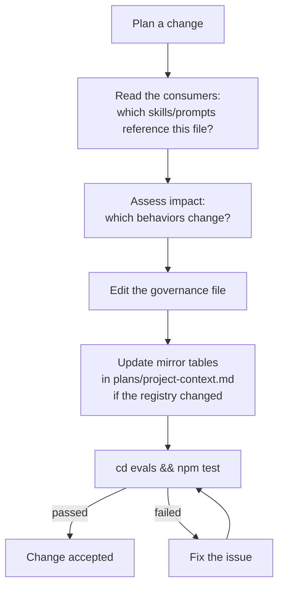

# Chapter 10 — Governance

## Why this chapter

Understand **which governance files regulate the pipeline** in the slim model and how to change them safely without breaking the system. Governance is slim: four files, three policy blocks, and no tool/model grant surfaces.

## Key Concepts

- **Governance** — four configuration files in `governance/` that define the pipeline policy, the role roster, the canonical-source matrix, and the rename allowlist.
- **Three policy blocks** — the surviving runtime policy: `review_pipeline_by_tier`, `semantic_risk_policy`, `verdict_routing`.
- **Delegated to native Copilot** — tool access, model selection, subagent governance. The legacy model-selection routing file, tool-access grants file, and subagent grants file are retired and no longer in `governance/`.
- **"Canonical source beats prose"** — when a tutorial, an agent prompt, and a governance file disagree, the governance file (or its named canonical source) wins. The contract-drift eval suite asserts alignment.

## Governance Files (the slim four)

| File | Purpose |
| --- | --- |
| `runtime-policy.json` | Three surviving policy blocks: tier-gated verify/review depth, semantic-risk policy, verdict routing plus confidence thresholds |
| `project-context-registry.json` | The authoritative role roster (eight executor roles + three inline verify roles) and the agent role matrix (schema outputs, tool profiles, delegation sources) |
| `canonical-source-matrix.json` | The canonical-source matrix: which file is authoritative for which concern |
| `rename-allowlist.json` | Permitted file renames (anti-drift protection) |

Retired (no longer in `governance/`): the model-selection routing file, the tool-access grants file, and the subagent grants file. Their concerns — model selection, tool access, subagent governance — are delegated to native Copilot. The slim `governance/` directory contains exactly the four files above.

## runtime-policy.json — the three surviving blocks

The most important governance file. The `controlflow-verify` and `controlflow-review` skills read it as the **authoritative source** for tier-gated pipeline depth and verdict semantics. The slim model dropped the retired blocks (approval lists, per-tier iteration caps, retry budgets, stagnation detection, plan-review trigger conditions, final-review gate, memory hygiene) — retry budgets, wave execution, compaction, stagnation detection, and max-iterations knobs are delegated to the native Copilot runtime. Memory hygiene lives in `skills/patterns/repo-memory-hygiene.md` and `evals/validate.mjs` Pass 7, not in `runtime-policy.json`.

### Block 1 — `review_pipeline_by_tier`

Which verify phases run for each tier (plus `code_review: true` on all tiers):

```text
TRIVIAL: { plan_auditor: false, assumption_verifier: false, executability_verifier: false, code_review: true }
SMALL:   { plan_auditor: true,  assumption_verifier: false, executability_verifier: false, code_review: true }
MEDIUM:  { plan_auditor: true,  assumption_verifier: true,  executability_verifier: false, code_review: true }
LARGE:   { plan_auditor: true,  assumption_verifier: true,  executability_verifier: true,  code_review: true }
```

`plan_auditor` is verify phase 1 (structural audit), `assumption_verifier` is phase 2 (mirage detection), `executability_verifier` is phase 3 (executability cold-start). TRIVIAL skips all three but still runs native Copilot code review for the change.

### Block 2 — `semantic_risk_policy`

The seven mandatory categories every non-TRIVIAL plan must include exactly once: `data_volume`, `performance`, `concurrency`, `access_control`, `migration_rollback`, `dependency`, `operability`. If a category is not applicable, set `not_applicable` with justification — never skip a row. The override rule: any unresolved `HIGH`-impact applicable entry forces `LARGE` (all three verify phases) regardless of file count.

The allowed values are pinned by the policy: `applicability_values` (`applicable`, `not_applicable`, `uncertain`), `impact_values` (`HIGH`, `MEDIUM`, `LOW`, `UNKNOWN`), `disposition_values` (`resolved`, `open_question`, `research_phase_added`, `not_applicable`).

### Block 3 — `verdict_routing`

Verdicts emitted by `controlflow-verify` and what each means:

- `APPROVED` — all checks pass, Phase 1 actionable, criteria measurable. Proceed to implementation.
- `NEEDS_REVISION` — ambiguous Phase 1, no rollback on destructive change, unverified paths, or vague criteria. List each finding with the exact section reference; re-audit after fix.
- `REJECTED` — structural flaw; scope not deliverable as authored. Explain blockers; ask the user for direction; do not start coding.

Confidence thresholds:
- `ready_for_execution_min`: 0.9 (below this, the plan is not `READY_FOR_EXECUTION`)
- `uncertain_count_cap`: 0.85
- `high_impact_open_question_cap`: 0.7

## project-context-registry.json — the role roster

The **authoritative** source for the role taxonomy. The `executor_agent` enum in `schemas/planner.plan.schema.json` and the mirror tables in `plans/project-context.md` are validated against this registry row-for-row by the Pass 14 drift check (`validateProjectContextRegistryMirror`). Do not hand-edit the mirror tables independently — update the registry first, then mirror.

It defines:
- The eight executor roles (`CodeMapper-subagent`, `Researcher-subagent`, `CoreImplementer-subagent`, `UIImplementer-subagent`, `PlatformEngineer-subagent`, `TechnicalWriter-subagent`, `BrowserTester-subagent`, `CodeReviewer-subagent`) available for `executor_agent` assignment.
- The three inline verify roles (`PlanAuditor-subagent`, `AssumptionVerifier-subagent`, `ExecutabilityVerifier-subagent`) performed by `controlflow-verify` — strictly read-only; must not appear as `executor_agent`.
- The agent role matrix (schema output, tools profile, delegation source) for each role.

The `Model Routing Role` column in the registry is a **conceptual capability tier** the Copilot Auto model picker targets when the Planner describes a role. There is no model-selection routing surface in the slim model.

## canonical-source-matrix.json

Maps each concern to its authoritative file, so when two files disagree the canonical source wins. Key rows:

| Concern | Authoritative File |
| --- | --- |
| Executor roster | `governance/project-context-registry.json` |
| Review pipeline roster | `governance/project-context-registry.json` |
| Agent role matrix | `governance/project-context-registry.json` |
| Complexity tiers | `plans/project-context.md` |
| Semantic-risk taxonomy | `docs/agent-engineering/RISK-TAXONOMY.md` |
| Runtime policy | `governance/runtime-policy.json` |
| Shared evidence discipline | `docs/agent-engineering/PROMPT-BEHAVIOR-CONTRACT.md` |

## rename-allowlist.json

Permitted file renames. Prevents accidental drift: if a change tries to rename a file not on the allowlist, the drift check fails.

Typical structure:

```json
[{"from": "old-name.md", "to": "new-name.md", "reason": "..."}]
```

After adding an entry here, run `cd evals && npm test` to verify the drift check accepts the new allowlist entry.

## Principle: Canonical Source Beats Prose

A tutorial, an agent prompt, and a governance file may disagree on a tier boundary or a role name. Which wins?

The governance file (or its named canonical source) wins. Agent prompts and tutorials are **prose defaults**; the registry and the runtime policy **override** them. The contract-drift eval suite (see chapter 14) asserts the alignment holds across files.

**Why this matters:** changing behavior doesn't require editing every agent prompt. You edit `governance/runtime-policy.json` or `governance/project-context-registry.json`, and the change propagates to every consumer automatically — at the cost of each file reference being verified by the eval suite.

## Safe Governance Change Flow



## What Is NOT in Governance Anymore

| Retired surface | Where it went |
| --- | --- |
| Model-selection routing | Model selection delegated to native Copilot (Auto model picker) |
| Tool-access grants | Tool access delegated to native Copilot |
| Subagent grants | Subagent governance delegated to native Copilot |
| Approval-action list | Human approval is the pipeline's stopping rules (see chapter 05); no separate governance list |
| Retry budgets / iteration caps / stagnation detection | Retry routing, parallelism, and iteration caps delegated to native Copilot |
| Memory-hygiene thresholds | Live in `evals/validate.mjs` Pass 7 plus `skills/patterns/repo-memory-hygiene.md` |

## Knowledge Location Table

| Question | Where to look |
| --- | --- |
| Which verify phases run for MEDIUM? | `governance/runtime-policy.json → review_pipeline_by_tier` |
| What are the seven semantic-risk categories? | `governance/runtime-policy.json → semantic_risk_policy.categories` |
| What does the APPROVED verdict mean? | `governance/runtime-policy.json → verdict_routing.verdicts.APPROVED` |
| What is the confidence threshold for READY_FOR_EXECUTION? | `governance/runtime-policy.json → verdict_routing.confidence_thresholds.ready_for_execution_min` |
| Which roles can be `executor_agent`? | `governance/project-context-registry.json` (eight executor roles) |
| Which roles must NOT be `executor_agent`? | `governance/project-context-registry.json` (three inline verify roles) |
| Which file is canonical for tier definitions? | `governance/canonical-source-matrix.json` → `plans/project-context.md` |
| Can a file be renamed? | `governance/rename-allowlist.json` |
| Which model should a role use? | Native Copilot (Auto model picker). There is no governance file for this. |
| Which tools can an agent use? | The `tools:` frontmatter in the agent file; delegated to native Copilot. No governance file. |

## Additional Governance Docs

Authoritative policy documents in `docs/agent-engineering/`:

| Document | Content |
| --- | --- |
| `NATIVE-DELEGATION-BOUNDARY.md` | The canonical native-vs-ControlFlow delegation boundary (table + audit checklist) |
| `RISK-TAXONOMY.md` | The seven semantic-risk categories |
| `CLARIFICATION-POLICY.md` | When to ask the user vs record a bounded assumption |
| `SCORING-SPEC.md` | Quantitative scoring formula |
| `MEMORY-ARCHITECTURE.md` | Three-layer memory model |
| `PROMPT-BEHAVIOR-CONTRACT.md` | Behavioral invariants across skills and roles |

## Common Mistakes

- **Editing `runtime-policy.json` without running evals.** The contract-drift check may break.
- **Looking for a model-selection routing file or tool-access grants file in `governance/`.** Both retired — model selection and tool access are native Copilot's job.
- **Hand-editing the mirror tables in `plans/project-context.md` without updating `governance/project-context-registry.json` first.** The registry is the single source of truth; the mirror is validated against it.
- **Treating `governance/` as internal agent files.** They are public contracts checked into the repo.
- **Trying to override governance with an agent prompt.** The registry and runtime policy win.
- **Expecting a memory-hygiene block in `runtime-policy.json`.** It is not there — memory hygiene lives in `skills/patterns/repo-memory-hygiene.md` and `evals/validate.mjs` Pass 7.

## Exercises

1. **(beginner)** Open `governance/runtime-policy.json`. Find `review_pipeline_by_tier`. Which verify phases are active for `MEDIUM`?
2. **(beginner)** Open `governance/project-context-registry.json`. List the eight executor roles and the three inline verify roles. Confirm the three verify roles are marked read-only.
3. **(intermediate)** You want to add a new semantic-risk category. Which files must change, in what order, to keep the contract-drift eval green?
4. **(intermediate)** In `runtime-policy.json → review_pipeline_by_tier`, the TRIVIAL pipeline has all three verify phases set to `false` but `code_review: true`. Does this mean code review runs for TRIVIAL? Explain where the actual code review happens.
5. **(advanced)** Name every file that must reference `governance/runtime-policy.json` or be validated against it. Verify your answer against the contract-drift eval scenarios in `evals/`.

## Review Questions

1. Name the four governance files in the slim model.
2. Name the three surviving policy blocks in `runtime-policy.json`.
3. Which file is the authoritative source for the role taxonomy, and which mirror is validated against it?
4. Why are the model-selection, tool-access, and subagent-governance surfaces retired, and where did their concerns go?
5. What does "canonical source beats prose" mean, and which eval check enforces it?

## See Also

- [Chapter 05 — The plan → verify → review pipeline](05-orchestration.md)
- [Chapter 07 — Review Pipeline](07-review-pipeline.md)
- [Chapter 08 — Execution Pipeline](08-execution-pipeline.md)
- [Chapter 14 — Eval Harness](14-evals.md)
- [governance/](../../governance/)
- [docs/agent-engineering/](../agent-engineering/)