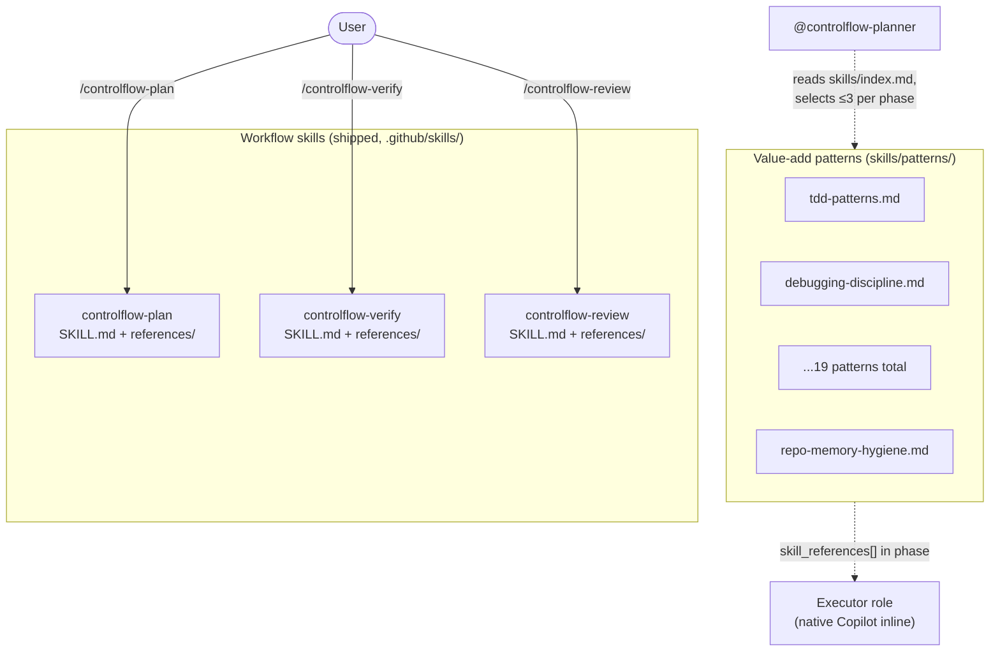
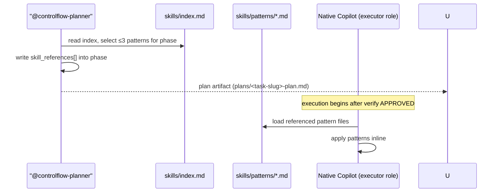

# Chapter 11 — Skills

## Why this chapter

ControlFlow has **two skill surfaces** in the slim model, and they are easy to confuse. This chapter explains what each is, where it lives, who loads it, and how the Planner injects the value-add patterns into plan phases. After this chapter you can point at any `SKILL.md` or `skills/patterns/*.md` file and say which surface it belongs to and how it gets invoked.

The headline reframe for readers of the legacy tutorial: the **19 value-add patterns are no longer statically bound to retired specialized agents**. They are Planner-injected, at most three per phase, via `skill_references`. The reusable discipline the retired 13 specialized agents embodied survives in `skills/patterns/`; the personas themselves are gone (see `docs/agent-engineering/NATIVE-DELEGATION-BOUNDARY.md §5` for the retired-persona → patterns mapping).

## Key Concepts

- **Workflow skill** — one of the three shipped ControlFlow skills under `.github/skills/controlflow-{plan,verify,review}/`. Each is a directory with a `SKILL.md` plus a `references/` tree, loaded by Copilot's native skills library when the user invokes `/controlflow-plan`, `/controlflow-verify`, or `/controlflow-review`.
- **Value-add pattern** — a reusable Markdown discipline file in `skills/patterns/`. Not a workflow skill, not executable code. Provides domain-specific guidance (testing, debugging, security, memory hygiene, etc.).
- **Pattern index** — `skills/index.md`, the registry from which `@controlflow-planner` selects ≤3 patterns per plan phase.
- **Planner-injected** — the binding mode for every pattern in the slim model. `@controlflow-planner` selects relevant patterns at planning time and writes them into a phase's `skill_references[]` array; the executor role (a conceptual role label executed inline by native Copilot) loads the referenced pattern files before starting work.
- **Not a code library** — both surfaces are Markdown. They carry guidance and discipline, not runtime code.
- **Conceptual role, not shipped agent** — the "Applicable Agents" column in `skills/index.md` lists the preserved 8 executor role names + 3 inline verify role names. These are routing hints for which conceptual role likely consumes a pattern when injected; they are not shipped agent files.

## The Two Skill Surfaces



| Surface | Location | Count | Who loads it | How |
|---------|----------|-------|--------------|-----|
| Workflow skills | `.github/skills/controlflow-{plan,verify,review}/` | 3 | Copilot's native skills library | User invokes the slash command |
| Value-add patterns | `skills/patterns/` | 19 | `@controlflow-planner` selects; the executor role (native Copilot) loads | Planner-injected via `skill_references[]` (≤3 per phase) |

The workflow skills are the pipeline (see chapter 05). The value-add patterns are the reusable discipline the Planner injects into plan phases. The two surfaces do not overlap: a workflow skill is a shipped ControlFlow surface; a pattern is a Planner-injected guidance file.

## Workflow Skills (the three)

Each workflow skill is a directory under `.github/skills/` containing a `SKILL.md` (the skill prompt Copilot loads on invoke) plus a `references/` tree (lazily-loaded reference docs the skill reads when it needs format detail).

| Skill | Path | What it does |
|-------|------|--------------|
| `controlflow-plan` | `.github/skills/controlflow-plan/SKILL.md` | Produces a schema-anchored plan artifact in `plans/`. Single-sources the format from `schemas/planner.plan.schema.json` and `plans/templates/plan-document-template.md`. Run by `@controlflow-planner`. |
| `controlflow-verify` | `.github/skills/controlflow-verify/SKILL.md` | Inline adversarial pre-execution verification (zero subagents). Tier-gated phases: structural audit, mirage detection, executability cold-start. Emits `APPROVED` / `NEEDS_REVISION` / `REJECTED`. |
| `controlflow-review` | `.github/skills/controlflow-review/SKILL.md` | Evidence-backed review layered over native Copilot code review. Adds plan-vs-implementation scope-drift comparison and proactive vulnerability/error search. |

These three skills are the entire shipped ControlFlow workflow surface (plus the `@controlflow-planner` agent and the `.github/copilot-instructions.md` routing stub — see chapter 02). They are invoked by the user, not by the Planner.

## Value-Add Patterns (the nineteen)

The value-add patterns live in `skills/patterns/` and are registered in `skills/index.md`. The Planner reads the index during planning (Step 8 of the workflow in chapter 06) and selects ≤3 patterns per phase based on domain keywords. The selection is written into the phase's `skill_references[]` array; the executor role (native Copilot inline) reads the referenced pattern files before executing the phase.

### Domain mapping (authoritative in `skills/index.md`)

The full domain mapping table lives in `skills/index.md` and is the single source of truth. A condensed view:

| Domain | File | Likely consumers when injected (conceptual roles) |
|--------|------|---------------------------------------------------|
| Testing | `skills/patterns/tdd-patterns.md` | CoreImplementer-subagent, UIImplementer-subagent, CodeReviewer-subagent |
| Spec-Driven Development | `skills/patterns/spec-driven-development.md` | CoreImplementer-subagent, UIImplementer-subagent |
| Debugging Discipline | `skills/patterns/debugging-discipline.md` | CoreImplementer-subagent, UIImplementer-subagent, PlatformEngineer-subagent, BrowserTester-subagent |
| Code Simplification | `skills/patterns/code-simplification.md` | CoreImplementer-subagent, UIImplementer-subagent, CodeReviewer-subagent |
| Error Handling | `skills/patterns/error-handling-patterns.md` | CoreImplementer-subagent, UIImplementer-subagent, PlatformEngineer-subagent |
| Security | `skills/patterns/security-patterns.md` | CoreImplementer-subagent, UIImplementer-subagent, CodeReviewer-subagent, PlanAuditor-subagent |
| Performance | `skills/patterns/performance-patterns.md` | CoreImplementer-subagent, UIImplementer-subagent, CodeReviewer-subagent, PlanAuditor-subagent |
| Completeness | `skills/patterns/completeness-traceability.md` | controlflow-planner, PlanAuditor-subagent, CodeReviewer-subagent |
| Integration | `skills/patterns/integration-validator.md` | controlflow-planner, PlanAuditor-subagent, CoreImplementer-subagent |
| Idea-to-Prompt | `skills/patterns/idea-to-prompt.md` | controlflow-planner |
| LLM Behavior | `skills/patterns/llm-behavior-guidelines.md` | CoreImplementer-subagent, UIImplementer-subagent, CodeReviewer-subagent, controlflow-planner |
| PreFlect | `skills/patterns/preflect-core.md` | controlflow-planner (all conceptual roles) |
| Reflection Loop | `skills/patterns/reflection-loop.md` | controlflow-planner, CoreImplementer-subagent, UIImplementer-subagent, PlatformEngineer-subagent |
| Budget Tracking | `skills/patterns/budget-tracking.md` | controlflow-planner, CoreImplementer-subagent, UIImplementer-subagent, PlatformEngineer-subagent |
| Memory Hygiene | `skills/patterns/repo-memory-hygiene.md` | controlflow-planner, CodeReviewer-subagent, PlanAuditor-subagent |
| Memory Promotion | `skills/patterns/memory-promotion-candidates.md` | controlflow-planner |
| Security Review Discipline | `skills/patterns/security-review-discipline.md` | CodeReviewer-subagent |
| Source Grounding | `skills/patterns/source-grounding.md` | Researcher-subagent; controlflow-planner (consider) |
| Decision Challenge | `skills/patterns/decision-challenge.md` | PlanAuditor-subagent, CodeReviewer-subagent |

> The "Applicable Agents" column is a **routing hint, not a static binding**. In the slim model no shipped ControlFlow surface statically cites a pattern file; every pattern is PLANNER-INJECTED. The roles listed indicate the likely consumer when injected — the conceptual role that executes the phase — not shipped agents that load the pattern unconditionally. See the binding legend at the top of `skills/index.md`.

### Patterns vs documentation

| Patterns | Documentation |
|----------|---------------|
| Loaded by the executor role at execution time | Read by a human in advance |
| Selected per phase by the Planner (≤3) | Always available |
| Contain tested discipline (checklists, decision rules) | Contain policies and explanations |
| Registered in `skills/index.md` | Not registered |

## Planner Discovery Protocol

The Planner selects patterns in **Step 8** of its planning workflow (see chapter 06):

1. Read `skills/index.md` after the complexity gate.
2. Match task domain keywords against the Domain column.
3. Select ≤3 most relevant patterns based on task context.
4. Include selected pattern file paths in each applicable phase's `skill_references[]` array.

**Rule: ≤3 patterns per phase.** More patterns increase context overhead and dilute focus. If a phase seems to require more, decompose it into two phases.

## Just-in-Time Loading



**Why just in time?** Patterns add context to the executor's prompt. Loading all nineteen patterns upfront wastes tokens and creates noise. Only load what the current phase needs.

## What the Patterns Carry (the retired-persona discipline)

The 13 specialized `*.agent.md` files were retired in Phase 3. Their **personas** are not lost — the value-add discipline they embodied remains in `skills/patterns/`. The mapping is recorded in `docs/agent-engineering/NATIVE-DELEGATION-BOUNDARY.md §5`; a condensed view:

| Retired persona | Value-add patterns that survive in `skills/patterns/` |
|-----------------|------------------------------------------------------|
| BrowserTester-subagent | `tdd-patterns`, `debugging-discipline`, `error-handling-patterns` |
| UIImplementer-subagent | `tdd-patterns`, `code-simplification`, `error-handling-patterns` |
| PlatformEngineer-subagent | `error-handling-patterns`, `debugging-discipline`, `integration-validator` |
| Researcher-subagent | `source-grounding`, `completeness-traceability` |
| CodeMapper-subagent | `completeness-traceability`, `code-simplification` |
| TechnicalWriter-subagent | `completeness-traceability`, `llm-behavior-guidelines` |
| CodeReviewer-subagent | `security-review-discipline`, `decision-challenge`, `llm-behavior-guidelines` |

If you want a specialized persona back, recreate it as a **native Copilot custom agent** under `.github/agents/` and have `@controlflow-planner` assign it as a phase `executor_agent`. The pattern files carry the reusable discipline; the new agent file carries the persona. The full recipe is in `NATIVE-DELEGATION-BOUNDARY.md §5`.

The three inline verify roles (`PlanAuditor-subagent`, `AssumptionVerifier-subagent`, `ExecutabilityVerifier-subagent`) are **not** recreated as agents — they are the inline phases of the `controlflow-verify` skill, which is the non-native value-add.

## A Few Patterns in Detail

### preflect-core

A pre-action gate: classify the upcoming action into one of 4 risk classes (high-risk-destructive, scope-drift, assumption, dependency) and emit `GO` / `PAUSE` / `ABORT`. Planner-injected when a phase touches destructive or irreversible operations.

### llm-behavior-guidelines

A meta-pattern for preventing systematic agent anti-patterns: scope drift prevention, weak success criteria detection, over-abstraction detection, silent assumption detection. Likely consumed by CoreImplementer, UIImplementer, CodeReviewer, and the Planner when injected.

### tdd-patterns

Testing discipline: write tests before implementation, test the contract not the implementation, distinguish unit / integration / e2e levels. Likely consumed by CoreImplementer and UIImplementer when injected.

### completeness-traceability

Every public interface must have a doc; each doc must have a code citation; diagrams must be Mermaid; parity check when code changes. Likely consumed by the Planner, PlanAuditor, and CodeReviewer when injected.

### repo-memory-hygiene

Mandatory before any `/memories/repo/` write or `NOTES.md` update. Four checklists: (A) dedup before writing a new entry; (B) prune routine to age out stale entries; (C) phase-boundary promotion (classify → scope check → near-duplicate check → verify required fields); (D) periodic read-only audit. See chapter 12.

### idea-to-prompt

For the Planner's Idea Interview: convert vague user ideas to concrete requirements, ask clarifying questions one by one, map to `risk_review` categories, do not skip the semantic risk taxonomy. See chapter 06.

## `skill_references` in the Schema

Each phase in `schemas/planner.plan.schema.json` has a `skill_references[]` field:

```json
"skill_references": [
  "skills/patterns/tdd-patterns.md",
  "skills/patterns/llm-behavior-guidelines.md"
]
```

Value = the pattern file path. The executor role (native Copilot inline) reads these files before executing the phase. The array is bounded to ≤3 entries per phase.

## Adding a New Pattern

1. Create `skills/patterns/<name>.md`.
2. Add an entry to the Domain Mapping table in `skills/index.md` with: domain, file, applicable conceptual roles (routing hint), keywords.
3. Run `cd evals && npm test` — the skill-discoverability suite validates that every `skills/patterns/` file is registered in the index and every index entry resolves to a real file.

## Common Mistakes

- **Confusing the two skill surfaces.** The three workflow skills under `.github/skills/` are the pipeline; the nineteen patterns under `skills/patterns/` are Planner-injected discipline. Different location, different loader, different count.
- **Treating the "Applicable Agents" column as a static binding.** It is a routing hint. Every pattern is PLANNER-INJECTED in the slim model; no shipped surface statically cites a pattern.
- **Treating patterns as runtime code.** Patterns are Markdown — they provide guidance, not execution.
- **Loading all patterns in advance.** Just-in-time loading only — otherwise tokens are wasted. The Planner selects ≤3 per phase.
- **Selecting > 3 patterns for one phase.** If a phase requires more, decompose it.
- **Forgetting to update `skills/index.md` when adding a pattern.** The skill-discoverability eval will fail.
- **Confusing `skill_references[]` with documentation links.** They point to loaded patterns, not readable references.

## Exercises

1. **(beginner)** Open `skills/index.md` and count the patterns registered in the Domain Mapping table. Confirm the count matches the files in `skills/patterns/`.
2. **(beginner)** Which three workflow skills live under `.github/skills/`? Name the slash command for each.
3. **(intermediate)** A phase plans to: write backend, write tests, and update docs. Which ≤3 patterns would you inject via `skill_references[]`?
4. **(intermediate)** Open `docs/agent-engineering/NATIVE-DELEGATION-BOUNDARY.md §5`. Which patterns survive from the retired BrowserTester-subagent persona?
5. **(advanced)** Describe how adding a new pattern affects the eval harness. Which test file protects the index↔file bidirectional check?

## Review Questions

1. Name the two skill surfaces in the slim model and where each lives.
2. How many patterns can be in `skill_references[]` per phase, and who selects them?
3. What is the difference between a workflow skill and a value-add pattern?
4. Where is the authoritative pattern domain mapping maintained?
5. Where do you look to find which patterns a retired specialized persona embodied?

## See Also

- [Chapter 02 — Architecture Overview](02-architecture-overview.md)
- [Chapter 06 — Planning](06-planning.md)
- [Chapter 07 — Review Pipeline](07-review-pipeline.md)
- [skills/index.md](../../skills/index.md)
- [skills/patterns/](../../skills/patterns/)
- [docs/agent-engineering/NATIVE-DELEGATION-BOUNDARY.md](../agent-engineering/NATIVE-DELEGATION-BOUNDARY.md)