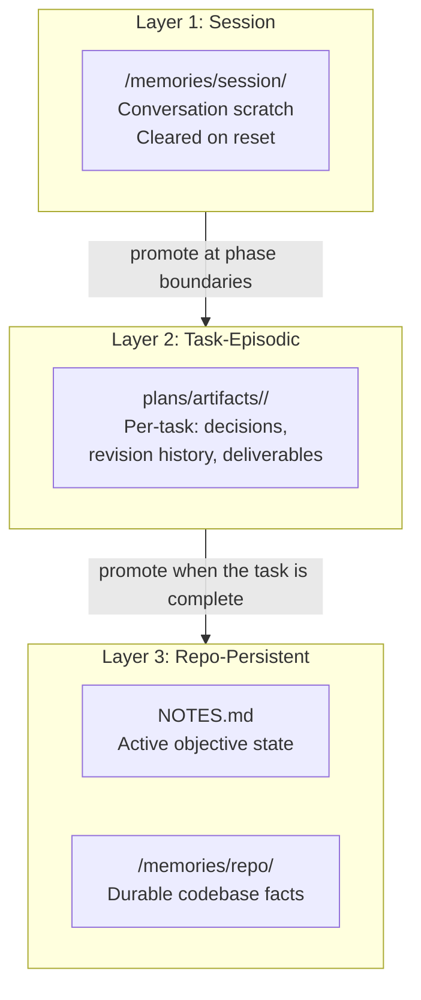

# Chapter 12 — Memory Architecture

## Why this chapter

Understand **where agents store state** and why the three-layer memory model prevents context loss across context resets.

## Key Concepts

- **Session memory** — conversation-scoped scratch; cleared after the conversation ends.
- **Task-episodic memory** — per-task history in `plans/artifacts/<task-slug>/`; persists beyond the conversation.
- **Repo-persistent memory** — durable facts in `NOTES.md` + `/memories/repo/`; survives context resets.
- **Context compaction** — trimming context when the budget runs out; memory layers allow recovery.

## Three-Layer Memory Model

## Memory Content Taxonomy

Every entry written to `/memories/repo/` should be classified into one of four content types:

| Type | What to store |
|------|--------------|
| `user` | Personal preferences and workflows spanning the entire environment |
| `feedback` | Historical corrections: past mistakes, constraints the agent must respect |
| `project` | Core architecture decisions, structure, and established project conventions |
| `reference` | Verified CLI commands, configuration values, and build instructions |

**Save exclusions — never write these to repo-persistent memory:**
- Derivable code state (anything that can be re-read from the repo directly).
- Git history (commit messages, branch names, merge records).
- Ephemeral task state (single-turn notes, tool scratch, "iteration 3 passed at 14:32").

**Verify before recommending:** any claim about a named file or function that comes from memory must be re-verified against the current codebase before being acted on or reported. Memory is a hint, not a source of truth for specific code locations.

## Layer 1: Session Memory

**Location:** `/memories/session/`

**Purpose:** Scratch space for the current conversation. Stores:
- Current phase context.
- Intermediate research notes.
- Open questions for this session.

**Rules:**
- Do not create new session files unnecessarily.
- List existing files before reading — they are not auto-loaded into context.
- Cleared when the conversation ends.
- For long orchestration runs, use the session notes template at `plans/templates/session-notes-template.md`. It provides five sections: `Current State`, `Files and Functions`, `Errors & Corrections`, `Key Results`, `Worklog`.

**Who uses it:** Any agent that needs within-conversation scratch state.

## Layer 2: Task-Episodic Memory

**Location:** `plans/artifacts/<task-slug>/`

**Purpose:** History for one specific task. Stores:
- Revision history (why was the plan revised?).
- Verified items across iterations.
- Phase completion reports.
- Intermediate deliverables (designs, diagrams).

**Rules:**
- Create one folder per task; slug = kebab-case task title.
- Contents persist beyond the conversation.
- Orchestrator reads this in revision loops to populate regression tracking.

**Examples of files in a task folder:**
- `final_review.md` — optional final review advisory.
- `observability/<task-id>.ndjson` — gate event log.
- `verified_items.md` — verified items from iteration 1.

## Layer 3: Repo-Persistent Memory

**Two locations:**

### NOTES.md

**Purpose:** Active-objective state only. Contains:
- Current active goal and its phase.
- Unresolved blockers and risks.
- Current phase boundary.

**Rules:**
- Update at each phase boundary.
- Remove stale entries when superseded.
- Do not use NOTES.md for task-specific history — that goes in task-episodic memory.

### /memories/repo/

**Purpose:** Durable codebase facts that survive context resets. Examples:
- "The test command is `cd evals && npm test`".
- "PlanAuditor excludes the `transient` failure classification".
- "All agent files follow P.A.R.T. section order".

**Rules:**
- Only `create` is supported — no inline edits.
- Each fact must be short (1–2 sentences), with citations.
- Store only if: independently actionable, unlikely to change, relevant to future tasks.

## Read and Write Rules

| Event | Read | Write |
|-------|------|-------|
| Context start | Session (if exists), NOTES.md | — |
| Phase start | Task-episodic (relevant files) | Session note; promote durable cross-plan facts to `/memories/repo/` using Checklist C in `skills/patterns/repo-memory-hygiene.md` |
| Phase end | — | Task-episodic (completion report, NOTES.md) |
| Task complete | — | /memories/repo/ (durable facts) |
| Conversation end | — | Session files cleared |

## Example Scenario

| Step | Agent action | Memory layer |
|------|-------------|--------------|
| 1 | User says "implement feature X" | — |
| 2 | Planner reads NOTES.md | Repo-persistent |
| 3 | Orchestrator creates `plans/artifacts/feature-x/` | Task-episodic |
| 4 | Phase 1 completes; Orchestrator writes verified items | Task-episodic |
| 5 | Context resets | Session cleared |
| 6 | Orchestrator reads NOTES.md and `plans/artifacts/feature-x/` | Both layers |
| 7 | Task complete; write durable fact about the API convention | /memories/repo/ |

## Context Compaction Policy

When context budget approaches the limit, Orchestrator:
- **Keeps:** active phase, unresolved blockers, approved decisions, safety constraints.
- **Drops:** verbose intermediate tool output already summarized.
- **Emits:** compact summary in deterministic bullets before proceeding.

The idea: session and task-episodic layers hold the state, so the LLM can be reset without losing task history.

## Memory Pollution

Excessive or noisy memory records are **memory pollution**. Symptoms:
- NOTES.md grows with stale entries.
- `/memories/repo/` records facts that change frequently.
- Session files accumulate unused notes.

**Prevention:**
- Prune stale NOTES.md entries at each phase boundary.
- Only store facts meeting the "durable" criteria in `/memories/repo/`.
- Don't create new session files unless necessary.
Memory Use Discipline

Two behavioral invariants (enforced by `evals/tests/prompt-behavior-contract.test.mjs`):

1. **Verify before use** — any named file or named function claim that originates from memory (session notes, `/memories/repo/`, or `NOTES.md`) must be re-verified against the current codebase before being acted on or reported to the user. Stale memory is a hint, not a source of truth for specific code locations.

2. **Ignore memory on request** — when the user explicitly says "ignore memory" (or equivalent: "don't use memory", "fresh context"), the agent must not consult `/memories/repo/`, NOTES.md, or session notes for that turn. This override is per-turn and does not persist.

See `docs/agent-engineering/PROMPT-BEHAVIOR-CONTRACT.md → §7 Memory Use Discipline`.

## 
## Observability and Memory

Gate events (see [Chapter 05](05-orchestration.md) and [docs/agent-engineering/OBSERVABILITY.md](../agent-engineering/OBSERVABILITY.md)) are appended to `plans/artifacts/<task-id>/observability/<task-id>.ndjson`. This is part of task-episodic memory — not session scratch.

## Logical vs Physical Storage

| Logical Layer | Physical Location |
|---------------|-----------------|
| Session memory | `/memories/session/` (VS Code / Copilot Chat) |
| Task-episodic | `plans/artifacts/<task-slug>/` (file system) |
- **Writing unclassified or derivable facts to `/memories/repo/`.** Use the content taxonomy to classify first; discard derivable code state, git history, and ephemeral task state before promoting.
- **Acting on stale memory without verification.** Named file and function claims from memory become incorrect after refactoring. Always re-verify against the current codebase before acting.

## Exercises

1. **(beginner)** Open `NOTES.md` — what is the current active objective?
2. **(beginner)** Which memory layer stores per-task revision history?
3. **(intermediate)** A phase completes successfully. What should the Orchestrator write to memory and where?
4. **(intermediate)** A context reset occurs at phase 3 of 6. What data does the Orchestrator have available to reconstruct state?
5. **(advanced)** Design a memory usage strategy for a LARGE-tier 10-phase task that requires resumability after a context reset.
6. **(intermediate)** A phase just completed. You noticed that `CoreImplementer-subagent` discovered a new API convention. Walk through Checklist C (in `skills/patterns/repo-memory-hygiene.md`) to decide whether to promote this fact to `/memories/repo/`.
7. **(advanced)** Your `/memories/repo/` context block shows six entries with slightly different descriptions of the same `cd evals && npm test` command. Run Checklist D (periodic audit) to produce an Audit Report for this situation.
- **Creating session files for everything.** They should be minimal scratch — not a full task journal.
- **Forgetting to read task-episodic memory after a reset.** Regression tracking and verified items are there.

## Exercises

1. **(beginner)** Open `NOTES.md` — what is the current active objective?
2. **(beginner)** Which memory layer stores per-task revision history?
3. **(intermediate)** A phase completes successfully. What should the Orchestrator write to memory and where?
4. **(intermediate)** A context reset occurs at phase 3 of 6. What data does the Orchestrator have available to reconstruct state?
5. **(advanced)** Design a memory usage strategy for a LARGE-tier 10-phase task that requires resumability after a context reset.

## Review Questions

1. Name the 3 memory layers.
2. What does NOTES.md store?
3. What are task-episodic deliverables?
4. What is memory pollution?
5. Why is just-in-time loading important for memory layers?

## See Also

- [docs/agent-engineering/MEMORY-ARCHITECTURE.md](../agent-engineering/MEMORY-ARCHITECTURE.md)
- [Chapter 05 — Orchestration](05-orchestration.md)
- [Chapter 08 — Execution Pipeline](08-execution-pipeline.md)
- [NOTES.md](../../NOTES.md)
