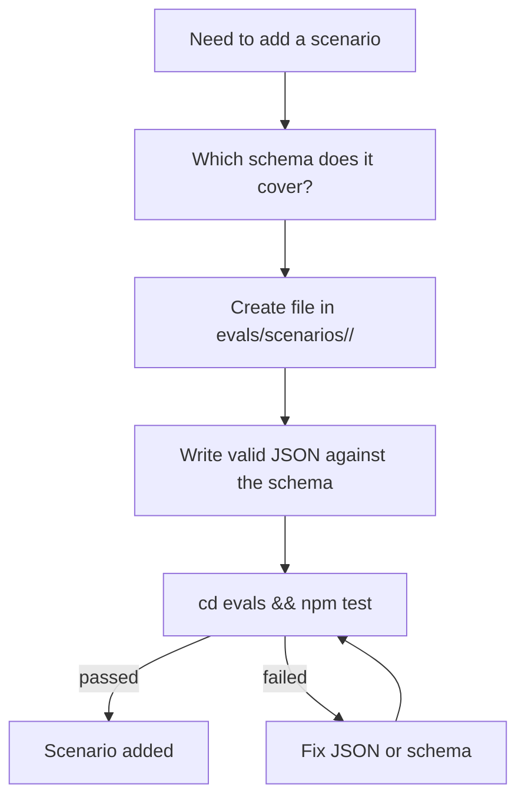

# Chapter 14 — Eval Harness

## Why this chapter

Understand **how the ControlFlow repository is tested**: what `npm test` checks, how scenarios work, and how to add a new check after making a change. The eval harness is the offline contract-drift gate — the one thing Copilot does not provide natively and ControlFlow keeps. It asserts that the plan format, the role taxonomy, the governance config, and the tutorial parity stay aligned across files.

In the slim model the harness still runs completely offline, no live agents, no network. What changed is what it asserts: the slim surface (one agent + three skills), the `CLAUDE.md` ↔ plan-contract drift, the `plans/project-context.md` ↔ `governance/project-context-registry.json` mirror, the skill-discoverability of the nineteen patterns, and the plugin-manifest-parity across the Claude Code / Codex / Cursor host plugins.

## Key Concepts

- **Eval harness** — a set of offline checks in `evals/` that do not call live agents.
- **Scenario** — a JSON file in `evals/scenarios/` that pairs an input with an expected output.
- **Drift check** — a test that verifies shipped surfaces haven't gone out of sync with contracts and governance files.
- **Contract drift** — the `CLAUDE.md` plan-contract anchors (Status, Agent, Schema Version, Complexity Tier, Confidence, Abstain, executor enum) stay aligned with `schemas/planner.plan.schema.json`, `governance/project-context-registry.json`, and `governance/runtime-policy.json`.
- **Tutorial parity** — Pass 7c validates that the EN and RU tutorial chapter H2 heading sets match via the allowlist in `evals/scenarios/tutorial-parity/allowlist.json`.
- **Skill discoverability** — every `skills/patterns/` file is registered in `skills/index.md` and every index entry resolves to a real file.

## What the Eval Harness Is

A **Node.js test runner** in `evals/`. It is completely offline.

**Key properties:**
- **No network** — no live agents, no LLM calls.
- **Offline only** — runs in CI without credentials.
- **Deterministic** — same input always produces the same pass/fail.
- **Warm cache** — a success-only fingerprint cache at `evals/.cache/validate-cache.json` short-circuits a repeat structural run. Delete the cache (`rm -rf evals/.cache`) before trusting a green run after structural edits.

## `evals/` Structure

```text
evals/
  package.json         — scripts: test, test:structural, test:behavior, health, archive:dry/apply
  validate.mjs         — main structural validator (Passes 1–17)
  drift-checks.mjs     — drift detection helpers (exports validateTutorialParity, validateNotesMdStyle, computeStructuralFingerprint, …)
  capability-matrix.mjs — tool-grant/agent-frontmatter/project-context reconciliation CLI
  archive-completed-plans.mjs — task-episodic auto-archive CLI
  report-health.mjs    — offline operator health report CLI
  tests/               — behavior test files (.test.mjs)
  scenarios/           — JSON scenario fixtures (incl. tutorial-parity/allowlist.json, runtime-policy/, planner/, …)
```

## Three Modes

| Command | What it runs | Speed |
|---------|-------------|-------|
| `cd evals && npm test` | Full suite — `validate.mjs` structural passes plus every `tests/*.test.mjs` harness | Slower |
| `npm run test:structural` | `validate.mjs` structural passes only (warm-cacheable) | Fast |
| `npm run test:behavior` | `tests/prompt-behavior-contract.test.mjs` + `tests/drift-detection.test.mjs` | Fast |

`npm run health` runs an offline read-only operator report (git status by surface, `NOTES.md` state, plans by status, latest session outcome). `npm run capability-matrix` reconciles tool grants, agent frontmatter, and `plans/project-context.md`. `npm run archive:dry` / `archive:apply` manage task-episodic archival.

## What Each Pass Checks

The current authoritative pass list enforced by `validate.mjs` (Pass 1 through Pass 17). The slim-relevant passes are listed below; passes that asserted retired surfaces (model-routing, tool-grants, agent-grants) skip gracefully and emit "skipped (retired in Phase 3)".

### Pass 1: Schema Validity

All `schemas/*.schema.json` compile under Ajv JSON Schema 2020-12 with `strict: false` and `allErrors: true`. Validates `governance/runtime-policy.json` against `schemas/runtime-policy.schema.json` and the three fixtures under `evals/scenarios/runtime-policy/`. No syntax errors.

### Pass 2: Scenario Integrity

All `evals/scenarios/**/*.json` have the required identity fields and point to real schema contracts. Planner scenarios must assert `risk_review_present: true` and `complexity_tier_present: true`. Planner terminal-status scenarios (`ABSTAIN` / `REPLAN_REQUIRED`) must assert `persisted_artifact: true`.

### Pass 3: Reference Integrity

All backtick schema/doc references inside root `*.agent.md` files resolve to existing files. `skill_references[]` values point to files that exist in `skills/patterns/`. F7: every Planner scenario asserts `complexity_tier_present` explicitly. F8: internal markdown links and backtick code references in `README.md` and `docs/agent-engineering/*.md` resolve to files under known top-level directories.

### Pass 3b: Required Project Artifacts

Verifies that critical shared files exist: `.github/copilot-instructions.md`, `.github/agents/controlflow-planner.agent.md`, `plans/project-context.md`, `docs/agent-engineering/PART-SPEC.md`, `docs/agent-engineering/CLARIFICATION-POLICY.md`, `governance/runtime-policy.json`, `governance/rename-allowlist.json`.

### Pass 3c / 3c.1 / 3d: Tool-Grant / Read-Only Denylist / Agent-Grant Consistency

These passes asserted tool and agent frontmatter against `governance/tool-grants.json` and `governance/agent-grants.json` in the legacy model. Both governance files are retired in Phase 3; the passes skip gracefully and emit "skipped (retired in Phase 3)" for the retired governance files. The read-only edit-tool denylist still covers the conceptual verify/discovery/review roles via the `read-only-agent-tool-denylist.json` fixture.

### Pass 3e / 3f: Cursor Rule / Cursor Plugin Validation

Validates `.cursor/rules/**/*.mdc` frontmatter bounds, activation metadata, line budget, and canonical references; validates `.cursor/skills/**/SKILL.md` and `.cursor/agents/*.md` entries against `evals/scenarios/cursor-plugin/` contracts. These cover the Cursor host plugin.

### Pass 4: P.A.R.T Section Order

Every root `*.agent.md` preserves `## Prompt` → `## Archive` → `## Resources` → `## Tools` ordering. With the 13 specialized agent files retired, only the surviving root agent file is in scope; the pass is retained as a structural guard on the legacy P.A.R.T. convention (see chapter 04 for the reframe of P.A.R.T. as guidance, not a mandatory template).

### Pass 4b: Clarification Triggers & Tool Routing Rules

Agent companion rules validating clarification routing and tool-routing policy mentions. Runs against surviving root agent files.

### Pass 5: Skill Library Consistency

Validates the structural integrity of the `skills/` index mapping — every file in `skills/patterns/` is registered in `skills/index.md` and every index entry resolves to a real file. Protected by `evals/tests/skill-discoverability.test.mjs`.

### Pass 6: Synthetic Rename Negative-Path Checks

Structural guard checks: stale `target_agent`, stale `expected.schema`, and stale nested `agent` references are correctly rejected by the rename-allowlist machinery.

### Pass 7: Memory Architecture References

Required memory docs/templates exist; `NOTES.md` remains within the 20-line budget and passes the `validateNotesMdStyle` anti-pattern checks (no `iteration`/`verdict` leakage, no `phase-\d+-` fragments, no fenced code blocks, no more than 3 consecutive bullets under a single heading).

### Pass 7b: Memory Discipline Contracts

Runtime memory taxonomy, session-notes template sections, and repo-memory hygiene checklist anchors are present.

### Pass 7c: Tutorial Parity

The tutorial-parity check is driven by `evals/scenarios/tutorial-parity/allowlist.json`. When `_status: "active"` and `_chapters_in_scope` lists chapter basenames, `validateTutorialParity` extracts the level-2 heading set from each in-scope EN/RU chapter pair, applies the `heading_aliases` map (EN→RU), and emits per-chapter-pair pass/fail. A RU-only heading is acceptable if it equals the alias of a corresponding EN heading. This chapter (`14-evals.md`) is in scope; its 16 H2 headings are the allowlist keys.

### Pass 8: Drift Detection — Model Routing, Roster, and Contract Alignment

`governance/model-routing.json` is retired in Phase 3; the model-routing checks skip gracefully. The roster↔enum bidirectional alignment still runs: the agent roster in `plans/project-context.md` and the `executor_agent` enum in `schemas/planner.plan.schema.json` stay in sync in both directions (the 8 executor role names).

### Pass 9: Drift Detection — Agent Resources Schema Existence

For every schema referenced from a surviving root agent's `Resources` section, verifies the schema file actually exists.

### Pass 10: Drift Detection — Cross-Plan File-Overlap

Detects accidental file-list overlap across active plans in `plans/` by parsing backticked paths in `Files:` bullets.

### Pass 12: Governance Policy Assertions

Asserts invariants on `governance/runtime-policy.json` and related governance files — the three surviving policy blocks (`review_pipeline_by_tier`, `semantic_risk_policy`, `verdict_routing`), tier coverage, verdict thresholds, and the semantic-risk override rule.

### Pass 13: Drift Detection — review_scope=final Bidirectional Coupling

Verifies that `review_scope: "final"` references in surviving agent prompts and schema fields are coupled in both directions and reference the same fields.

### Pass 14: Canonical Source Matrix Heading

Ensures `plans/project-context.md` keeps the Canonical Source Matrix heading.

### Pass 15: Tool-Label / Pattern-Budget / Doc-Count / Plugin-Parity

Runs the live-tree drift checks for registry tool-count labels, skill-pattern line budgets, allowlisted documentation totals (README, quickstart, glossary), and no-delta Codex generation parity.

### Pass 16: Selective Plugin-Core Portability

Validates `core-portability-matrix.json`: unique invariant IDs, allowed dispositions, evidence paths, and declared semantic anchors without requiring byte parity with core prose.

### Pass 17: CLAUDE.md ↔ Plan Contract Drift

Asserts that the plan-contract anchors in `CLAUDE.md` (Status, Agent, Schema Version, Complexity Tier, Confidence, Abstain, the 8-name executor enum) stay aligned with `schemas/planner.plan.schema.json`, `governance/project-context-registry.json`, and `governance/runtime-policy.json`. Protected by `evals/tests/controlflow-contract-drift.test.mjs`.

### Separate harnesses in `npm test`

| Harness | What it checks |
|---------|----------------|
| `tests/prompt-behavior-contract.test.mjs` | Behavioral invariants across the three workflow skills and shared policy |
| `tests/drift-detection.test.mjs` | Negative-path coverage for drift-check helpers and runtime-policy schema enforcement |
| `tests/notes-md-drift.test.mjs` | `NOTES.md` style anti-pattern detection |
| `tests/archive-script.test.mjs` | Task-episodic archive script behavior against isolated fixture trees |
| `tests/fingerprint.test.mjs` | Structural fingerprint invalidation for nested scenario fixtures |
| `tests/report-health.test.mjs` | Operator health report helpers and smoke generation |
| `tests/skill-discoverability.test.mjs` | Skill metadata discoverability and index↔file bidirectional resolution |
| `tests/capability-matrix.test.mjs` | Capability-matrix reconciliation of tool grants, agent frontmatter, and project context |
| `tests/plugin-manifest-parity.test.mjs` | Plugin manifest parity across the Claude Code / Codex / Cursor host plugins |
| `tests/controlflow-contract-drift.test.mjs` | `CLAUDE.md` ↔ plan-contract drift (the Pass 17 assertions, exercised as a behavior test) |
| `tests/cursor-rules.test.mjs` | Cursor `.mdc` parser regressions |
| `tests/ponytail-adaptation.test.mjs` | Ponytail adaptation regressions |

## Scenarios

A scenario is a JSON fixture describing an input/output pair. It is used for two purposes:
1. **Schema validation** — verifies the structure against the matching schema in `schemas/`.
2. **Regression testing** — verifies behavior doesn't change unexpectedly.

**Examples of scenario types:**

| Scenario | Folder | Checked against |
|----------|--------|----------------|
| Planner plan with phases | `scenarios/planner/` | `planner.plan.schema.json` |
| PlanAuditor APPROVED verdict | `scenarios/plan-auditor/` | `plan-auditor.plan-audit.schema.json` |
| Runtime-policy fixture | `scenarios/runtime-policy/` | `runtime-policy.schema.json` |
| Tutorial-parity allowlist | `scenarios/tutorial-parity/` | (consumed by `validateTutorialParity`, not Ajv) |

Scenarios live in `evals/scenarios/`; some are organized into subdirectories (`runtime-policy/`, `planner/`, `plan-auditor/`, `assumption-verifier/`, `executability-verifier/`, `tutorial-parity/`, `cursor-rules/`, `cursor-plugin/`).

## Reading the Output

A typical `npm test` result prints each pass with an OK marker, then a total:

```text
Pass 1: Schema Validity — OK
Pass 2: Scenario Integrity — OK
Pass 3: Reference Integrity — OK
...
Pass 7c: Tutorial Parity — OK
Pass 17: CLAUDE.md ↔ Plan Contract Drift — OK
==================================================
CLAUDE.md contract drift: 44 checks | 44 passed | 0 failed
==================================================
All CLAUDE.md contract-drift checks passed ✅
```

If a check fails:

```text
FAIL Pass 8 Check #2 — Roster ↔ enum alignment
  plans/project-context.md: roster is [CodeMapper-subagent, ...]
  schemas/planner.plan.schema.json: enum is [CodeMapper-subagent, ...]
  Missing from enum: [NewRole-subagent]
```

The error tells you exactly what file, what check, and what the diff is. Read the failing pass, fix the drift, re-run.

The warm cache at `evals/.cache/validate-cache.json` may short-circuit a repeat green run after a structural edit — delete it (`rm -rf evals/.cache`) before trusting a green run.

## Adding a New Scenario



1. Identify which schema the scenario exercises (or create a new schema in `schemas/`).
2. Create the scenario file under the matching `evals/scenarios/<name>/` subdirectory.
3. Write valid JSON against the schema (required fields: the identity fields the harness expects, plus `risk_review_present` / `complexity_tier_present` for Planner scenarios).
4. Run `cd evals && npm test` and confirm the new scenario passes.

## Adding a New Agent or Schema

The slim model ships one agent (`@controlflow-planner` at `.github/agents/controlflow-planner.agent.md`) plus three workflow skills. To add a **custom agent** (for example, recreating a retired specialized persona as a native Copilot custom agent — see `docs/agent-engineering/NATIVE-DELEGATION-BOUNDARY.md §5`):

1. **Create the agent file** — `.github/agents/<name>.agent.md` with Copilot agent frontmatter (`name`, `description`, `tools`). Do not add `model:` by default; let the Copilot Auto picker choose.
2. **Write the persona discipline as prose** in the prompt body, citing the value-add `skills/patterns/` files the persona should load (e.g. `skills/patterns/tdd-patterns.md`).
3. **Register the conceptual role** in `plans/project-context.md` so the Planner can assign it as a phase `executor_agent`. (The 8-name enum in `schemas/planner.plan.schema.json` is the canonical executor set; a custom agent file is treated as a valid conceptual executor role by the Planner.)
4. **Add eval scenarios** — at least one scenario in `evals/scenarios/<name>/` if the agent introduces a new contract.

To add a **new schema** (contract documentation + eval fixture reference):

1. **Create the schema** — `schemas/<name>.schema.json` (draft 2020-12).
2. **Add eval scenarios** — at least one scenario in `evals/scenarios/<name>/` that exercises it.
3. **Cite it from the surface that uses it** — e.g. a workflow skill's `references/` tree, or `plans/project-context.md`.

After each step, run `cd evals && npm test` to verify nothing is broken. The skill-discoverability suite validates the `skills/patterns/` ↔ `skills/index.md` bidirectional mapping; the contract-drift suite validates `CLAUDE.md` ↔ `schemas/planner.plan.schema.json` ↔ governance alignment.

## What Evals Do NOT Check

- **Does the agent solve the task correctly?** — Not verified; that's a human review (and `controlflow-review` layers evidence over native Copilot code review).
- **Does the LLM follow behavioral invariants at runtime?** — Not verified at eval time; the prompt-behavior-contract harness checks the prompt text, not live model behavior.
- **Network dependencies** — no live tools, no API calls.
- **UI rendering** — no visual output.
- **Plugin byte-parity** — Pass 16 validates portability-matrix invariants, not byte-for-byte parity across host plugins.

## CI Configuration

`.github/workflows/ci.yml` runs the canonical command:

```yaml
- run: cd evals && npm test
  env:
    NODE_ENV: test
```

The CI gate requires all checks to pass. No partial passes. The same command a developer runs locally is the command CI runs.

## Common Mistakes

- **Running `npm test` from the repo root** instead of `evals/`. The command works only from `evals/`.
- **Trusting a green run after a structural edit without clearing the cache.** Delete `evals/.cache/` first (`rm -rf evals/.cache`).
- **Adding a scenario file in the wrong folder** (wrong naming convention → schema not found).
- **Changing a shipped surface but not updating `plans/project-context.md` / `skills/index.md` / `governance/project-context-registry.json`** — drift checks fail.
- **Renaming an H2 heading in `14-evals.md`** — Pass 7c tutorial parity fails (the EN heading must match the allowlist key).
- **Treating eval failures as "optional"** — CI uses the same command; a local failure is a CI failure.

## Exercises

1. **(beginner)** Run `cd evals && npm test`. How many passes and harnesses run? Optionally redirect the output to a local file (`npm test > out.txt`, which is gitignored) to review the last run.
2. **(beginner)** Open `evals/scenarios/tutorial-parity/allowlist.json`. List the 16 EN heading keys for `14-evals.md` and confirm they match this chapter's H2 headings.
3. **(intermediate)** Add an `ABSTAIN` verdict scenario for a Planner terminal-status case. What JSON fields are required?
4. **(intermediate)** Open `evals/tests/skill-discoverability.test.mjs`. What does it assert about `skills/patterns/` and `skills/index.md`?
5. **(advanced)** Add a new pattern file in `skills/patterns/` without registering it in `skills/index.md`. Run `npm test`. Which pass fails, and which behavior test also fails?

## Review Questions

1. What are the three modes the eval harness runs in, and which command triggers each?
2. Can the eval harness make LLM calls?
3. What does Pass 7c check, and which file drives the allowlist?
4. What is the single command you run before declaring a change "done"?
5. Name two drift checks that protect the slim-model contract (Pass 8 roster↔enum and Pass 17 CLAUDE.md ↔ plan contract).

## See Also

- [Chapter 02 — Architecture Overview](02-architecture-overview.md)
- [Chapter 09 — Schemas](09-schemas.md)
- [Chapter 10 — Governance](10-governance.md)
- [Chapter 11 — Skills](11-skills.md)
- [evals/README.md](../../evals/README.md)
- [.github/workflows/ci.yml](../../.github/workflows/ci.yml)