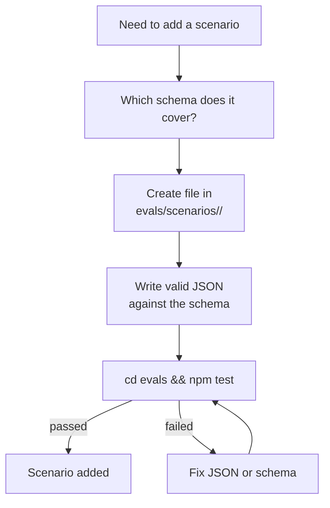

# Chapter 14 — Eval Harness

## Why this chapter

Understand **how the ControlFlow repository is tested**: what `npm test` checks, how scenarios work, and how to add a new check after making a change.

## Key Concepts

- **Eval harness** — a set of offline checks in `evals/` that do not call live agents.
- **Scenario** — a JSON file in `evals/scenarios/` that pairs an input with an expected output.
- **Drift check** — a test that verifies agent files haven't gone out of sync with contracts and governance files.
- **Companion rule** — a `_must_contain` assertion about which sections must be present in an agent file.

## What the Eval Harness Is

A **Node.js test runner** in `evals/`. It is completely offline.

**Key properties:**
- **No network** — no live agents, no LLM calls.
- **Offline only** — runs in CI without credentials.
- **Deterministic** — same input always produces the same pass/fail.

## `evals/` Structure

```
evals/
  package.json         — scripts: test, test:structural, test:behavior
  validate.mjs         — main structural validator (Passes 1–13)
  drift-checks.mjs     — drift detection helpers
  tests/               — behavior test files (.test.mjs)
  scenarios/           — JSON scenario fixtures
    <agent-name>/      — folder per agent
      <scenario>.json  — individual scenario
```

## Three Modes

| Command | What it runs | Speed |
|---------|-------------|-------|
| `cd evals && npm test` | Full suite (all 18 passes & behaviors) | Slower |
| `npm run test:structural` | `validate.mjs` structural passes | Fast |
| `npm run test:behavior` | Prompt-behavior + orchestration-handoff | Fast |

## What Each Pass Checks

The current authoritative pass list enforced by `validate.mjs`:

### Pass 1: Schema Validity

- Each `schemas/*.json` is a valid JSON Schema (draft 2020-12).
- Validates `governance/runtime-policy.json` against `schemas/runtime-policy.schema.json` and the three fixtures under `evals/scenarios/runtime-policy/`.
- No syntax errors.

### Pass 2: Scenario Integrity

- Each `evals/scenarios/**/*.json` file is valid against its corresponding schema.

### Pass 3: Reference Integrity

- Each agent file that mentions a schema has the correct path.
- `skill_references[]` values point to files that exist in `skills/patterns/`.

### Pass 3b: Required Project Artifacts

- Verifies that critical files like `plans/project-context.md` exist.

### Pass 3c: Tool Grant Consistency

- Validates tool arrays against governance configs.

### Pass 3d: Agent Grant Consistency

- Validates agent arrays against governance configs.

### Pass 4: P.A.R.T Section Order

- Each `*.agent.md` has sections in this exact order: **Prompt → Archive → Resources → Tools**.
- Any missing or reordered section fails.

### Pass 4b: Clarification Triggers (§5) & Tool Routing Rules (§6)

- Agent companion rules validating strict routing policy mentions.

### Pass 5: Skill Library Consistency

- Validates the structural integrity of the `skills/` index mapping.

### Pass 6: Synthetic Rename Negative-Path Checks

- Tests renaming files to ensure governance around drift isn't bypassed.

### Pass 7: Memory Architecture References

- Ensures agents reference the unified memory architecture.

### Pass 7b: Memory Discipline Contracts

- Verifies that agents correctly include instructions for memory cleanups, hygiene rules, and persistent storage boundaries.

### Pass 7c: Tutorial Parity

In placeholder mode (current default — `_status: "placeholder"` in `evals/scenarios/tutorial-parity/allowlist.json`), Pass 7c only logs that the parity check is installed and skips validation. Activation flips `_status` to `"active"` in a follow-up phase, after which `validateTutorialParity` runs and emits per-chapter-pair pass/fail by comparing level-2 heading sets between `docs/tutorial-en/` and `docs/tutorial-ru/`.

### Pass 8: Drift Detection — Roster ↔ Enum Bidirectional Alignment

- Verifies that the agent roster in `plans/project-context.md` and the `executor_agent` enum in `schemas/planner.plan.schema.json` stay in sync in both directions.

### Pass 9: Drift Detection — Agent Resources Schema Existence

- For every schema referenced from an agent's `Resources` section, verifies the schema file actually exists.

### Pass 10: Drift Detection — Cross-Plan File-Overlap

- Detects accidental file-list overlap across active plans in `plans/`.

### Pass 12: Governance Policy Assertions

- Asserts invariants on `governance/runtime-policy.json` and related governance files (review pipeline by tier, retry budgets, approval gate thresholds).

### Pass 13: Drift Detection — review_scope=final Bidirectional Coupling

- Verifies that `review_scope: "final"` references in Orchestrator and CodeReviewer agent prompts are coupled in both directions and reference the same fields.

## Scenarios

A scenario is a JSON fixture describing an input/output pair. It is used for two purposes:
1. **Schema validation** — verifies the structure.
2. **Regression testing** — verifies behavior doesn't change unexpectedly.

**Examples of scenario types:**

| Scenario | Folder | Checked against |
|----------|--------|----------------|
| Planner plan with 5 phases | `scenarios/planner/` | `planner.plan.schema.json` |
| PlanAuditor APPROVED verdict | `scenarios/plan-auditor/` | `plan-auditor.plan-audit.schema.json` |
| CoreImplementer NEEDS_INPUT | `scenarios/core-implementer/` | `core-implementer.execution-report.schema.json` |
| Orchestrator gate event | `scenarios/orchestrator/` | `orchestrator.gate-event.schema.json` |

## Reading the Output

A typical `npm test` result now includes all 18 passes:

```
Pass 1: Schema Validity — OK
Pass 2: Scenario Integrity — OK
Pass 3: Reference Integrity — OK
...
Pass 7c: Tutorial Parity — OK
Pass 13: Drift Detection — review_scope=final Bidirectional Coupling — OK
Total: All checks passed
```

If a check fails:
```
FAIL Pass 4 — P.A.R.T. order
  CoreImplementer-subagent.agent.md: 
  Section order is [Prompt, Resources, Archive, Tools] 
  Expected [Prompt, Archive, Resources, Tools]
```

The error tells you exactly what file, what check, and what the diff is.

## Adding a New Scenario



## Adding a New Agent or Schema

1. **Create the agent file** — `<Name>.agent.md` (P.A.R.T. order).
2. **Create the schema** — `schemas/<name>.schema.json`.
3. **Add eval scenarios** — at least one scenario in `evals/scenarios/<name>/`.
4. **Register** the agent in `plans/project-context.md`.

After each step, run `npm test` to verify nothing is broken.

## What Evals Do NOT Check

- **Does the agent solve the task correctly?** — Not verified; that's a human review.
- **Does the LLM follow behavioral invariants at runtime?** — Not verified at eval time (only at code review).
- **Network dependencies** — no live tools, no API calls.
- **UI rendering** — no visual output.

## CI Configuration

`.github/workflows/ci.yml`:
```yaml
- run: cd evals && npm test
  env:
    NODE_ENV: test
```

The CI gate requires all checks to pass. No partial passes.

## Common Mistakes

- **Running `npm test` from the repo root** instead of `evals/`. The command works only from `evals/`.
- **Adding a scenario file but forgetting the folder** (wrong naming convention → schema not found).
- **Changing `agents:` frontmatter but not updating `plans/project-context.md`** — companion rule fails.
- **Reordering P.A.R.T. sections** — Pass 4 fails immediately.
- **Treating eval failures as "optional"** — CI uses the same command; a local failure is a CI failure.

## Exercises

1. **(beginner)** Run `cd evals && npm test`. How many checks pass? Check `evals/out.txt` for the last run.
2. **(beginner)** Open `evals/scenarios/` — how many agent folders are there?
3. **(intermediate)** Add a `ABSTAIN` verdict scenario for PlanAuditor. What JSON fields are required?
4. **(intermediate)** What companion rule exists for `Orchestrator.agent.md`? Find the rule in `drift-checks.mjs`.
5. **(advanced)** Write a test for a new `needs_replan` scenario for BrowserTester. What fields are required in the schema?

## Review Questions

1. How many checks does the full eval suite run?
2. Can the eval harness make LLM calls?
3. What does Pass 4 check?
4. How many steps are needed to add a new agent to the repo?
5. What command do you run before declaring a change "done"?

## See Also

- [Chapter 04 — P.A.R.T. Specification](04-part-spec.md)
- [Chapter 09 — Schemas](09-schemas.md)
- [Chapter 10 — Governance](10-governance.md)
- [evals/README.md](../../evals/README.md)
- [.github/workflows/ci.yml](../../.github/workflows/ci.yml)
