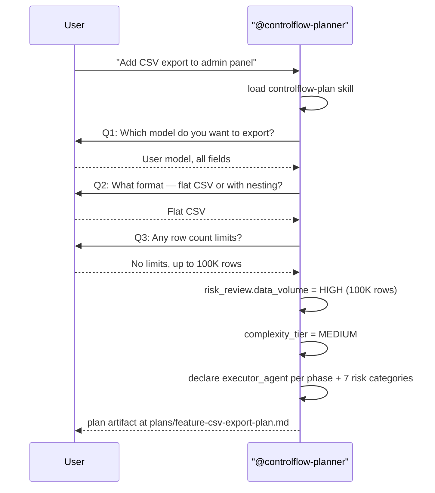
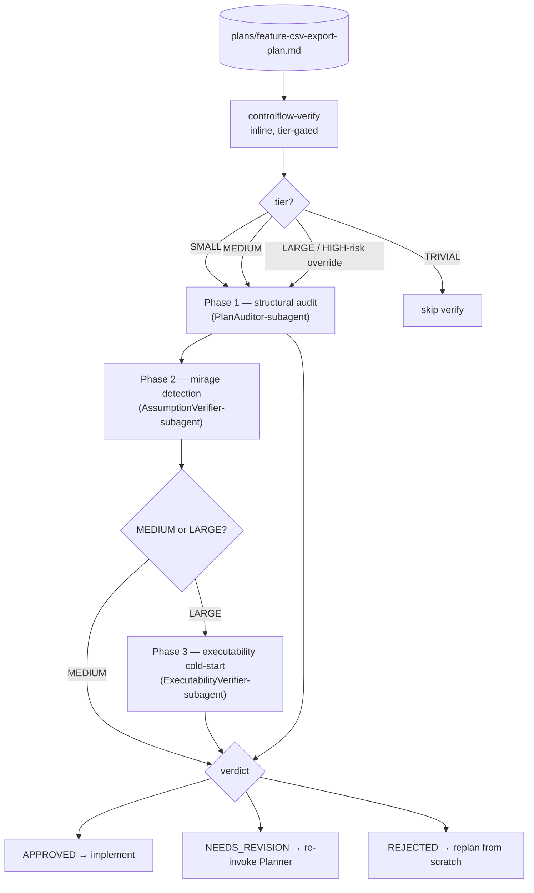
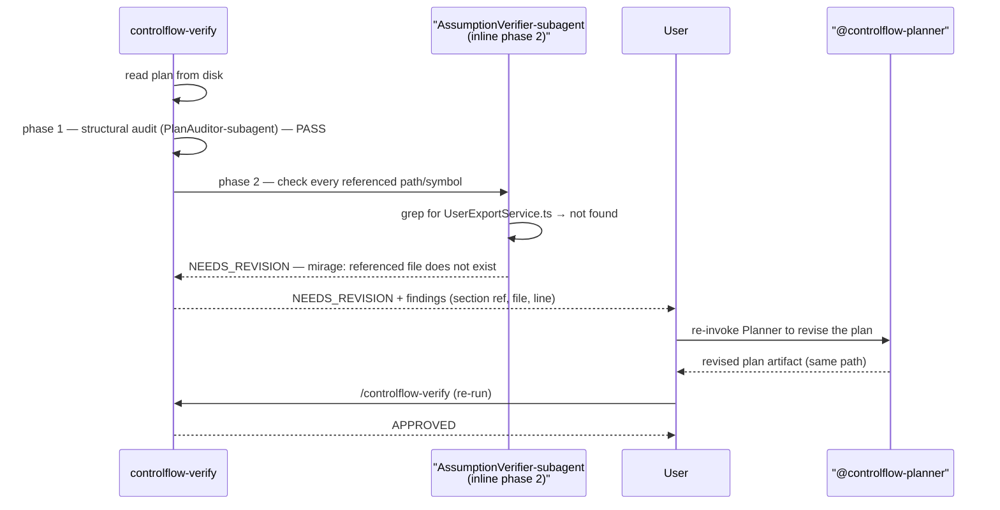
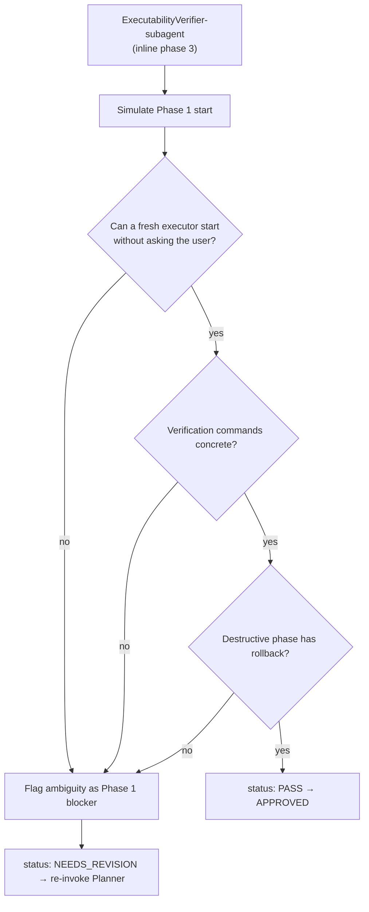
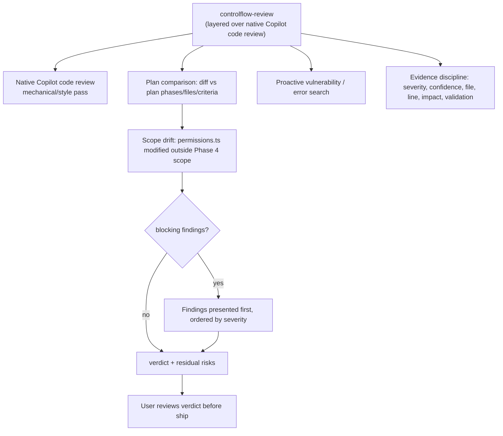

# Chapter 15 — Case Studies

## Why this chapter

Concrete scenarios showing how the slim ControlFlow pipeline works in practice over native Copilot. Each case study traces a real interaction pattern with a diagram. After this chapter you can sketch any task end-to-end: user → `@controlflow-planner` → plan artifact → `controlflow-verify` (tier-gated) → native Copilot executes phases → `controlflow-review`.

## How to Read a Case Study

Each case presents:
- **Scenario** — what the user wants.
- **Flow** — sequence or flowchart over the slim pipeline.
- **Key decisions** — which rules, tier, or verdict gate determine what happens.

## Case Study 1: Planner Idea Interview

**Scenario:** User says "I want to add a CSV export to the admin panel."



**Key decisions:**
- The Planner runs an **Idea Interview** because the request is vague (file scope / behavior is unclear).
- `data_volume: HIGH` is recorded in `risk_review`; the tier is `MEDIUM` (six phases, cross-domain).
- The Planner writes the artifact to `plans/feature-csv-export-plan.md` and points the user to the path — it never inlines the plan in chat.
- The Planner does **not** approve the plan; it only produces a reviewable artifact.

## Case Study 2: Plan Artifact → Verify Gate

**Scenario:** The Planner produced a MEDIUM-tier plan. The user runs `/controlflow-verify`.



**Key decisions:**
- `controlflow-verify` reads the plan **from disk** (not a chat-embedded copy).
- Tier `MEDIUM` → phases 1–2 run (structural audit + mirage detection). Phase 3 (executability cold-start) is skipped unless tier is `LARGE` or the HIGH-risk override fires.
- The three verify phases correspond to the three inline verify roles (`PlanAuditor-subagent`, `AssumptionVerifier-subagent`, `ExecutabilityVerifier-subagent`) — they are performed inline, **not** dispatched as subagents.
- A written plan is not approval. Implementation may begin only on `APPROVED`.

## Case Study 3: Adversarial Mirage Detection (MEDIUM)

**Scenario:** MEDIUM-tier plan. `AssumptionVerifier-subagent` (verify phase 2) finds a mirage: the plan references `src/export/UserExportService.ts`, which does not exist in the codebase.



**Key decisions:**
- `AssumptionVerifier-subagent` tries to **refute** the plan's factual claims (default to `flagged` when evidence is insufficient).
- A single BLOCKING mirage forces `NEEDS_REVISION`; the user re-invokes the Planner with the findings.
- After revision, verify re-runs from phase 1 — there is no "patch only the broken phase" shortcut.
- The mirage taxonomy (presence mirages P1–P10, absence mirages A11–A17) lives in `.github/skills/controlflow-verify/references/mirage-patterns.md`.

## Case Study 4: Executability Cold-Start (LARGE)

**Scenario:** LARGE-tier plan. `ExecutabilityVerifier-subagent` (verify phase 3) simulates a fresh executor starting Phase 1 with only the plan in hand.



**Key decisions:**
- Phase 3 simulates a cold-start executor: no prior context, only the plan artifact.
- "No concrete file path", "vague verification command", or "destructive phase without rollback" are executability blockers.
- A blocker routes back to the Planner for a **targeted refinement**, not a full replan.
- Tier gating: `LARGE` (or any unresolved HIGH-impact semantic risk) forces all three phases.

## Case Study 5: Failure Classification Mid-Execution

**Scenario:** Native Copilot is executing Phase 3 (executor role `CoreImplementer-subagent`). A test fails with a flaky timeout.

```mermaid
flowchart TD
    Native["Native Copilot executing Phase 3<br/>(executor role: CoreImplementer-subagent)"]
    Fail[Test FAILED — transient timeout]
    Class{failure_classification}
    Transient[transient → native Copilot retries]
    Fixable[fixable → native Copilot retries with fix hint]
    Replan[needs_replan → re-invoke @controlflow-planner]
    Esc[escalate → STOP + user approval]
    Mu[model_unavailable → native Copilot substitutes model]
    Log[record in plan lifecycle section<br/>(Progress / Idempotence & Recovery)]
    Continue[Phase 3 proceeds]

    Native --> Fail
    Fail --> Class
    Class --> Transient
    Class --> Fixable
    Class --> Replan
    Class --> Esc
    Class --> Mu
    Transient --> Log
    Fixable --> Log
    Replan --> Log
    Esc --> Log
    Mu --> Log
    Log --> Continue
```

**Key decisions:**
- Retry routing, retry budgets, and parallelism are **native Copilot's job**, not ControlFlow's.
- `needs_replan` is the only class that re-enters the ControlFlow pipeline — the user re-invokes `@controlflow-planner` for a targeted replan.
- Every failure is recorded in a plan lifecycle section (`## Progress`, `## Discoveries`, `## Idempotence & Recovery`) with its `failure_classification`.
- ControlFlow labels; native Copilot routes.

## Case Study 6: Mid-Execution Clarification

**Scenario:** Native Copilot, executing a UI phase (executor role `UIImplementer-subagent`), cannot decide how to display the empty state in the export dialog.

```mermaid
sequenceDiagram
    participant N as Native Copilot
    participant U as User
    participant P as "@controlflow-planner"

    N->>N: executing UI phase; ambiguous empty state
    alt ambiguity does not change file scope / architecture
        N->>U: native ask-questions surface: "How should the empty state be displayed?" (options: skeleton / message / hide)
        U-->>N: "hide"
        N->>N: continue phase with selection in context
    else ambiguity changes file scope or architecture
        U->>P: re-invoke @controlflow-planner for targeted replan
        P->>P: read existing artifact, update affected phases
        P-->>U: revised plan artifact
        U->>N: resume execution after /controlflow-verify APPROVED
    end
```

**Key decisions:**
- Mid-execution clarification is **native Copilot's job** — there is no ControlFlow `NEEDS_INPUT` routing table in the slim model.
- If the answer changes file scope, user-visible behavior, architecture, or destructive-risk handling, the user re-invokes the Planner for a targeted replan instead of resolving it inline.
- The revised plan must pass `controlflow-verify` again before execution resumes.

## Case Study 7: Review Gate — Scope Drift

**Scenario:** LARGE-tier task, all phases complete. The user runs `/controlflow-review`. The diff reveals that Phase 4 (executor role `CoreImplementer-subagent`) modified `src/auth/permissions.ts` — a file not in Phase 4's declared scope.



**Key decisions:**
- `controlflow-review` is a **layer over** native Copilot code review, not a replacement. The mechanical/style pass belongs to native review; ControlFlow adds plan comparison, proactive vulnerability search, and evidence discipline.
- Scope drift is flagged by comparing the implementation diff against the plan's declared phases, files, and acceptance criteria.
- `controlflow-review` **does not fix** issues — it labels them with severity, confidence, file, line, user impact, and validation method. The user (or a new plan phase) owns the fix.
- Findings are presented first, ordered by severity. Soft labels (`Nit`, `Optional`, `FYI`) come only after blocking findings.

---

## Scenario Reading Template

When working through an unfamiliar scenario, use this template:

1. **What tier was assigned?** (TRIVIAL / SMALL / MEDIUM / LARGE — and did the HIGH-risk override fire?)
2. **What did `controlflow-verify` return?** (APPROVED / NEEDS_REVISION / REJECTED — and which phase flagged it?)
3. **Who produced the failure or finding?** (Planner? a verify phase? native Copilot mid-execution? `controlflow-review`?)
4. **Which routing path applies?** (re-invoke Planner / native Copilot retry / user approval / ship)
5. **Was it recorded in a lifecycle section?** (`Progress` / `Discoveries` / `Idempotence & Recovery` with `failure_classification`.)
6. **What happens after the fix?** (resume execution / re-verify / ship / replan from scratch.)

## Common Mistakes

- **Confusing "Planner produced a plan" with "plan approved".** The Planner hands off a reviewable artifact; `controlflow-verify` still must return `APPROVED` before execution.
- **Expecting phase 3 (executability cold-start) on a SMALL task.** Phase 3 runs only on `LARGE` or when the HIGH-risk override fires.
- **Looking for the Orchestrator dispatch / wave scheduler.** Both are retired. Native Copilot runs phases; the pipeline gates before and after.
- **Expecting `controlflow-review` to fix issues.** It labels; the user or a new plan phase owns the fix.
- **Routing mid-execution ambiguity through a ControlFlow table.** Native Copilot handles clarification; only scope/architecture-changing ambiguity re-enters the pipeline via the Planner.

## Exercises

1. **(beginner)** In Case Study 1, why does `data_volume: HIGH` not automatically force `LARGE`? What tier does it produce, and which verify phases run?
2. **(beginner)** In Case Study 3, why does verify re-run from phase 1 after the revision rather than patching only the broken claim?
3. **(intermediate)** In Case Study 6, what distinguishes the two branches (inline clarification vs targeted replan)? Give an example of each.
4. **(intermediate)** In Case Study 5, which failure class is the only one that re-enters the ControlFlow pipeline, and what is the entry point?
5. **(advanced)** In Case Study 7, draft the findings list `controlflow-review` would emit for the `permissions.ts` scope drift — severity, confidence, file, line, user impact, validation method.

## Review Questions

1. When does verify phase 3 (executability cold-start) run?
2. What is a mirage, and which inline verify role detects it?
3. How does `controlflow-review` differ from native Copilot code review?
4. Why is a written plan not the same as an approved plan?
5. Which failure class re-enters the ControlFlow pipeline, and how?

## See Also

- [Chapter 05 — The plan → verify → review pipeline](05-orchestration.md)
- [Chapter 07 — Review Pipeline (controlflow-verify)](07-review-pipeline.md)
- [Chapter 08 — Execution + review over native Copilot](08-execution-pipeline.md)
- [Chapter 13 — Failure Taxonomy](13-failure-taxonomy.md)
- [docs/agent-engineering/NATIVE-DELEGATION-BOUNDARY.md](../agent-engineering/NATIVE-DELEGATION-BOUNDARY.md)