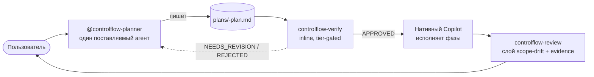

# Глава 00 — Введение

## Зачем эта глава

Понять, **что такое ControlFlow**, что он поставляет и зачем он существует. После этой главы вы будете знать отличие ControlFlow от других AI-инструментов и с чего начать изучение.

## Ключевые понятия

- **Тонкий слой (thin layer)** — ControlFlow — это не дублирующая поверхность поверх нативных agent-возможностей GitHub Copilot, а не компилируемое приложение и не multi-agent dispatch runtime.
- **Prompt-репозиторий** — ControlFlow поставляется как Markdown-промпты агентов, JSON-схемы, governance-файлы и skill'и, которые Copilot читает нативно из `.github/`.
- **Концептуальная роль (conceptual role)** — помеченная ответственность (например, `CoreImplementer-subagent`, `PlanAuditor-subagent`), которую Planner назначает в фазах плана, а нативный Copilot исполняет inline. _Не_ поставляемый файл агента.
- **Пайплайн (pipeline)** — plan → verify → review поверх нативного Copilot: Planner производит артефакт, `controlflow-verify` гейтит его, нативный Copilot исполняет фазы, `controlflow-review` гейтит результат.
- **Детерминизм** — каждое решение следует задокументированному правилу; никаких угадываний и скрытых предположений.

## Что ControlFlow есть (и чем не является)

**ControlFlow — это тонкий, не дублирующий слой поверх нативных agent-возможностей GitHub Copilot.** Он поставляет один агент (`@controlflow-planner`) и три skill'а (`controlflow-plan`, `controlflow-verify`, `controlflow-review`) плюс routing stub и оставляет только то, чего Copilot не предоставляет нативно: schema-enforced формат плана, адверсариальную верификацию, семикатегорийную semantic-risk taxonomy, plan-vs-implementation scope-drift ревью и набор eval-проверок на contract-drift.

**ControlFlow НЕ:**
- Runtime-сервер или компилируемое приложение.
- Библиотека, которую вы `npm install`-ите.
- Multi-agent dispatch runtime — никаких поставляемых сабагентов; dispatch и parallelism предоставляет нативный Copilot.
- Чат-бот или single-agent-ассистент.
- Low-code drag-and-drop workflow builder.

Репозиторий поставляет:

| Артефакт | Количество | Назначение |
|----------|------------|-----------|
| Planner-агент (`@controlflow-planner`) | один | `.github/agents/controlflow-planner.agent.md` — единственный поставляемый агент; производит планы, передаёт исполнение нативному Copilot |
| Workflow skill'и | три | `.github/skills/` — пайплайн `controlflow-plan`, `controlflow-verify`, `controlflow-review` |
| Value-add паттерны | девятнадцать | `skills/patterns/` — переиспользуемая доменная дисциплина, которую Planner инжектит в фазы (до трёх на фазу) |
| JSON-схемы | двадцать | `schemas/` — контрактная документация + ссылки на eval-фикстуры (anchor формата плана — `schemas/planner.plan.schema.json`) |
| Governance-конфиги | четыре | `governance/` — runtime-политика, реестр ролей, canonical-source matrix, rename allowlist |
| Routing stub | один | `.github/copilot-instructions.md` — общие политики, связывающие пайплайн |
| Eval-харнесс | ~410 проверок | `evals/` — оффлайн-валидация schema compliance, drift, parity и поведенческих инвариантов |
| Документация | — | Engineering-политики, tutorials, архитектурные документы |

## Зачем существует ControlFlow

Без структурированного слоя планирования поверх agentic-кодового ассистента LLM-инжиниринг страдает от повторяющихся failure-мод:

1. **Галлюцинации** — ассистент выдумывает файлы, API или поведения, которых не существует.
2. **Scope drift** — имплементация меняет то, что выходит за согласованный scope.
3. **Скрытые предположения** — ассистент угадывает вместо того, чтобы спросить.
4. **Missing rollback** — деструктивные операции продолжаются без recovery-плана.
5. **Approval bypass** — high-risk действия исполняются без человеческого подтверждения.
6. **Flaky outputs** — результаты меняются от запуска к запуску без детерминированной маркировки сбоев.

ControlFlow адресует все шесть через:
- Адверсариальную верификацию плана до того, как написан любой код (`controlflow-verify`).
- Schema-anchored контракты плана (`schemas/planner.plan.schema.json`), удерживаемые в согласованности набором eval-проверок на contract-drift.
- Явные гейты человеческого одобрения до исполнения и до публикации изменения.
- Пятиклассную taxonomy сбоев (`transient`, `fixable`, `needs_replan`, `escalate`, `model_unavailable`), записываемую в lifecycle-секциях плана; retry routing и parallelism делегированы нативному Copilot.
- Оффлайн eval-харнесс для непрерывного отлова регрессий.

Что ControlFlow **не** дублирует: planning discovery, subagent dispatch, code review, model selection, approvals, MCP и skills library — всё это нативные возможности Copilot. ControlFlow наслаивает свои пять дисциплин поверх, а не реимплементирует их. Каноническая запись — `docs/agent-engineering/NATIVE-DELEGATION-BOUNDARY.md`.

## Архитектура в одном предложении

**Planner** (`@controlflow-planner`) авторизует schema-anchored артефакт плана; `controlflow-verify` адверсариально аудирует его inline; **нативный Copilot** исполняет фазы (восемь ролей исполнителей — концептуальные метки, назначаемые Planner'ом, не поставляемые агенты); `controlflow-review` наслаивает scope-drift и evidence review поверх нативного Copilot code review.

## Тонкая поверхность и пайплайн

В пайплайне три гейта, а не state machine. Между гейтами нативный Copilot управляет процессом. Глубина verify-фаз tier-gated (см. главу 05).

## Аудитория

Это пособие написано для трёх аудиторий:

**Новички (главы 00–04):** не требуется предварительное знание ControlFlow. Нужна только базовая знакомость с Markdown, JSON и концепциями software engineering.

**Разработчики среднего уровня (главы 05–14):** предполагается, что вы прочитали главы 00–04 и хотите глубже понять пайплайн, планирование, схемы, governance и eval-харнесс.

**Практики (главы 15–18):** hands-on кейсы, упражнения, глоссарий и FAQ для ежедневного использования.

## Результаты обучения

После прохождения этого пособия вы сможете:

1. Описать тонкую поверхность ControlFlow (один агент + три skill'а + routing stub) и что делает каждая часть.
2. Объяснить пайплайн plan → verify → review и где нативный Copilot перехватывает между гейтами.
3. Классифицировать задачу в один из четырёх complexity-тиров и указать, какие verify-фазы запускаются.
4. Описать восемь ролей исполнителей и три inline verify-роли как **концептуальные метки**, назначаемые Planner'ом и исполняемые нативным Copilot'ом — не поставляемые файлы агентов.
5. Прочитать любой артефакт плана в `plans/` и понять его status, фазы, риски и handoff.
6. Запустить `cd evals && npm test` и интерпретировать вывод.
7. Внести новый skill-паттерн или governance-изменение по процессу, задокументированному в CONTRIBUTING.md.

## Как читать это пособие

- **Последовательно** — читайте главы по порядку для полной ментальной модели.
- **По траектории** — см. [README](README.md) для курируемых путей чтения.
- **Как справочник** — главы 03, 09, 10, 17 и 18 рассчитаны на lookup.

## Контрольные вопросы

1. Назовите три вещи, чем ControlFlow **не** является.
2. Какие шесть failure-мод адресует ControlFlow и какие из них митигируются `controlflow-verify`?
3. Какой каталог репозитория содержит оффлайн eval-харнесс?
4. Какова связь между Planner и нативным Copilot? Где заканчивается ControlFlow и начинается Copilot?

## См. также

- [Глава 01 — Быстрый старт](01-quickstart.md)
- [Глава 02 — Архитектурный обзор](02-architecture-overview.md)
- [docs/agent-engineering/NATIVE-DELEGATION-BOUNDARY.md](../agent-engineering/NATIVE-DELEGATION-BOUNDARY.md)
- [plans/project-context.md](../../plans/project-context.md)