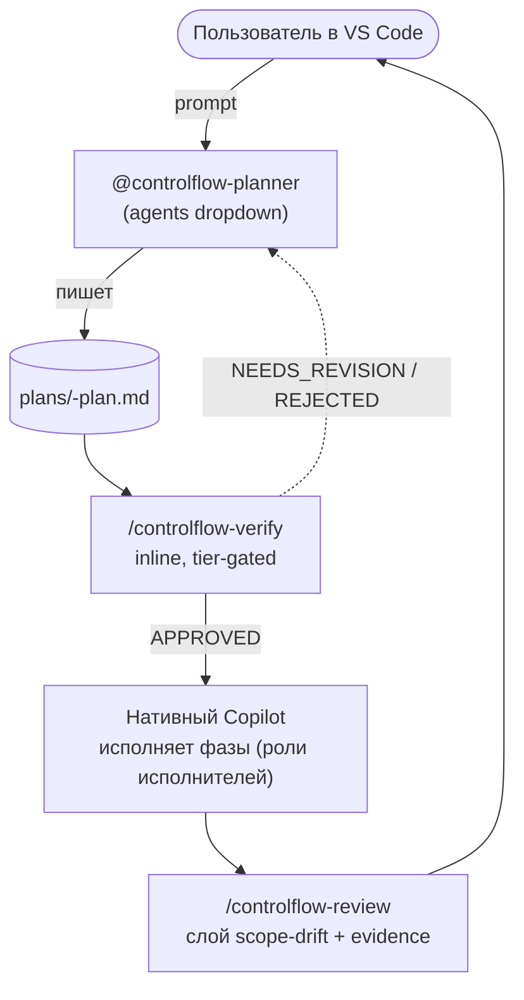

# Глава 01 — Быстрый старт

## Зачем эта глава

Сориентироваться в репозитории за тридцать минут. После этой главы вы сможете провести тонкий ControlFlow-поток end-to-end — открыть planner, произвести артефакт плана, верифицировать его, имплементить нативным Copilot и сделать review — и запустить eval-харнесс.

## Шаг 1: Карта репозитория

```text
ControlFlow/
├── .github/
│   ├── agents/
│   │   └── controlflow-planner.agent.md   ← единственный поставляемый агент
│   ├── skills/
│   │   ├── controlflow-plan/              ← plan skill + references
│   │   ├── controlflow-verify/           ← inline адверсариальный verify
│   │   └── controlflow-review/           ← post-implementation review
│   └── copilot-instructions.md            ← общий routing stub
├── schemas/                               ← двадцать JSON-схем (контракты + eval-фикстуры)
├── governance/                            ← четыре governance-файла (policy, registry, matrix, allowlist)
├── skills/
│   ├── index.md                           ← domain-маппинг паттернов
│   └── patterns/                          ← девятнадцать value-add паттернов
├── evals/                                 ← оффлайн eval-харнесс
│   ├── validate.mjs
│   ├── scenarios/                          ← регрессионные фикстуры
│   └── tests/
├── plans/
│   ├── project-context.md                 ← taxonomy ролей, тиров, конвенций
│   ├── templates/                          ← шаблоны плана + session-notes
│   └── artifacts/                         ← per-task история
├── plugins/
│   ├── controlflow-claude-code/           ← портативный плагин Claude Code
│   ├── controlflow-codex/                 ← портативный плагин Codex CLI
│   └── controlflow-cursor/                ← портативный плагин Cursor
├── docs/
│   └── agent-engineering/                 ← engineering policy-документы
└── NOTES.md                               ← active objective state
```

Copilot читает `.github/agents/`, `.github/skills/` и `.github/copilot-instructions.md` нативно — это и есть вся поставляемая поверхность ControlFlow. В поставке один агент и три skill'а; всё остальное — контракты, паттерны, eval'ы и документация.

## Шаг 2: Запуск eval-харнесса

Каноническая команда верификации:

```sh
cd evals && npm test
```

Она запускает ~410 оффлайн-проверок — структурную валидацию, prompt-behavior-контракты, drift detection (включая зеркало `plans/project-context.md` ↔ `governance/project-context-registry.json`), skill discoverability, capability matrix, plugin manifest parity и contract-drift. Никаких live-агентов, никаких сетевых вызовов.

Быстрые целевые прогоны:

```sh
npm run test:structural   # только структурная валидация (быстрее)
npm run test:behavior     # только prompt-behavior + drift-регрессии
```

Запустите `npm install` один раз перед `npm test`, если ещё не делали. Кэш в `evals/.cache/` может маскировать ошибки после структурных правок — удалите его (`rm -rf evals/.cache`) перед тем, как доверять зелёному прогону.

## Шаг 3: Тонкий поток на одном дыхании



В потоке три гейта: Planner производит артефакт, `controlflow-verify` гейтит его до исполнения, нативный Copilot исполняет фазы, `controlflow-review` гейтит результат. Между гейтами нативный Copilot управляет процессом.

## Шаг 4: Проведите поток end-to-end

1. **Откройте репо в VS Code.** Copilot читает тонкую поверхность из `.github/` нативно.
2. **Откройте Copilot Chat → переключитесь в Agent mode → откройте agents dropdown → выберите `controlflow-planner`.** (Выбор из dropdown — это GA-подтверждённый путь вызова. `@controlflow-planner` через `@-mention` тоже работает, если он surfaced в вашей настройке.)
3. **Промптните его.** Пример: `Add OAuth login with Google`. Planner проводит Idea Interview, если запрос расплывчат, читает репо, назначает complexity tier, заполняет семь категорий semantic-risk, декомпозирует на фазы и пишет schema-conforming план в `plans/<task-slug>-plan.md`. Он никогда не inline'ит план в чат — он указывает путь к артефакту.
4. **Прочитайте артефакт плана.** Откройте `plans/<task-slug>-plan.md` в редакторе; ревьюте status, фазы, риски и handoff.
5. **Верифицируйте (SMALL+ работа).** Запустите `/controlflow-verify` в Copilot Chat. Skill читает план с диска, запускает tier-gated inline-фазы (structural audit для SMALL; плюс mirage detection для MEDIUM; плюс executability cold-start для LARGE) и эмиттит `APPROVED` / `NEEDS_REVISION` / `REJECTED`. Компактный verdict пишется в `plans/artifacts/<task-slug>/verify-verdict.md`. Не начинайте имплементацию, пока verdict не `APPROVED`.
6. **Имплементите нативным Copilot.** Продолжайте в Copilot Chat; нативный Copilot исполняет фазы плана, используя поле `executor_agent` в каждой фазе как метку роли (например, `CoreImplementer-subagent`), а не как spawned ControlFlow-агент. Mid-execution clarification — задача нативного Copilot; если ambiguity меняет file scope или архитектуру, re-invoke'ните `@controlflow-planner` для targeted replan.
7. **Review (SMALL+ работа).** После имплементации запустите `/controlflow-review`. Он наслаивает сравнение plan-vs-implementation на scope drift, проактивный поиск уязвимостей и ошибок и дисциплину evidence поверх нативного Copilot code review. Findings упорядочены по severity.

TRIVIAL-задачи (один-два файла, одна проблема) пропускают пайплайн целиком — без плана, без verify, без review.

## Шаг 5: End-to-end сценарий (CSV-экспорт)

**Задача:** «Add CSV export to the orders page.»

Вот упрощённый walkthrough:

1. **Выберите `controlflow-planner` из agents dropdown** и промптните его задачей.
2. **Planner проводит Idea Interview**, если scope неоднозначен (формат? какой эндпоинт? нужен auth?).
3. **Planner читает репо** и держит verified facts отдельно от bounded assumptions.
4. **Planner назначает complexity tier** — скорее всего `SMALL` или `MEDIUM` (один домен, несколько файлов).
5. **Planner заполняет семь категорий semantic-risk** (ни одна не пропущена; `not_applicable` с обоснованием, когда не релевантно).
6. **Planner выбирает skill-паттерны** — например, `skills/patterns/tdd-patterns.md`, `skills/patterns/error-handling-patterns.md` (до трёх на фазу).
7. **Planner декомпозирует на фазы** — Phase 1: добавить service layer; Phase 2: добавить эндпоинт; Phase 3: добавить тесты. Каждая фаза объявляет один `executor_agent` из восьмиимённого enum.
8. **Planner пишет артефакт** в `plans/add-csv-export-plan.md` и указывает путь. Он не handoff'ает диспатчеру — он останавливается здесь.
9. **Вы запускаете `/controlflow-verify`.** Для `SMALL` идёт фаза 1 (structural audit). Для `MEDIUM` — фазы 1–2. Если `APPROVED`, продолжайте. Если `NEEDS_REVISION`, re-invoke'ните Planner для правки.
10. **Вы имплементите нативным Copilot**, фаза за фазой, следуя меткам `executor_agent` и `acceptance_criteria` плана.
11. **Вы запускаете `/controlflow-review`.** Он сравнивает diff с планом, проактивно ищет уязвимости и пропущенные error-пути и эмиттит findings плюс verdict.
12. **Вы ревьюте verdict** до публикации изменения.

Нет dispatch state machine, нет wave scheduler и нет per-phase потока gate-events в тонком потоке — это были ответственности retired концептуального дирижёра, теперь покрытые Planner плюс нативный Copilot плюс два verdict-гейта.

## Шаг 6: Что читать дальше

| Цель | Глава |
| --- | --- |
| Понять тонкую архитектуру | [Глава 02](02-architecture-overview.md) |
| Понять taxonomy ролей | [Глава 03](03-agent-roster.md) |
| Написать промпт кастомного агента | [Глава 04](04-part-spec.md) |
| Понять пайплайн | [Глава 05](05-orchestration.md) |
| Понять планирование | [Глава 06](06-planning.md) |
| Понять verify | [Глава 07](07-review-pipeline.md) |
| Понять схемы | [Глава 09](09-schemas.md) |
| Понять governance | [Глава 10](10-governance.md) |

## Упражнения

1. **(новичок)** Откройте `.github/agents/controlflow-planner.agent.md`. Найдите обязательные frontmatter-поля (`description`, `name`, `tools`). Почему там нет строки `model:`?
2. **(новичок)** Запустите `cd evals && npm test`. Сколько проверок прошло? Сколько занял прогон? (Не забудьте сначала `rm -rf evals/.cache`.)
3. **(средний)** Откройте `governance/runtime-policy.json`. Найдите `review_pipeline_by_tier`. Какие verify-фазы активны для `MEDIUM`?
4. **(средний)** Откройте `schemas/planner.plan.schema.json`. Найдите enum `complexity_tier`. Какие четыре значения разрешены и какой пропускает пайплайн целиком?

## Использование с Cursor или Codex

ControlFlow поставляет host-adaptation-плагины для не-VS Code хостов: `plugins/controlflow-cursor/` (Cursor) и `plugins/controlflow-codex/` (Codex CLI). Они аппроксимируют тонкий поток нативными поверхностями каждого хоста. См. `plugins/controlflow-cursor/README.md` и `plugins/controlflow-codex/README.md` для установки и текущего каталога skill'ов.

## Контрольные вопросы

1. Какова каноническая команда верификации и почему нужно удалить `evals/.cache/` перед тем, как доверять зелёному прогону?
2. Назовите поставляемую тонкую поверхность ControlFlow (один агент, три skill'а, один stub) и каталог, из которого Copilot читает их.
3. Перечислите три гейта тонкого потока по порядку.
4. После того как Planner записал артефакт плана, он авто-одобрен? Что должно произойти до начала имплементации SMALL+ работы?

## См. также

- [Глава 02 — Архитектурный обзор](02-architecture-overview.md)
- [Глава 04 — Структура промпта агента](04-part-spec.md)
- [Глава 14 — Eval-харнесс](14-evals.md)
- [evals/README.md](../../evals/README.md)
- [docs/agent-engineering/NATIVE-DELEGATION-BOUNDARY.md](../agent-engineering/NATIVE-DELEGATION-BOUNDARY.md)