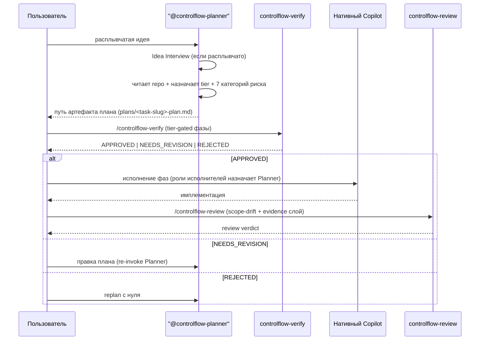

# Глава 02 — Архитектурный обзор

## Зачем эта глава

Построить ментальную модель всей системы: что ControlFlow поставляет, что он делегирует нативному Copilot, и как пайплайн plan → verify → review связывает эти части вместе. После этой главы вы сможете нарисовать архитектуру ControlFlow на доске за пять минут — и точно показать, где именно в дело вступает нативный Copilot.

## Ключевые понятия

- **Тонкая поверхность (slim surface)** — весь поставляемый ControlFlow артефактный набор для VS Code Copilot: один агент (`@controlflow-planner`) плюс три skill'а (`controlflow-plan`, `controlflow-verify`, `controlflow-review`) плюс routing stub. Всё остальное делегировано нативному Copilot.
- **Концептуальная роль (conceptual role)** — помеченная ответственность (например, `CoreImplementer-subagent`, `PlanAuditor-subagent`), которую Planner назначает в фазах плана, а нативный Copilot исполняет inline. _Не_ поставляемый файл агента.
- **Пайплайн (pipeline)** — plan → verify → review поверх нативного Copilot. Planner производит артефакт; `controlflow-verify` гейтит его до исполнения; нативный Copilot исполняет фазы; `controlflow-review` гейтит результат.
- **Tier-gated политика** — `TRIVIAL` / `SMALL` / `MEDIUM` / `LARGE` определяют, запускаются ли plan, verify и review вообще и насколько глубоко идёт verify.
- **Граница делегирования (delegation boundary)** — правило, по которому ControlFlow не поставляет поверхность, дублирующую нативную возможность Copilot. Каноническая запись — `docs/agent-engineering/NATIVE-DELEGATION-BOUNDARY.md`.
- **Контракт (schema)** — JSON-схема в `schemas/`, документирующая форму выхода роли и anchors eval-фикстуру. В slim-модели схемы — это контрактная документация + ссылки на eval-фикстуры, а не runtime-валидируемые сообщения между агентами.

## Архитектура верхнего уровня

```mermaid
flowchart TB
    User([Пользователь])

    subgraph CF["Тонкая поверхность ControlFlow (поставляется)"]
        direction TB
        Planner["@controlflow-planner<br/>.github/agents/controlflow-planner.agent.md"]
        PlanSkill["controlflow-plan<br/>.github/skills/controlflow-plan/"]
        VerifySkill["controlflow-verify<br/>.github/skills/controlflow-verify/"]
        ReviewSkill["controlflow-review<br/>.github/skills/controlflow-review/"]
        Stub["copilot-instructions.md<br/>routing stub"]
    end

    subgraph Roles["Концептуальные роли (НЕ поставляемые файлы)"]
        direction LR
        Exec[8 ролей исполнителей]
        Verify[3 inline-роли verify]
    end

    subgraph Native["Нативный Copilot (предоставляет)"]
        direction LR
        Dispatch[Subagent dispatch + parallelism]
        PlanMode[/plan mode]
        CodeReview[Agentic code review]
        Models[Model selection + approvals + MCP]
    end

    User -->|prompt| Planner
    Planner --> PlanSkill
    PlanSkill -->|артефакт плана в plans/| VerifySkill
    VerifySkill -->|APPROVED| Native
    Native -->|исполняет фазы<br/>(роли исполнителей)| ReviewSkill
    ReviewSkill -->|verdict| User
    Planner -.->|назначает| Roles
    Roles -.->|исполняется| Native
    Stub -.->|маршрутизирует| PlanSkill
    Stub -.->|маршрутизирует| VerifySkill
    Stub -.->|маршрутизирует| ReviewSkill
```

## Тонкая поверхность и её роли

ControlFlow поставляет **один агент и три skill'а** поверх нативного Copilot. **Никаких поставляемых сабагентов нет.**

| Поверхность | Путь | Роль |
|-------------|------|------|
| Агент `@controlflow-planner` | `.github/agents/controlflow-planner.agent.md` | Единственный поставляемый агент. Запускает plan skill + Idea Interview; передаёт исполнение нативному Copilot. Использует Copilot Auto model picker (без `model:` frontmatter). |
| skill `controlflow-plan` | `.github/skills/controlflow-plan/` | Производит schema-anchored артефакт плана в `plans/`. Single-source формат берёт из `schemas/planner.plan.schema.json` и `plans/templates/plan-document-template.md`. |
| skill `controlflow-verify` | `.github/skills/controlflow-verify/` | Inline адверсариальная верификация (ноль сабагентов). Tier-gated фазы: structural audit, mirage detection, executability cold-start. Эмиттит verdict. |
| skill `controlflow-review` | `.github/skills/controlflow-review/` | Evidence-backed ревью, слой поверх нативного Copilot code review. Добавляет сравнение plan-vs-implementation на scope drift. |
| Routing stub | `.github/copilot-instructions.md` | Общие политики; связывает plan → verify → review. |

Метки ролей в планах — восемь ролей исполнителей и три inline-роли verify — это **концептуальные роли**, которые Planner назначает в фазах плана, а нативный Copilot исполняет inline. Это не поставляемые файлы агентов. Полный taxonomy — в главе 03, authoritative mirror-таблицы — в `plans/project-context.md`.

### Что предоставляет нативный Copilot (делегировано)

| Нативная возможность | Статус | Делегирование ControlFlow |
|----------------------|--------|----------------------------|
| Custom agents (`@-mention`, `.agent.md`) | GA (Feb 2026) | `.agent.md` от ControlFlow уже является агентом Copilot |
| Subagent dispatch + parallelism | GA (Feb 2026) | Убираем legacy dispatch state machine; нативный Copilot запускает фазы исполнителей |
| Plan mode (`/plan`) | GA | Layer поверх — сохраняем _формат_ плана CF; используем нативную разведку |
| Agentic code review | GA (Mar 2026) | Делегируем механический проход; сохраняем слой scope-drift + evidence от CF |
| Skills library (`.github/skills/`) | GA (portable) | Поставляем ControlFlow как skills |
| MCP, model selection, approvals, custom instructions | GA | Делегируем |

### Что ControlFlow оставляет (Copilot не предоставляет нативно)

1. Schema-enforced формат плана (YAML header, десять секций, семикатегорийный semantic risk, Mermaid по тиру) anchored by `schemas/planner.plan.schema.json`.
2. Адверсариальная inline верификация (`controlflow-verify`: structural audit, mirage detection, executability cold-start → `APPROVED` / `NEEDS_REVISION` / `REJECTED`).
3. Tier-gated политика workflow (`TRIVIAL` / `SMALL` / `MEDIUM` / `LARGE` с глубиной verify-фаз).
4. Plan-vs-implementation scope-drift ревью (`controlflow-review`, слой поверх нативного Copilot code review).
5. Набор eval-проверок на contract-drift (`evals/`).

Каноническая запись — `docs/agent-engineering/NATIVE-DELEGATION-BOUNDARY.md` — прочитайте её; цитируйте; не пересказывайте дословно.

## Ключевой поток: Idea → Code



В пайплайне три гейта, а не state machine: Planner производит артефакт; `controlflow-verify` гейтит его до исполнения; нативный Copilot исполняет; `controlflow-review` гейтит после. Между гейтами нативный Copilot управляет процессом — включая mid-execution clarification и retry routing (см. главу 05).

## Подсистемы

| Подсистема | Расположение | Назначение |
|------------|--------------|------------|
| **Schemas** | `schemas/*.json` | Двадцать JSON-схем — контрактная документация + ссылки на eval-фикстуры. Anchor формата плана — `schemas/planner.plan.schema.json`. |
| **Governance** | `governance/*.json` | Четыре файла: `runtime-policy.json`, `project-context-registry.json`, `canonical-source-matrix.json`, `rename-allowlist.json`. Без поверхностей model routing или tool grant. |
| **Skills** | `.github/skills/controlflow-{plan,verify,review}/` + `skills/patterns/` | Три workflow skill'а (поставляются) и девятнадцать value-add паттернов (Planner-injected, ≤3 на фазу через `skill_references`). |
| **Memory** | `NOTES.md`, `plans/artifacts/`, `/memories/repo/` | Трёхслойная модель: session / task-episodic / repo-persistent. |
| **Plans** | `plans/` | Артефакты планов + `plans/project-context.md` (authoritative taxonomy ролей) + `plans/templates/`. |
| **Eval harness** | `evals/` | Оффлайн-проверки качества всей системы (см. главу 14). |

Каждая подсистема рассматривается в отдельной главе (09–14).

## Принципы архитектуры

1. **Разделение планирования и исполнения.** Planner производит план и не пишет код. Нативный Copilot исполняет фазы и не меняет дизайн.
2. **Адверсариальная верификация до исполнения.** `controlflow-verify` пытается опровергнуть план до того, как будет тронут код. Найти проблему в плане дешевле, чем в коде.
3. **Контракты вместо доверия.** Формат плана anchored by `schemas/planner.plan.schema.json`; формы выходов ролей задокументированы в `schemas/` и проверяются eval-харнессом.
4. **Гейты человеческого одобрения.** Пользователь подтверждает план до начала исполнения и verdict ревью до публикации изменения.
5. **Явная taxonomy сбоев.** Каждый сбой, записанный в lifecycle-секции плана, классифицируется одним из пяти классов (`transient`, `fixable`, `needs_replan`, `escalate`, `model_unavailable`). Retry routing и parallelism — задача нативного Copilot.
6. **Fail-loud, abstain-safe.** Когда evidence недостаточно, Planner возвращает `ABSTAIN`, а не угадывает.
7. **Least privilege — делегировано.** Доступ к инструментам и выбор модели делегированы нативному Copilot. В slim-модели нет поверхности tool-grants (retired).
8. **Структурированный текстовый вывод.** Планы и verdict'ы пишутся в артефакты в `plans/` и представляются как структурированный текст — никогда не raw JSON в чат.
9. **Non-duplication.** ControlFlow не поставляет поверхность, дублирующую нативную возможность Copilot. Граница делегирования аудируется (см. `docs/agent-engineering/NATIVE-DELEGATION-BOUNDARY.md`).

## Типичные заблуждения

- **«Имена ролей исполнителей — это поставляемые файлы агентов.»** Нет — `CodeMapper-subagent`, `CoreImplementer-subagent` и остальные семь — это _метки концептуальных ролей_, которые Planner назначает в фазах плана. Нативный Copilot исполняет их inline. Единственный поставляемый файл агента — `.github/agents/controlflow-planner.agent.md`.
- **«`controlflow-verify` спавнит verifier-сабагентов.»** Нет — три verify-роли (`PlanAuditor-subagent`, `AssumptionVerifier-subagent`, `ExecutabilityVerifier-subagent`) — это фазы verify skill, выполняемые inline в главном контексте. Ноль сабагентов.
- **«У ControlFlow есть Orchestrator, который диспатчит фазы.»** Orchestrator — _retired_ концептуальная роль дирижёра; он не поставляется. Planner + нативный Copilot покрывают оркестрацию. Legacy state machine, dispatch, waves и gates ушли.
- **«Можно вызвать роль исполнителя напрямую из ControlFlow.»** Нет поверхности ControlFlow для вызова. Planner назначает роль в фазе плана; затем вы запускаете фазу через нативный Copilot (или воссоздаёте персону как native Copilot custom agent — см. `NATIVE-DELEGATION-BOUNDARY.md §5`).
- **«Схемы валидируют inter-agent сообщения в runtime.»** В slim-модели схемы — это контрактная документация + ссылки на eval-фикстуры. Формат плана enforced во время планирования skill'ом `controlflow-plan`, conforming to `schemas/planner.plan.schema.json`, а eval-харнесс на contract-drift утверждает, что формат, taxonomy ролей и governance остаются согласованы.

## Упражнения

1. **(новичок)** Нарисуйте на бумаге тонкую поверхность (один агент, три skill'а, routing stub) поверх нативного Copilot. Сравните с диаграммой выше.
2. **(новичок)** Откройте `plans/project-context.md` и найдите таблицу Phase Executor Agents. Подтвердите, что восемь имён ролей исполнителей совпадают с перечисленными в главе 03.
3. **(средний)** Какие три роли **не могут** появиться в поле `executor_agent` фазы плана и почему? (Подсказка: это inline verify-роли, выполняемые `controlflow-verify`.)
4. **(средний)** Откройте `docs/agent-engineering/NATIVE-DELEGATION-BOUNDARY.md` §1. Перечислите пять строк «Keep» — то, что Copilot не предоставляет нативно и ControlFlow оставляет.
5. **(продвинутый)** Объясните своими словами, почему Orchestrator state machine был retired, а не slimmed. Какая нативная возможность Copilot заменила dispatch + waves + gates?

## Контрольные вопросы

1. Назовите поставляемую поверхность ControlFlow для VS Code Copilot (один агент, три skill'а, один stub).
2. В чём разница между _концептуальной ролью_ и _поставляемым файлом агента_?
3. Перечислите три гейта пайплайна по порядку.
4. Какая подсистема anchor'ит формат плана как контракт?
5. Почему в slim-модели в каталоге governance нет JSON-файла model routing или tool grant?

## См. также

- [Глава 03 — Taxonomy ролей](03-agent-roster.md)
- [Глава 05 — Пайплайн plan → verify → review](05-orchestration.md)
- [Глава 07 — Ревью-пайплайн](07-review-pipeline.md)
- [docs/agent-engineering/NATIVE-DELEGATION-BOUNDARY.md](../agent-engineering/NATIVE-DELEGATION-BOUNDARY.md)
- [plans/project-context.md](../../plans/project-context.md)