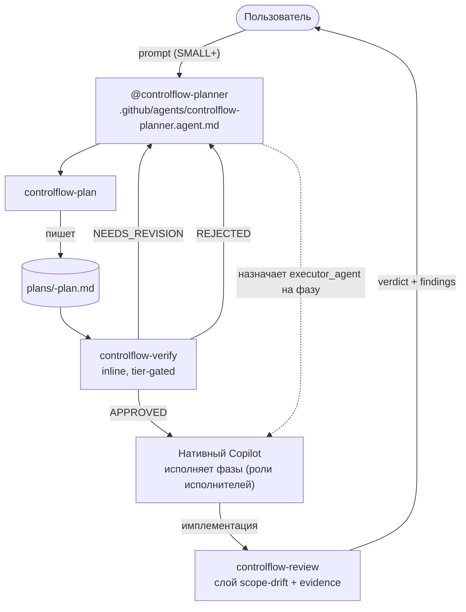
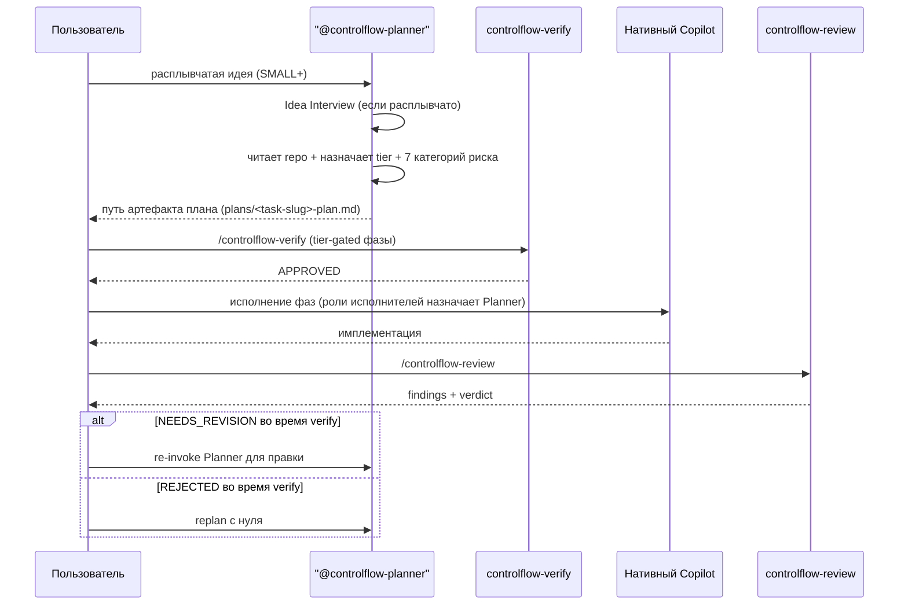

# Глава 05 — Пайплайн plan → verify → review

## Зачем эта глава

Понять, **как пайплайн управляет процессом** в slim-модели: что запускается когда, что что гейтит, и чем владеет нативный Copilot между гейтами. После этой главы вы сможете проследить любую задачу пошагово от идеи до review'енной имплементации — и точно знать, куда делся legacy Orchestrator state machine и почему.

Главное изменение: Orchestrator **retired** как поставляемый агент. Нет dispatch state machine, нет wave scheduler, нет потока gate-events на фазу. Оркестрация теперь — это пайплайн plan → verify → review поверх нативного Copilot, управляемый tier-gated политикой и тремя verdict-гейтами.

## Ключевые понятия

- **Пайплайн (pipeline)** — трёхшаговый поток: `controlflow-plan` (Planner производит артефакт) → `controlflow-verify` (inline адверсариальный аудит) → нативный Copilot исполняет фазы → `controlflow-review` (слой scope-drift + evidence поверх нативного code review).
- **Tier-gated политика** — `TRIVIAL` / `SMALL` / `MEDIUM` / `LARGE` определяют, запускаются ли plan, verify и review вообще и сколько verify-фаз запускается.
- **Verdict-гейт** — решение, эмиттируемое skill'ом: `controlflow-verify` → `APPROVED` / `NEEDS_REVISION` / `REJECTED`; `controlflow-review` → findings + verdict. Гейт блокирует продвижение, пока пользователь (или re-invoke Planner'а) его не разрешит.
- **Концептуальная роль** — помеченная ответственность, которую Planner назначает в фазе плана (`executor_agent`), а нативный Copilot исполняет inline. Не поставляемый агент (см. главу 03).
- **Classification сбоев** — один из `transient`, `fixable`, `needs_replan`, `escalate`, `model_unavailable`. Записывается в lifecycle-секциях плана; retry routing и parallelism — задача нативного Copilot.
- **Orchestrator (retired)** — концептуальная роль дирижёра. Здесь упоминается только как история: в slim-модели Planner + нативный Copilot покрывают оркестрацию. Legacy state machine (`PLANNING` / `WAITING_APPROVAL` / `PLAN_REVIEW` / `ACTING` / `REVIEWING` / `COMPLETE`), dispatch, waves и batch gates ушли.

## Пайплайн

В пайплайне три гейта, а не state machine. Между гейтами нативный Copilot управляет процессом.

## Tier-gated политика

Таблица тиров — единственная политика workflow. Она должна совпадать с `README.md`, `.github/copilot-instructions.md` и `plans/project-context.md`.

| Tier | Scope | Plan | Verify (inline фазы) | Review |
|------|-------|------|----------------------|--------|
| **TRIVIAL** | 1–2 файла, одна проблема | skip | skip | skip |
| **SMALL** | 3–5 файлов, один домен | `controlflow-plan` | фаза 1 (structural audit) | `controlflow-review` |
| **MEDIUM** | 6–14 файлов, кросс-домен | `controlflow-plan` | фазы 1–2 (audit + assumption/mirage) | `controlflow-review` |
| **LARGE** | 15+ файлов, system-wide | `controlflow-plan` | фазы 1–3 (audit + mirage + executability cold-start) | `controlflow-review` |

**Override-правило:** любой план с записью `risk_review`, где `applicability: applicable` AND `impact: HIGH` AND `disposition` не `resolved`, форсит `LARGE` (все три verify-фазы) независимо от количества файлов.

**Жёсткое правило:** не начинать имплементацию SMALL+ работы, пока `controlflow-verify` не вернёт `APPROVED`.

## Три гейта подробно

### Гейт 1 — Plan (производит артефакт)

`@controlflow-planner` запускает skill `controlflow-plan` (`.github/skills/controlflow-plan/`). Что происходит:

- Чтение репозитория до декомпозиции фаз; verified facts отделены от предположений bounded scope statement.
- **Idea Interview**, когда запрос расплывчат; спросить пользователя напрямую, когда ответ меняет file scope, user-visible поведение, архитектуру или обработку destructive-risk; иначе записать bounded assumption.
- Назначить один complexity tier.
- Заполнить все семь категорий semantic-risk (ни одна не пропущена; `not_applicable` с обоснованием, когда не релевантно).
- Объявить ровно один `executor_agent` на фазу из schema enum.
- Записать артефакт в `plans/<task-slug>-plan.md` через шаблон `plans/templates/plan-document-template.md`, conforming to `schemas/planner.plan.schema.json`.
- Никогда не inline'ить план в чат — указать путь артефакта.

Planner **не** пишет код, не вызывает исполнителей и не запускает verify/review. Он производит артефакт и handoff'ает.

### Гейт 2 — Verify (адверсариально до исполнения)

`/controlflow-verify` запускается inline в главном контексте — ноль сабагентов. Skill читает план с диска (не встроенную в чат копию) и пытается его опровергнуть. Адверсариальный фрейминг: ваша задача — сломать план, а не защищать его. По умолчанию `flagged`, когда evidence недостаточно.

| Фаза | Метка роли | Что проверяет | Tier |
|------|-----------|---------------|------|
| 1 — Structural audit | `PlanAuditor-subagent` | Соответствие schema/template; 10 секций по порядку; 7 категорий риска; executor enum; правила Mermaid | SMALL+ |
| 2 — Mirage detection | `AssumptionVerifier-subagent` | Указанные files/symbols существуют; предположения bounded; нет concurrency hand-waving | MEDIUM+ |
| 3 — Executability cold-start | `ExecutabilityVerifier-subagent` | Может ли свежий исполнитель начать Phase 1 из одного плана? Concrete verification-команды? Rollback для деструктивных фаз? | LARGE (или HIGH-risk override) |

**Семантика verdict'а:**

- `APPROVED` — все проверки пройдены, Phase 1 actionable, критерии измеримы. Можно начинать имплементацию.
- `NEEDS_REVISION` — ambiguous Phase 1, непроверенные пути, vague критерии, структурный сбой. Перечислить каждый finding с точной ссылкой на секцию; повторный аудит после исправления. Re-invoke Planner для правки.
- `REJECTED` — структурный изъян; scope не deliverable как написано. Объяснить blockers; запросить направление у пользователя. Не начинать кодинг.

Компактный verdict пишется в `plans/artifacts/<task-slug>/verify-verdict.md` для auditability, затем показывается пользователю.

### Гейт 3 — Review (после имплементации, слой поверх нативного)

`/controlflow-review` запускается после имплементации. Это **слой поверх** нативного Copilot code review, не замена. Механический/style-проход (lint-class проблемы, форматирование, rote pattern checks) принадлежит нативному Copilot code review и `security-review`. ControlFlow добавляет только то, чего нет в нативном ревью:

- **Сравнение с планом** — соответствует ли diff фазам, файлам и acceptance criteria плана? Пометить scope drift, пропущенные фазы, extra-phased работу, невыполненные acceptance criteria.
- **Проактивный поиск уязвимостей / ошибок** — отследить новые потоки данных до их эндпоинтов; проверить validation на каждой границе; найти error-пути, которые имплементация пропустила (absence mirages A11–A13); проверить отсутствие миграций или rollback (A16); проверить отсутствие security boundaries на чувствительных операциях (A17).
- **Дисциплина evidence** — пометить каждый finding severity, confidence, file, line, user impact и validation method. Различать validated blockers и hypotheses; явно указывать validation gaps.

Findings предъявляются первыми, упорядоченными по severity. Если их нет, skill так и говорит и называет residual risks или test gaps. Soft-метки (`Nit`, `Optional`, `FYI`) идут только после blocking findings.

## Сценарий: типичная end-to-end задача

## Mid-execution clarification

Нативный Copilot обрабатывает mid-execution ambiguity. Если фазе нужно clarification, нативный Copilot surfaces его пользователю напрямую (через свою нативную поверхность approvals/ask-questions) и продолжает. Никакой `NEEDS_INPUT` routing-таблицы нет — это было концепцией Orchestrator'а.

Если ambiguity меняет file scope, user-visible поведение, архитектуру или обработку destructive-risk, пользователь re-invoke'ит `@controlflow-planner` для targeted replan, а не разрешает её inline. Planner читает существующий артефакт в `plans/`, обновляет затронутые фазы и перезапускает `controlflow-verify` до возобновления исполнения.

## Failure routing

Каждый сбой, записанный в lifecycle-секции плана (`## Progress`, `## Discoveries`, `## Idempotence & Recovery`), получает `failure_classification`:

| Класс | Значение | Кто маршрутизирует |
|-------|----------|---------------------|
| `transient` | Flaky тест, network timeout, временная недоступность tool; retry с тем же scope | Нативный Copilot |
| `fixable` | Мелкая исправимая проблема (опечатка, missing import, значение config); retry с fix hint | Нативный Copilot |
| `needs_replan` | Архитектурное несоответствие или missing dependency; делегировать Planner'у на targeted replan | Re-invoke `@controlflow-planner` |
| `escalate` | Уязвимость безопасности, риск целостности данных, неразрешимый blocker; остановиться и ждать human approval | Нативный Copilot останавливается; пользователь решает |
| `model_unavailable` | Routed/primary модель недоступна или unreachable; retry через нативную Copilot подмену модели, затем escalate при исчерпании | Нативный Copilot |

Retry routing, retry budgets и parallelism — задача нативного Copilot, не ControlFlow. `needs_replan` — единственный класс, который re-входит в пайплайн ControlFlow — он re-invoke'ит Planner для targeted replan.

## Правила остановки (обязательные паузы)

Эти моменты — **обязательные паузы**, их нельзя пропустить:

1. После записи плана и до начала исполнения (пользователь ревьюит артефакт).
2. После того, как `controlflow-verify` вернёт verdict — имплементация начинается только на `APPROVED`.
3. После того, как `controlflow-review` вернёт findings — пользователь ревьюит verdict до публикации изменения.

Пропуск правила остановки равен пропуску гейта — это нарушение контракта.

## Почему Orchestrator state machine был retired

Краткая история, так как вопрос частый. Legacy Orchestrator владел lifecycle (`PLANNING` → `WAITING_APPROVAL` → `PLAN_REVIEW` → `ACTING` → `REVIEWING` → `COMPLETE`), эмиттил gate events, диспатчил фазы в waves и маршрутизировал сбои по retry budget. С февраля 2026 Copilot делает всё это нативно: subagent dispatch + parallelism — GA default-on, `/plan` mode — GA, agentic code review — GA, approvals + custom instructions — GA.

Держать ControlFlow dispatch state machine поверх этого дублировало бы нативные возможности — именно то, что slim-модель запрещает. Поэтому Orchestrator retired как поставляемый агент. ControlFlow оставляет то, чего Copilot не предоставляет нативно: _формат_ плана, адверсариальный _verify_-гейт, tier-gated _политику_ и слой scope-drift _review_. Пайплайн выше — это то, что теперь значит «оркестрация».

## Типичные ошибки

- **Трактовать артефакт плана как одобренный.** Записанный план — не одобрение; `controlflow-verify` всё равно должен вернуть `APPROVED` до исполнения.
- **Пропуск verify на SMALL-задачах.** SMALL запускает фазу 1 (structural audit) — это не skip-verify. Только TRIVIAL пропускает пайплайн.
- **Inline'ить план в чат.** Planner пишет артефакт в `plans/` и указывает путь. Verify skill читает с диска. План в чате — не артефакт плана.
- **Искать retired файл агента Orchestrator или dispatch state machine.** Оба retired. Routing stub (`.github/copilot-instructions.md`) и таблица тиров — это политика.
- **Ожидать, что ControlFlow будет retry'ить, parallelize или маршрутизировать сбои.** Это задача нативного Copilot. ControlFlow только метит сбои (`needs_replan` re-входит в пайплайн; остальные — на обработку нативного Copilot).
- **Форсировать продолжение после `REJECTED`.** `REJECTED` значит стоп; запросить направление у пользователя или replan с нуля.

## Упражнения

1. **(новичок)** Откройте `.github/copilot-instructions.md` и найдите таблицу тиров. Подтвердите, что она совпадает с таблицей в этой главе и в `README.md`.
2. **(новичок)** Откройте `.github/skills/controlflow-verify/SKILL.md` и перечислите три фазы и метку роли, которой соответствует каждая.
3. **(средний)** У SMALL-задачи есть неразрешённая `HIGH`-impact запись риска `performance`. Какой tier она получает и сколько verify-фаз запускается? (Override-правило.)
4. **(средний)** Фаза сбоит с `needs_replan`. Кто её маршрутизирует и какова единственная точка входа ControlFlow, которая re-входит в пайплайн?
5. **(продвинутый)** Проследите MEDIUM-задачу end-to-end: какой skill запускается, какие verify-фазы запускаются, какие роли назначаются, какой гейт эмиттит verdict. Нарисуйте.

## Контрольные вопросы

1. Назовите три гейта пайплайна и skill (или нативную поверхность) за каждым.
2. Что говорит tier-gated override-правило и где оно закодировано?
3. Перечислите три verify verdict'а и что каждый значит для имплементации.
4. Какой класс сбоев re-входит в пайплайн ControlFlow и как?
5. Почему Orchestrator state machine был retired, а не slimmed?

## См. также

- [Глава 02 — Архитектурный обзор](02-architecture-overview.md)
- [Глава 06 — Планирование](06-planning.md)
- [Глава 07 — Ревью-пайплайн](07-review-pipeline.md)
- [Глава 08 — Пайплайн исполнения](08-execution-pipeline.md)
- [Глава 13 — Таксономия сбоев](13-failure-taxonomy.md)
- [.github/copilot-instructions.md](../../.github/copilot-instructions.md)
- [docs/agent-engineering/NATIVE-DELEGATION-BOUNDARY.md](../agent-engineering/NATIVE-DELEGATION-BOUNDARY.md)