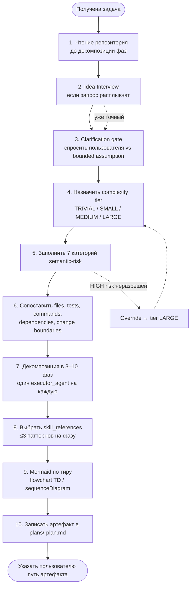

# Глава 06 — Планирование

## Зачем эта глава

Разобрать, **как `@controlflow-planner` превращает идею в артефакт плана**: последовательный workflow, который выполняет skill `controlflow-plan` — от первого чтения репозитория до записанного артефакта в `plans/`. Это самая «думающая» часть пайплайна и единственное место, где ControlFlow производит durable письменный контракт до того, как будет тронут код.

Planner **не** пишет код, не вызывает исполнителей и не запускает verify/review. Он производит артефакт и handoff'ает. Исполнение — задача нативного Copilot (см. главу 08); адверсариальная верификация — задача `controlflow-verify` (см. главу 07).

## Ключевые понятия

- **`@controlflow-planner`** — единственный поставляемый агент ControlFlow (`.github/agents/controlflow-planner.agent.md`). Запускает skill `controlflow-plan`. Использует Copilot Auto model picker (без `model:` frontmatter).
- **skill `controlflow-plan`** — workflow, описанный в этой главе. Single-source формат плана берёт из `schemas/planner.plan.schema.json` (machine-enforced контракт) и `plans/templates/plan-document-template.md` (скелетон документа).
- **Idea Interview** — структурированный диалог с пользователем при расплывчатой задаче.
- **Clarification gate** — спросить пользователя напрямую, когда ответ меняет file scope, user-visible поведение, архитектуру или обработку destructive-risk; иначе записать bounded assumption.
- **Semantic risk review** — обязательная оценка по 7 категориям риска (ни одна не пропускается; `not_applicable` с обоснованием, когда не релевантно).
- **Complexity tier** — классификация в `TRIVIAL` / `SMALL` / `MEDIUM` / `LARGE` (TRIVIAL пропускает пайплайн).
- **`executor_agent`** — обязательное поле каждой фазы; ровно одно, из 8-именного schema enum. Метка концептуальной роли, которую Planner назначает, а нативный Copilot исполняет.
- **`skill_references`** — до 3 путей value-add паттернов из `skills/patterns/`, которые Planner инжектирует в фазу для дисциплины.
- **Артефакт плана** — план, записанный в `plans/<task-slug>-plan.md`. **Никогда не inline'ится в чат** — Planner указывает путь артефакта.
- **Терминальные исходы** — `READY_FOR_EXECUTION`, либо `ABSTAIN` / `REPLAN_REQUIRED`, когда evidence недостаточно или предпосылки невалидны.

## Workflow Planner

Workflow зеркалит `.github/skills/controlflow-plan/SKILL.md`. Сам формат здесь **не** пересказывается — Planner читает `schemas/planner.plan.schema.json` и `plans/templates/plan-document-template.md` во время invoke и conform'ит к ним.

## Шаг 1. Чтение репозитория

До декомпозиции фаз Planner читает репозиторий и держит **verified facts** отдельно от **предположений** с bounded scope statement. Планирование из chat-памяти, когда чтение репо изменило бы scope — это failure mode (см. `controlflow-plan` skill, Planning-Specific Failure Checks).

## Шаг 2. Idea Interview

Если запрос пользователя расплывчат («улучшить производительность», «давай рефакторить»), Planner проводит интервью:

- **Какова цель?** — что именно изменится в системе для пользователя.
- **Какие границы?** — что **не** должно быть затронуто.
- **Какие критерии успеха?** — как мы поймём, что готово.
- **Какие ограничения?** — performance, time, dependencies.

Skill-паттерн: `skills/patterns/idea-to-prompt.md`. Интервью можно **пропустить**, если задача уже сформулирована точно.

## Шаг 3. Clarification Gate

Planner спрашивает пользователя напрямую, когда ответ меняет **file scope, user-visible поведение, архитектуру или обработку destructive-risk**; иначе записывает bounded assumption. Типичные triggers clarification:

| Trigger | Пример |
|---------|---------|
| Scope ambiguity | «Добавить экспорт» — куда? CSV / JSON / PDF? |
| Architecture fork | «Хранить в Redis или в Postgres?» |
| User preference decision | «Сортировать по имени или по дате?» |
| Destructive risk approval | «Удалить старые записи навсегда?» |
| Repository structure change | «Переименовать модуль?» |

Канонические классы clarification живут в `docs/agent-engineering/CLARIFICATION-POLICY.md`. Когда Planner спрашивает, он предлагает 2–3 опции, у каждой — pros/cons/affected files и рекомендация.

## Шаг 4. Назначить Complexity Tier

Planner читает определения тиров и назначает один. Таблица тиров должна совпадать с `README.md`, `.github/copilot-instructions.md` и `plans/project-context.md`.

| Tier | Scope | Plan | Verify (inline фазы) | Review |
|------|-------|------|----------------------|--------|
| **TRIVIAL** | 1–2 файла, одна проблема | skip | skip | skip |
| **SMALL** | 3–5 файлов, один домен | `controlflow-plan` | фаза 1 (structural audit) | `controlflow-review` |
| **MEDIUM** | 6–14 файлов, кросс-домен | `controlflow-plan` | фазы 1–2 (audit + assumption/mirage) | `controlflow-review` |
| **LARGE** | 15+ файлов, system-wide | `controlflow-plan` | фазы 1–3 (audit + mirage + executability cold-start) | `controlflow-review` |

**Override-правило:** любой план с записью `risk_review`, где `applicability: applicable` AND `impact: HIGH` AND `disposition` не `resolved`, форсит `LARGE` (все три verify-фазы) независимо от количества файлов.

## Шаг 5. Semantic Risk Review

**Обязательно** для всех статусов плана (включая `READY_FOR_EXECUTION`). Все 7 категорий, каждая ровно один раз:

| Категория | Что проверяет |
|-----------|---------------|
| `data_volume` | Объёмы данных, пагинация, batch ops, `SELECT *` |
| `performance` | Query paths, N+1, индексы, hot path |
| `concurrency` | Параллельные операции, гонки данных, shared mutable state |
| `access_control` | Авторизация, права, ownership |
| `migration_rollback` | Schema migrations, data transforms, format changes |
| `dependency` | Внешние API, новые пакеты, версии |
| `operability` | Deployment, мониторинг, инфраструктура |

Для каждой категории записываются `applicability` (`applicable` / `not_applicable` / `uncertain`), `impact` (`HIGH` / `MEDIUM` / `LOW` / `UNKNOWN`), `evidence_source` (путь файла или запрос) и `disposition` (`resolved` / `open_question` / `research_phase_added` / `not_applicable`). Никогда не пропускайте строку — используйте `not_applicable` с обоснованием. Override из шага 4 срабатывает на неразрешённой HIGH-impact applicable записи.

Taxonomy категорий определена в `docs/agent-engineering/RISK-TAXONOMY.md`; focus-области аудита, в которые каждая категория мапится — в `plans/project-context.md` (таблица `controlflow-verify Phase 1 (Audit) Focus Area Mapping`).

## Шаг 6. Сопоставить files, tests, commands, dependencies, change boundaries

Planner сопоставляет вероятные файлы, тесты, команды, зависимости и change boundaries **до** декомпозиции фаз (не после). Это вход для секции 9 артефакта плана (Success Criteria) и для массивов `files` каждой фазы.

## Шаг 7. Декомпозиция в фазы

План разбивается на **3–10 фаз**. Если нужно больше — декомпозируйте задачу глубже. Каждая фаза объявляет ровно один `executor_agent` из 8-именного schema enum — это **метки концептуальных ролей**, которые Planner назначает, а нативный Copilot исполняет inline (см. главу 03), не поставляемые файлы агентов:

- `CodeMapper-subagent` — read-only разведка
- `Researcher-subagent` — research & evidence
- `CoreImplementer-subagent` — backend-имплементация (canonical backbone)
- `UIImplementer-subagent` — UI-имплементация
- `PlatformEngineer-subagent` — инфраструктура / CI-CD
- `TechnicalWriter-subagent` — документация
- `BrowserTester-subagent` — E2E browser-тестирование
- `CodeReviewer-subagent` — post-implementation ревью

Каждая фаза содержит: `phase_id`, `title`, `objective`, `dependencies`, `files` (`{path, action, reason}`), `tests`, `steps` (нумерованная проза — **без code-блоков**), `acceptance_criteria` (минимум один измеримый observable outcome), `quality_gates` (из enum `tests_pass` / `lint_clean` / `schema_valid` / `safety_clear` / `human_approved_if_required`), `failure_expectations` (`{scenario, classification, mitigation}`) и `skill_references`.

**Inter-phase contracts** — если фаза B зависит от A, записывается `{from_phase, to_phase, interface, format}`. Формат должен быть явным, а downstream-фаза должна знать, как его валидировать.

Три inline verify-роли (`PlanAuditor-subagent`, `AssumptionVerifier-subagent`, `ExecutabilityVerifier-subagent`) **не должны** появляться как `executor_agent` — это read-only verify-фазы, выполняемые `controlflow-verify` (см. главу 07).

## Шаг 8. Выбрать skill_references

Planner читает `skills/index.md` и выбирает **до 3** путей `skills/patterns/`, наиболее релевантных фазе. Пути пишутся в `skill_references` каждой применимой фазы. Implementation-агенты читают эти паттерны **до** начала работы.

Пример выбора для задачи «добавить endpoint с auth»:

- `skills/patterns/security-patterns.md` (auth, validation)
- `skills/patterns/tdd-patterns.md` (тесты)
- `skills/patterns/error-handling-patterns.md` (boundaries)

Паттерны несут переиспользуемую дисциплину, которую раньше воплощали retired специализированные агенты. См. главу 11 для mapping доменов паттернов.

## Шаг 9. Mermaid по тиру

- `flowchart TD` (DAG зависимостей фаз) обязателен для MEDIUM+ с 3+ фазами.
- `sequenceDiagram` добавляется для MEDIUM с нетривиальной оркестрацией и для всех LARGE-планов.
- Каждая диаграмма ≤30 строк.

## Шаг 10. Запись артефакта

Planner записывает артефакт в `plans/<task-slug>-plan.md` через `plans/templates/plan-document-template.md`, conforming to `schemas/planner.plan.schema.json`. Артефакт включает YAML header, 10 секций по порядку и 5 lifecycle-секций (`## Progress`, `## Discoveries`, `## Decision Log`, `## Outcomes`, `## Idempotence & Recovery`) для SMALL+ планов.

Planner **никогда не inline'ит план в чат** — он указывает путь артефакта. `controlflow-verify` читает план с диска, а не из chat-копии. План в чате — не артефакт плана.

## Handoff

Для `READY_FOR_EXECUTION` артефакт включает секцию Handoff, указывающую исполнение на `plans/<task-slug>-plan.md` и объявляющую маршрут ревью (`/controlflow-verify`, tier-gated). `plan_path` — это **reviewable input**, не implicit approval — пользователь ревьюит артефакт, затем запускает `/controlflow-verify`.

Legacy handoff `target_agent: Orchestrator` retired — поставляемого Orchestrator'а нет. Planner handoff'ает в артефакт; пользователь запускает verify; нативный Copilot исполняет (см. главу 08).

## Терминальные исходы

Если Planner не может произвести план `READY_FOR_EXECUTION`:

- **`status: ABSTAIN`** — недостаточно evidence; нужно действие пользователя. Включить структуру terminal-outcome из шаблона.
- **`status: REPLAN_REQUIRED`** — первоначальные предпосылки оказались невалидны.

У обоих другая файловая структура (см. `plans/templates/plan-document-template.md`, раздел Terminal Non-Ready Outcome Artifact). Когда confidence ниже 0.9, план не `READY_FOR_EXECUTION`.

## Schema-driven structure

Полная структура плана определяется `schemas/planner.plan.schema.json`. Обязательные поля верхнего уровня включают `schema_version` (`1.2.0`), `agent` (`Planner`), `status`, `task_title`, `summary`, `confidence` (0–1; <0.9 триггерит escalation), `abstain` (`{is_abstaining, reasons}`), `phases` (массив), `open_questions`, `risks`, `risk_review` (7 категорий), `success_criteria`, `complexity_tier` и `handoff`. Eval-харнесс на contract-drift (`evals/`) утверждает, что формат плана, taxonomy ролей и governance-конфиг остаются согласованы (см. главу 14).

## Типичные ошибки

- **Inline'ить план в чат.** Planner пишет артефакт в `plans/` и указывает путь. Verify skill читает с диска. План в чате — не артефакт плана.
- **Пропустить `risk_review` для TRIVIAL.** Все 7 категорий обязательны для не-TRIVIAL планов, даже как `not_applicable` с обоснованием. (TRIVIAL пропускает пайплайн целиком.)
- **Размытое `acceptance_criteria`.** Должно быть **измеримым observable outcome** — минимум одно на фазу.
- **Code-блоки в `steps`.** Запрещены — описывайте шаги нумерованной прозой.
- **Manual testing steps.** Запрещены — вся верификация должна быть автоматизируемой.
- **Назначить verify-роль как `executor_agent`.** `PlanAuditor-subagent`, `AssumptionVerifier-subagent` и `ExecutabilityVerifier-subagent` — read-only verify-фазы, выполняемые `controlflow-verify`; они не должны появляться в `executor_agent`.
- **Декомпозиция фаз до сопоставления files и tests.** Сначала mapping (шаг 6), затем декомпозиция (шаг 7).
- **Пометка `READY_FOR_EXECUTION` без маршрута ревью и назначения артефакта.**
- **Пересказ schema/template внутри артефакта.** Conform'ите к ним; не парафразируйте контракт по памяти.

## Упражнения

1. **(новичок)** Откройте `.github/skills/controlflow-plan/SKILL.md` и найдите workflow. Сравните его шаги с диаграммой выше.
2. **(новичок)** Откройте `schemas/planner.plan.schema.json` и перечислите 8 разрешённых значений `executor_agent`. Подтвердите, что они совпадают с главой 03.
3. **(средний)** Какой шаг workflow Planner может пропустить, если задача уже сформулирована точно?
4. **(средний)** Откройте любой план в `plans/`. Найдите все 7 категорий semantic risk и их значения `disposition`. Какая из них форсила бы LARGE override, если неразрешена и HIGH-impact?
5. **(продвинутый)** Задача: «Удалить устаревший endpoint `/v1/users`». Какие triggers clarification применимы? Какой complexity tier и какой override может сработать?

## Контрольные вопросы

1. Назовите два файла single-source-of-truth, которые Planner читает во время invoke для формата плана.
2. Какое максимальное число `skill_references` на фазу и куда они записываются?
3. При каких условиях задача форсится в tier `LARGE` независимо от количества файлов?
4. Какие два терминальных не-ready исхода выдаёт Planner и когда срабатывает каждый?
5. Может ли Planner назначить `PlanAuditor-subagent` как `executor_agent` фазы? Почему да/нет?

## См. также

- [Глава 03 — Taxonomy ролей](03-agent-roster.md)
- [Глава 05 — Пайплайн plan → verify → review](05-orchestration.md)
- [Глава 07 — Ревью-пайплайн (controlflow-verify)](07-review-pipeline.md)
- [Глава 08 — Исполнение + ревью поверх нативного Copilot](08-execution-pipeline.md)
- [Глава 11 — Skills](11-skills.md)
- [.github/skills/controlflow-plan/SKILL.md](../../.github/skills/controlflow-plan/SKILL.md)
- [schemas/planner.plan.schema.json](../../schemas/planner.plan.schema.json)
- [plans/templates/plan-document-template.md](../../plans/templates/plan-document-template.md)
- [docs/agent-engineering/CLARIFICATION-POLICY.md](../agent-engineering/CLARIFICATION-POLICY.md)