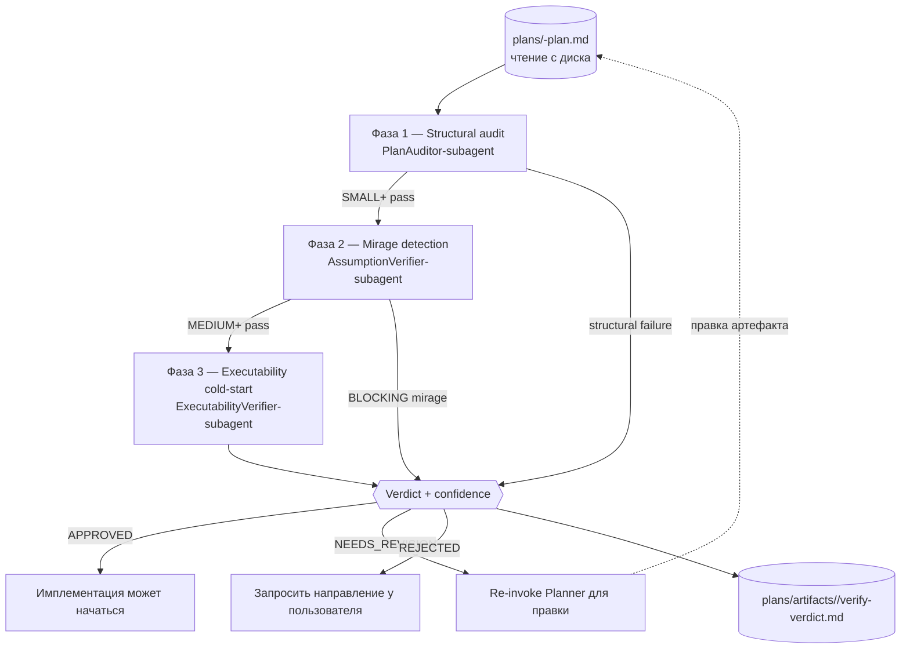

# Глава 07 — Ревью-пайплайн (controlflow-verify)

## Зачем эта глава

Понять **`controlflow-verify`** — адверсариальный гейт до исполнения, запускающийся *до* того, как будет тронут код. Это «verify»-половина пайплайна: Planner производит артефакт; `controlflow-verify` пытается его опровергнуть; только на `APPROVED` начинается имплементация. Найти проблему в плане на порядки дешевле, чем в коде.

Эта глава — **pre-execution** verify-гейт. Post-execution «review»-гейт (`controlflow-review`) — глава 08. Вместе они два гейта, обрамляющие исполнение в пайплайне plan → verify → review (глава 05).

## Ключевые понятия

- **`controlflow-verify`** — skill, запускающий адверсариальную pre-execution верификацию **inline в главном контексте** (ноль сабагентов). Invoke через `/controlflow-verify`.
- **Inline, не dispatch** — verify runs в главном контексте разговора. Он **не** спавнит verifier-агентов. Три verify-роли — это фазы skill'а, не поставляемые агенты.
- **Адверсариальный фрейминг** — ваша задача **сломать** план, а не защищать его. Steelman rejection. По умолчанию `flagged`, когда evidence недостаточно; не рационализируйте pass.
- **Три фазы = три verify-роли** — `PlanAuditor-subagent` (фаза 1, structural audit), `AssumptionVerifier-subagent` (фаза 2, mirage detection), `ExecutabilityVerifier-subagent` (фаза 3, executability cold-start). Это метки концептуальных ролей; они **не должны** появляться как `executor_agent` в фазах плана.
- **Tier-gated глубина фаз** — `SMALL` → фаза 1; `MEDIUM` → фазы 1–2; `LARGE` → фазы 1–3; любая неразрешённая HIGH-impact semantic-risk → все три независимо от тира.
- **Verdict** — `APPROVED` / `NEEDS_REVISION` / `REJECTED`, с confidence score.
- **Taxonomy миражей** — presence-миражи P1–P10 и absence-миражи A11–A17 (ось factual-claims).
- **Чтение с диска** — verify skill читает артефакт плана из `plans/<task-slug>-plan.md`, а не из chat-копии.

## Verify-пайплайн



Пайплайн tier-gated: SMALL запускает только фазу 1; MEDIUM — фазы 1–2; LARGE — все три. Structural failure в фазе 1 short-circuit'ит в `NEEDS_REVISION` немедленно.

## Tier-gated глубина фаз

Таблица тиров совпадает с `README.md`, `.github/copilot-instructions.md` и `plans/project-context.md`.

| Tier | Какие verify-фазы запускать |
|------|------------------------------|
| **TRIVIAL** | skip |
| **SMALL** | фаза 1 (structural audit) |
| **MEDIUM** | фазы 1–2 (audit + assumption/mirage) |
| **LARGE** | фазы 1–3 (audit + mirage + executability cold-start) |

**Override-правило:** любой план с записью `risk_review`, где `applicability: applicable` AND `impact: HIGH` AND `disposition` не `resolved`, форсит все три фазы независимо от тира. Не начинать имплементацию SMALL+ работы, пока `controlflow-verify` не вернёт `APPROVED`.

## Адверсариальный фрейминг (применим к каждой фазе)

- Ваша задача — сломать план, а не защищать его. Steelman rejection.
- По умолчанию `flagged`, когда evidence недостаточно — не рационализируйте pass.
- Для каждого claim'а спросите: «Что сделало бы это ложным?» — затем проверьте это.
- Различайте **validated blockers** и **hypotheses**; явно указывайте validation gaps.
- `confidence` Planner'а **не** заменяет ваш собственный скоринг.

Адверсариальный фрейминг — корректив для inline-ревью, которому не хватает изоляции свежего контекста агента. Поскольку нет свежего verifier-сабагента, скептицизм должен нести само framing.

## Фаза 1 — Structural Audit (PlanAuditor-subagent)

Подтвердить, что артефакт соответствует `schemas/planner.plan.schema.json` и `plans/templates/plan-document-template.md`:

1. YAML header присутствует; `Status` — один из `READY_FOR_EXECUTION`, `ABSTAIN`, `REPLAN_REQUIRED`; `Agent: Planner`; `Schema Version: 1.2.0`; `Confidence` — числовое.
2. Все 10 секций присутствуют по порядку; 5 lifecycle-секций присутствуют и упорядочены для SMALL+.
3. Секция 7 содержит ровно семь категорий риска, каждая один раз.
4. Каждая фаза объявляет один `executor_agent` из schema enum; quality gates используют только пять стандартных значений (`tests_pass`, `lint_clean`, `schema_valid`, `safety_clear`, `human_approved_if_required`).
5. Acceptance criteria включают минимум один измеримый observable outcome на фазу.
6. Tier LARGE включает `flowchart TD` + `sequenceDiagram`; каждая ≤30 строк.

**Structural failure → `NEEDS_REVISION` немедленно.** Classification сбоев для этой фазы **исключает** `transient`.

### Маппинг focus-областей фазы 1

Когда запись semantic-risk триггерит аудит, категория риска мапится в focus-области аудита. Эта таблица — та, что в `plans/project-context.md`:

| Категория риска | Focus-области аудита |
|-----------------|----------------------|
| `data_volume`, `performance` | `["performance"]` |
| `concurrency`, `access_control` | `["architecture"]` |
| `migration_rollback` | `["destructive_risk", "missing_rollback"]` |
| `dependency` | `["architecture"]` |
| `operability` | `["scope_gap"]` |

## Фаза 2 — Assumption / Mirage Check (AssumptionVerifier-subagent)

Попытаться **опровергнуть** factual claims плана:

1. Каждый указанный file/path/symbol реален — открыть или grep'нуть. Указанный файл, которого не существует — это мираж и blocker.
2. Каждое предположение bounded по scope, а не скрытое решение о scope.
3. Зависимости и version constraints pinned или явно помечены.
4. Никакого hand-waving «должно быть безопасно» по concurrency или shared mutable state — ownership и ordering явные.
5. Data-volume-опасения задокументированы там, где применимо (bulk ops, пагинация).

Полная taxonomy миражей — в `.github/skills/controlflow-verify/references/mirage-patterns.md`:

- **Presence-миражи (P1–P10)** — «Файл X существует» (его нет); «Функция Y возвращает Z» (возвращает другое); «API W доступен» (deprecated); «Зависимость уже установлена» (нет); «Тест покрывает случай» (нет).
- **Absence-миражи (A11–A17)** — error-пути, которые план пропустил, отсутствующие миграции, отсутствующий rollback, отсутствующие security boundaries на чувствительных операциях.

Severity — `BLOCKING` / `WARNING` / `INFO`. Только `BLOCKING` останавливает пайплайн. `AssumptionVerifier` дополняет `PlanAuditor`, потому что они проверяют **разные оси**: PlanAuditor ревьюит _дизайн_ (корректно ли решение?); AssumptionVerifier ревьюит _factual accuracy_ (то, что Planner написал, действительно правда?).

## Фаза 3 — Executability Cold-Start Simulation (ExecutabilityVerifier-subagent)

Симулировать свежего исполнителя, начинающего Phase 1 только с планом в руках:

1. Может ли Phase 1 выполниться без вопроса пользователю? Если да — ок; если нет — пометить ambiguity как blocker Phase 1.
2. Достаточно ли concrete verification-команды, чтобы запустить as-is (без угадывания)?
3. Есть ли у каждой destructive или migration-heavy фазы rollback/recovery guidance? HIGH blast radius → требуется `human_approved_if_required`; MEDIUM → `safety_clear`.
4. Явный ли формат inter-phase contract deliverable и знает ли downstream-фаза, как его валидировать?

Status — `PASS` / `WARN` / `FAIL`. `FAIL` или `WARN` маршрутизирует обратно Planner'у на доработку.

## Confidence Score и Verdict

Оцените каждый применимый checklist-item как `confirmed` / `uncertain` / `refuted`:

```
confidence = confirmed_count / total_items_with_any_actionable_question
```

- `uncertain ≥ 2` → cap confidence на 0.85.
- Любой HIGH-impact open question → cap на 0.7.
- Все проверки pass, Phase 1 actionable, критерии измеримы → **`APPROVED`**.
- Ambiguous Phase 1, непроверенные пути, vague критерии, нет rollback на destructive change → **`NEEDS_REVISION`** (перечислить каждый finding с точной ссылкой на секцию; re-audit после исправления; re-invoke Planner для правки).
- Structural flaw; scope не deliverable как написано → **`REJECTED`** (объяснить blockers; запросить направление у пользователя; не начинать кодинг).

Компактный verdict пишется в `plans/artifacts/<task-slug>/verify-verdict.md` для auditability, затем показывается пользователю с findings, которые его обосновывают.

| Verdict | Значение | Следующий шаг |
|---------|----------|---------------|
| `APPROVED` | Все проверки pass; Phase 1 actionable; критерии измеримы | Имплементация может начаться (глава 08) |
| `NEEDS_REVISION` | Устранимые проблемы — ambiguous Phase 1, непроверенные пути, vague критерии | Re-invoke `@controlflow-planner` для правки; re-run verify |
| `REJECTED` | Structural flaw; scope не deliverable как написано | Запросить направление у пользователя или replan с нуля; не начинать кодинг |

`ABSTAIN` — **не** verify verdict. (`ABSTAIN` — _Planner_-терминальный исход, не verify verdict — см. главу 06.) Если verify не может уверенно оценить item, он помечает его и указывает validation gap; он не молча проходит.

## Verify-Specific Failure Checks

- Не pass'ить план, который вы не прочитали с диска.
- Не помечать finding resolved без re-check evidence.
- Не позволять `confidence` Planner'а заменять ваш собственный скоринг.
- Не схлопывать три фазы в один skim для «маленького» плана — запускайте фазы, которые требует tier.
- Не начинать имплементацию SMALL+ работы, пока verify не вернёт `APPROVED`.

## Типичные ошибки

- **Трактовать `controlflow-verify` как опциональный на SMALL.** SMALL запускает фазу 1 (structural audit) — это не skip-verify. Только TRIVIAL пропускает пайплайн.
- **Inline'ить план в чат и верифицировать chat-копию.** Verify skill читает с диска (`plans/<task-slug>-plan.md`). План в чате — не артефакт плана.
- **Защищать план вместо опровержения.** Адверсариальный фрейминг обязателен. По умолчанию `flagged`, когда evidence недостаточно.
- **Схлопывать фазы в один skim.** Запускайте фазы, которые требует tier. LARGE — все три; MEDIUM — две; SMALL — одну.
- **Игнорировать HIGH-risk override.** План может быть SMALL по числу файлов, но неразрешённая HIGH-impact applicable запись `risk_review` форсит все три фазы.
- **Назначать verify-роль как `executor_agent`.** `PlanAuditor-subagent`, `AssumptionVerifier-subagent` и `ExecutabilityVerifier-subagent` — read-only verify-фазы, выполняемые inline; они не должны появляться в `executor_agent`.
- **Трактовать AssumptionVerifier как «вторую пару глаз».** Он проверяет **другую ось** (factual accuracy claims плана), чем PlanAuditor (корректность дизайна).
- **Форсировать продолжение после `REJECTED`.** `REJECTED` значит стоп; запросить направление у пользователя или replan с нуля.

## Упражнения

1. **(новичок)** Откройте `.github/skills/controlflow-verify/SKILL.md` и перечислите три фазы и метку роли, которой соответствует каждая.
2. **(новичок)** Откройте `.github/skills/controlflow-verify/references/mirage-patterns.md`. Назовите один presence-мираж (P1–P10) и один absence-мираж (A11–A17).
3. **(средний)** При каких условиях SMALL-tier план получает полный трёхфазный LARGE-пайплайн?
4. **(средний)** На итерации PlanAuditor проходит (`APPROVED`-эквивалент), но AssumptionVerifier находит `BLOCKING`-мираж. Каков verdict и что происходит дальше?
5. **(продвинутый)** План ссылается на `src/api/users.ts` и `getUsers()` в Phase 1. Пройдите, как именно фаза 2 попыталась бы опровергнуть каждый claim. Какие команды вы бы запустили?

## Контрольные вопросы

1. Перечислите три verify-фазы, метку роли каждой и tier, на котором каждая активируется.
2. Что такое адверсариальный фрейминг и почему он необходим именно потому, что verify runs inline, а не как свежий сабагент?
3. Каковы три verdict'а и что каждый значит для имплементации?
4. Как вычисляется confidence score и какие два условия cap его ниже 0.9?
5. Где определена таблица Phase 1 Audit Focus Area Mapping и что она мапит?

## См. также

- [Глава 05 — Пайплайн plan → verify → review](05-orchestration.md)
- [Глава 06 — Планирование](06-planning.md)
- [Глава 08 — Исполнение + ревью поверх нативного Copilot](08-execution-pipeline.md)
- [Глава 09 — Schemas (контракты)](09-schemas.md)
- [.github/skills/controlflow-verify/SKILL.md](../../.github/skills/controlflow-verify/SKILL.md)
- [plans/project-context.md](../../plans/project-context.md)