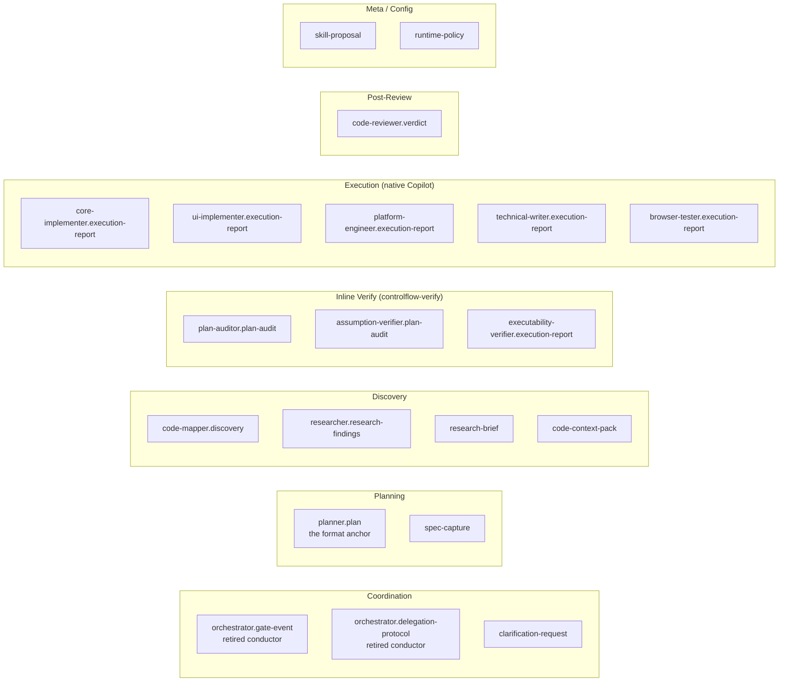

# Глава 09 — Схемы (контракты)

## Зачем эта глава

Понять, **что схемы — это контракты и eval-фикстуры**, а не runtime-валидируемые inter-agent сообщения. После этой главы вы будете знать назначение каждой из двадцати схем в `schemas/` и где искать их ключевые поля.

## Что такое схема в ControlFlow

Схема (файл под `schemas/`) — это **JSON Schema (draft 2020-12)**, фиксирующая структуру выхода одной роли, общий payload или governance-конфиг. В slim-модели схемы служат трём целям:

1. **Контрактная документация** — форма выхода роли задокументирована один раз и referenced прозой роли (в промпте агента или skill'е), `plans/project-context.md` и tutorials. Агенты **не** эмиттят raw JSON в чат; они эмиттят структурированный текст. Схема — контракт за текстом.
2. **Ссылка на eval-фикстуру** — `evals/validate.mjs` валидирует реальные сценарии и шаблоны против схем. Набор eval-проверок на contract-drift утверждает, что формат плана, taxonomy ролей и governance-конфиг остаются согласованными across files (см. главу 14).
3. **Anchor формата плана** — `schemas/planner.plan.schema.json` — это immutable machine-enforced контракт, которому skill `controlflow-plan` соответствует во время планирования.

**Важно:** в slim-модели схемы — **не** runtime-валидируемые inter-agent сообщения. Нет dispatch state machine, обменивающейся JSON-payload'ами между поставляемыми агентами — slim-модель поставляет один агент (`@controlflow-planner`) и делегирует исполнение нативному Copilot. Схемы документируют контракт и anchor'ят eval'ы; Planner conforms к `planner.plan.schema.json` во время планирования, а eval-харнесс утверждает, что контракты остаются согласованными.

## Полный реестр схем

Двадцать схем в `schemas/`:

| № | Файл | Документирует контракт для | Назначение |
|---|------|------------------------------|------------|
| 1 | `clarification-request.schema.json` | Любая acting role на `NEEDS_INPUT` | Общий шаблон clarification-payload |
| 2 | `orchestrator.delegation-protocol.schema.json` | Orchestrator (retired концептуальный дирижёр) | Delegation-контракт — historical, anchored как eval-фикстура |
| 3 | `orchestrator.gate-event.schema.json` | Orchestrator (retired концептуальный дирижёр) | Gate-event-формат — historical, anchored как eval-фикстура |
| 4 | `planner.plan.schema.json` | Planner | Полный план с фазами, рисками, контрактами, handoff — **anchor формата плана** |
| 5 | `code-mapper.discovery.schema.json` | `CodeMapper-subagent` | Discovery-отчёт |
| 6 | `researcher.research-findings.schema.json` | `Researcher-subagent` | Findings с цитатами |
| 7 | `plan-auditor.plan-audit.schema.json` | `PlanAuditor-subagent` (verify фаза 1) | Audit-verdict (APPROVED/NEEDS_REVISION/REJECTED/ABSTAIN) |
| 8 | `assumption-verifier.plan-audit.schema.json` | `AssumptionVerifier-subagent` (verify фаза 2) | Mirage-detection-отчёт |
| 9 | `executability-verifier.execution-report.schema.json` | `ExecutabilityVerifier-subagent` (verify фаза 3) | Cold-start-отчёт |
| 10 | `core-implementer.execution-report.schema.json` | `CoreImplementer-subagent` | Backend-implementation-отчёт |
| 11 | `ui-implementer.execution-report.schema.json` | `UIImplementer-subagent` | UI-implementation-отчёт (a11y/responsive) |
| 12 | `platform-engineer.execution-report.schema.json` | `PlatformEngineer-subagent` | Infra-отчёт (approvals, rollback, health) |
| 13 | `technical-writer.execution-report.schema.json` | `TechnicalWriter-subagent` | Docs-отчёт (parity, диаграммы) |
| 14 | `browser-tester.execution-report.schema.json` | `BrowserTester-subagent` | E2E-отчёт (сценарии, accessibility) |
| 15 | `code-reviewer.verdict.schema.json` | `CodeReviewer-subagent` | Review-verdict (validated_blocking_issues) |
| 16 | `skill-proposal.schema.json` | Любая acting role | Proposal skill-паттерна-кандидата (human-approved перед промоушеном) |
| 17 | `runtime-policy.schema.json` | Governance-конфиг | Схема, валидирующая `governance/runtime-policy.json` |
| 18 | `spec-capture.schema.json` | Planner | Компактный spec-before-plan артефакт |
| 19 | `research-brief.schema.json` | `Researcher-subagent` | Компактный research-handoff с ranked options |
| 20 | `code-context-pack.schema.json` | `CodeMapper-subagent` | Компактная code-map для bounded executor-context |

> **Примечание:** четырнадцать schema-output-схем + три shared/config-схемы (`clarification-request`, `skill-proposal`, `runtime-policy`) + три компактных artifact-схемы = двадцать файлов. Две `orchestrator.*`-схемы документируют контракт **retired** концептуального дирижёра и остаются как ссылки на eval-фикстуры — в slim-модели нет поставляемого Orchestrator-агента.

## Группы схем по назначению

Имена ролей выше (`CodeMapper-subagent`, `PlanAuditor-subagent` и т.д.) — это **концептуальные role-метки**, которые Planner назначает, а нативный Copilot (или inline-фазы `controlflow-verify`) исполняет — не поставляемые файлы агентов (см. главу 03).

## Ключевые схемы — глубокий разбор

### planner.plan.schema.json

Самая комплексная и важная схема — anchor формата плана. Обязательные top-level-поля:

- `schema_version` (`1.2.0`)
- `agent` (`Planner`)
- `status` (`READY_FOR_EXECUTION` / `ABSTAIN` / `REPLAN_REQUIRED`)
- `task_title`, `summary`, `confidence` (0–1; <0.9 триггерит escalation)
- `abstain` `{is_abstaining, reasons}`
- `phases[]` — массив фаз
- `open_questions[]`, `risks[]`
- `risk_review[]` — семь категорий semantic risk
- `success_criteria[]`
- `complexity_tier` (TRIVIAL/SMALL/MEDIUM/LARGE)
- `handoff` `{target_agent, prompt}`

**Каждая фаза:**
- `phase_id`, `title`, `objective`, `wave`
- `executor_agent` (enum — восемь значений; концептуальные role-метки)
- `dependencies[]`, `files[]`, `tests[]`, `steps[]`
- `acceptance_criteria[]` (≥1, обязательно)
- `quality_gates[]` (enum — пять значений: `tests_pass`, `lint_clean`, `schema_valid`, `safety_clear`, `human_approved_if_required`)
- `failure_expectations[]`
- `skill_references[]`

**Опциональные top-level-поля:** `trace_id`, `contracts[]`, `max_parallel_agents`, `diagrams[]`, `iteration_budget`.

Skill `controlflow-plan` conforms к этой схеме во время планирования; набор eval-проверок на contract-drift утверждает, что схема, `plans/project-context.md` и `governance/project-context-registry.json` остаются согласованными (см. главу 14).

### orchestrator.gate-event.schema.json (retired conductor, historical)

Документирует формат gate-event, который retired концептуальный дирижёр эмиттил на state-переходах. **В slim-модели нет поставляемого Orchestrator** — эта схема остаётся как контрактная документация и ссылка на eval-фикстуру; никакой runtime-агент её не эмиттит. Минимальные поля:
- `event_type` (enum: `PLAN_GATE`, `PREFLECT_GATE`, `PHASE_REVIEW_GATE`, `HIGH_RISK_APPROVAL_GATE`, `COMPLETION_GATE`)
- `workflow_state` (enum: PLANNING/WAITING_APPROVAL/ACTING/REVIEWING/COMPLETE — **без** PLAN_REVIEW; эта метка существует только в legacy-промпте)
- `decision`, `requires_human_approval`, `reason`, `next_action`
- `trace_id`, `iteration_index`, `max_iterations`

### code-reviewer.verdict.schema.json

Ключевая фича: **`validated_blocking_issues`** — отдельный массив, отличный от raw `issues`. `controlflow-review` блокирует продолжение **только** на validated-blocking-элементах. Также содержит:
- `status` (`APPROVED`/`NEEDS_REVISION`/`REJECTED`)
- `review_scope` (`phase` / `final`)
- `phase_id`
- `issues[]` (severity, file, message)
- `final_review_analysis` (опционально; для final mode — scope drift, file-to-phase mapping)

### *-implementer.execution-report.schema.json

Общая структура для трёх implementer-схем:
- `status` (COMPLETE/FAILED/NEEDS_INPUT/…)
- `failure_classification` (опционально)
- `changes[]` (file, action, summary) — CoreImplementer и PlatformEngineer
- `ui_changes[]` — UIImplementer
- `tests[]`, `build` `{state, output}`, `lint`, `definition_of_done[]`
- `clarification_request` (если NEEDS_INPUT)

UI-вариант добавляет: `accessibility[]`, `responsive[]`.
Platform-вариант добавляет: `approvals[]`, `rollback_plan`, `health_checks[]`.

### technical-writer.execution-report.schema.json
- `docs_created[]`, `docs_updated[]` — каждый с `path`.
- `parity_check` — валидирует, что код и docs синхронны.
- `diagrams[]` — Mermaid-диаграммы.
- `coverage` — какие концепции покрыты.

### browser-tester.execution-report.schema.json
- `health_check` — health-first gate (приложение запустилось?).
- `scenarios[]` (status, steps, screenshots).
- `console_failures[]`, `network_failures[]`.
- `accessibility_findings[]`.

### plan-auditor и assumption-verifier схемы
Похожая структура:
- `status` (APPROVED/NEEDS_REVISION/REJECTED/ABSTAIN)
- `findings[]` или `mirages[]` — каждый с `severity` (BLOCKING/WARNING/INFO/CRITICAL/MAJOR/MINOR), `file`, `description`, `evidence`.
- `score` — количественный (см. `docs/agent-engineering/SCORING-SPEC.md`).
- `iteration_index`.

Failure classification **исключает** `transient`.

### executability-verifier.execution-report.schema.json
- `status` (PASS/WARN/FAIL).
- `task_walkthroughs[]` — симуляция первых 3 задач.
- Для каждой: `task_id`, `executable` (boolean), `gaps[]`.

### researcher.research-findings.schema.json
- `status` (COMPLETE/ABSTAIN), `confidence`, `summary`.
- `findings[]` — каждый с `topic`, `definition`, `key_invariants`, `source`, `example_or_quote`.
- `open_questions[]`.

### code-mapper.discovery.schema.json
- `files[]` — каждый с `path`, `type`, `relevance`.
- `dependencies[]`, `entry_points[]`, `conventions[]`.

### orchestrator.delegation-protocol.schema.json (retired conductor, historical)
Документирует **delegation-payload**, который использовал retired концептуальный дирижёр. **Ни один поставляемый агент не эмиттит его в slim-модели** — остаётся как контрактная документация и ссылка на eval-фикстуру. Загружайте **on-demand** при аудите legacy-трейсов:
- `target_agent`, `phase_id`, `phase_title`.
- `executor_agent` (должен совпадать с `phase.executor_agent`).
- `scope`, `inputs`, `expected_output_schema`.
- `trace_id`, `iteration_index`, `iteration_budget`.

### clarification-request.schema.json
Общий шаблон для acting roles на `NEEDS_INPUT`:
- `question`.
- `options[]` — каждый с `label`, `pros`, `cons`, `affected_files`, `recommended` (boolean).
- `recommendation_rationale`, `impact_analysis`.

## Конвенции схем

- Все схемы используют `additionalProperties: false` — **unknown-поля запрещены**.
- Enum'ы стабильны и не должны переписываться без миграции.
- Минимальные длины строк: `minLength` на критичных полях (title, description).
- Versioning: константа `schema_version` в каждой схеме (для Planner — `"1.2.0"`).

## Кто валидирует

`evals/validate.mjs` — структурный проход. Проверяет:
- Каждая схема — валидная JSON Schema.
- Каждый сценарий в `evals/scenarios/` валиден против соответствующей схемы.
- Schema-ссылки из артефактов планов и governance-файлов корректны.
- Набор проверок на contract-drift утверждает, что `schemas/planner.plan.schema.json` ↔ `plans/project-context.md` ↔ `governance/project-context-registry.json` ↔ `.github/copilot-instructions.md` остаются согласованными (см. главу 14).

## Типичные заблуждения

- **Трактовка схемы как chat-формата.** Нет — схемы это контракты; в чат агенты эмиттят **структурированный текст**, не raw JSON.
- **Трактовка схем как runtime-валидируемых inter-agent сообщений.** В slim-модели это контрактная документация + ссылки на eval-фикстуры. Нет dispatch state machine, обменивающейся JSON между поставляемыми агентами.
- **Добавление поля без обновления схемы.** `additionalProperties: false` — eval упадёт.
- **Трактовка `clarification-request` как role-output-схемы.** Это **shared**-шаблон, не привязанный к одной роли.
- **Путаница между `workflow_state` (без PLAN_REVIEW) и legacy prompt-level stage-меткой (с PLAN_REVIEW).**
- **Игнорирование `validated_blocking_issues` в verdict'е.** Блокируют только они — не raw issues.
- **Ожидание, что `orchestrator.*`-схемы эмиттятся в runtime.** Они документируют контракт retired conductor и anchor'ят eval-фикстуры; ни один slim-модельный агент их не эмиттит.

## Упражнения

1. **(новичок)** Откройте `schemas/planner.plan.schema.json` и найдите все семь категорий semantic risk в `risk_review.items.properties.category.enum`.
2. **(новичок)** Сколько обязательных top-level-полей у `core-implementer.execution-report.schema.json`?
3. **(средний)** В чём разница между `orchestrator.gate-event.schema.json` и `orchestrator.delegation-protocol.schema.json` и почему обе retained, когда дирижёр retired?
4. **(средний)** Откройте `code-reviewer.verdict.schema.json` и найдите `validated_blocking_issues`. Чем отличается от `issues`?
5. **(продвинутый)** Какие схемы anchor'ят набор eval-проверок на contract-drift? Проследите выравнивание: `planner.plan.schema.json` ↔ `plans/project-context.md` ↔ `governance/project-context-registry.json`.

## Контрольные вопросы

1. Сколько JSON-схем в `schemas/` и что они документируют в slim-модели?
2. Чем `clarification-request.schema.json` отличается от role-output-схем?
3. Какая схема — anchor формата плана и какой skill ей соответствует?
4. Какая схема описывает post-review verdict и какое поле блокирует продолжение?
5. Почему две `orchestrator.*`-схемы retained, когда нет поставляемого conductor'а?

## См. также

- [Глава 04 — Структура промпта агента](04-part-spec.md)
- [Глава 06 — Планирование](06-planning.md)
- [Глава 10 — Governance](10-governance.md)
- [Глава 14 — Eval-харнесс](14-evals.md)
- [schemas/](../../schemas/)