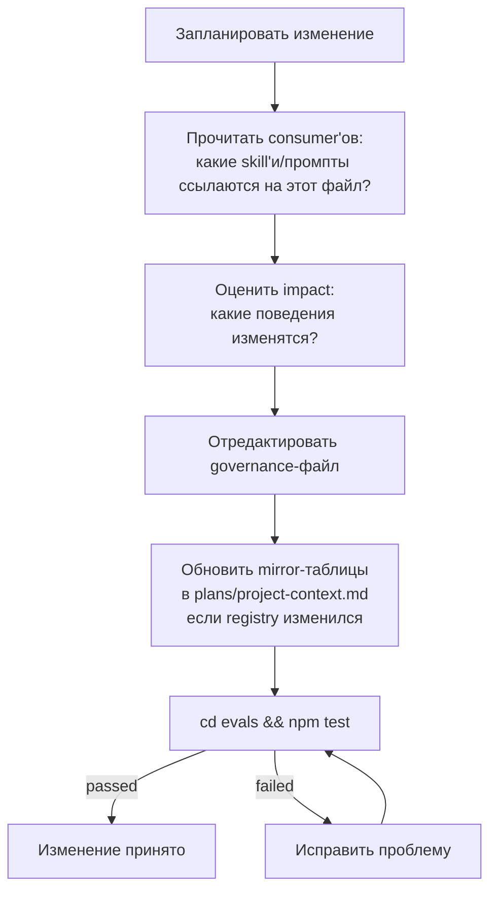

# Глава 10 — Governance

## Зачем эта глава

Понять, **какие governance-файлы регулируют пайплайн** в slim-модели и как менять их безопасно, не ломая систему. Governance тонкий: четыре файла, три policy-блока и никаких tool/model-grant поверхностей.

## Ключевые понятия

- **Governance** — четыре конфиг-файла в `governance/`, задающие политику пайплайна, реестр ролей, canonical-source matrix и rename allowlist.
- **Три policy-блока** — выжившая runtime-политика: `review_pipeline_by_tier`, `semantic_risk_policy`, `verdict_routing`.
- **Делегировано нативному Copilot** — доступ к инструментам, выбор модели, subagent governance. Legacy-файл model-selection routing, файл tool-access grants и файл subagent grants retired и больше не в `governance/`.
- **«Canonical source бьёт prose»** — когда tutorial, промпт агента и governance-файл расходятся, выигрывает governance-файл (или его названный canonical source). Набор eval-проверок на contract-drift утверждает выравнивание.

## Governance-файлы (тонкая четвёрка)

| Файл | Назначение |
| --- | --- |
| `runtime-policy.json` | Три выживших policy-блока: tier-gated verify/review-глубина, semantic-risk-политика, verdict routing плюс confidence-пороги |
| `project-context-registry.json` | Authoritative реестр ролей (восемь ролей исполнителей + три inline verify-роли) и agent role matrix (schema outputs, tool profiles, delegation sources) |
| `canonical-source-matrix.json` | Canonical-source matrix: какой файл authoritative для какого concern'а |
| `rename-allowlist.json` | Разрешённые переименования файлов (anti-drift protection) |

Retired (больше не в `governance/`): файл model-selection routing, файл tool-access grants и файл subagent grants. Их concern'ы — model selection, tool access, subagent governance — делегированы нативному Copilot. Slim-каталог `governance/` содержит ровно четыре файла выше.

## runtime-policy.json — три выживших блока

Самый важный governance-файл. Skill'и `controlflow-verify` и `controlflow-review` читают его как **authoritative source** для tier-gated глубины пайплайна и семантики verdict'ов. Slim-модель убрала retired-блоки (approval lists, per-tier iteration caps, retry budgets, stagnation detection, plan-review trigger conditions, final-review gate, memory hygiene) — retry budgets, wave execution, compaction, stagnation detection и max-iterations-ручки делегированы нативному Copilot runtime. Memory hygiene живёт в `skills/patterns/repo-memory-hygiene.md` и `evals/validate.mjs` Pass 7, не в `runtime-policy.json`.

### Блок 1 — `review_pipeline_by_tier`

Какие verify-фазы запускаются для каждого тира (плюс `code_review: true` на всех тирах):

```text
TRIVIAL: { plan_auditor: false, assumption_verifier: false, executability_verifier: false, code_review: true }
SMALL:   { plan_auditor: true,  assumption_verifier: false, executability_verifier: false, code_review: true }
MEDIUM:  { plan_auditor: true,  assumption_verifier: true,  executability_verifier: false, code_review: true }
LARGE:   { plan_auditor: true,  assumption_verifier: true,  executability_verifier: true,  code_review: true }
```

`plan_auditor` — verify-фаза 1 (structural audit), `assumption_verifier` — фаза 2 (mirage detection), `executability_verifier` — фаза 3 (executability cold-start). TRIVIAL пропускает все три, но всё равно запускает нативный Copilot code review для изменения.

### Блок 2 — `semantic_risk_policy`

Семь обязательных категорий, которые каждый non-TRIVIAL план должен включить ровно один раз: `data_volume`, `performance`, `concurrency`, `access_control`, `migration_rollback`, `dependency`, `operability`. Если категория не применима, ставьте `not_applicable` с обоснованием — никогда не пропускайте строку. Override-правило: любая неразрешённая `HIGH`-impact applicable-запись форсит `LARGE` (все три verify-фазы) независимо от количества файлов.

Allowed values pinned'ы политикой: `applicability_values` (`applicable`, `not_applicable`, `uncertain`), `impact_values` (`HIGH`, `MEDIUM`, `LOW`, `UNKNOWN`), `disposition_values` (`resolved`, `open_question`, `research_phase_added`, `not_applicable`).

### Блок 3 — `verdict_routing`

Verdict'ы, эмиттируемые `controlflow-verify`, и что каждый значит:

- `APPROVED` — все проверки пройдены, Phase 1 actionable, критерии измеримы. Продолжать к имплементации.
- `NEEDS_REVISION` — ambiguous Phase 1, нет rollback на destructive change, непроверенные пути или vague критерии. Перечислить каждый finding с точной ссылкой на секцию; повторный аудит после исправления.
- `REJECTED` — структурный изъян; scope не deliverable как написано. Объяснить blockers; запросить направление у пользователя; не начинать кодинг.

Confidence-пороги:
- `ready_for_execution_min`: 0.9 (ниже план не `READY_FOR_EXECUTION`)
- `uncertain_count_cap`: 0.85
- `high_impact_open_question_cap`: 0.7

## project-context-registry.json — реестр ролей

**Authoritative** source для taxonomy ролей. Enum `executor_agent` в `schemas/planner.plan.schema.json` и mirror-таблицы в `plans/project-context.md` валидируются против этого registry row-for-row drift-проверкой Pass 14 (`validateProjectContextRegistryMirror`). Не правьте mirror-таблицы независимо — сначала обновите registry, затем mirror.

Он определяет:
- Восемь ролей исполнителей (`CodeMapper-subagent`, `Researcher-subagent`, `CoreImplementer-subagent`, `UIImplementer-subagent`, `PlatformEngineer-subagent`, `TechnicalWriter-subagent`, `BrowserTester-subagent`, `CodeReviewer-subagent`), доступных для назначения `executor_agent`.
- Три inline verify-роли (`PlanAuditor-subagent`, `AssumptionVerifier-subagent`, `ExecutabilityVerifier-subagent`), выполняемые `controlflow-verify` — строго read-only; не должны появляться как `executor_agent`.
- Agent role matrix (schema output, tools profile, delegation source) для каждой роли.

Колонка `Model Routing Role` в registry — это **концептуальный capability tier**, который Copilot Auto model picker target'ит, когда Planner описывает роль. В slim-модели нет поверхности model-selection routing.

## canonical-source-matrix.json

Маппит каждый concern к его authoritative файлу, так что когда два файла расходятся, canonical source выигрывает. Ключевые строки:

| Concern | Authoritative файл |
| --- | --- |
| Executor roster | `governance/project-context-registry.json` |
| Review pipeline roster | `governance/project-context-registry.json` |
| Agent role matrix | `governance/project-context-registry.json` |
| Complexity tiers | `plans/project-context.md` |
| Semantic-risk taxonomy | `docs/agent-engineering/RISK-TAXONOMY.md` |
| Runtime policy | `governance/runtime-policy.json` |
| Shared evidence discipline | `docs/agent-engineering/PROMPT-BEHAVIOR-CONTRACT.md` |

## rename-allowlist.json

Разрешённые переименования файлов. Предотвращает случайный drift: если изменение пытается переименовать файл не из allowlist'а, drift-проверка падает.

Типичная структура:

```json
[{"from": "old-name.md", "to": "new-name.md", "reason": "..."}]
```

После добавления записи запустите `cd evals && npm test`, чтобы убедиться, что drift-проверка принимает новую allowlist-запись.

## Принцип: canonical source бьёт prose

Tutorial, промпт агента и governance-файл могут разойтись в границе тира или имени роли. Кто выигрывает?

Governance-файл (или его названный canonical source) выигрывает. Промпты агентов и tutorials — это **prose-дефолты**; registry и runtime policy **переопределяют** их. Набор eval-проверок на contract-drift (см. главу 14) утверждает, что выравнивание держится across files.

**Почему это важно:** изменение поведения не требует правки каждого промпта агента. Вы правите `governance/runtime-policy.json` или `governance/project-context-registry.json`, и изменение распространяется на каждого consumer'а автоматически — ценой того, что каждая file-ссылка верифицируется eval-харнессом.

## Безопасный flow governance-изменений



## Чего больше нет в Governance

| Retired-поверхность | Куда ушла |
| --- | --- |
| Model-selection routing | Выбор модели делегирован нативному Copilot (Auto model picker) |
| Tool-access grants | Доступ к инструментам делегирован нативному Copilot |
| Subagent grants | Subagent governance делегирован нативному Copilot |
| Approval-action list | Human approval — это stopping-правила пайплайна (см. главу 05); отдельного governance-списка нет |
| Retry budgets / iteration caps / stagnation detection | Retry routing, parallelism и iteration caps делегированы нативному Copilot |
| Memory-hygiene thresholds | Живут в `evals/validate.mjs` Pass 7 плюс `skills/patterns/repo-memory-hygiene.md` |

## Таблица расположения знаний

| Вопрос | Где искать |
| --- | --- |
| Какие verify-фазы запускаются для MEDIUM? | `governance/runtime-policy.json → review_pipeline_by_tier` |
| Какие семь категорий semantic-risk? | `governance/runtime-policy.json → semantic_risk_policy.categories` |
| Что значит verdict APPROVED? | `governance/runtime-policy.json → verdict_routing.verdicts.APPROVED` |
| Какой confidence-порог для READY_FOR_EXECUTION? | `governance/runtime-policy.json → verdict_routing.confidence_thresholds.ready_for_execution_min` |
| Какие роли могут быть `executor_agent`? | `governance/project-context-registry.json` (восемь ролей исполнителей) |
| Какие роли **не** должны быть `executor_agent`? | `governance/project-context-registry.json` (три inline verify-роли) |
| Какой файл canonical для определения тиров? | `governance/canonical-source-matrix.json` → `plans/project-context.md` |
| Можно ли переименовать файл? | `governance/rename-allowlist.json` |
| Какую модель должна использовать роль? | Нативный Copilot (Auto model picker). Governance-файла для этого нет. |
| Какие инструменты может использовать агент? | Frontmatter `tools:` в файле агента; делегировано нативному Copilot. Governance-файла нет. |

## Дополнительные governance-документы

Authoritative policy-документы в `docs/agent-engineering/`:

| Документ | Содержание |
| --- | --- |
| `NATIVE-DELEGATION-BOUNDARY.md` | Каноническая native-vs-ControlFlow delegation boundary (таблица + audit-чеклист) |
| `RISK-TAXONOMY.md` | Семь категорий semantic-risk |
| `CLARIFICATION-POLICY.md` | Когда спрашивать пользователя vs записывать bounded assumption |
| `SCORING-SPEC.md` | Количественная формула scoring |
| `MEMORY-ARCHITECTURE.md` | Трёхслойная memory-модель |
| `PROMPT-BEHAVIOR-CONTRACT.md` | Поведенческие инварианты across skills и ролей |

## Типичные заблуждения

- **Правка `runtime-policy.json` без запуска eval'ов.** Contract-drift-проверка может сломаться.
- **Поиск файла model-selection routing или tool-access grants в `governance/`.** Оба retired — model selection и tool access — задача нативного Copilot.
- **Ручная правка mirror-таблиц в `plans/project-context.md` без обновления `governance/project-context-registry.json` первым.** Registry — single source of truth; mirror валидируется против него.
- **Трактовка `governance/` как внутренних файлов агентов.** Это публичные контракты, checked into репо.
- **Попытка переопределить governance промптом агента.** Registry и runtime policy выигрывают.
- **Ожидание memory-hygiene-блока в `runtime-policy.json`.** Его там нет — memory hygiene живёт в `skills/patterns/repo-memory-hygiene.md` и `evals/validate.mjs` Pass 7.

## Упражнения

1. **(новичок)** Откройте `governance/runtime-policy.json`. Найдите `review_pipeline_by_tier`. Какие verify-фазы активны для `MEDIUM`?
2. **(новичок)** Откройте `governance/project-context-registry.json`. Перечислите восемь ролей исполнителей и три inline verify-роли. Подтвердите, что три verify-роли помечены read-only.
3. **(средний)** Вы хотите добавить новую категорию semantic-risk. Какие файлы должны измениться и в каком порядке, чтобы contract-drift eval остался зелёным?
4. **(средний)** В `runtime-policy.json → review_pipeline_by_tier` у TRIVIAL-пайплайна все три verify-фазы `false`, но `code_review: true`. Значит ли это, что code review запускается для TRIVIAL? Объясните, где фактически происходит code review.
5. **(продвинутый)** Назовите каждый файл, который должен ссылаться на `governance/runtime-policy.json` или валидироваться против него. Проверьте ответ против contract-drift eval-сценариев в `evals/`.

## Контрольные вопросы

1. Назовите четыре governance-файла в slim-модели.
2. Назовите три выживших policy-блока в `runtime-policy.json`.
3. Какой файл — authoritative source для taxonomy ролей и какой mirror валидируется против него?
4. Почему поверхности model-selection, tool-access и subagent-governance retired и куда ушли их concern'ы?
5. Что значит «canonical source бьёт prose» и какая eval-проверка это enforced?

## См. также

- [Глава 05 — Пайплайн plan → verify → review](05-orchestration.md)
- [Глава 07 — Ревью-пайплайн](07-review-pipeline.md)
- [Глава 08 — Пайплайн исполнения](08-execution-pipeline.md)
- [Глава 14 — Eval-харнесс](14-evals.md)
- [governance/](../../governance/)
- [docs/agent-engineering/](../agent-engineering/)