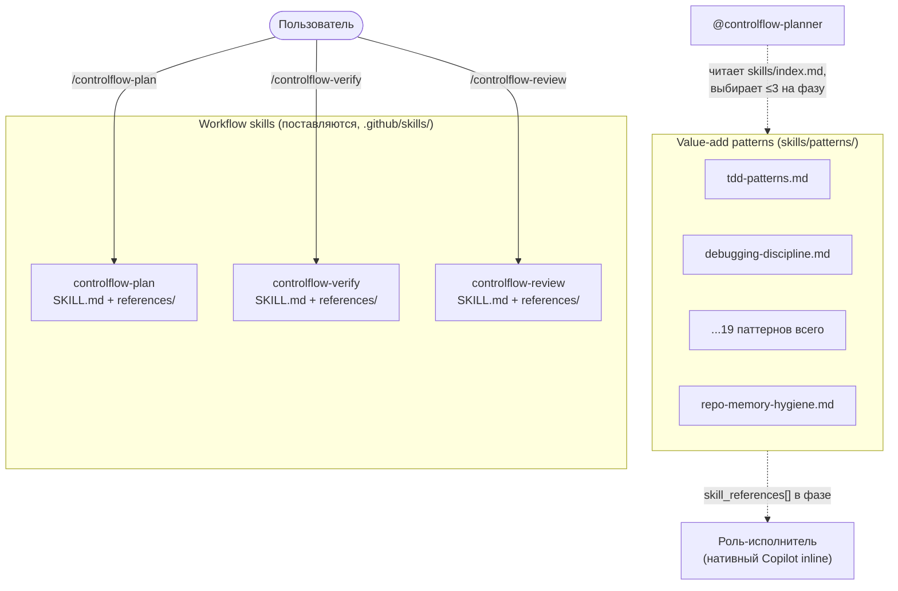
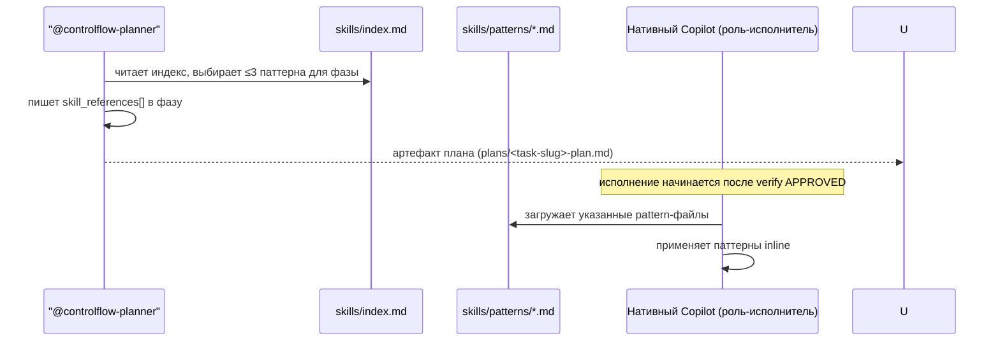

# Глава 11 — Skills

## Зачем эта глава

В slim-модели у ControlFlow **две skill-поверхности**, и их легко перепутать. Эта глава объясняет, что такое каждая, где она живёт, кто её загружает и как Planner инжектит value-add паттерны в фазы плана. После этой главы вы сможете указать на любой `SKILL.md` или `skills/patterns/*.md` файл и сказать, к какой поверхности он относится и как вызывается.

Главное переосмысление для читателей legacy-туториала: **19 value-add паттернов больше не привязаны статически к retired специализированным агентам**. Они Planner-injected, не более трёх на фазу, через `skill_references`. Переиспользуемая дисциплина, которую воплощали retired 13 специализированных агентов, survives в `skills/patterns/`; сами персоны ушли (см. `docs/agent-engineering/NATIVE-DELEGATION-BOUNDARY.md §5` для mapping'а retired-persona → patterns).

## Ключевые понятия

- **Workflow skill** — один из трёх поставляемых ControlFlow skill'ов в `.github/skills/controlflow-{plan,verify,review}/`. Каждый — это директория с `SKILL.md` плюс деревом `references/`, загружаемая нативной skills-библиотекой Copilot, когда пользователь вызывает `/controlflow-plan`, `/controlflow-verify` или `/controlflow-review`.
- **Value-add pattern** — переиспользуемый Markdown-файл дисциплины в `skills/patterns/`. Не workflow skill, не исполняемый код. Даёт домен-специфичное руководство (тестирование, дебаггинг, безопасность, memory hygiene и т.д.).
- **Pattern index** — `skills/index.md`, реестр, из которого `@controlflow-planner` выбирает ≤3 паттернов на фазу плана.
- **Planner-injected** — режим привязки для каждого паттерна в slim-модели. `@controlflow-planner` выбирает релевантные паттерны во время планирования и записывает их в массив `skill_references[]` фазы; роль-исполнитель (концептуальная role-метка, исполняемая inline нативным Copilot) загружает указанные pattern-файлы до начала работы.
- **Не библиотека кода** — обе поверхности Markdown. Они несут руководство и дисциплину, не runtime-код.
- **Концептуальная роль, не поставляемый агент** — колонка «Applicable Agents» в `skills/index.md` перечисляет preserved 8 имён ролей исполнителей + 3 inline verify role-имени. Это routing-подсказки, какая концептуальная роль вероятно потребляет паттерн при инжекции; это не поставляемые файлы агентов.

## Две skill-поверхности



| Поверхность | Расположение | Кол-во | Кто загружает | Как |
|-------------|--------------|--------|---------------|-----|
| Workflow skills | `.github/skills/controlflow-{plan,verify,review}/` | 3 | Нативная skills-библиотека Copilot | Пользователь вызывает slash-команду |
| Value-add patterns | `skills/patterns/` | 19 | `@controlflow-planner` выбирает; роль-исполнитель (нативный Copilot) загружает | Planner-injected через `skill_references[]` (≤3 на фазу) |

Workflow skills — это пайплайн (см. главу 05). Value-add patterns — переиспользуемая дисциплина, которую Planner инжектит в фазы плана. Поверхности не пересекаются: workflow skill — поставляемая ControlFlow поверхность; pattern — Planner-injected guidance-файл.

## Workflow Skills (три)

Каждый workflow skill — это директория под `.github/skills/`, содержащая `SKILL.md` (skill-промпт, который Copilot загружает при вызове) плюс дерево `references/` (lazily-loaded reference-документы, которые skill читает, когда нужен формат-деталь).

| Skill | Путь | Что делает |
|-------|------|------------|
| `controlflow-plan` | `.github/skills/controlflow-plan/SKILL.md` | Производит schema-anchored артефакт плана в `plans/`. Single-sources формат из `schemas/planner.plan.schema.json` и `plans/templates/plan-document-template.md`. Запускается `@controlflow-planner`. |
| `controlflow-verify` | `.github/skills/controlflow-verify/SKILL.md` | Inline адверсариальная pre-execution верификация (ноль сабагентов). Tier-gated фазы: structural audit, mirage detection, executability cold-start. Эмиттит `APPROVED` / `NEEDS_REVISION` / `REJECTED`. |
| `controlflow-review` | `.github/skills/controlflow-review/SKILL.md` | Evidence-backed ревью, слой поверх нативного Copilot code review. Добавляет сравнение plan-vs-implementation на scope drift и проактивный поиск уязвимостей/ошибок. |

Эти три skill'а — вся поставляемая ControlFlow workflow-поверхность (плюс агент `@controlflow-planner` и routing stub `.github/copilot-instructions.md` — см. главу 02). Они вызываются пользователем, не Planner'ом.

## Value-Add Patterns (девятнадцать)

Value-add patterns живут в `skills/patterns/` и зарегистрированы в `skills/index.md`. Planner читает индекс во время планирования (Step 8 workflow'а в главе 06) и выбирает ≤3 паттернов на фазу по домен-ключевым словам. Выбор записывается в массив `skill_references[]` фазы; роль-исполнитель (нативный Copilot inline) читает указанные pattern-файлы перед исполнением фазы.

### Domain mapping (authoritative в `skills/index.md`)

Полная таблица domain mapping — в `skills/index.md`, и это единственный источник истины. Сжатый вид:

| Домен | Файл | Вероятные потребители при инжекции (концептуальные роли) |
|-------|------|----------------------------------------------------------|
| Testing | `skills/patterns/tdd-patterns.md` | CoreImplementer-subagent, UIImplementer-subagent, CodeReviewer-subagent |
| Spec-Driven Development | `skills/patterns/spec-driven-development.md` | CoreImplementer-subagent, UIImplementer-subagent |
| Debugging Discipline | `skills/patterns/debugging-discipline.md` | CoreImplementer-subagent, UIImplementer-subagent, PlatformEngineer-subagent, BrowserTester-subagent |
| Code Simplification | `skills/patterns/code-simplification.md` | CoreImplementer-subagent, UIImplementer-subagent, CodeReviewer-subagent |
| Error Handling | `skills/patterns/error-handling-patterns.md` | CoreImplementer-subagent, UIImplementer-subagent, PlatformEngineer-subagent |
| Security | `skills/patterns/security-patterns.md` | CoreImplementer-subagent, UIImplementer-subagent, CodeReviewer-subagent, PlanAuditor-subagent |
| Performance | `skills/patterns/performance-patterns.md` | CoreImplementer-subagent, UIImplementer-subagent, CodeReviewer-subagent, PlanAuditor-subagent |
| Completeness | `skills/patterns/completeness-traceability.md` | controlflow-planner, PlanAuditor-subagent, CodeReviewer-subagent |
| Integration | `skills/patterns/integration-validator.md` | controlflow-planner, PlanAuditor-subagent, CoreImplementer-subagent |
| Idea-to-Prompt | `skills/patterns/idea-to-prompt.md` | controlflow-planner |
| LLM Behavior | `skills/patterns/llm-behavior-guidelines.md` | CoreImplementer-subagent, UIImplementer-subagent, CodeReviewer-subagent, controlflow-planner |
| PreFlect | `skills/patterns/preflect-core.md` | controlflow-planner (все концептуальные роли) |
| Reflection Loop | `skills/patterns/reflection-loop.md` | controlflow-planner, CoreImplementer-subagent, UIImplementer-subagent, PlatformEngineer-subagent |
| Budget Tracking | `skills/patterns/budget-tracking.md` | controlflow-planner, CoreImplementer-subagent, UIImplementer-subagent, PlatformEngineer-subagent |
| Memory Hygiene | `skills/patterns/repo-memory-hygiene.md` | controlflow-planner, CodeReviewer-subagent, PlanAuditor-subagent |
| Memory Promotion | `skills/patterns/memory-promotion-candidates.md` | controlflow-planner |
| Security Review Discipline | `skills/patterns/security-review-discipline.md` | CodeReviewer-subagent |
| Source Grounding | `skills/patterns/source-grounding.md` | Researcher-subagent; controlflow-planner (consider) |
| Decision Challenge | `skills/patterns/decision-challenge.md` | PlanAuditor-subagent, CodeReviewer-subagent |

> Колонка «Applicable Agents» — это **routing-подсказка, не статическая привязка**. В slim-модели ни одна поставляемая ControlFlow поверхность статически не цитирует pattern-файл; каждый паттерн PLANNER-INJECTED. Перечисленные роли указывают вероятного потребителя при инжекции — концептуальную роль, исполняющую фазу, — а не поставляемых агентов, загружающих паттерн безусловно. См. binding-легенду вверху `skills/index.md`.

### Паттерны vs документация

| Паттерны | Документация |
|----------|--------------|
| Загружаются ролью-исполнителем во время исполнения | Читаются человеком заранее |
| Выбираются на фазу Planner'ом (≤3) | Всегда доступны |
| Содержат протестированную дисциплину (чек-листы, decision-правила) | Содержат политики и объяснения |
| Зарегистрированы в `skills/index.md` | Не зарегистрированы |

## Planner Discovery Protocol

Planner выбирает паттерны на **Step 8** своего planning-workflow (см. главу 06):

1. Прочитать `skills/index.md` после complexity gate.
2. Сматчить домен-ключевые слова задачи против колонки Domain.
3. Выбрать ≤3 наиболее релевантных паттернов по контексту задачи.
4. Включить пути выбранных pattern-файлов в массив `skill_references[]` каждой применимой фазы.

**Правило: ≤3 паттернов на фазу.** Больше паттернов увеличивают context-overhead и размывают фокус. Если фаза вроде требует больше, декомпозируйте её на две.

## Just-in-Time Loading



**Почему just in time?** Паттерны добавляют контекст в промпт исполнителя. Загрузка всех девятнадцати upfront тратит токены и создаёт шум. Грузите только то, что нужно текущей фазе.

## Что несут паттерны (дисциплина retired-персон)

13 специализированных `*.agent.md` файлов были retired в Phase 3. Их **персоны** не потеряны — value-add дисциплина, которую они воплощали, осталась в `skills/patterns/`. Mapping записан в `docs/agent-engineering/NATIVE-DELEGATION-BOUNDARY.md §5`; сжатый вид:

| Retired персона | Value-add patterns, surviving в `skills/patterns/` |
|-----------------|----------------------------------------------------|
| BrowserTester-subagent | `tdd-patterns`, `debugging-discipline`, `error-handling-patterns` |
| UIImplementer-subagent | `tdd-patterns`, `code-simplification`, `error-handling-patterns` |
| PlatformEngineer-subagent | `error-handling-patterns`, `debugging-discipline`, `integration-validator` |
| Researcher-subagent | `source-grounding`, `completeness-traceability` |
| CodeMapper-subagent | `completeness-traceability`, `code-simplification` |
| TechnicalWriter-subagent | `completeness-traceability`, `llm-behavior-guidelines` |
| CodeReviewer-subagent | `security-review-discipline`, `decision-challenge`, `llm-behavior-guidelines` |

Если вы хотите вернуть специализированную персону, воссоздайте её как **native Copilot custom agent** под `.github/agents/` и пусть `@controlflow-planner` назначает её как `executor_agent` фазы. Pattern-файлы несут переиспользуемую дисциплину; новый agent-файл несёт персону. Полный recipe — в `NATIVE-DELEGATION-BOUNDARY.md §5`.

Три inline verify роли (`PlanAuditor-subagent`, `AssumptionVerifier-subagent`, `ExecutabilityVerifier-subagent`) **не** воссоздаются как агенты — это inline-фазы skill'а `controlflow-verify`, и в этом состоит non-native value-add.

## Несколько паттернов подробно

### preflect-core

Pre-action gate: классифицирует предстоящее действие в один из 4 risk-классов (high-risk-destructive, scope-drift, assumption, dependency) и эмиттит `GO` / `PAUSE` / `ABORT`. Planner-injected, когда фаза трогает деструктивные или необратимые операции.

### llm-behavior-guidelines

Мета-паттерн для предотвращения системных agent anti-patterns: scope drift prevention, weak success criteria detection, over-abstraction detection, silent assumption detection. Вероятно потребляется CoreImplementer, UIImplementer, CodeReviewer и Planner при инжекции.

### tdd-patterns

Дисциплина тестирования: пишите тесты до имплементации, тестируйте контракт, а не имплементацию, различайте unit / integration / e2e уровни. Вероятно потребляется CoreImplementer и UIImplementer при инжекции.

### completeness-traceability

Каждый публичный интерфейс должен иметь документ; каждый документ — кодовую цитату; диаграммы должны быть Mermaid; parity-проверка при изменении кода. Вероятно потребляется Planner, PlanAuditor и CodeReviewer при инжекции.

### repo-memory-hygiene

Обязателен перед любой записью в `/memories/repo/` или обновлением `NOTES.md`. Четыре чек-листа: (A) дедуп перед записью новой записи; (B) прунинг для вытеснения устаревших записей; (C) phase-boundary promotion (классификация → scope-проверка → проверка near-duplicate → верификация обязательных полей); (D) периодический read-only аудит. См. главу 12.

### idea-to-prompt

Для Idea Interview Planner'а: преобразует расплывчатые идеи пользователя в конкретные требования, задаёт clarifying-вопросы по одному, мапит на категории `risk_review`, не пропускает semantic risk taxonomy. См. главу 06.

## `skill_references` в схеме

Каждая фаза в `schemas/planner.plan.schema.json` имеет поле `skill_references[]`:

```json
"skill_references": [
  "skills/patterns/tdd-patterns.md",
  "skills/patterns/llm-behavior-guidelines.md"
]
```

Значение = путь к pattern-файлу. Роль-исполнитель (нативный Copilot inline) читает эти файлы перед исполнением фазы. Массив ограничен ≤3 элементами на фазу.

## Добавление нового паттерна

1. Создать `skills/patterns/<name>.md`.
2. Добавить запись в таблицу Domain Mapping в `skills/index.md` с: домен, файл, применимые концептуальные роли (routing-подсказка), ключевые слова.
3. Запустить `cd evals && npm test` — skill-discoverability suite валидирует, что каждый `skills/patterns/` файл зарегистрирован в индексе и каждая запись индекса разрешается в реальный файл.

## Типичные ошибки

- **Путать две skill-поверхности.** Три workflow skill'а в `.github/skills/` — это пайплайн; девятнадцать паттернов в `skills/patterns/` — Planner-injected дисциплина. Разное расположение, разный загрузчик, разное количество.
- **Трактовать колонку «Applicable Agents» как статическую привязку.** Это routing-подсказка. Каждый паттерн PLANNER-INJECTED в slim-модели; ни одна поставляемая поверхность статически не цитирует паттерн.
- **Трактовать паттерны как runtime-код.** Паттерны — Markdown, они дают руководство, не исполнение.
- **Грузить все паттерны заранее.** Только just-in-time — иначе токены тратятся впустую. Planner выбирает ≤3 на фазу.
- **Выбирать > 3 паттернов на одну фазу.** Если фаза требует больше, декомпозируйте.
- **Забыть обновить `skills/index.md` при добавлении паттерна.** Skill-discoverability eval упадёт.
- **Путать `skill_references[]` со ссылками на документацию.** Они указывают на загружаемые паттерны, а не на читаемые ссылки.

## Упражнения

1. **(новичок)** Откройте `skills/index.md` и посчитайте паттерны, зарегистрированные в таблице Domain Mapping. Подтвердите, что количество совпадает с файлами в `skills/patterns/`.
2. **(новичок)** Какие три workflow skill'а живут в `.github/skills/`? Назовите slash-команду для каждого.
3. **(средний)** Фаза планирует: написать backend, написать тесты и обновить доку. Какие ≤3 паттерна вы инжектнете через `skill_references[]`?
4. **(средний)** Откройте `docs/agent-engineering/NATIVE-DELEGATION-BOUNDARY.md §5`. Какие паттерны survive от retired персоны BrowserTester-subagent?
5. **(продвинутый)** Опишите, как добавление нового паттерна влияет на eval-харнесс. Какой тест-файл защищает index↔file bidirectional-проверку?

## Контрольные вопросы

1. Назовите две skill-поверхности в slim-модели и где каждая живёт.
2. Сколько паттернов может быть в `skill_references[]` на фазу и кто их выбирает?
3. В чём разница между workflow skill и value-add pattern?
4. Где поддерживается authoritative pattern domain mapping?
5. Куда смотреть, чтобы найти, какие паттерны воплощала retired специализированная персона?

## См. также

- [Глава 02 — Архитектурный обзор](02-architecture-overview.md)
- [Глава 06 — Планирование](06-planning.md)
- [Глава 07 — Ревью-пайплайн](07-review-pipeline.md)
- [skills/index.md](../../skills/index.md)
- [skills/patterns/](../../skills/patterns/)
- [docs/agent-engineering/NATIVE-DELEGATION-BOUNDARY.md](../agent-engineering/NATIVE-DELEGATION-BOUNDARY.md)