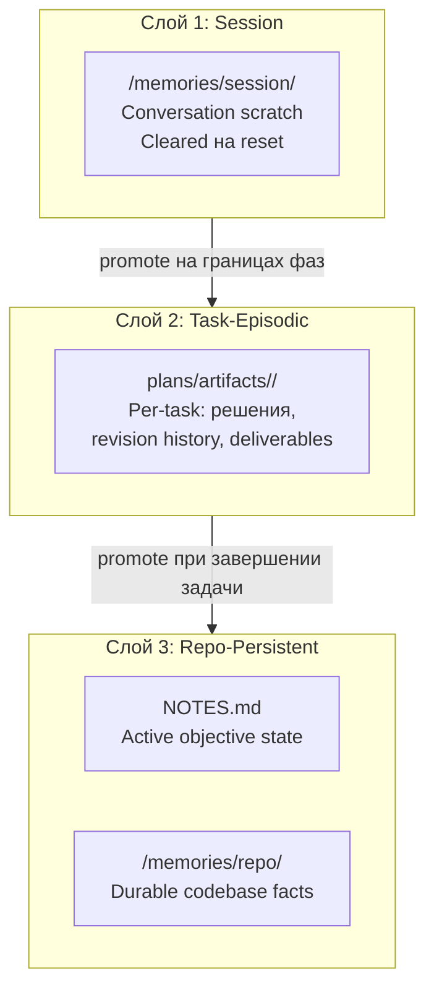

# Глава 12 — Архитектура памяти

## Зачем эта глава

Понять, **где живёт состояние** в пайплайне plan → verify → review и почему трёхслойная модель памяти предотвращает потерю контекста при context resets. Модель памяти не изменена slim-рефакторингом; изменилось то, кто в неё пишет. В slim-модели нативный Copilot исполняет фазы inline (концептуальные роли-исполнители, которые назначает Planner), `@controlflow-planner` владеет артефактом плана, а пользователь re-invoke'ит Planner для replan'ов. Никакого агента Orchestrator, пишущего в `NOTES.md` на каждой границе фазы, нет — эта запись теперь ответственность пользователя (или нативного Copilot) на границах фаз.

## Ключевые понятия

- **Session memory** — scratch, ограниченный беседой; очищается после завершения разговора.
- **Task-episodic memory** — per-task история в `plans/artifacts/<task-slug>/`; переживает беседу.
- **Repo-persistent memory** — durable-факты в `NOTES.md` + `/memories/repo/`; переживает context resets.
- **Context compaction** — обрезка контекста при исчерпании бюджета; слои памяти позволяют восстановление.
- **Концептуальная роль, не поставляемый агент** — роли-исполнители, читающие и пишущие память, это preserved 8-имённая концептуальная taxonomy, исполняемая inline нативным Copilot (см. главу 03). В slim-модели нет файла агента Orchestrator.

## Трёхслойная модель памяти

Канонический spec — `docs/agent-engineering/MEMORY-ARCHITECTURE.md`. Каждая концептуальная роль, пишущая в память, следует одному трёхслойному контракту.

## Memory Content Taxonomy

Каждая запись в `/memories/repo/` должна классифицироваться в один из четырёх типов контента:

| Тип | Что хранить |
|-----|-------------|
| `user` | Персональные предпочтения и workflow, охватывающие всё окружение |
| `feedback` | Исторические корректировки: прошлые ошибки, ограничения, которые агент должен соблюдать |
| `project` | Ключевые архитектурные решения, структура и установленные project conventions |
| `reference` | Проверенные CLI-команды, значения конфигурации и инструкции по сборке |

**Save exclusions — никогда не писать в repo-persistent память:**
- Derivable code state (то, что можно перечитать из репо напрямую).
- Git history (commit messages, имена веток, merge records).
- Ephemeral task state (однотёрновые заметки, tool scratch, «итерация 3 прошла в 14:32»).

**Verify before recommending:** любое утверждение о названном файле или функции из памяти должно быть перепроверено по текущей кодовой базе перед тем, как на него опираться или сообщать его. Память — подсказка, не источник истины для конкретных мест в коде.

## Слой 1: Session Memory

**Расположение:** `/memories/session/`

**Назначение:** Scratch-пространство для текущей беседы. Хранит:
- Контекст текущей фазы.
- Промежуточные research-заметки.
- Открытые вопросы сессии.

**Правила:**
- Не создавать новые session-файлы без необходимости.
- Листать существующие файлы перед чтением — они не auto-загружаются в контекст.
- Очищаются при завершении беседы.
- Для длинных orchestration-прогонов используйте session-notes шаблон в `plans/templates/session-notes-template.md`. Он содержит пять секций: `Current State`, `Files and Functions`, `Errors & Corrections`, `Key Results`, `Worklog`.

**Кто использует:** Любая концептуальная роль во время своего прогона (исполняемая inline нативным Copilot).

## Слой 2: Task-Episodic Memory

**Расположение:** `plans/artifacts/<task-slug>/`

**Назначение:** История для одной конкретной задачи. Хранит:
- Revision history (почему план был пересмотрен?).
- Verified items across iterations.
- Phase completion reports.
- Промежуточные deliverables (дизайны, диаграммы, verify verdicts).

**Правила:**
- Создавать одну папку на задачу; slug = kebab-case заголовок задачи.
- Содержимое переживает беседу.
- Planner и нативный Copilot читают это в revision loops для regression tracking.

**Примеры файлов в папке задачи:**
- `verify-verdict.md` — компактный verdict, написанный `controlflow-verify`.
- `final_review.md` — опциональный финальный review-advisory от `controlflow-review`.
- `verified_items.md` — verified items из итерации 1.

## Слой 3: Repo-Persistent Memory

**Два расположения:**

### NOTES.md

**Назначение:** Только active-objective state. Содержит:
- Текущая активная цель и её фаза.
- Неразрешённые blockers и риски.
- Текущая граница фазы.

**Правила:**
- Обновлять на каждой границе фазы (пользователь или нативный Copilot во время исполнения; Planner не пишет mid-execution).
- Удалять устаревшие записи при superseding.
- Держаться в пределах 20-строчного бюджета (enforced через `evals/validate.mjs` Pass 7; style drift проверяется через `validateNotesMdStyle` в `evals/drift-checks.mjs`).
- Не использовать `NOTES.md` для task-specific истории — это в task-episodic памяти.

### /memories/repo/

**Назначение:** Durable codebase facts, переживающие context resets. Примеры:
- «Команда тестирования — `cd evals && npm test`.»
- «PlanAuditor исключает классификацию сбоев `transient`.»
- «Slim-модель поставляет один агент и три skill'а.»

**Правила:**
- Поддерживается только `create` — никаких inline-редактирований.
- Каждый факт должен быть коротким (1–2 предложения), с цитатами.
- Хранить только если: независимо actionable, вряд ли изменится, релевантно для будущих задач.

## Правила чтения и записи

| Событие | Чтение | Запись |
|---------|--------|--------|
| Context start | Session (если есть), `NOTES.md` | — |
| Plan written | `NOTES.md`, repo-persistent | `plans/<task-slug>-plan.md` (task-episodic) |
| Phase start | Task-episodic (релевантные файлы) | Session note; продвигать durable cross-plan факты в `/memories/repo/` через Checklist C в `skills/patterns/repo-memory-hygiene.md` |
| Phase end | — | Task-episodic (completion report, `NOTES.md`) |
| Task complete | — | `/memories/repo/` (durable факты) |
| Conversation end | — | Session files очищены |

Перед записью в `/memories/repo/` или обновлением `NOTES.md` на границе фазы загрузите и следуйте `skills/patterns/repo-memory-hygiene.md` (дедуп-чек-лист + прунинг-routine).

## Пример сценария

| Шаг | Кто | Слой памяти |
|-----|-----|-------------|
| 1 | Пользователь говорит «реализуй фичу X» | — |
| 2 | `@controlflow-planner` читает `NOTES.md` | Repo-persistent |
| 3 | Planner пишет `plans/feature-x-plan.md`; создаётся task-episodic dir | Task-episodic |
| 4 | `controlflow-verify` пишет `verify-verdict.md` | Task-episodic |
| 5 | Phase 1 исполняется (нативный Copilot inline); пишется completion report | Task-episodic |
| 6 | Context reset | Session очищен |
| 7 | Нативный Copilot читает `NOTES.md` и `plans/artifacts/feature-x/` | Оба слоя |
| 8 | Задача завершена; записать durable факт про API convention | `/memories/repo/` |

## Context Compaction Policy

Когда context-бюджет приближается к лимиту, нативный Copilot (исполняющий текущую фазу):
- **Сохраняет:** активная фаза, неразрешённые blockers, одобренные решения, safety-constraints.
- **Сбрасывает:** verbose промежуточный tool-output, уже суммированный.
- **Эмиттит:** компактную summary детерминированными буллетами перед продолжением.

Compaction-ladder (L1 inline truncation → L2 summary replacement → L3 chunk discard → L4 spill to disk под `.cache/tool-output/<task-slug>/` → L5 hard reset с сохранением continuity через `NOTES.md` и task-episodic artifact tree) описана в `docs/agent-engineering/MEMORY-ARCHITECTURE.md`.

Идея: session и task-episodic слои держат состояние, поэтому модель можно сбросить без потери истории задачи.

## Memory Pollution

Избыточные или шумные memory-записи — это **memory pollution**. Симптомы:
- `NOTES.md` обрастает устаревшими записями.
- `/memories/repo/` хранит факты, которые часто меняются.
- Session-файлы накапливают неиспользуемые заметки.

**Профилактика:**
- Прать устаревшие `NOTES.md` записи на каждой границе фаз.
- Хранить в `/memories/repo/` только факты, удовлетворяющие критериям «durable».
- Не создавать session-файлы без необходимости.

## Memory Use Discipline

Два поведенческих инварианта (enforced через `evals/tests/prompt-behavior-contract.test.mjs`):

1. **Verify before use** — любое утверждение о названном файле или функции, происходящее из памяти (session notes, `/memories/repo/` или `NOTES.md`), должно быть перепроверено по текущей кодовой базе перед тем, как на него опираться или сообщать его пользователю. Устаревшая память — подсказка, не источник истины для конкретных мест в коде.

2. **Ignore memory on request** — когда пользователь явно говорит «ignore memory» (или эквивалент: «don't use memory», «fresh context»), агент не должен обращаться к `/memories/repo/`, `NOTES.md` или session notes в этом turn-е. Override per-turn, не сохраняется.

См. `docs/agent-engineering/PROMPT-BEHAVIOR-CONTRACT.md → §7 Memory Use Discipline`.

## Task-Episodic Auto-Archive

`plans/artifacts/<task-slug>/` накапливается неограниченно, если явно не архивировать. Инструментарий:

- **Скрипт:** `evals/archive-completed-plans.mjs` — сканирует `plans/*.md`, обнаруживает закрытые планы (статус `DONE`, `SUPERSEDED`, `DEFERRED`), проверяет возраст ≥ 14 дней, затем перемещает план и его сопоставленную artifact-директорию в `plans/archive/<YYYY-MM>/`. Dry-run по умолчанию (`npm run archive:dry`); `--apply` mode для исполнения (`npm run archive:apply`).
- **Safety:** idempotent, без удалений, `READY_FOR_EXECUTION` планы никогда не eligible.

Для идентификации планов, готовых к архивации: `cd evals && npm run archive:dry`. Для исполнения: `npm run archive:apply`.

## Logical vs Physical Storage

| Логический слой | Физическое расположение |
|-----------------|-------------------------|
| Session memory | `/memories/session/` (VS Code / Copilot Chat) |
| Task-episodic | `plans/artifacts/<task-slug>/` (файловая система) |
| Repo-persistent | `NOTES.md` + `/memories/repo/` (файловая система + Copilot memory tool) |

## Типичные ошибки

- **Запись неклассифицированных или derivable фактов в `/memories/repo/`.** Сначала классифицируйте по content taxonomy; отбрасывайте derivable code state, git history и ephemeral task state перед продвижением.
- **Действие на основе устаревшей памяти без верификации.** Утверждения о названных файлах и функциях из памяти становятся некорректными после рефакторинга. Всегда перепроверяйте по текущей кодовой базе перед действием.
- **Создание session-файлов для всего.** Они должны быть минимальным scratch — не полным журналом задачи.
- **Забыть прочитать task-episodic память после reset.** Regression tracking и verified items — там.
- **Искать агента Orchestrator для обновления `NOTES.md`.** В slim-модели нет агента Orchestrator. Пользователь или нативный Copilot обновляет `NOTES.md` на границах фаз; Planner не пишет mid-execution.

## Упражнения

1. **(новичок)** Откройте `NOTES.md` — какая текущая active objective?
2. **(новичок)** Какой слой памяти хранит per-task revision history?
3. **(средний)** Фаза завершилась успешно. Что нужно записать в память и куда?
4. **(средний)** Context reset происходит на фазе 3 из 6. Какие данные есть у нативного Copilot для реконструкции состояния?
5. **(продвинутый)** Спроектируйте стратегию использования памяти для LARGE-tier 10-фазной задачи, требующей resumability после context reset.
6. **(средний)** Фаза только что завершилась. Исполнитель обнаружил новое API-соглашение. Пройдите через Checklist C (в `skills/patterns/repo-memory-hygiene.md`), чтобы решить, продвигать ли этот факт в `/memories/repo/`.
7. **(продвинутый)** Ваш `/memories/repo/` context-блок показывает шесть записей с немного разными описаниями одной и той же команды `cd evals && npm test`. Запустите Checklist D (периодический аудит) и составьте Audit Report для этой ситуации.

## Контрольные вопросы

1. Назовите 3 слоя памяти.
2. Что хранит `NOTES.md` и каков его строковый бюджет?
3. Что такое task-episodic deliverables?
4. Что такое memory pollution?
5. Кто обновляет `NOTES.md` на границах фаз в slim-модели?

## См. также

- [docs/agent-engineering/MEMORY-ARCHITECTURE.md](../agent-engineering/MEMORY-ARCHITECTURE.md)
- [Глава 05 — Пайплайн plan → verify → review](05-orchestration.md)
- [Глава 08 — Пайплайн исполнения](08-execution-pipeline.md)
- [Глава 11 — Skills](11-skills.md)
- [NOTES.md](../../NOTES.md)