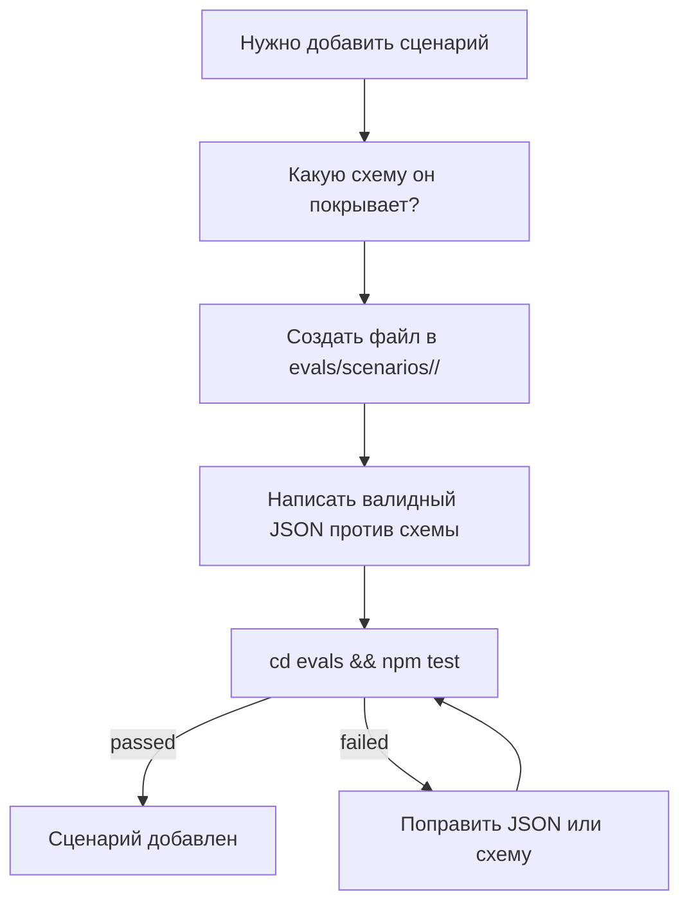

# Глава 14 — Eval-харнесс

## Зачем эта глава

Понять, **как тестируется репозиторий ControlFlow**: что проверяет `npm test`, как работают сценарии и как добавить новую проверку после изменения. Eval-харнесс — это оффлайн contract-drift гейт, единственное, что Copilot не предоставляет нативно и ControlFlow оставляет. Он утверждает, что формат плана, taxonomy ролей, governance-конфиг и tutorial parity остаются согласованы между файлами.

В slim-модели харнесс по-прежнему работает полностью оффлайн, без live-агентов, без сети. Изменилось то, что он утверждает: slim-поверхность (один агент + три skill'а), `CLAUDE.md` ↔ plan-contract drift, `plans/project-context.md` ↔ `governance/project-context-registry.json` mirror, skill-discoverability девятнадцати паттернов и plugin-manifest-parity между хост-плагинами Claude Code / Codex / Cursor.

## Ключевые концепции

- **Eval-харнесс** — набор оффлайн-проверок в `evals/`, не вызывающих live-агентов.
- **Сценарий** — JSON-файл в `evals/scenarios/`, парящий вход с ожидаемым выходом.
- **Drift check** — тест, verifying, что поставляемые поверхности не рассинхронизировались с контрактами и governance-файлами.
- **Contract drift** — plan-contract anchors в `CLAUDE.md` (Status, Agent, Schema Version, Complexity Tier, Confidence, Abstain, executor enum) остаются согласованы с `schemas/planner.plan.schema.json`, `governance/project-context-registry.json` и `governance/runtime-policy.json`.
- **Tutorial parity** — Pass 7c валидирует, что множества H2-заголовков EN и RU глав совпадают через allowlist в `evals/scenarios/tutorial-parity/allowlist.json`.
- **Skill discoverability** — каждый `skills/patterns/` файл зарегистрирован в `skills/index.md` и каждая запись индекса разрешается в реальный файл.

## Что такое eval-харнесс

**Node.js test runner** в `evals/`. Полностью оффлайн.

**Ключевые свойства:**
- **Без сети** — никаких live-агентов, никаких LLM-вызовов.
- **Только оффлайн** — работает в CI без учётных данных.
- **Детерминированный** — одинаковый ввод всегда даёт одинаковый pass/fail.
- **Warm cache** — success-only fingerprint-кэш в `evals/.cache/validate-cache.json` short-circuit'ит повторный структурный прогон. Удалите кэш (`rm -rf evals/.cache`) перед тем, как доверять green-прогону после структурных правок.

## Структура `evals/`

```text
evals/
  package.json         — scripts: test, test:structural, test:behavior, health, archive:dry/apply
  validate.mjs         — главный структурный валидатор (Passes 1–17)
  drift-checks.mjs     — хелперы drift detection (экспортирует validateTutorialParity, validateNotesMdStyle, computeStructuralFingerprint, …)
  capability-matrix.mjs — tool-grant/agent-frontmatter/project-context reconciliation CLI
  archive-completed-plans.mjs — task-episodic auto-archive CLI
  report-health.mjs    — оффлайн operator health report CLI
  tests/               — файлы behavior-тестов (.test.mjs)
  scenarios/           — JSON scenario-фикстуры (вкл. tutorial-parity/allowlist.json, runtime-policy/, planner/, …)
```

## Три режима

| Команда | Что запускает | Скорость |
|---------|---------------|---------|
| `cd evals && npm test` | Полный suite — структурные passes `validate.mjs` плюс каждый `tests/*.test.mjs` харнесс | Медленнее |
| `npm run test:structural` | Только структурные passes `validate.mjs` (warm-cacheable) | Быстро |
| `npm run test:behavior` | `tests/prompt-behavior-contract.test.mjs` + `tests/drift-detection.test.mjs` | Быстро |

`npm run health` запускает оффлайн read-only operator-отчёт (git status по поверхностям, состояние `NOTES.md`, планы по статусу, latest session outcome). `npm run capability-matrix` реконсильтит tool grants, agent frontmatter и `plans/project-context.md`. `npm run archive:dry` / `archive:apply` управляют task-episodic архивацией.

## Что проверяет каждый pass

Текущий authoritative список passes, enforced `validate.mjs` (Pass 1 через Pass 17). Slim-релевантные passes перечислены ниже; passes, утверждавшие retired поверхности (model-routing, tool-grants, agent-grants), skip'ают gracefully и эмиттят «skipped (retired in Phase 3)».

### Pass 1: Schema Validity

Все `schemas/*.schema.json` компилируются под Ajv JSON Schema 2020-12 с `strict: false` и `allErrors: true`. Валидирует `governance/runtime-policy.json` против `schemas/runtime-policy.schema.json` и три фикстуры в `evals/scenarios/runtime-policy/`. Нет синтаксических ошибок.

### Pass 2: Scenario Integrity

Все `evals/scenarios/**/*.json` имеют обязательные identity-поля и указывают на реальные schema-контракты. Planner-сценарии должны assert'ить `risk_review_present: true` и `complexity_tier_present: true`. Planner terminal-status сценарии (`ABSTAIN` / `REPLAN_REQUIRED`) должны assert'ить `persisted_artifact: true`.

### Pass 3: Reference Integrity

Все backtick schema/doc references внутри root `*.agent.md` файлов разрешаются в существующие файлы. Значения `skill_references[]` указывают на файлы, существующие в `skills/patterns/`. F7: каждый Planner-сценарий assert'ит `complexity_tier_present` явно. F8: внутренние markdown-ссылки и backtick code-ссылки в `README.md` и `docs/agent-engineering/*.md` разрешаются в файлы под известными top-level директориями.

### Pass 3b: Required Project Artifacts

Verifies, что критические общие файлы существуют: `.github/copilot-instructions.md`, `.github/agents/controlflow-planner.agent.md`, `plans/project-context.md`, `docs/agent-engineering/PART-SPEC.md`, `docs/agent-engineering/CLARIFICATION-POLICY.md`, `governance/runtime-policy.json`, `governance/rename-allowlist.json`.

### Pass 3c / 3c.1 / 3d: Tool-Grant / Read-Only Denylist / Agent-Grant Consistency

Эти passes утверждали tool и agent frontmatter против `governance/tool-grants.json` и `governance/agent-grants.json` в legacy-модели. Оба governance-файла retired в Phase 3; passes skip'ают gracefully и эмиттят «skipped (retired in Phase 3)» для retired governance-файлов. Read-only edit-tool denylist всё ещё покрывает концептуальные verify/discovery/review роли через `read-only-agent-tool-denylist.json` фикстуру.

### Pass 3e / 3f: Cursor Rule / Cursor Plugin Validation

Валидирует `.cursor/rules/**/*.mdc` frontmatter bounds, activation metadata, line budget и canonical references; валидирует `.cursor/skills/**/SKILL.md` и `.cursor/agents/*.md` записи против `evals/scenarios/cursor-plugin/` контрактов. Покрывают Cursor host-плагин.

### Pass 4: P.A.R.T Section Order

Каждый root `*.agent.md` сохраняет порядок `## Prompt` → `## Archive` → `## Resources` → `## Tools`. С 13 специализированными agent-файлами retired, только surviving root agent-файл в scope; pass сохранён как структурный guard на legacy P.A.R.T. convention (см. главу 04 для переосмысления P.A.R.T. как guidance, не mandatory template).

### Pass 4b: Clarification Triggers & Tool Routing Rules

Agent companion rules, валидирующие clarification routing и упоминания tool-routing policy. Запускается против surviving root agent-файлов.

### Pass 5: Skill Library Consistency

Валидирует структурную целостность `skills/` index mapping — каждый файл в `skills/patterns/` зарегистрирован в `skills/index.md` и каждая запись индекса разрешается в реальный файл. Защищён `evals/tests/skill-discoverability.test.mjs`.

### Pass 6: Synthetic Rename Negative-Path Checks

Структурные guard-проверки: stale `target_agent`, stale `expected.schema` и stale nested `agent` references корректно отвергаются rename-allowlist механизмом.

### Pass 7: Memory Architecture References

Обязательные memory docs/templates существуют; `NOTES.md` остаётся в пределах 20-строчного бюджета и проходит `validateNotesMdStyle` anti-pattern checks (no `iteration`/`verdict` leakage, no `phase-\d+-` fragments, no fenced code blocks, no more than 3 consecutive bullets под одним заголовком).

### Pass 7b: Memory Discipline Contracts

Runtime memory taxonomy, session-notes template секции и repo-memory hygiene checklist anchors присутствуют.

### Pass 7c: Tutorial Parity

Tutorial-parity проверка управляется `evals/scenarios/tutorial-parity/allowlist.json`. Когда `_status: "active"` и `_chapters_in_scope` перечисляет chapter basenames, `validateTutorialParity` извлекает множество level-2 заголовков из каждой in-scope EN/RU chapter-пары, применяет `heading_aliases` map (EN→RU) и эмиттит per-chapter-pair pass/fail. RU-only заголовок приемлем, если он равен alias'у соответствующего EN заголовка. Эта глава (`14-evals.md`) в scope; её 16 H2 заголовков — это allowlist keys.

### Pass 8: Drift Detection — Model Routing, Roster, and Contract Alignment

`governance/model-routing.json` retired в Phase 3; model-routing checks skip'ают gracefully. Roster↔enum bidirectional alignment всё ещё запускается: agent roster в `plans/project-context.md` и `executor_agent` enum в `schemas/planner.plan.schema.json` остаются sync в обоих направлениях (8 имён ролей исполнителей).

### Pass 9: Drift Detection — Agent Resources Schema Existence

Для каждой схемы, referenced из `Resources` секции surviving root agent'а, verifies, что schema-файл реально существует.

### Pass 10: Drift Detection — Cross-Plan File-Overlap

Обнаруживает случайное пересечение file-lists между активными планами в `plans/` парсингом backtick-путей в `Files:` буллетах.

### Pass 12: Governance Policy Assertions

Assert'ит инварианты на `governance/runtime-policy.json` и связанных governance-файлах — три surviving policy-блока (`review_pipeline_by_tier`, `semantic_risk_policy`, `verdict_routing`), tier coverage, verdict thresholds и semantic-risk override rule.

### Pass 13: Drift Detection — review_scope=final Bidirectional Coupling

Verifies, что `review_scope: "final"` ссылки в surviving agent-промптах и schema-полях coupled в обоих направлениях и ссылаются на те же поля.

### Pass 14: Canonical Source Matrix Heading

Ensures, что `plans/project-context.md` хранит Canonical Source Matrix заголовок.

### Pass 15: Tool-Label / Pattern-Budget / Doc-Count / Plugin-Parity

Запускает live-tree drift checks для registry tool-count labels, skill-pattern line budgets, allowlisted documentation totals (README, quickstart, glossary) и no-delta Codex generation parity.

### Pass 16: Selective Plugin-Core Portability

Валидирует `core-portability-matrix.json`: уникальные invariant IDs, allowed dispositions, evidence paths и declared semantic anchors без требования byte parity с core-прозой.

### Pass 17: CLAUDE.md ↔ Plan Contract Drift

Assert'ит, что plan-contract anchors в `CLAUDE.md` (Status, Agent, Schema Version, Complexity Tier, Confidence, Abstain, 8-имённый executor enum) остаются согласованы с `schemas/planner.plan.schema.json`, `governance/project-context-registry.json` и `governance/runtime-policy.json`. Защищён `evals/tests/controlflow-contract-drift.test.mjs`.

### Отдельные харнессы в `npm test`

| Харнесс | Что проверяет |
|---------|---------------|
| `tests/prompt-behavior-contract.test.mjs` | Поведенческие инварианты трёх workflow skills и shared policy |
| `tests/drift-detection.test.mjs` | Negative-path coverage для drift-check хелперов и runtime-policy schema enforcement |
| `tests/notes-md-drift.test.mjs` | `NOTES.md` style anti-pattern detection |
| `tests/archive-script.test.mjs` | Поведение task-episodic archive-скрипта против изолированных fixture-деревьев |
| `tests/fingerprint.test.mjs` | Structural fingerprint invalidation для nested scenario fixtures |
| `tests/report-health.test.mjs` | Operator health report хелперы и smoke generation |
| `tests/skill-discoverability.test.mjs` | Skill metadata discoverability и index↔file bidirectional resolution |
| `tests/capability-matrix.test.mjs` | Capability-matrix reconciliation tool grants, agent frontmatter и project context |
| `tests/plugin-manifest-parity.test.mjs` | Plugin manifest parity между хост-плагинами Claude Code / Codex / Cursor |
| `tests/controlflow-contract-drift.test.mjs` | `CLAUDE.md` ↔ plan-contract drift (Pass 17 assertions, как behavior-тест) |
| `tests/cursor-rules.test.mjs` | Cursor `.mdc` parser regressions |
| `tests/ponytail-adaptation.test.mjs` | Ponytail adaptation regressions |

## Сценарии

Сценарий — JSON-фикстура, описывающая input/output пару. Используется для двух целей:
1. **Schema validation** — verifies структуру против соответствующей схемы в `schemas/`.
2. **Regression testing** — verifies, что поведение не меняется неожиданно.

**Примеры типов сценариев:**

| Сценарий | Папка | Проверяется против |
|----------|-------|---------------------|
| Planner plan с фазами | `scenarios/planner/` | `planner.plan.schema.json` |
| PlanAuditor APPROVED verdict | `scenarios/plan-auditor/` | `plan-auditor.plan-audit.schema.json` |
| Runtime-policy fixture | `scenarios/runtime-policy/` | `runtime-policy.schema.json` |
| Tutorial-parity allowlist | `scenarios/tutorial-parity/` | (consumed by `validateTutorialParity`, не Ajv) |

Сценарии живут в `evals/scenarios/`; некоторые организованы в поддиректории (`runtime-policy/`, `planner/`, `plan-auditor/`, `assumption-verifier/`, `executability-verifier/`, `tutorial-parity/`, `cursor-rules/`, `cursor-plugin/`).

## Чтение вывода

Типичный результат `npm test` печатает каждый pass с OK-маркером, затем итог:

```text
Pass 1: Schema Validity — OK
Pass 2: Scenario Integrity — OK
Pass 3: Reference Integrity — OK
...
Pass 7c: Tutorial Parity — OK
Pass 17: CLAUDE.md ↔ Plan Contract Drift — OK
==================================================
CLAUDE.md contract drift: 44 checks | 44 passed | 0 failed
==================================================
All CLAUDE.md contract-drift checks passed ✅
```

Если проверка падает:

```text
FAIL Pass 8 Check #2 — Roster ↔ enum alignment
  plans/project-context.md: roster is [CodeMapper-subagent, ...]
  schemas/planner.plan.schema.json: enum is [CodeMapper-subagent, ...]
  Missing from enum: [NewRole-subagent]
```

Ошибка точно говорит, какой файл, какая проверка и в чём diff. Прочитайте упавший pass, исправьте drift, перезапустите.

Warm cache в `evals/.cache/validate-cache.json` может short-circuit'ить повторный green-прогон после структурной правки — удалите его (`rm -rf evals/.cache`) перед тем, как доверять green-прогону.

## Добавление нового сценария



1. Идентифицируйте, какую схему сценарий exercise'ит (или создайте новую схему в `schemas/`).
2. Создайте scenario-файл в соответствующей поддиректории `evals/scenarios/<name>/`.
3. Напишите валидный JSON против схемы (обязательные поля: identity-поля, которые ожидает харнесс, плюс `risk_review_present` / `complexity_tier_present` для Planner-сценариев).
4. Запустите `cd evals && npm test` и подтвердите, что новый сценарий проходит.

## Добавление нового агента/схемы

Slim-модель поставляет один агент (`@controlflow-planner` в `.github/agents/controlflow-planner.agent.md`) плюс три workflow skill'а. Чтобы добавить **custom agent** (например, воссоздать retired специализированную персону как native Copilot custom agent — см. `docs/agent-engineering/NATIVE-DELEGATION-BOUNDARY.md §5`):

1. **Создать agent-файл** — `.github/agents/<name>.agent.md` с Copilot agent frontmatter (`name`, `description`, `tools`). Не добавляйте `model:` по умолчанию; пусть Copilot Auto picker выбирает.
2. **Написать персону-дисциплину как прозу** в теле промпта, цитируя value-add `skills/patterns/` файлы, которые персона должна загружать (например, `skills/patterns/tdd-patterns.md`).
3. **Зарегистрировать концептуальную роль** в `plans/project-context.md`, чтобы Planner мог назначать её как `executor_agent` фазы. (8-имённый enum в `schemas/planner.plan.schema.json` — canonical executor set; custom agent-файл трактуется Planner'ом как валидная концептуальная роль-исполнитель.)
4. **Добавить eval-сценарии** — хотя бы один сценарий в `evals/scenarios/<name>/`, если агент вводит новый контракт.

Чтобы добавить **новую схему** (контрактная документация + eval fixture reference):

1. **Создать схему** — `schemas/<name>.schema.json` (draft 2020-12).
2. **Добавить eval-сценарии** — хотя бы один сценарий в `evals/scenarios/<name>/`, который её exercise'ит.
3. **Цитировать её с поверхности, которая использует её** — например, `references/` дерево workflow skill'а или `plans/project-context.md`.

После каждого шага запускайте `cd evals && npm test`, чтобы verify, что ничего не сломано. Skill-discoverability suite валидирует `skills/patterns/` ↔ `skills/index.md` bidirectional mapping; contract-drift suite валидирует `CLAUDE.md` ↔ `schemas/planner.plan.schema.json` ↔ governance alignment.

## Что не делает eval-харнесс

- **Решает ли агент задачу корректно?** — Не verified; это human review (и `controlflow-review` добавляет evidence-слой поверх нативного Copilot code review).
- **Следует ли LLM поведенческим инвариантам в runtime?** — Не verified во время eval; prompt-behavior-contract харнесс проверяет текст промпта, не live model behavior.
- **Сетевые зависимости** — никаких live tools, никаких API-вызовов.
- **UI rendering** — никакого визуального вывода.
- **Plugin byte-parity** — Pass 16 валидирует portability-matrix invariants, не byte-for-byte parity между хост-плагинами.

## CI Configuration

`.github/workflows/ci.yml` запускает каноническую команду:

```yaml
- run: cd evals && npm test
  env:
    NODE_ENV: test
```

CI-гейт требует, чтобы все проверки прошли. Никаких частичных passes. Та же команда, которую разработчик запускает локально, — это команда, которую запускает CI.

## Типичные ошибки

- **Запуск `npm test` из корня репо** вместо `evals/`. Команда работает только из `evals/`.
- **Доверять green-прогону после структурной правки без очистки кэша.** Сначала удалите `evals/.cache/` (`rm -rf evals/.cache`).
- **Добавление scenario-файла не в ту папку** (неправильная naming convention → схема не найдена).
- **Изменение поставляемой поверхности без обновления `plans/project-context.md` / `skills/index.md` / `governance/project-context-registry.json`** — drift checks падают.
- **Переименование H2 заголовка в `14-evals.md`** — Pass 7c tutorial parity падает (EN заголовок должен совпадать с allowlist key).
- **Трактовка eval-падений как «опциональных»** — CI использует ту же команду; локальный failure — это CI failure.

## Упражнения

1. **(новичок)** Запустите `cd evals && npm test`. Сколько passes и харнессов запустилось? Опционально перенаправьте вывод в локальный файл (`npm test > out.txt`, он в .gitignore), чтобы просмотреть последний прогон.
2. **(новичок)** Откройте `evals/scenarios/tutorial-parity/allowlist.json`. Перечислите 16 EN heading keys для `14-evals.md` и подтвердите, что они совпадают с H2 заголовками этой главы.
3. **(средний)** Добавьте `ABSTAIN` verdict сценарий для Planner terminal-status случая. Какие JSON-поля обязательны?
4. **(средний)** Откройте `evals/tests/skill-discoverability.test.mjs`. Что он assert'ит про `skills/patterns/` и `skills/index.md`?
5. **(продвинутый)** Добавьте новый pattern-файл в `skills/patterns/` без регистрации в `skills/index.md`. Запустите `npm test`. Какой pass падает и какой behavior-тест тоже падает?

## Контрольные вопросы

1. В каких трёх режимах запускается eval-харнесс и какая команда триггерит каждый?
2. Может ли eval-харнесс делать LLM-вызовы?
3. Что проверяет Pass 7c и какой файл управляет allowlist?
4. Какова единственная команда, которую вы запускаете перед объявлением изменения «выполненным»?
5. Назовите два drift checks, защищающих slim-model контракт (Pass 8 roster↔enum и Pass 17 CLAUDE.md ↔ plan contract).

## Смотрите также

- [Глава 02 — Архитектурный обзор](02-architecture-overview.md)
- [Глава 09 — Schemas](09-schemas.md)
- [Глава 10 — Governance](10-governance.md)
- [Глава 11 — Skills](11-skills.md)
- [evals/README.md](../../evals/README.md)
- [.github/workflows/ci.yml](../../.github/workflows/ci.yml)