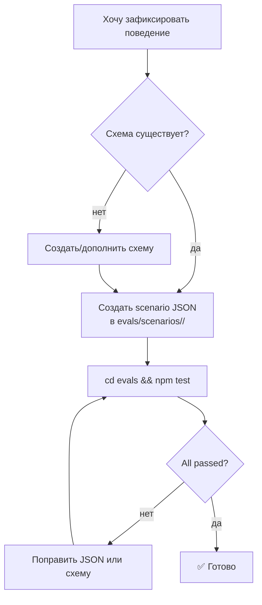

# Глава 14 — Eval-харнесс

## Зачем эта глава

Понять, **как ControlFlow проверяет качество собственных артефактов**. После этой главы вы сможете запускать eval-харнесс, читать его вывод и добавлять новые сценарии.

## Ключевые концепции

- **Eval-харнесс** — набор оффлайн проверок в `evals/`, которые не вызывают реальных агентов.
- **Сценарий** — JSON-файл в `evals/scenarios/`, описывающий входящие данные и ожидаемый выход.
- **Drift check** — проверка, гарантирующая, что файлы агентов синхронизированы с правилами (governance) и схемами.
- **Companion rule** — правило `_must_contain`, требующее наличия определенных строк в файле агента.

## Что такое eval-харнесс

`evals/` — это **оффлайн** test runner. Он полностью автономен.

**Ключевые свойства:**
- **Никакой сети** — нет вызовов реальных агентов или LLM.
- **Только оффлайн** — работает в CI без учетных данных.
- **Детерминированность** — одинаковый ввод всегда дает одинаковый результат (pass/fail).

## Структура `evals/`

```
evals/
├── package.json              # npm scripts
├── validate.mjs              # корневой валидатор (Passes 1–13)
├── drift-checks.mjs          # хелперы для drift detection
├── README.md                 # документация
├── scenarios/                # сценарии для регрессии
│   ├── planner-orchestrator-handoff.json
│   ├── orchestrator-plan-auditor-integration.json
│   ├── plan-auditor-adversarial-detection.json
│   ├── ...
└── tests/                    # тестовые модули
    ├── prompt-behavior-contract.test.mjs
    ├── orchestration-handoff-contract.test.mjs
    └── drift-detection.test.mjs
```

## Три режима

| Команда | Что запускает | Скорость |
|---------|--------------|---------|
| `cd evals && npm test` | Полный suite (все 18 проходов и поведения) | Медленно |
| `npm run test:structural` | Только структурные проходы `validate.mjs` | Быстро |
| `npm run test:behavior` | Поведение (behavior) + handoff | Быстро |

## Что проверяет каждый pass

Актуальный список проходов (passes), выполняемых `validate.mjs`:

### Pass 1: Schema Validity

- Каждая схема валидна согласно JSON Schema (draft 2020-12).
- Включает валидацию `governance/runtime-policy.json` против `schemas/runtime-policy.schema.json` и фикстур из `evals/scenarios/runtime-policy/`.
- Нет синтаксических ошибок.

### Pass 2: Scenario Integrity

- Каждый JSON-файл в `evals/scenarios/` валиден по отношению к своей схеме.

### Pass 3: Reference Integrity

- Ссылки на схемы в файлах агентов корректны.
- Ссылки `skill_references[]` указывают на существующие файлы в `skills/patterns/`.

### Pass 3b: Required Project Artifacts

- Проверка наличия обязательных базовых артефактов, таких как `plans/project-context.md`.

### Pass 3c: Tool Grant Consistency

- Верифицирует массивы инструментов (tools) согласно governance-конфигам.

### Pass 3d: Agent Grant Consistency

- Верифицирует массивы агентов согласно governance-конфигам.

### Pass 4: P.A.R.T Section Order

- Формат каждого `*.agent.md` строго соответствует порядку секций: **Prompt → Archive → Resources → Tools**.
- Отсутствие или неверный порядок приводят к ошибке.

### Pass 4b: Clarification Triggers (§5) & Tool Routing Rules (§6)

- Companion rules, обязывающие агентов использовать политики уточнения и строгие правила роутинга инструментов.

### Pass 5: Skill Library Consistency

- Проверка структурной целостности индекса `skills/`.

### Pass 6: Synthetic Rename Negative-Path Checks

- Тесты негативных путей для защиты от обхода правил при переименовании файлов.

### Pass 7: Memory Architecture References

- Гарантирует, что агенты корректно ссылаются на унифицированную архитектуру памяти.

### Pass 7b: Memory Discipline Contracts

- Проверяет наличие обязательных инструкций по гигиене памяти, очистке сессий и управлению персистентным хранилищем.

### Pass 7c: Tutorial Parity

В режиме placeholder (текущий дефолт — `_status: "placeholder"` в `evals/scenarios/tutorial-parity/allowlist.json`), Pass 7c только логирует, что проверка установлена, и пропускает валидацию. Активация переключает `_status` в `"active"` в следующей фазе, после чего `validateTutorialParity` выполняется и выдаёт результат по каждой паре глав, сравнивая множества заголовков H2 между `docs/tutorial-en/` и `docs/tutorial-ru/`.

### Pass 8: Drift Detection — Roster ↔ Enum Bidirectional Alignment

- Проверяет двунаправленную синхронизацию реестра агентов в `plans/project-context.md` и enum'а `executor_agent` в `schemas/planner.plan.schema.json`.

### Pass 9: Drift Detection — Agent Resources Schema Existence

- Для каждой схемы, на которую ссылается секция `Resources` агента, проверяет что соответствующий файл схемы существует.

### Pass 10: Drift Detection — Cross-Plan File-Overlap

- Обнаруживает случайные пересечения списков файлов между активными планами в `plans/`.

### Pass 12: Governance Policy Assertions

- Проверяет инварианты `governance/runtime-policy.json` и связанных governance-файлов (review pipeline по уровням, retry-бюджеты, пороги approval gate).

### Pass 13: Drift Detection — review_scope=final Bidirectional Coupling

- Проверяет двунаправленную связность ссылок на `review_scope: "final"` в промптах Orchestrator и CodeReviewer.

## Сценарии

`evals/scenarios/*.json` — это **фикстуры** реальных interaction-сценариев. Они валидируются **против схем** при каждом запуске тестов.

**Зачем сценарии:**
- Валидация схемы: проверяет структуру данных.
- Регрессионная защита: если кто-то сломает контракт, упадёт сценарий (тест на поведение).

**Примеры важных сценариев:**

| Файл | Папка | Соответствующая схема |
|------|-------|-----------------------|
| Planner plan with 5 phases | `scenarios/planner/` | `planner.plan.schema.json` |
| PlanAuditor APPROVED verdict | `scenarios/plan-auditor/` | `plan-auditor.plan-audit.schema.json` |
| CoreImplementer NEEDS_INPUT | `scenarios/core-implementer/` | `core-implementer.execution-report.schema.json` |
| Orchestrator gate event | `scenarios/orchestrator/` | `orchestrator.gate-event.schema.json` |

## Чтение вывода

Типичный успешный прогон `npm test` теперь выглядит так:

```
Pass 1: Schema Validity — OK
Pass 2: Scenario Integrity — OK
Pass 3: Reference Integrity — OK
...
Pass 7c: Tutorial Parity — OK
Pass 13: Drift Detection — review_scope=final Bidirectional Coupling — OK
Total: All checks passed
```

Ошибка показывает конкретный pass, артефакт и точную причину. Например:

```
FAIL Pass 4 — P.A.R.T. order
  CoreImplementer-subagent.agent.md: 
  Section order is [Prompt, Resources, Archive, Tools] 
  Expected [Prompt, Archive, Resources, Tools]
```

## Добавление нового сценария



## Добавление нового агента/схемы

1. **Создать агент-файл** — `<Name>.agent.md` в формате P.A.R.T.
2. **Создать схему** — `schemas/<name>.schema.json`.
3. **Добавить сценарии (evals)** — как минимум 1 в папку `evals/scenarios/<name>/`.
4. **Зарегистрировать** — в файле `plans/project-context.md`.

После каждого шага необходимо запустить `npm test` для проверки.

## Что не делает eval-харнесс

- ❌ **Не проверяет правильность решения задачи** — это задача code review.
- ❌ **Не вызывает реальных агентов/LLM** — проверки идут только оффлайн.
- ❌ **Не делает межсетевых запросов** — никаких API вызовов.
- ❌ **Не запускает приложение** — здесь нет UI-тестов.

## CI Configuration

`.github/workflows/ci.yml`:

```yaml
- run: cd evals && npm test
  env:
    NODE_ENV: test
```

В CI требуются успешные проходы **всех** проверок. Одиночные падения считаются провалами сборки (failure).

## Типичные ошибки

- **Запуск из корня репо**, а не папки `evals/`.
- **Создание JSON вне папки правильного агента** (схема не подтянется).
- **Добавление агента без его регистрации в `plans/project-context.md`** — упадёт drift companion rule.
- **Изменение порядка секций P.A.R.T.** — Pass 4 упадёт немедленно.
- **Игнорирование локальных фейлов** — CI запускает ту же самую команду.

## Упражнения

1. **(новичок)** Запустите `cd evals && npm install && npm test`. Сколько тестов прошло? Посмотрите файл `evals/out.txt`.
2. **(новичок)** Откройте `evals/scenarios/` — сколько папок (агентов) там находится?
3. **(средний)** Попробуйте добавить новый сценарий `ABSTAIN` для PlanAuditor. Какие поля требуют заполнения?
4. **(средний)** Найдите companion rule для `Orchestrator.agent.md` в файле `drift-checks.mjs`. О чём оно?
5. **(продвинутый)** Напишите тестовый сценарий с возвращением статуса `needs_replan` для BrowserTester.

## Контрольные вопросы

1. Сколько проверок и проходов инициируется полным eval-харнессом?
2. Вызывает ли eval-харнесс LLM в процессе работы?
3. За что отвечает Pass 4?
4. Сколько шагов нужно, чтобы добавить в проект нового агента?
5. Какую команду вы должны запустить, прежде чем объявить свою работу «выполненной»?

## Смотрите также

- [Глава 04 — P.A.R.T. Specification](04-part-spec.md)
- [Глава 09 — Schemas](09-schemas.md)
- [Глава 10 — Governance](10-governance.md)
- [evals/README.md](../../evals/README.md)
- [.github/workflows/ci.yml](../../.github/workflows/ci.yml)
