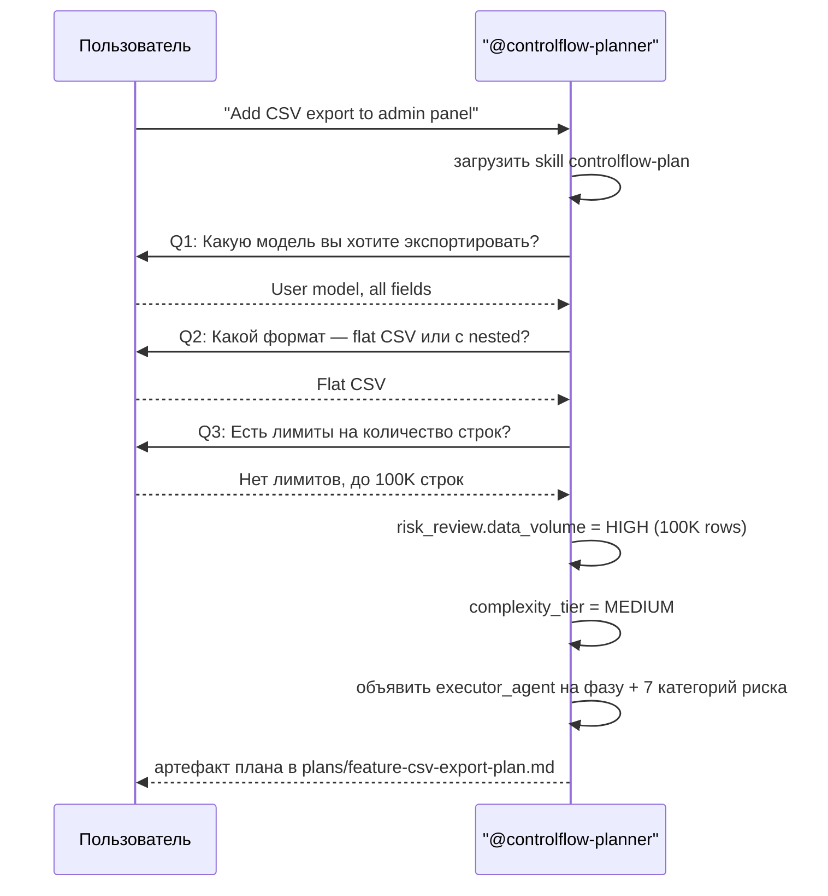
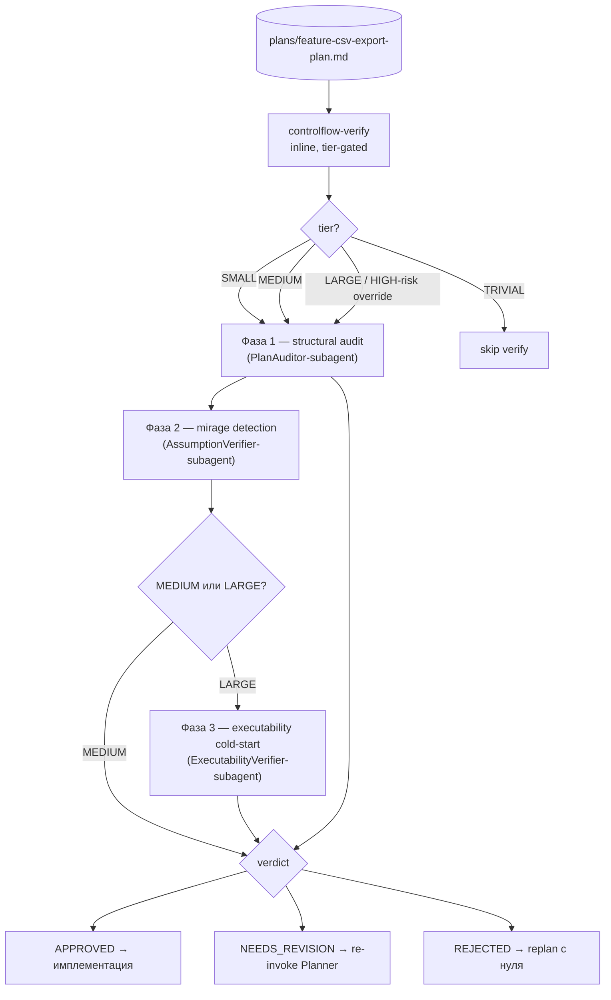
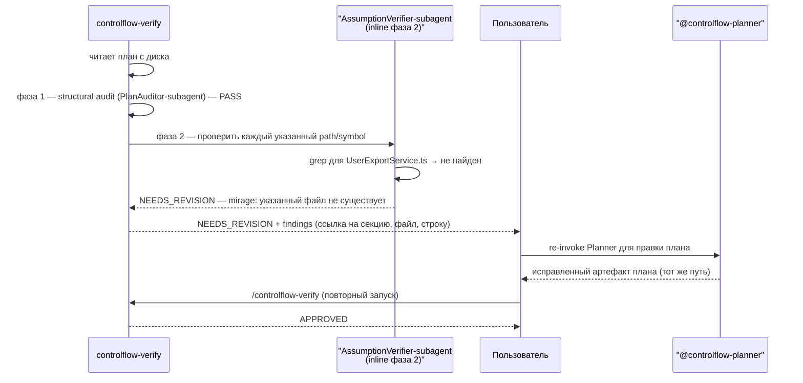
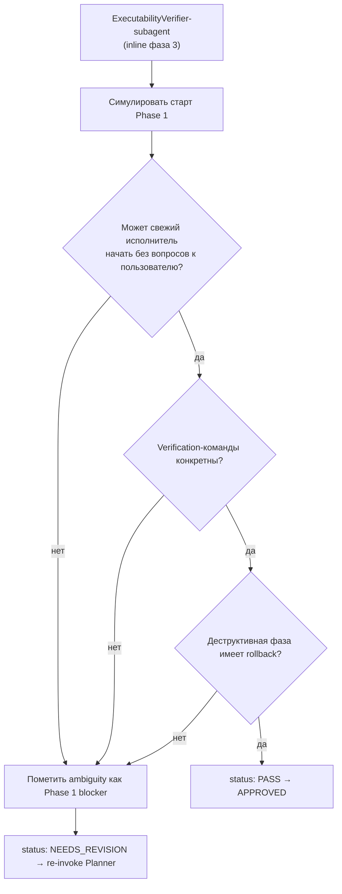
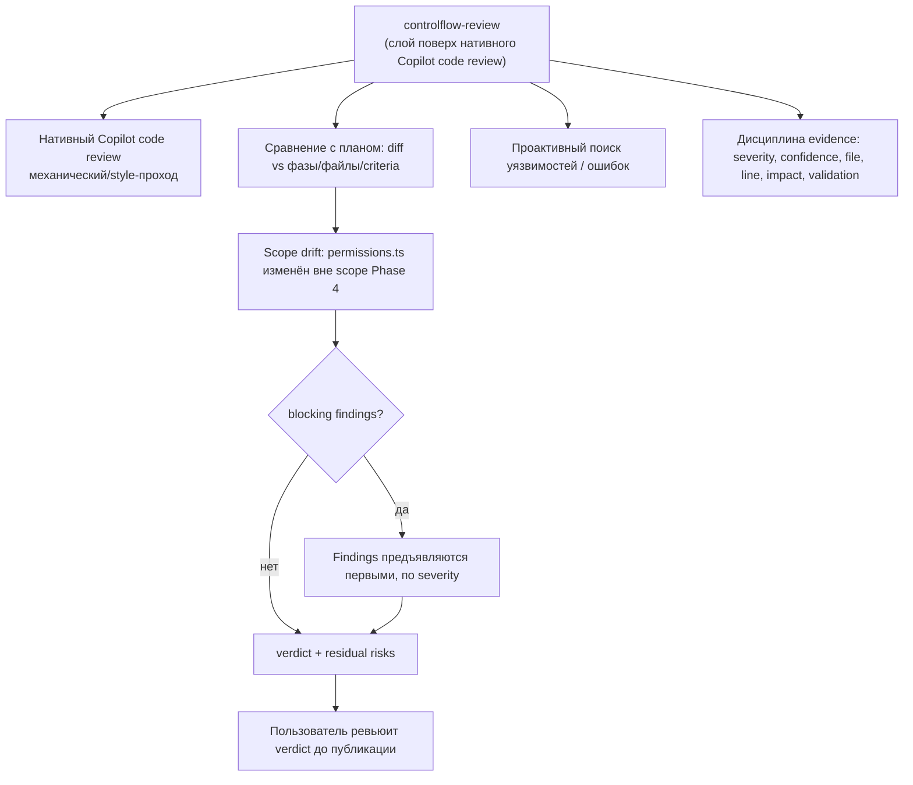

# Глава 15 — Разборы кейсов

## Зачем эта глава

Конкретные сценарии, показывающие, как тонкий ControlFlow-пайплайн работает на практике поверх нативного Copilot. Каждый кейс прослеживает реальный паттерн взаимодействия с диаграммой. После этой главы вы сможете набросать любую задачу end-to-end: пользователь → `@controlflow-planner` → артефакт плана → `controlflow-verify` (tier-gated) → нативный Copilot исполняет фазы → `controlflow-review`.

## Как читать разбор кейса

Каждый кейс содержит:
- **Сценарий** — чего хочет пользователь.
- **Поток** — sequence- или flowchart-диаграмма по тонкому пайплайну.
- **Ключевые решения** — какие правила, tier или verdict-гейт определяют происходящее.

## Кейс 1: Idea Interview у Planner'а

**Сценарий:** Пользователь говорит «хочу добавить CSV-экспорт в админ-панель».



**Ключевые решения:**
- Planner запускает **Idea Interview**, потому что запрос расплывчат (file scope / поведение неясны).
- `data_volume: HIGH` записывается в `risk_review`; tier — `MEDIUM` (шесть фаз, кросс-домен).
- Planner записывает артефакт в `plans/feature-csv-export-plan.md` и указывает пользователю путь — он никогда не inline'ит план в чат.
- Planner **не** одобряет план; он только производит reviewable-артефакт.

## Кейс 2: Артефакт плана → Verify-гейт

**Сценарий:** Planner произвёл план тира MEDIUM. Пользователь запускает `/controlflow-verify`.



**Ключевые решения:**
- `controlflow-verify` читает план **с диска** (не встроенную в чат копию).
- Tier `MEDIUM` → запускаются фазы 1–2 (structural audit + mirage detection). Фаза 3 (executability cold-start) пропускается, если только tier не `LARGE` или не срабатывает HIGH-risk override.
- Три verify-фазы соответствуют трём inline verify-ролям (`PlanAuditor-subagent`, `AssumptionVerifier-subagent`, `ExecutabilityVerifier-subagent`) — они выполняются inline, **не** диспатчатся как сабагенты.
- Записанный план — не одобрение. Имплементация может начаться только на `APPROVED`.

## Кейс 3: Адверсариальный mirage detection (MEDIUM)

**Сценарий:** План тира MEDIUM. `AssumptionVerifier-subagent` (verify фаза 2) находит mirage: план ссылается на `src/export/UserExportService.ts`, которого нет в кодовой базе.



**Ключевые решения:**
- `AssumptionVerifier-subagent` пытается **опровергнуть** фактические утверждения плана (по умолчанию `flagged`, когда evidence недостаточно).
- Один BLOCKING mirage форсит `NEEDS_REVISION`; пользователь re-invoke'ит Planner с findings.
- После правки verify перезапускается с фазы 1 — нет ярлыка «пропатчить только сломанную фазу».
- Taxonomy mirages (presence P1–P10, absence A11–A17) живёт в `.github/skills/controlflow-verify/references/mirage-patterns.md`.

## Кейс 4: Executability cold-start (LARGE)

**Сценарий:** План тира LARGE. `ExecutabilityVerifier-subagent` (verify фаза 3) симулирует свежего исполнителя, начинающего Phase 1 только с планом в руках.



**Ключевые решения:**
- Фаза 3 симулирует cold-start исполнителя: никакого prior-контекста, только артефакт плана.
- «Нет конкретного file path», «vague verification-команда» или «деструктивная фаза без rollback» — это executability-блокеры.
- Блокер маршрутизируется обратно к Planner'у для **targeted refinement**, а не полного replan.
- Tier gating: `LARGE` (или любой неразрешённый HIGH-impact semantic risk) форсит все три фазы.

## Кейс 5: Failure classification во время исполнения

**Сценарий:** Нативный Copilot исполняет Phase 3 (роль исполнителя `CoreImplementer-subagent`). Тест падает с flaky timeout.

```mermaid
flowchart TD
    Native["Нативный Copilot исполняет Phase 3<br/>(роль исполнителя: CoreImplementer-subagent)"]
    Fail[Тест FAILED — transient timeout]
    Class{failure_classification}
    Transient[transient → нативный Copilot retry]
    Fixable[fixable → нативный Copilot retry с fix hint]
    Replan[needs_replan → re-invoke @controlflow-planner]
    Esc[escalate → STOP + user approval]
    Mu[model_unavailable → нативный Copilot подменяет модель]
    Log[записать в lifecycle-секцию плана<br/>(Progress / Idempotence & Recovery)]
    Continue[Phase 3 продолжается]

    Native --> Fail
    Fail --> Class
    Class --> Transient
    Class --> Fixable
    Class --> Replan
    Class --> Esc
    Class --> Mu
    Transient --> Log
    Fixable --> Log
    Replan --> Log
    Esc --> Log
    Mu --> Log
    Log --> Continue
```

**Ключевые решения:**
- Retry routing, retry budgets и parallelism — **задача нативного Copilot**, не ControlFlow.
- `needs_replan` — единственный класс, который re-входит в пайплайн ControlFlow — пользователь re-invoke'ит `@controlflow-planner` для targeted replan.
- Каждый сбой записывается в lifecycle-секцию плана (`## Progress`, `## Discoveries`, `## Idempotence & Recovery`) со своим `failure_classification`.
- ControlFlow метит; нативный Copilot маршрутизирует.

## Кейс 6: Mid-execution clarification

**Сценарий:** Нативный Copilot, исполняя UI-фазу (роль исполнителя `UIImplementer-subagent`), не может решить, как показать empty state в диалоге экспорта.

```mermaid
sequenceDiagram
    participant N as Нативный Copilot
    participant U as Пользователь
    participant P as "@controlflow-planner"

    N->>N: исполняет UI-фазу; ambiguous empty state
    alt ambiguity не меняет file scope / архитектуру
        N->>U: нативная ask-questions поверхность: "Как показать empty state?" (options: skeleton / message / hide)
        U-->>N: "hide"
        N->>N: продолжить фазу с выбором в контексте
    else ambiguity меняет file scope или архитектуру
        U->>P: re-invoke @controlflow-planner для targeted replan
        P->>P: читает существующий артефакт, обновляет затронутые фазы
        P-->>U: исправленный артефакт плана
        U->>N: возобновить исполнение после /controlflow-verify APPROVED
    end
```

**Ключевые решения:**
- Mid-execution clarification — **задача нативного Copilot** — в slim-модели нет ControlFlow `NEEDS_INPUT` routing-таблицы.
- Если ответ меняет file scope, user-visible поведение, архитектуру или обработку destructive-risk, пользователь re-invoke'ит Planner для targeted replan вместо того, чтобы разрешать inline.
- Исправленный план должен снова пройти `controlflow-verify` до возобновления исполнения.

## Кейс 7: Review-гейт — scope drift

**Сценарий:** Задача тира LARGE, все фазы завершены. Пользователь запускает `/controlflow-review`. Diff показывает, что Phase 4 (роль исполнителя `CoreImplementer-subagent`) модифицировала `src/auth/permissions.ts` — файл, не входящий в объявленный scope Phase 4.



**Ключевые решения:**
- `controlflow-review` — это **слой поверх** нативного Copilot code review, не замена. Механический/style-проход принадлежит нативному ревью; ControlFlow добавляет сравнение с планом, проактивный поиск уязвимостей и дисциплину evidence.
- Scope drift помечается сравнением diff'а имплементации с объявленными фазами, файлами и acceptance criteria плана.
- `controlflow-review` **не чинит** проблемы — он метит их severity, confidence, file, line, user impact и validation method. Пользователь (или новая фаза плана) владеет фиксом.
- Findings предъявляются первыми, упорядоченными по severity. Soft-метки (`Nit`, `Optional`, `FYI`) идут только после blocking findings.

---

## Шаблон чтения сценария

Работая с незнакомым сценарием, используйте этот шаблон:

1. **Какой tier был назначен?** (TRIVIAL / SMALL / MEDIUM / LARGE — и сработал ли HIGH-risk override?)
2. **Что вернул `controlflow-verify`?** (APPROVED / NEEDS_REVISION / REJECTED — и какая фаза пометила?)
3. **Кто произвёл сбой или finding?** (Planner? verify-фаза? нативный Copilot mid-execution? `controlflow-review`?)
4. **Какой routing-путь применяется?** (re-invoke Planner / нативный Copilot retry / user approval / ship)
5. **Записано ли в lifecycle-секцию?** (`Progress` / `Discoveries` / `Idempotence & Recovery` с `failure_classification`.)
6. **Что происходит после фикса?** (продолжить исполнение / re-verify / ship / replan с нуля.)

## Типичные заблуждения

- **Путать «Planner произвёл план» с «план одобрен».** Planner handoff'ает reviewable-артефакт; `controlflow-verify` всё равно должен вернуть `APPROVED` до исполнения.
- **Ожидать фазу 3 (executability cold-start) на SMALL-задаче.** Фаза 3 запускается только на `LARGE` или когда срабатывает HIGH-risk override.
- **Искать Orchestrator dispatch / wave scheduler.** Оба retired. Нативный Copilot запускает фазы; пайплайн гейтит до и после.
- **Ожидать, что `controlflow-review` чинит проблемы.** Он метит; пользователь или новая фаза плана владеют фиксом.
- **Маршрутизировать mid-execution ambiguity через ControlFlow-таблицу.** Нативный Copilot обрабатывает clarification; только scope/architecture-changing ambiguity re-входит в пайплайн через Planner.

## Упражнения

1. **(новичок)** В кейсе 1 почему `data_volume: HIGH` не форсит автоматически `LARGE`? Какой tier получается и какие verify-фазы запускаются?
2. **(новичок)** В кейсе 3 почему verify перезапускается с фазы 1 после правки, а не патчит только сломанное утверждение?
3. **(средний)** В кейсе 6 что различает две ветки (inline clarification vs targeted replan)? Приведите пример каждой.
4. **(средний)** В кейсе 5 какой класс сбоев — единственный, который re-входит в пайплайн ControlFlow, и какова точка входа?
5. **(продвинутый)** В кейсе 7 составьте список findings, который эмиттит `controlflow-review` для scope drift `permissions.ts` — severity, confidence, file, line, user impact, validation method.

## Контрольные вопросы

1. Когда запускается verify-фаза 3 (executability cold-start)?
2. Что такое mirage и какая inline verify-роль его обнаруживает?
3. Чем `controlflow-review` отличается от нативного Copilot code review?
4. Почему записанный план — не то же самое, что одобренный план?
5. Какой класс сбоев re-входит в пайплайн ControlFlow и как?

## См. также

- [Глава 05 — Пайплайн plan → verify → review](05-orchestration.md)
- [Глава 07 — Ревью-пайплайн (controlflow-verify)](07-review-pipeline.md)
- [Глава 08 — Исполнение + review поверх нативного Copilot](08-execution-pipeline.md)
- [Глава 13 — Таксономия сбоев](13-failure-taxonomy.md)
- [docs/agent-engineering/NATIVE-DELEGATION-BOUNDARY.md](../agent-engineering/NATIVE-DELEGATION-BOUNDARY.md)