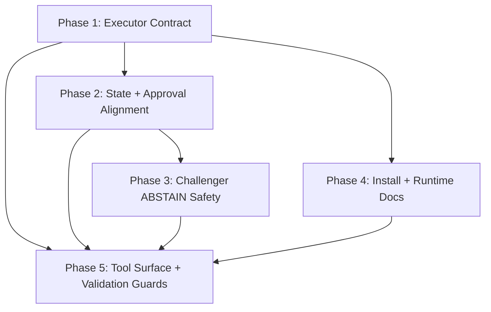
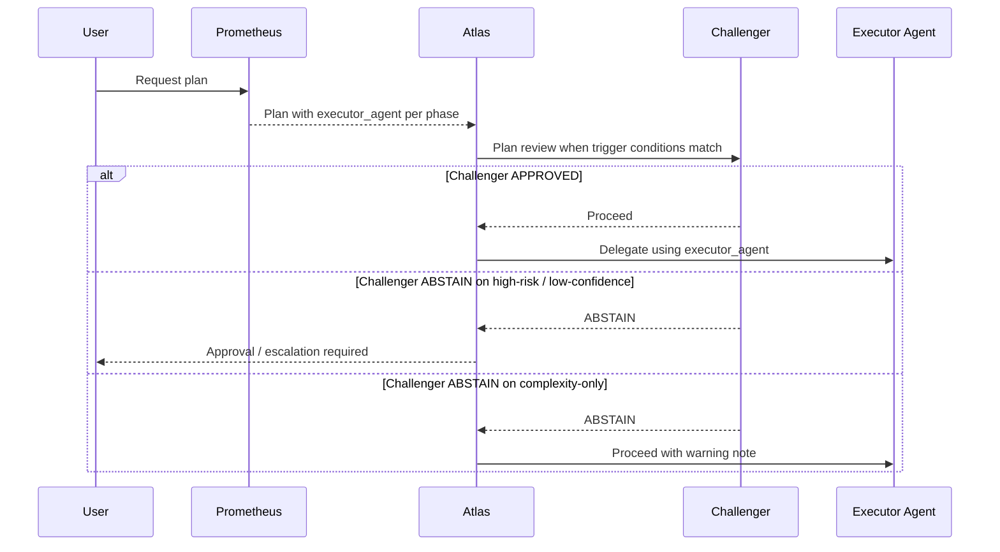

## Plan: Atlas Orchestration Remediation

**Summary:** Harden the control-plane contracts that currently rely on narrative alignment rather than machine-readable guarantees. The remediation focuses on five areas: planner-to-conductor executor routing, Atlas state/schema alignment, safer Challenger fallback behavior, operational consistency in approvals/install/tool naming, and regression guards for token/tool drift.

### Context & Analysis
- The highest-risk defect is at the planner → conductor boundary: Prometheus plans do not carry a machine-readable executor selection per phase, so Atlas must infer which subagent to delegate to.
- Atlas prompt text uses `PLAN_REVIEW` as a real workflow state, but `schemas/atlas.gate-event.schema.json` does not allow that value.
- Challenger is triggered specifically for risky plans, yet Atlas currently proceeds when Challenger returns `ABSTAIN`, even for low-confidence or destructive plans.
- Atlas currently contains an internal policy conflict: stopping rules require approval after each phase review, while batch approval says one approval per wave.
- Atlas prompt text refers to the `#todos` tool while the eval fixtures and frontmatter refer to `todo`.
- README installation still describes copying only `*.agent.md`, but the current agent set depends on repo-local docs, schemas, and `plans/project-context.md`.
- Atlas still carries a wide tool surface in frontmatter relative to the subset explicitly routed in the body, which increases token noise and permission surface.

### Implementation Phases

#### Phase 1 — Formalize Phase Executor Contract
- **Objective:** Make phase-to-agent routing deterministic by adding an explicit executor field to the Prometheus plan contract and consuming it in Atlas.
- **Wave:** 1
- **Dependencies:** None.
- **Files:**
  - `schemas/prometheus.plan.schema.json` — modify: add required per-phase `executor_agent` field with enum covering the allowed execution/review/research agents.
  - `Prometheus.agent.md` — modify: require `executor_agent` in the plan template, quality standards, and planning instructions.
  - `Atlas.agent.md` — modify: replace heuristic-only implementation delegation with `executor_agent`-driven routing.
  - `plans/project-context.md` — modify: add a short note defining which agent classes are valid `executor_agent` values.
  - `evals/scenarios/prometheus-schema-output.json` — update: require `executor_agent` in emitted phases.
  - `evals/scenarios/agent-triggering-quality.json` — update or split: assert Atlas respects explicit `executor_agent` instead of freeform inference.
  - `evals/scenarios/atlas-phase-executor-routing.json` — create: validate that Atlas dispatches the phase to the declared agent.
- **Tests:**
  - `cd evals && npm test`
  - Scenario assertion: a phase with `executor_agent: "DocWriter-subagent"` must not be routed to Sisyphus or Frontend-Engineer.
- **Failure Expectations:**
  - **Scenario:** The initial enum is too restrictive for future agents. **Classification:** `fixable`. **Mitigation:** define the enum from the current supported executor set and document schema update as the extension path.
  - **Scenario:** Atlas still contains fallback heuristics that override explicit routing. **Classification:** `fixable`. **Mitigation:** treat `executor_agent` as authoritative and use heuristics only when reading legacy plans.
- **Steps:**
  1. Extend the per-phase schema in `schemas/prometheus.plan.schema.json` with `executor_agent` as a required field.
  2. Update Prometheus instructions so every phase names exactly one primary executor.
  3. Update Atlas implementation loop to branch on `executor_agent` when delegating the phase.
  4. Define backward-compat behavior for legacy plans without `executor_agent`: reject them explicitly or map them through a temporary compatibility layer.
  5. Add/adjust evals so executor selection becomes a tested contract instead of an implied behavior.

#### Phase 2 — Align Atlas State, Approval, and Todo Semantics
- **Objective:** Remove internal contradictions in Atlas by making workflow state, approval boundaries, and todo tool naming consistent across prompt, schema, and eval fixtures.
- **Wave:** 2
- **Dependencies:** Phase 1.
- **Files:**
  - `Atlas.agent.md` — modify: add `PLAN_REVIEW` to the state tracking list; resolve the conflict between per-phase and per-wave approvals; replace `#todos` wording with the canonical `todo` tool name or explicitly define the alias.
  - `schemas/atlas.gate-event.schema.json` — modify: allow `PLAN_REVIEW` in `workflow_state`.
  - `evals/scenarios/consistency-repeatability.json` — update: include a valid `PLAN_REVIEW` transition case or clarify normalization behavior.
  - `evals/scenarios/wave-execution.json` — update: align approval expectations with the final chosen model.
  - `evals/scenarios/atlas-todo-orchestration.json` — update only if alias semantics are preserved rather than canonicalized.
- **Tests:**
  - `cd evals && npm test`
  - Targeted structural check: all prompt-declared Atlas workflow states are representable in `schemas/atlas.gate-event.schema.json`.
- **Failure Expectations:**
  - **Scenario:** Existing consumers assume the narrower workflow-state enum. **Classification:** `fixable`. **Mitigation:** bump schema version if needed and document the addition as a backward-compatible enum extension.
  - **Scenario:** Approval semantics drift into two parallel rulesets again. **Classification:** `fixable`. **Mitigation:** nominate one canonical rule: wave-level approval by default, per-phase approval only for destructive/high-risk exceptions.
- **Steps:**
  1. Add `PLAN_REVIEW` to the `workflow_state` enum.
  2. Update Atlas state tracking text so the prompt and schema name the same state set.
  3. Choose and codify one approval model: batch approval per wave by default, per-phase only for destructive/high-risk or explicit exception cases.
  4. Normalize todo terminology to `todo` everywhere in Atlas-facing instructions unless an alias must be preserved for UI reasons.
  5. Update eval fixtures so approval and todo assertions follow the same semantics as the prompt.

#### Phase 3 — Tighten Challenger ABSTAIN Behavior
- **Objective:** Preserve the value of adversarial review by making Challenger `ABSTAIN` safe and context-sensitive instead of universally non-blocking.
- **Wave:** 3
- **Dependencies:** Phase 2.
- **Files:**
  - `Atlas.agent.md` — modify: replace unconditional “log and proceed” behavior for Challenger `ABSTAIN` with trigger-aware routing.
  - `evals/scenarios/atlas-challenger-integration.json` — update: split `ABSTAIN` expectations by trigger class.
  - `evals/scenarios/safety-approval-gate.json` — update if high-risk `ABSTAIN` now routes through `WAITING_APPROVAL`/blocked review instead of silently proceeding.
  - `README.md` — modify the workflow section if the user-visible audit behavior changes materially.
- **Tests:**
  - `cd evals && npm test`
  - Scenario matrix:
    - complexity-only trigger (`3+ phases`, high confidence, non-destructive) may proceed with warning;
    - low-confidence trigger must not silently proceed on `ABSTAIN`;
    - destructive/high-risk trigger must not silently proceed on `ABSTAIN`.
- **Failure Expectations:**
  - **Scenario:** Tightening `ABSTAIN` creates deadlock for benign complex plans. **Classification:** `fixable`. **Mitigation:** keep liveness only for complexity-only triggers with explicit warning and audit-unavailable note.
  - **Scenario:** High-risk plans still bypass review on `ABSTAIN`. **Classification:** `escalate`. **Mitigation:** force `WAITING_APPROVAL` with explicit audit-unavailable rationale.
- **Steps:**
  1. Split Challenger trigger handling into categories: complexity-only, low-confidence, and destructive/high-risk.
  2. Define the new `ABSTAIN` routing policy: non-blocking only for complexity-only triggers; blocking or approval-gated for low-confidence and destructive triggers.
  3. Update the Atlas prompt text in the Plan Review Gate section.
  4. Update evals to exercise all three categories explicitly.
  5. If README claims “adversarial review” as a safety feature, make sure the documented workflow matches the stricter runtime rule.

#### Phase 4 — Fix Runtime Installation Model and Operational Docs
- **Objective:** Make installation and workspace assumptions honest, so end users do not deploy only the prompt files and lose the repo-local contracts they depend on.
- **Wave:** 3
- **Dependencies:** Phase 1.
- **Files:**
  - `README.md` — modify: replace copy-only installation with a workspace-aware setup flow; explain repo-local dependencies (`docs/`, `schemas/`, `plans/project-context.md`, `evals/`).
  - `plans/project-context.md` — modify: add a short “Runtime Assumptions” section stating that the repository must remain available as workspace context for the agents.
  - `.github/copilot-instructions.md` — modify only if needed to point to the updated installation/runtime assumptions.
- **Tests:**
  - Manual verification: a new user can follow the README and end up with access to all files agents reference.
  - `cd evals && npm test` still passes after doc updates.
- **Failure Expectations:**
  - **Scenario:** The actual deployment target for users is a packaged standalone agent bundle rather than a live workspace. **Classification:** `needs_replan`. **Mitigation:** split README into “development repo” and “distribution bundle” installation modes instead of pretending one flow fits both.
- **Steps:**
  1. Rewrite the Installation section so it no longer implies that copying only `*.agent.md` is sufficient.
  2. Add a minimal runtime dependency explanation to the README.
  3. Add a `Runtime Assumptions` note to `plans/project-context.md` so the expectation is discoverable from within the agent context itself.
  4. If two install modes are truly supported, document them separately and name the tradeoff explicitly.

#### Phase 5 — Reduce Tool Surface and Add Regression Guards
- **Objective:** Cut token/permission noise and prevent the same class of drift from reappearing by expanding structural validation.
- **Wave:** 4
- **Dependencies:** Phases 1, 2, and 3.
- **Files:**
  - `Atlas.agent.md` — modify: remove frontmatter tools that are not part of the documented operating model or active routing rules.
  - `Prometheus.agent.md` — review and trim only if any frontmatter tools remain unsupported by body-level routing.
  - `docs/agent-engineering/TOOL-ROUTING.md` — modify only if the canonical allowed tool set changes.
  - `evals/validate.mjs` — modify: add structural checks for (a) Atlas prompt-declared workflow states vs schema enum, (b) required `executor_agent` in plan schema, (c) prompt/frontmatter tool drift for Atlas and Prometheus, (d) canonical `todo` naming in Atlas.
  - `evals/README.md` — modify: document the new validation passes.
- **Tests:**
  - `cd evals && npm test`
  - New validator checks must fail when:
    - `executor_agent` is removed from the plan schema;
    - Atlas mentions a workflow state not present in the gate-event schema;
    - Atlas frontmatter reintroduces unused tools without body-level routing;
    - Atlas prompt drifts back to non-canonical todo tool naming.
- **Failure Expectations:**
  - **Scenario:** Over-aggressive tool removal cuts off a legitimate future workflow. **Classification:** `fixable`. **Mitigation:** trim only tools with no body-level routing and no execution protocol references.
  - **Scenario:** New validation rules are too brittle and create false positives on harmless prompt rewording. **Classification:** `fixable`. **Mitigation:** check canonical markers and structured sections, not arbitrary prose.
- **Steps:**
  1. Audit Atlas frontmatter tool grants against body-level routing and actual orchestration use.
  2. Remove tools that are neither routed nor part of the intended orchestration surface.
  3. Extend `evals/validate.mjs` with cross-contract checks that catch the defects identified in this review.
  4. Update `evals/README.md` so contributors know what the validator now enforces.

### Inter-Phase Contracts
- **From Phase 1 → Phase 2:** `executor_agent` becomes the authoritative routing signal Atlas must preserve while its state/approval logic is normalized.
  - **Format:** Updated `PrometheusPlan` schema plus updated prompt template.
  - **Validation:** Atlas evals assert phase routing uses the explicit executor field.
- **From Phase 2 → Phase 3:** The revised Atlas state model and approval semantics determine how Challenger `ABSTAIN` can block or route through `WAITING_APPROVAL`.
  - **Format:** Updated `Atlas.agent.md` and `atlas.gate-event.schema.json`.
  - **Validation:** Challenger integration evals assert the correct routing per trigger class.
- **From Phase 1/2/3 → Phase 5:** Validation guardrails must encode the final contract, not the pre-remediation one.
  - **Format:** Finalized schema/prompt/docs state.
  - **Validation:** `evals/validate.mjs` passes only when all cross-contract invariants hold.

### Open Questions
- **Should `executor_agent` be required for every phase, including research and review phases, or only for acting phases?**
  - **Options:**
    - Require it for every phase.
    - Require it only for acting phases and leave review/research implicit.
  - **Recommendation:** Require it for every phase. Atlas should not have to infer routing for any phase category.
- **How strict should Challenger `ABSTAIN` be for complexity-only triggers?**
  - **Options:**
    - Always block on `ABSTAIN`.
    - Block only for low-confidence and destructive triggers; warn-only for complexity-only triggers.
  - **Recommendation:** Block only for low-confidence and destructive triggers; preserve liveness for complexity-only plans while surfacing the warning.

### Risks
- Changing the plan schema introduces backward-compat pressure for any downstream consumer expecting the old phase shape.
- Atlas prompt updates touch multiple high-centrality rules in one file, so incremental validation after each edit is important.
- Tightening Challenger `ABSTAIN` can improve safety but reduce throughput if applied too broadly.
- Tool-surface trimming can accidentally remove a rarely used but valid orchestration path unless the audit is grounded in current body instructions.

### Success Criteria
- `schemas/prometheus.plan.schema.json` requires a machine-readable `executor_agent` per phase, and Atlas uses it for delegation.
- `schemas/atlas.gate-event.schema.json` can represent every workflow state Atlas claims to use, including `PLAN_REVIEW`.
- Atlas no longer has conflicting approval semantics between stopping rules and batch approval.
- Challenger `ABSTAIN` is no longer universally non-blocking; high-risk and low-confidence cases are gated safely.
- README no longer implies that copying only the agent markdown files is a supported installation path.
- `evals/validate.mjs` catches the cross-contract defects identified in this review.
- `cd evals && npm test` passes after all remediation changes.

### Notes for Atlas
- **Recommended execution order:** Phase 1 → Phase 2 → Phase 3, while Phase 4 can run after Phase 1 in parallel with Phase 3, then Phase 5 last.
- **Wave assignments:**
  - Wave 1: Phase 1
  - Wave 2: Phase 2
  - Wave 3: Phase 3 and Phase 4 (parallel)
  - Wave 4: Phase 5
- **Subagent delegation suggestions:**
  - Phase 1: Sisyphus for schema/prompt/eval contract work.
  - Phase 2: Sisyphus for Atlas/schema/eval alignment.
  - Phase 3: Sisyphus for Atlas/eval logic changes, with Challenger/Oracle consulted only for policy sanity-check if needed.
  - Phase 4: DocWriter for README + project-context updates.
  - Phase 5: Sisyphus for validator/tool-frontmatter changes.
- **Max parallel agents recommendation:** 2. Most phases touch Atlas or core schemas; parallelism should stay low to avoid file collisions.
- **Failure expectations summary per wave:**
  - Waves 1–3 are mostly `fixable` unless the install model or ABSTAIN policy reveals a deeper product decision mismatch.
  - Wave 4 may expose hidden phantom grants or legacy assumptions; treat initial failures as guardrail wins, not regressions.

### Architecture Visualization

