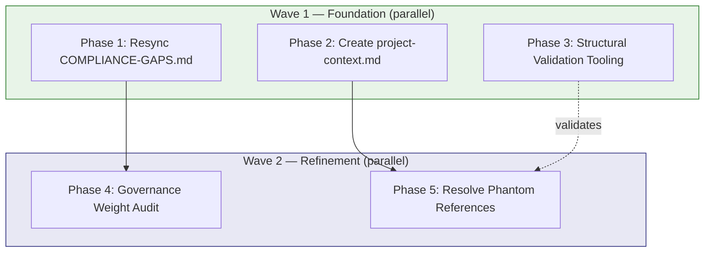
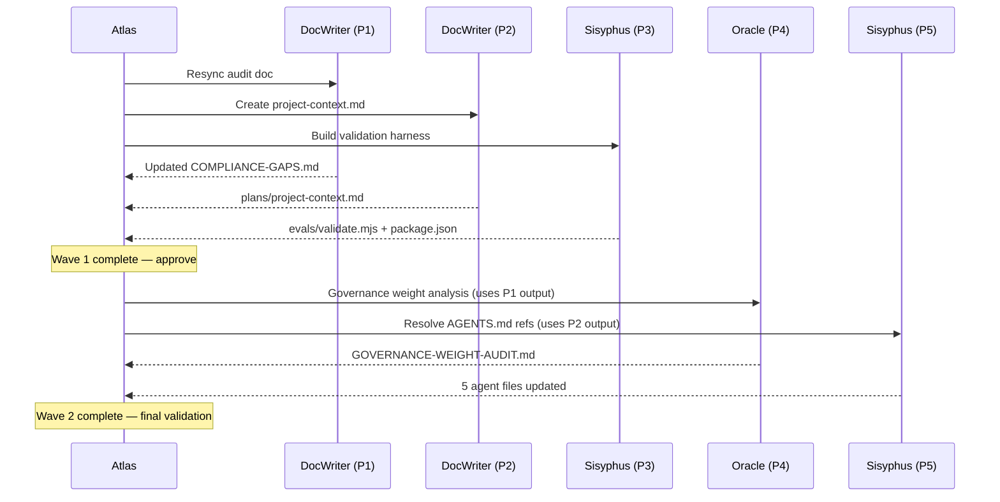

## Plan: Atlas Repository Operational Maturity Improvements

**Summary:** Close the gap between Atlas's strong specification layer and its operational readiness. Five phases address: stale audit sync, missing shared context artifact, adoption quickstart, structural validation tooling, and governance weight reduction. All changes are additive — no existing contracts or agents are broken.

### Context & Analysis

**Current state:**
- 11 agents with P.A.R.T architecture, 13 JSON Schema 2020-12 contracts, 23 eval scenario fixtures.
- Governance docs (PART-SPEC, RELIABILITY-GATES, CLARIFICATION-POLICY, TOOL-ROUTING) are thorough and internally consistent.
- Eval scenarios are well-structured JSON fixtures but have no runner or automation.
- `docs/agent-engineering/COMPLIANCE-GAPS.md` reports 3/11 compliant (27%), but current agents already contain the missing blocks (PreFlect, approval gates, tool routing, clarification) — the audit is stale by ~2 days of work.
- `plans/project-context.md` is referenced by all 11 agents + shared copilot-instructions but does not exist.
- `AGENTS.md` is referenced by 4 execution agents (Sisyphus, Frontend-Engineer, DevOps, DocWriter, BrowserTester) but does not exist.

**Key constraints:**
- All changes must be additive (no breaking changes to existing agent contracts).
- Agent prompt files are the primary artifact — any doc changes must stay in sync with them.
- Eval harness must work without programmatic Copilot API access (structural/schema validation, not behavioral).

**Architecture decisions:**
- Use Node.js + ajv for schema validation (JSON Schema 2020-12 is the project standard).
- Keep project-context.md as the single shared context source — do not create a second overlapping doc.
- Agent map goes inside project-context.md (not a separate file) to avoid yet another doc to maintain.

### Implementation Phases

#### Phase 1 — Resync COMPLIANCE-GAPS.md
- **Objective:** Update the compliance audit to reflect the current state of all 11 agents against the 9-item checklist. Change compliance rate from 3/11 to actual current state.
- **Wave:** 1
- **Dependencies:** None.
- **Files:**
  - `docs/agent-engineering/COMPLIANCE-GAPS.md` — modify: update summary table, compliance rate, move resolved gaps to "Recently Resolved" section, update audit date to current.
- **Tests:**
  - Manual: every ❌ in the updated table must be verifiable by searching the corresponding agent.md for the missing section.
  - Manual: every ✅ must have a line reference to the agent file proving compliance.
- **Failure Expectations:**
  - Scenario: Some agents may still have genuine gaps after careful re-audit. Classification: `fixable`. Mitigation: document remaining gaps with specific fix instructions rather than marking them resolved.
- **Steps:**
  1. Read each of the 11 `*.agent.md` files and check for all 9 checklist items from PART-SPEC.md: (a) P.A.R.T section order, (b) Plan/Act split, (c) PreFlect, (d) Compaction+memory, (e) Schema output, (f) Abstention, (g) Human approval gates, (h) Clarification triggers, (i) Tool routing rules.
  2. For each agent, record compliant/non-compliant per item with line references.
  3. Update the summary table with accurate ✅/❌ and gap descriptions.
  4. Move items from "Gap Details" sections to "Recently Resolved" where the gap no longer exists.
  5. Update the `Compliance rate` line and `Audit date`.
  6. If any agents remain non-compliant, write specific single-step fix instructions in the gap detail (not vague "Add X section").

#### Phase 2 — Create plans/project-context.md
- **Objective:** Create the shared context artifact that 11 agents and copilot-instructions.md already reference. Include agent role matrix, project conventions, expected workflow, and directory structure.
- **Wave:** 1
- **Dependencies:** None.
- **Files:**
  - `plans/project-context.md` — create.
- **Tests:**
  - Every agent.md that references `plans/project-context.md` can find it.
  - The agent role matrix includes all 11 agents with: name, file, model, schema, approval posture, tool grants, and primary eval scenarios.
  - The workflow section matches the diagram in README.md.
- **Failure Expectations:**
  - Scenario: Content drifts from agent files over time. Classification: `fixable`. Mitigation: add a "Last verified" date and a note that project-context.md is the canonical source — agent files point here.
- **Steps:**
  1. Create `plans/project-context.md` with sections: Project Overview, Agent Role Matrix (table), Workflow (text version of the README diagram), Directory Conventions, Schema Conventions, Failure Taxonomy Reference, Shared Policies Reference.
  2. Agent Role Matrix must be a single table with columns: Agent | File | Model | Schema | Approval Posture | External Tools | Primary Eval Scenarios.
  3. Populate from the 11 agent.md frontmatter blocks and the evals/scenarios directory.
  4. Add a "Decision Tree" subsection: a short bulleted guide on which agent to invoke for which task type (planning, research, implementation, review, testing, docs, infra).
  5. Mark document as `Last verified: {current date}`.

#### Phase 3 — Structural Validation Tooling
- **Objective:** Create a minimal validation harness that checks structural integrity of the agent system: schema validity, scenario-schema cross-references, agent P.A.R.T compliance, and reference integrity (all referenced files exist).
- **Wave:** 1
- **Dependencies:** None.
- **Files:**
  - `evals/package.json` — create: minimal Node.js package with ajv dependency.
  - `evals/validate.mjs` — create: validation runner script.
  - `evals/README.md` — modify: add "Running Validations" section with commands.
- **Tests:**
  - `npm test` in `evals/` runs all structural checks and exits 0 on clean repo.
  - Invalid schema or broken reference causes non-zero exit.
- **Failure Expectations:**
  - Scenario: ajv version incompatibility with JSON Schema 2020-12. Classification: `fixable`. Mitigation: pin ajv@8.x which supports 2020-12.
  - Scenario: Some existing scenarios may have minor schema drift. Classification: `fixable`. Mitigation: fix the scenario fixtures as part of this phase.
- **Steps:**
  1. Create `evals/package.json` with `ajv` (8.x), `ajv-formats`, and a `test` script.
  2. Create `evals/validate.mjs` with four validation passes:
     - **Pass 1 — Schema validity:** Load each `schemas/*.schema.json`, compile with ajv. Error on invalid schemas.
     - **Pass 2 — Scenario integrity:** Load each `evals/scenarios/*.json`, verify `target_agent` exists as an agent.md file, verify referenced schema exists in `schemas/`.
     - **Pass 3 — Reference integrity:** Scan all `*.agent.md` files for `schemas/*.json` references, verify each referenced schema file exists. Scan for `plans/project-context.md`, `docs/agent-engineering/*.md` references and verify existence.
     - **Pass 4 — P.A.R.T section order:** Parse each `*.agent.md` for `## Prompt`, `## Archive`, `## Resources`, `## Tools` headers and verify they appear in that order.
  3. Add summary output: count of checks passed/failed per pass.
  4. Update `evals/README.md` with installation and run instructions.

#### Phase 4 — Governance Weight Audit & Lite-Mode Recommendation
- **Objective:** Analyze orchestration overhead in Atlas and Prometheus prompts, identify redundant or low-value rules, and document a "lite mode" recommendation for small tasks (≤2 phases, low risk).
- **Wave:** 2
- **Dependencies:** Phase 1 (need accurate compliance state to know which rules are actually enforced).
- **Files:**
  - `docs/agent-engineering/GOVERNANCE-WEIGHT-AUDIT.md` — create: analysis document with findings and recommendations.
- **Tests:**
  - Every recommendation has a concrete before/after token count estimate.
  - Recommendations do not remove safety gates (approval, abstention, PreFlect) — only ceremony reduction.
- **Failure Expectations:**
  - Scenario: Analysis reveals all current rules carry weight — no simplification possible. Classification: `fixable`. Mitigation: document why each rule is load-bearing and close the audit as "no action."
- **Steps:**
  1. Count approximate token footprint per section in Atlas.agent.md and Prometheus.agent.md.
  2. Identify sections that repeat content already in copilot-instructions.md or governance docs (redundancy).
  3. Identify rules that apply only to complex plans (3+ phases) and could be conditionally loaded.
  4. Propose a "lite mode" profile: for tasks with ≤2 phases and no destructive operations, which sections/gates can be skipped without safety regression. Document as an optional configuration, not a mandatory change.
  5. Estimate token savings per recommendation.
  6. Write findings in `docs/agent-engineering/GOVERNANCE-WEIGHT-AUDIT.md`.

#### Phase 5 — Resolve Phantom References (AGENTS.md)
- **Objective:** Either create a minimal AGENTS.md or remove the 5 stale references to it from execution agents.
- **Wave:** 2
- **Dependencies:** Phase 2 (project-context.md may subsume AGENTS.md purpose).
- **Files:**
  - `Sisyphus-subagent.agent.md` — modify (1 line).
  - `Frontend-Engineer-subagent.agent.md` — modify (1 line).
  - `DevOps-subagent.agent.md` — modify (1 line).
  - `DocWriter-subagent.agent.md` — modify (1 line).
  - `BrowserTester-subagent.agent.md` — modify (1 line).
- **Tests:**
  - After changes, `grep -r "AGENTS.md"` returns zero hits OR all hits point to an existing file.
  - Phase 3 validation (reference integrity) passes.
- **Failure Expectations:**
  - Scenario: Removing the reference breaks agent behavior for teams that DO have an AGENTS.md. Classification: `fixable`. Mitigation: change to conditional reference `(if present)` pattern matching project-context.md style.
- **Steps:**
  1. Determine if project-context.md (Phase 2) fully subsumes the AGENTS.md role (agent listing + conventions). If yes, proceed with removal. If no, create minimal AGENTS.md pointing to project-context.md.
  2. In each of the 5 execution agent files, update the Execution Protocol step 0 line: remove `AGENTS.md` from the list or replace with `plans/project-context.md` reference.
  3. Verify no other files reference AGENTS.md.

### Inter-Phase Contracts

- **From Phase 1 → Phase 4:** Phase 4 needs the updated compliance table to know which rules are enforced vs aspirational. Format: updated COMPLIANCE-GAPS.md with accurate ✅/❌ per agent per item.
- **From Phase 2 → Phase 5:** Phase 5 needs project-context.md to exist before deciding whether to remove or redirect AGENTS.md references. Format: `plans/project-context.md` file with Agent Role Matrix section.
- **From Phase 3 → Phase 5:** Phase 3's reference integrity check (Pass 3) will catch any remaining phantom references after Phase 5, serving as verification. Format: validation script exit code.

### Open Questions

- **Q1:** Should the eval harness also include a "manual test template" for behavioral testing (paste agent output → validate against schema)? Options: (a) yes, include a CLI mode for manual output validation, (b) no, structural validation only. Recommendation: (a) — low effort, high value for iterative testing.
- **Q2:** Should project-context.md include model-specific notes (token limits, reasoning behavior) for each agent's assigned model? Options: (a) yes, include model notes, (b) no, keep model-agnostic. Recommendation: (b) — models change frequently; keep the doc stable.

### Risks

- **Stale sync risk:** project-context.md and COMPLIANCE-GAPS.md can drift from agent files over time. Mitigation: Phase 3 validation harness catches reference drift automatically; add "Last verified" dates to both docs.
- **Over-engineering lite-mode:** Phase 4 may produce recommendations that fragment the system into two operating modes. Mitigation: frame lite-mode as advisory documentation only, not a runtime switch.
- **Eval harness scope creep:** Validation tooling could expand to attempt behavioral testing. Mitigation: Phase 3 scope is strictly structural — behavioral testing is future work contingent on programmatic agent API access.

### Success Criteria

1. `COMPLIANCE-GAPS.md` compliance rate reflects actual agent state (expected: 9+/11).
2. `plans/project-context.md` exists and is referenced by all 11 agents without broken links.
3. `npm test` in `evals/` passes with zero failures on a clean repository.
4. Governance weight audit produces ≥3 concrete recommendations with token-count estimates.
5. `grep -r "AGENTS.md"` returns zero phantom references.

### Notes for Atlas

- **Recommended execution order:** Wave 1 (Phases 1, 2, 3 in parallel) → Wave 2 (Phases 4, 5 in parallel).
- **Wave 1:** Three independent tasks — maximal parallelism. Assign: Phase 1 → DocWriter or Sisyphus (re-audit is documentation work). Phase 2 → DocWriter (documentation creation). Phase 3 → Sisyphus (Node.js implementation).
- **Wave 2:** Two tasks with dependencies. Assign: Phase 4 → Oracle (research/analysis task). Phase 5 → Sisyphus (small agent file edits).
- **Max parallel agents:** 3 (Wave 1 is the widest wave; all three phases are lightweight).
- **Failure expectations summary:**
  - Wave 1: All phases are `fixable` — no transient or escalation risks.
  - Wave 2: Phase 4 may produce a "no action" result — this is acceptable and should not be classified as failure.

### Architecture Visualization

